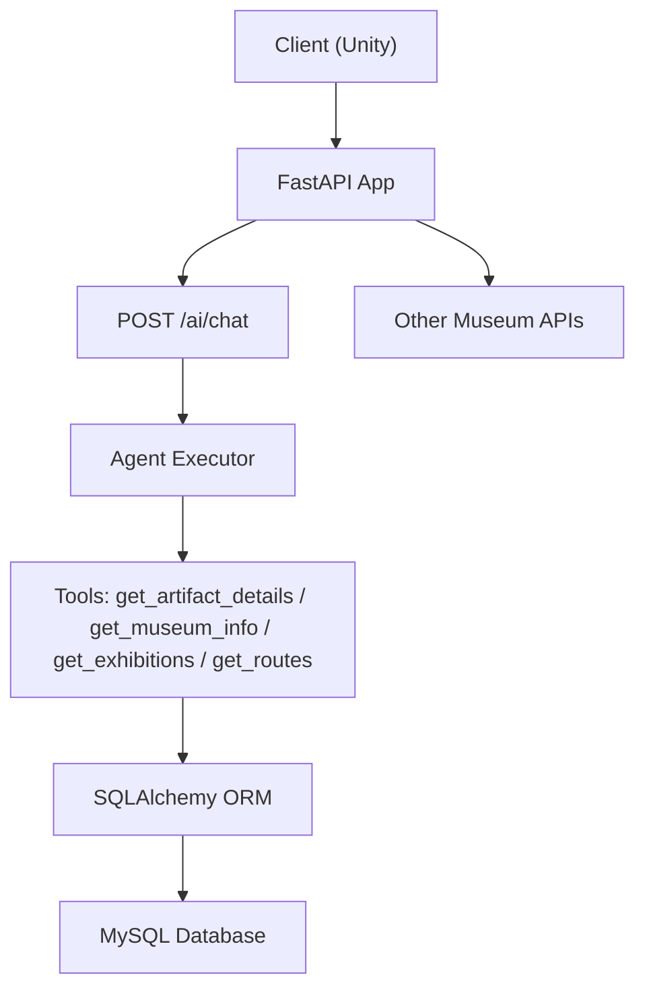
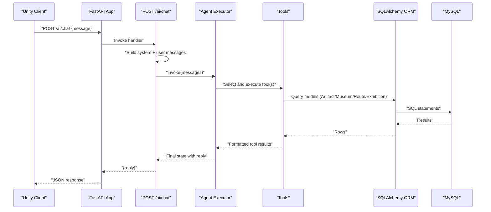
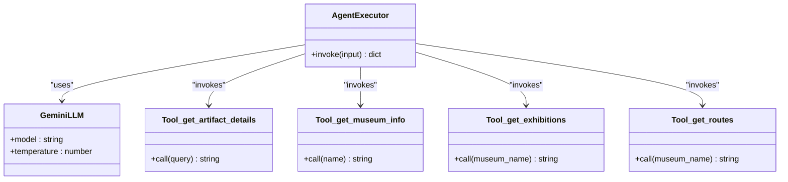
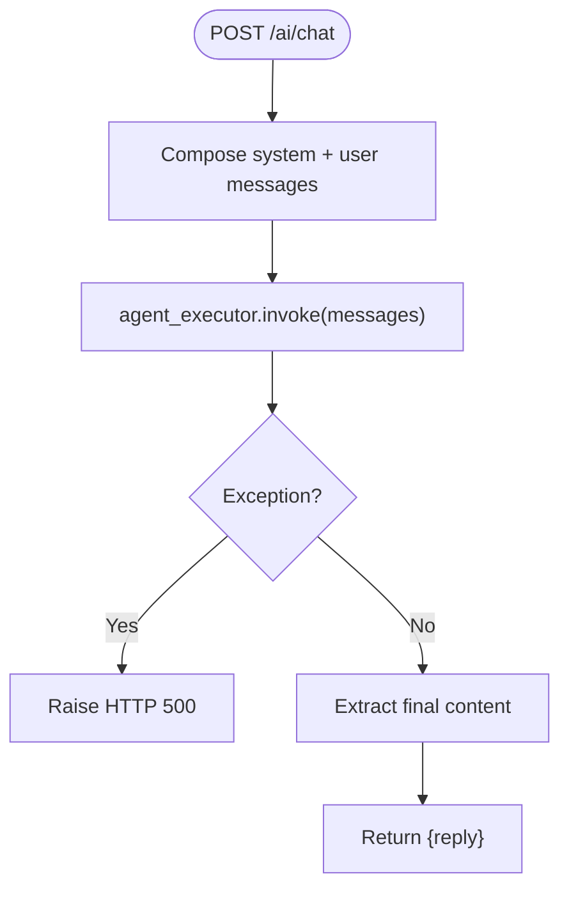
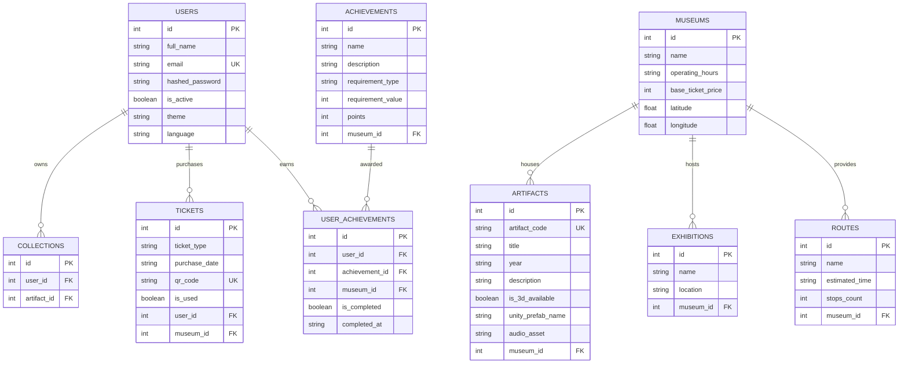
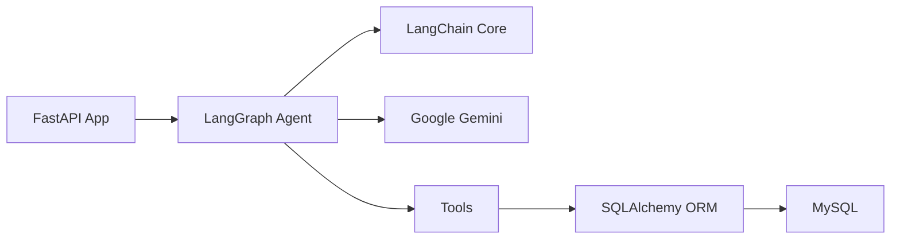

# AI Integration & Agent System

<cite>
**Referenced Files in This Document**
- [agent.py](file://agent.py)
- [main.py](file://main.py)
- [database.py](file://database.py)
- [models.py](file://models.py)
- [schemas.py](file://schemas.py)
- [security.py](file://security.py)
- [generate_audio.py](file://generate_audio.py)
- [requirements.txt](file://requirements.txt)
- [README.md](file://README.md)
</cite>

## Table of Contents
1. [Introduction](#introduction)
2. [Project Structure](#project-structure)
3. [Core Components](#core-components)
4. [Architecture Overview](#architecture-overview)
5. [Detailed Component Analysis](#detailed-component-analysis)
6. [Dependency Analysis](#dependency-analysis)
7. [Performance Considerations](#performance-considerations)
8. [Troubleshooting Guide](#troubleshooting-guide)
9. [Conclusion](#conclusion)
10. [Appendices](#appendices)

## Introduction
This document explains the AI integration and agent system powering the MuseAmigo Backend. It covers the LangChain agent architecture, tool-based workflows, Google Gemini API integration, prompt engineering, and how the agent retrieves contextual information from the database to assist users with museum artifacts, exhibitions, and routes. It also documents the chatbot endpoint, error handling, and performance optimization strategies.

## Project Structure
The backend is organized around a FastAPI application that exposes REST endpoints and integrates an AI agent powered by Google Gemini. The agent uses LangGraph to orchestrate tool calls to the database for museum-related information.

**Diagram sources**
- [main.py:869-897](file://main.py#L869-L897)
- [agent.py:105](file://agent.py#L105)
- [database.py:18-38](file://database.py#L18-L38)

**Section sources**
- [main.py:1-100](file://main.py#L1-L100)
- [agent.py:1-122](file://agent.py#L1-L122)
- [database.py:1-38](file://database.py#L1-L38)

## Core Components
- Agent executor: Orchestrates the LLM and tools using LangGraph’s React agent.
- Tools: Database-backed functions that search artifacts, museum info, exhibitions, and routes.
- LLM: Google Gemini configured via LangChain.
- FastAPI chat endpoint: Wraps user messages with a system prompt and invokes the agent.
- Database: SQLAlchemy models and session management for data access.

Key implementation references:
- Agent initialization and tools: [agent.py:93-105](file://agent.py#L93-L105)
- Tool implementations: [agent.py:17-91](file://agent.py#L17-L91)
- Chat endpoint: [main.py:869-897](file://main.py#L869-L897)
- Database engine/session: [database.py:18-38](file://database.py#L18-L38)

**Section sources**
- [agent.py:17-105](file://agent.py#L17-L105)
- [main.py:869-897](file://main.py#L869-L897)
- [database.py:18-38](file://database.py#L18-L38)

## Architecture Overview
The AI chatbot is implemented as a FastAPI endpoint that packages the user message with a system prompt and feeds it into the agent. The agent decides whether to use tools and, if so, executes them against the database to gather contextual information. The final response is returned to the client.

**Diagram sources**
- [main.py:869-897](file://main.py#L869-L897)
- [agent.py:105](file://agent.py#L105)
- [database.py:18-38](file://database.py#L18-L38)
- [models.py:1-105](file://models.py#L1-L105)

## Detailed Component Analysis

### Agent Executor and Tools
The agent is initialized with a Google Gemini LLM and a set of tools. Each tool encapsulates a database query and returns a formatted string suitable for the LLM to synthesize a human-readable response.

- LLM configuration: [agent.py:94-97](file://agent.py#L94-L97)
- Tool definitions:
  - Artifact search: [agent.py:17-36](file://agent.py#L17-L36)
  - Museum info: [agent.py:37-51](file://agent.py#L37-L51)
  - Exhibitions listing: [agent.py:53-71](file://agent.py#L53-L71)
  - Routes listing: [agent.py:73-91](file://agent.py#L73-L91)
- Agent creation: [agent.py:105](file://agent.py#L105)

**Diagram sources**
- [agent.py:93-105](file://agent.py#L93-L105)
- [agent.py:17-91](file://agent.py#L17-L91)

**Section sources**
- [agent.py:17-105](file://agent.py#L17-L105)

### Chat Endpoint Implementation
The chat endpoint composes a system message instructing the agent to act as a museum guide and to use tools for artifact, museum, exhibition, and route information. It then invokes the agent and returns the final reply.

- System prompt composition: [main.py:873-883](file://main.py#L873-L883)
- Agent invocation and response extraction: [main.py:885-893](file://main.py#L885-L893)
- Error handling: [main.py:895-897](file://main.py#L895-L897)

**Diagram sources**
- [main.py:869-897](file://main.py#L869-L897)

**Section sources**
- [main.py:869-897](file://main.py#L869-L897)

### Database Models and Sessions
The database layer defines the schema for users, museums, artifacts, collections, exhibitions, tickets, routes, achievements, and user achievements. Sessions are managed centrally to ensure proper lifecycle and connection pooling.

- Models: [models.py:1-105](file://models.py#L1-L105)
- Engine and session factory: [database.py:18-38](file://database.py#L18-L38)

**Diagram sources**
- [models.py:1-105](file://models.py#L1-L105)

**Section sources**
- [models.py:1-105](file://models.py#L1-L105)
- [database.py:18-38](file://database.py#L18-L38)

### Prompt Engineering and Response Processing
- The system prompt establishes the agent’s persona and capabilities, instructing it to use tools for museum-related queries and to gracefully handle unknowns.
- The endpoint extracts the final message content from the agent’s state and returns it as the chat reply.

References:
- System prompt: [main.py:874-879](file://main.py#L874-L879)
- Final message extraction: [main.py:890](file://main.py#L890)

**Section sources**
- [main.py:874-890](file://main.py#L874-L890)

### Audio Asset Generation (Supporting Feature)
While not part of the agent system, the audio generation script creates placeholder WAV files for artifact descriptions. This demonstrates how media assets can be integrated alongside the AI responses.

References:
- Audio generation: [generate_audio.py:1-78](file://generate_audio.py#L1-L78)

**Section sources**
- [generate_audio.py:1-78](file://generate_audio.py#L1-L78)

## Dependency Analysis
External libraries and integrations:
- LangChain and LangGraph: Agent orchestration and tool integration.
- Google Gemini: LLM provider via LangChain Google Generative AI integration.
- SQLAlchemy: ORM for database access.
- FastAPI: Web framework for endpoints.

**Diagram sources**
- [requirements.txt:24-29](file://requirements.txt#L24-L29)
- [agent.py:3-8](file://agent.py#L3-L8)
- [database.py:2-4](file://database.py#L2-L4)
- [main.py:1-11](file://main.py#L1-L11)

**Section sources**
- [requirements.txt:1-59](file://requirements.txt#L1-L59)
- [agent.py:1-122](file://agent.py#L1-L122)
- [database.py:1-38](file://database.py#L1-L38)
- [main.py:1-11](file://main.py#L1-L11)

## Performance Considerations
- Connection pooling: The database engine uses a pool with pre-ping and recycle settings to improve reliability and throughput.
- Tool execution: Each tool opens and closes a session to avoid leaks and ensure isolation.
- LLM cost and latency: The selected model and temperature balance responsiveness and creativity; adjust as needed for production.
- Cold start: The deployment platform may sleep without traffic; expect slower first requests.

References:
- Pool configuration: [database.py:20-24](file://database.py#L20-L24)
- Tool session lifecycle: [agent.py:21-35](file://agent.py#L21-L35), [agent.py:40-51](file://agent.py#L40-L51), [agent.py:56-71](file://agent.py#L56-L71), [agent.py:76-91](file://agent.py#L76-L91)

**Section sources**
- [database.py:20-24](file://database.py#L20-L24)
- [agent.py:21-91](file://agent.py#L21-L91)

## Troubleshooting Guide
Common issues and resolutions:
- Missing Google API key: The agent initialization validates the presence of the key and raises an error if absent.
  - Reference: [agent.py:14-15](file://agent.py#L14-L15)
- Database connectivity: Ensure DATABASE_URL is configured; the engine defaults to a local MySQL URL if not present.
  - Reference: [database.py:12-15](file://database.py#L12-L15)
- Chat endpoint failures: The endpoint catches exceptions and returns HTTP 500 with the error message.
  - Reference: [main.py:895-897](file://main.py#L895-L897)
- Tool query mismatches: Tools return explicit “not found” messages; verify search terms and data availability.
  - References: [agent.py:33](file://agent.py#L33), [agent.py:49](file://agent.py#L49), [agent.py:69](file://agent.py#L69), [agent.py:89](file://agent.py#L89)

Operational tips:
- Cold start delays: Expect slower initial requests on free-tier deployments.
  - Reference: [README.md:92](file://README.md#L92)

**Section sources**
- [agent.py:14-15](file://agent.py#L14-L15)
- [database.py:12-15](file://database.py#L12-L15)
- [main.py:895-897](file://main.py#L895-L897)
- [README.md:92](file://README.md#L92)

## Conclusion
The MuseAmigo Backend integrates a LangChain agent with Google Gemini to provide a conversational museum assistant. Tools query the database for artifacts, museum details, exhibitions, and routes, enabling the agent to deliver accurate, context-aware responses. The FastAPI chat endpoint orchestrates the flow, while robust database session management and connection pooling support reliability. Error handling ensures graceful degradation, and the modular design allows easy extension of tools and prompts.

## Appendices

### Tool Implementation Patterns
- Artifact search: Case-insensitive substring match on title or artifact code.
  - Reference: [agent.py:24-27](file://agent.py#L24-L27)
- Museum info: Exact-name match with operating hours, ticket price, and coordinates.
  - Reference: [agent.py:42](file://agent.py#L42)
- Exhibitions listing: Museum-based filtering and enumeration.
  - Reference: [agent.py:62-67](file://agent.py#L62-L67)
- Routes listing: Estimated time and stop counts for a given museum.
  - Reference: [agent.py:82-87](file://agent.py#L82-L87)

**Section sources**
- [agent.py:17-91](file://agent.py#L17-L91)

### Agent Configuration Options
- Model selection and temperature: Adjust for quality vs. speed trade-offs.
  - Reference: [agent.py:94-97](file://agent.py#L94-L97)
- Tool registration: Add or remove tools by updating the tools list.
  - Reference: [agent.py:100](file://agent.py#L100)

**Section sources**
- [agent.py:94-97](file://agent.py#L94-L97)
- [agent.py:100](file://agent.py#L100)

### Response Formatting
- Tools return structured strings for easy synthesis by the LLM.
- The chat endpoint returns a simple JSON object containing the reply.
  - Reference: [schemas.py:136-137](file://schemas.py#L136-L137), [main.py:890-893](file://main.py#L890-L893)

**Section sources**
- [schemas.py:136-137](file://schemas.py#L136-L137)
- [main.py:890-893](file://main.py#L890-L893)

### Security Notes
- Password hashing utilities are available for future authentication enhancements.
  - Reference: [security.py:1-12](file://security.py#L1-L12)

**Section sources**
- [security.py:1-12](file://security.py#L1-L12)