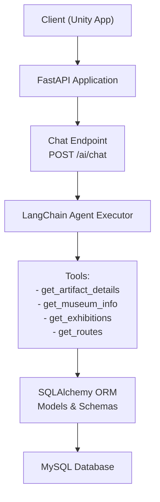
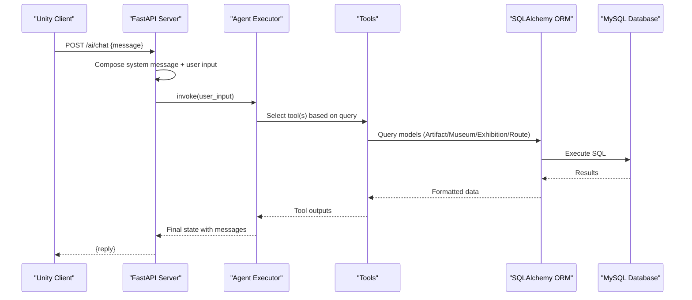
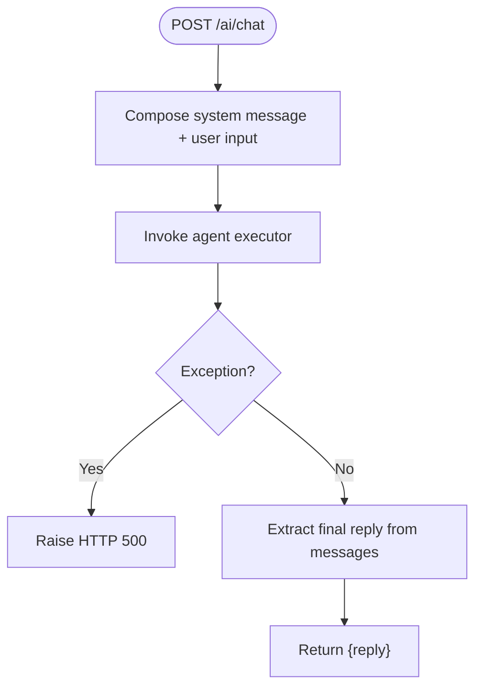
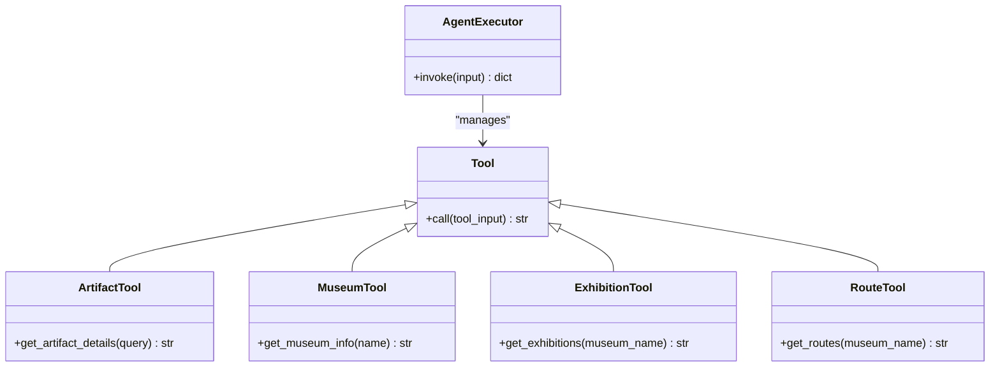
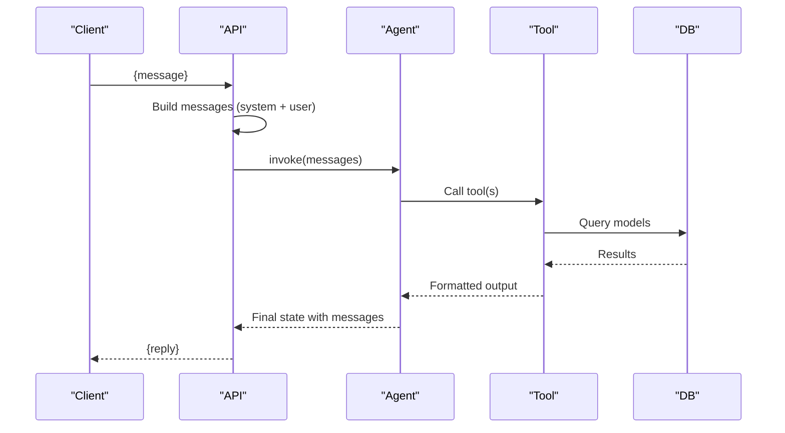
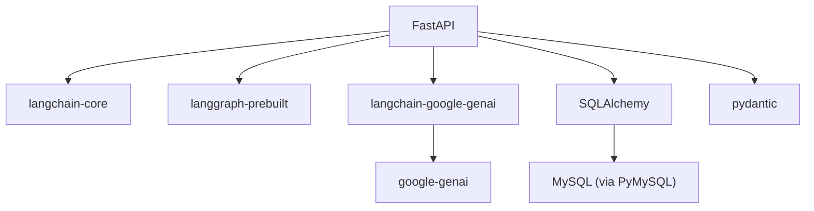
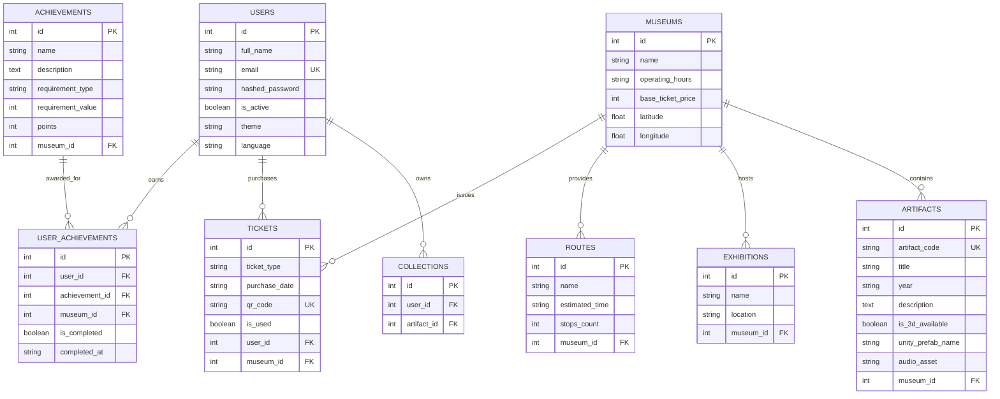

# AI Chat Assistant Endpoints

<cite>
**Referenced Files in This Document**
- [main.py](file://main.py)
- [agent.py](file://agent.py)
- [models.py](file://models.py)
- [schemas.py](file://schemas.py)
- [database.py](file://database.py)
- [requirements.txt](file://requirements.txt)
- [README.md](file://README.md)
</cite>

## Table of Contents
1. [Introduction](#introduction)
2. [Project Structure](#project-structure)
3. [Core Components](#core-components)
4. [Architecture Overview](#architecture-overview)
5. [Detailed Component Analysis](#detailed-component-analysis)
6. [Dependency Analysis](#dependency-analysis)
7. [Performance Considerations](#performance-considerations)
8. [Troubleshooting Guide](#troubleshooting-guide)
9. [Conclusion](#conclusion)
10. [Appendices](#appendices)

## Introduction
This document provides comprehensive API documentation for the AI chat assistant endpoints integrated into the MuseAmigo backend. The system uses a LangChain agent executor to power an intelligent museum information service. Users can ask questions about artifacts, museum details, exhibitions, and route guidance, and the AI responds with contextual answers derived from the internal database.

Key capabilities include:
- Artifact lookup by name or code
- Museum information retrieval (hours, ticket price, coordinates)
- Exhibition listings per museum
- Route suggestions for guided tours
- Seamless integration with external AI services via Google Gemini
- Robust error handling and performance considerations

## Project Structure
The backend is built with FastAPI and integrates LangChain with Google Gemini for AI orchestration. The agent exposes a single chat endpoint that orchestrates tool-based responses backed by a relational database.

**Diagram sources**
- [main.py:869-897](file://main.py#L869-L897)
- [agent.py:17-91](file://agent.py#L17-L91)
- [database.py:18-38](file://database.py#L18-L38)
- [models.py:4-105](file://models.py#L4-L105)

**Section sources**
- [main.py:15-23](file://main.py#L15-L23)
- [main.py:869-897](file://main.py#L869-L897)
- [agent.py:93-105](file://agent.py#L93-L105)
- [database.py:18-38](file://database.py#L18-L38)

## Core Components
- FastAPI application with CORS middleware and database initialization
- LangChain agent executor configured with Google Gemini
- Toolset for artifact, museum, exhibition, and route lookups
- Pydantic schemas for request/response typing
- SQLAlchemy models representing museums, artifacts, collections, exhibitions, tickets, routes, achievements, and user progress

**Section sources**
- [main.py:15-23](file://main.py#L15-L23)
- [main.py:512-526](file://main.py#L512-L526)
- [agent.py:17-91](file://agent.py#L17-L91)
- [schemas.py:132-137](file://schemas.py#L132-L137)
- [models.py:4-105](file://models.py#L4-L105)

## Architecture Overview
The AI chat assistant endpoint composes a system message and user input, invokes the agent executor, and returns a structured response. The agent selects appropriate tools based on the query and retrieves data from the database.

**Diagram sources**
- [main.py:869-897](file://main.py#L869-L897)
- [agent.py:103-105](file://agent.py#L103-L105)
- [agent.py:17-91](file://agent.py#L17-L91)
- [database.py:32-38](file://database.py#L32-L38)

## Detailed Component Analysis

### Chat Endpoint Configuration
- Endpoint: POST /ai/chat
- Request body: ChatRequest with message field
- Response: ChatResponse with reply field
- Behavior:
  - Composes a system message instructing the AI to use tools for museum-related queries
  - Wraps user input into a messages array with system and user roles
  - Invokes the agent executor and extracts the final AI reply
  - Returns structured JSON for Unity consumption
  - Catches exceptions and returns HTTP 500 on AI failures

**Diagram sources**
- [main.py:869-897](file://main.py#L869-L897)
- [schemas.py:132-137](file://schemas.py#L132-L137)

**Section sources**
- [main.py:869-897](file://main.py#L869-L897)
- [schemas.py:132-137](file://schemas.py#L132-L137)

### Agent and Tools
- Agent executor initialized with Google Gemini (gemini-2.5-flash) and configured tools
- Tools:
  - get_artifact_details(query): Searches artifacts by title or code
  - get_museum_info(name): Retrieves operating hours, ticket price, and coordinates
  - get_exhibitions(museum_name): Lists current exhibitions at a museum
  - get_routes(museum_name): Provides available navigation routes with estimated time and stops
- Tool implementation:
  - Each tool opens a new database session, performs a query, formats a readable response, and closes the session
  - Responses are designed for easy consumption by the AI model

**Diagram sources**
- [agent.py:17-91](file://agent.py#L17-L91)
- [agent.py:103-105](file://agent.py#L103-L105)

**Section sources**
- [agent.py:17-91](file://agent.py#L17-L91)
- [agent.py:93-105](file://agent.py#L93-L105)

### Message Processing Workflow
- Input packaging:
  - System message defines the AI’s persona and capabilities
  - User message is appended to the messages array
- Agent execution:
  - The agent decides whether to use tools and how to process the query
  - Tool outputs are aggregated into the final state
- Output extraction:
  - The last message in the messages array is returned as the reply

**Diagram sources**
- [main.py:869-897](file://main.py#L869-L897)
- [agent.py:103-105](file://agent.py#L103-L105)

**Section sources**
- [main.py:869-897](file://main.py#L869-L897)

### Tool-Based Responses
- Artifact information:
  - Query by title or artifact code
  - Returns formatted details suitable for AI interpretation
- Museum details:
  - Operating hours, base ticket price, and geographic coordinates
- Exhibitions:
  - Lists current exhibitions with locations
- Routes:
  - Provides route names, estimated time, and number of stops

**Section sources**
- [agent.py:17-91](file://agent.py#L17-L91)

### Context Management
- The agent maintains context through the messages array, allowing coherent multi-turn conversations
- System message sets expectations for tool usage and response style
- Tool outputs are integrated into the conversation state for subsequent reasoning

**Section sources**
- [main.py:874-883](file://main.py#L874-L883)

### Integration with External APIs
- Google Gemini integration via langchain-google-genai
- Environment configuration requires GOOGLE_API_KEY
- Agent executor uses the prebuilt REACT agent pattern

**Section sources**
- [agent.py:10-16](file://agent.py#L10-L16)
- [agent.py:94-97](file://agent.py#L94-L97)
- [agent.py:103-105](file://agent.py#L103-L105)
- [requirements.txt:14-26](file://requirements.txt#L14-L26)

### Chat Interaction Patterns
- Example queries:
  - “What are the operating hours of the Independence Palace?”
  - “Are there any routes in the Independence Palace?”
  - “Tell me about the T-54 tank.”
  - “Show me exhibitions at War Remnants Museum.”

- Expected response formats:
  - Structured text summarizing museum hours, route details, artifact descriptions, or exhibition lists
  - AI gracefully handles unknown queries by indicating lack of information

**Section sources**
- [agent.py:108-122](file://agent.py#L108-L122)
- [main.py:874-883](file://main.py#L874-L883)

## Dependency Analysis
The system relies on several libraries and integrations:

**Diagram sources**
- [requirements.txt:12-59](file://requirements.txt#L12-L59)
- [database.py:18-24](file://database.py#L18-L24)

**Section sources**
- [requirements.txt:12-59](file://requirements.txt#L12-L59)
- [database.py:18-24](file://database.py#L18-L24)

## Performance Considerations
- Database connection pooling:
  - Engine configured with pool_size, max_overflow, pool_pre_ping, and pool_recycle for improved reliability and throughput
- Agent invocation overhead:
  - Tool calls are synchronous; consider caching frequent queries or batching tool invocations for high-load scenarios
- Cold start:
  - Render free tier may introduce cold start latency; plan for initial delay on first request after idle periods
- Network latency:
  - External Gemini API latency affects response time; implement timeouts and retries at the client level if needed

**Section sources**
- [database.py:18-24](file://database.py#L18-L24)
- [README.md:92-94](file://README.md#L92-L94)

## Troubleshooting Guide
- Missing GOOGLE_API_KEY:
  - The agent initialization validates the presence of the API key and raises a configuration error if absent
- Database connectivity:
  - Ensure DATABASE_URL is set in environment variables; defaults to local MySQL if not present
- Tool errors:
  - Tools handle database session lifecycle and return informative messages when items are not found
- AI failures:
  - The chat endpoint catches exceptions and returns HTTP 500 with the error message
- CORS:
  - CORS middleware allows all origins for development; adjust for production deployments

**Section sources**
- [agent.py:10-16](file://agent.py#L10-L16)
- [database.py:12-15](file://database.py#L12-L15)
- [main.py:895-897](file://main.py#L895-L897)
- [main.py:17-23](file://main.py#L17-L23)

## Conclusion
The AI chat assistant endpoint provides a robust, extensible foundation for intelligent museum guidance. By leveraging LangChain tools and Google Gemini, it delivers contextual, data-driven responses grounded in the museum database. The modular design supports straightforward enhancements to toolsets and agent behavior while maintaining clear error handling and performance characteristics.

## Appendices

### API Definitions
- POST /ai/chat
  - Request: ChatRequest { message }
  - Response: ChatResponse { reply }
  - Status Codes: 200 OK, 500 Internal Server Error

**Section sources**
- [schemas.py:132-137](file://schemas.py#L132-L137)
- [main.py:869-897](file://main.py#L869-L897)

### Data Models Overview

**Diagram sources**
- [models.py:4-105](file://models.py#L4-L105)