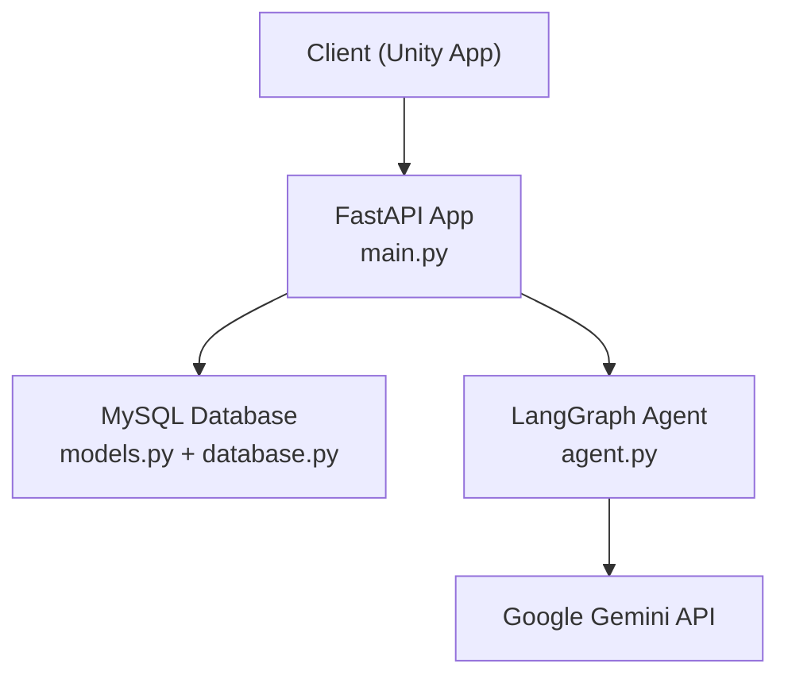
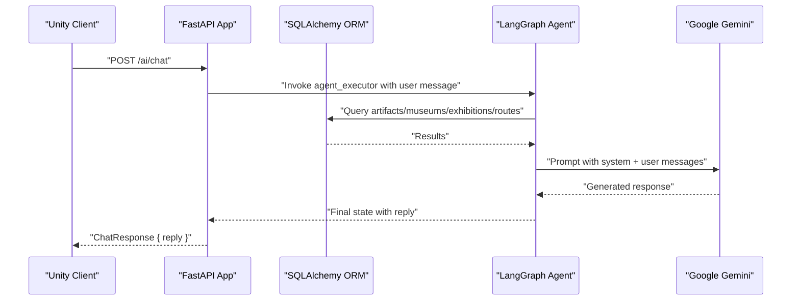
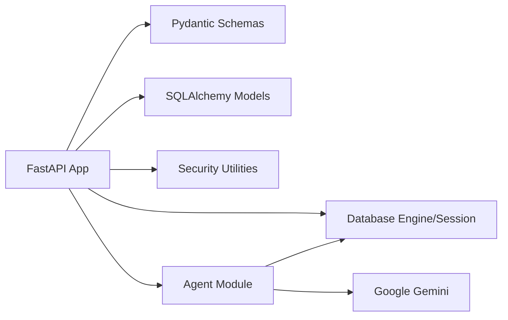
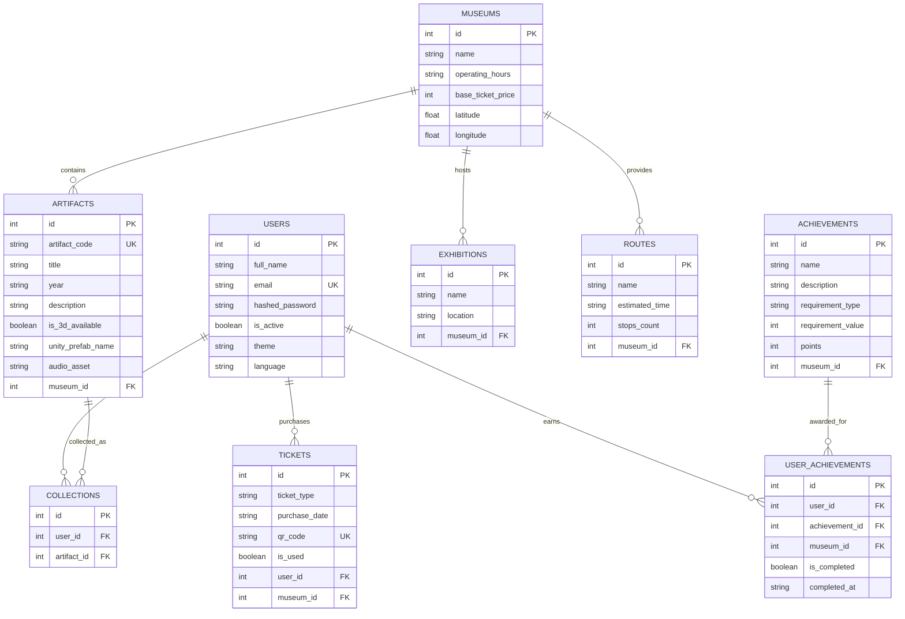

# API Reference

<cite>
**Referenced Files in This Document**
- [main.py](file://main.py)
- [models.py](file://models.py)
- [schemas.py](file://schemas.py)
- [security.py](file://security.py)
- [database.py](file://database.py)
- [agent.py](file://agent.py)
- [generate_audio.py](file://generate_audio.py)
- [README.md](file://README.md)
- [requirements.txt](file://requirements.txt)
</cite>

## Table of Contents
1. [Introduction](#introduction)
2. [Project Structure](#project-structure)
3. [Core Components](#core-components)
4. [Architecture Overview](#architecture-overview)
5. [Detailed Component Analysis](#detailed-component-analysis)
6. [Dependency Analysis](#dependency-analysis)
7. [Performance Considerations](#performance-considerations)
8. [Troubleshooting Guide](#troubleshooting-guide)
9. [Conclusion](#conclusion)
10. [Appendices](#appendices)

## Introduction
This document provides comprehensive API documentation for the MuseAmigo Backend. It covers all endpoints grouped by functional areas: Authentication, Museum Management, Artifact Discovery, Collections, Navigation, Achievements, Ticket Management, and AI Chat Assistant. For each endpoint, you will find HTTP methods, URL patterns, request/response schemas, authentication requirements, status codes, error handling, and security considerations. It also documents CORS configuration, rate limiting considerations, and testing instructions via Swagger UI.

## Project Structure
The backend is built with FastAPI and uses SQLAlchemy ORM for MySQL persistence. The agent module integrates Google Gemini via LangGraph to power the AI chat assistant. Environment variables are loaded from a .env file for database connectivity.

**Diagram sources**
- [main.py:15-23](file://main.py#L15-L23)
- [database.py:18-38](file://database.py#L18-L38)
- [agent.py:94-105](file://agent.py#L94-L105)

**Section sources**
- [main.py:15-23](file://main.py#L15-L23)
- [database.py:18-38](file://database.py#L18-L38)
- [agent.py:94-105](file://agent.py#L94-L105)

## Core Components
- FastAPI application with CORS enabled for development.
- SQLAlchemy models for Users, Museums, Artifacts, Collections, Exhibitions, Tickets, Routes, Achievements, and UserAchievements.
- Pydantic schemas for request/response payloads.
- Security utilities for password hashing and verification.
- Agent executor integrating Google Gemini for AI chat.
- Audio generation utility for artifact descriptions.

**Section sources**
- [main.py:15-23](file://main.py#L15-L23)
- [models.py:4-105](file://models.py#L4-L105)
- [schemas.py:4-137](file://schemas.py#L4-L137)
- [security.py:1-12](file://security.py#L1-L12)
- [agent.py:104-105](file://agent.py#L104-L105)
- [generate_audio.py:41-78](file://generate_audio.py#L41-L78)

## Architecture Overview
The backend exposes REST endpoints for Unity clients. Requests are validated using Pydantic models, processed with SQLAlchemy ORM, and responses are serialized using the same models. The AI chat endpoint uses an agent with tools to query the database and respond to user messages.

**Diagram sources**
- [main.py:869-897](file://main.py#L869-L897)
- [agent.py:17-91](file://agent.py#L17-L91)
- [agent.py:94-105](file://agent.py#L94-L105)

## Detailed Component Analysis

### Authentication Endpoints
- Register
  - Method: POST
  - URL: /auth/register
  - Request body: UserCreate (full_name, email, password)
  - Response: UserResponse (id, full_name, email, theme, language)
  - Status codes: 201 Created, 400 Bad Request (duplicate email or validation errors), 500 Internal Server Error
  - Error handling: IntegrityError for duplicate email, generic exception handling
  - Security: Password stored as plain text (not hashed); consider hashing with bcrypt
  - Notes: Response excludes sensitive fields like hashed_password

- Login
  - Method: POST
  - URL: /auth/login
  - Request body: UserLogin (email, password)
  - Response: JSON with message, user_id, full_name
  - Status codes: 200 OK, 404 Not Found (invalid credentials), 400 Bad Request (incomplete account)
  - Error handling: Case-sensitive password comparison against stored plaintext
  - Security: Plain text password storage; requires immediate hashing upgrade

**Section sources**
- [main.py:538-568](file://main.py#L538-L568)
- [main.py:569-601](file://main.py#L569-L601)
- [schemas.py:4-23](file://schemas.py#L4-L23)
- [schemas.py:10-17](file://schemas.py#L10-L17)
- [security.py:6-12](file://security.py#L6-L12)

### Museum Management Endpoints
- List Museums
  - Method: GET
  - URL: /museums
  - Response: Array of MuseumResponse (id, name, operating_hours, base_ticket_price, latitude, longitude)
  - Status codes: 200 OK
  - Notes: Used to populate the map/discovery screen

- Museum Info Endpoint (Legacy)
  - Method: GET
  - URL: /museums/independence-palace
  - Response: JSON object with name
  - Status codes: 200 OK

**Section sources**
- [main.py:604-607](file://main.py#L604-L607)
- [main.py:533-535](file://main.py#L533-L535)
- [schemas.py:24-35](file://schemas.py#L24-L35)

### Artifact Discovery Endpoints
- Get Artifact by Code
  - Method: GET
  - URL: /artifacts/{artifact_code}
  - Path parameter: artifact_code (case-insensitive, spaces handled)
  - Response: ArtifactResponse (id, artifact_code, title, year, description, is_3d_available, museum_id, unity_prefab_name, audio_asset)
  - Status codes: 200 OK, 404 Not Found (artifact not found)
  - Error handling: Returns available artifact codes in error message

- Add Artifact to Collection
  - Method: POST
  - URL: /collections
  - Request body: CollectionCreate (user_id, artifact_id)
  - Response: CollectionResponse (id, user_id, artifact_id)
  - Status codes: 201 Created, 400 Bad Request (duplicate artifact in collection)
  - Notes: Prevents duplicate entries for the same user-artifact pair

**Section sources**
- [main.py:609-632](file://main.py#L609-L632)
- [main.py:634-661](file://main.py#L634-L661)
- [schemas.py:36-48](file://schemas.py#L36-L48)
- [schemas.py:51-62](file://schemas.py#L51-L62)

### Collection Management Endpoints
- Add Artifact to Collection
  - Method: POST
  - URL: /collections
  - Request body: CollectionCreate (user_id, artifact_id)
  - Response: CollectionResponse (id, user_id, artifact_id)
  - Status codes: 201 Created, 400 Bad Request (duplicate artifact in collection)

**Section sources**
- [main.py:634-661](file://main.py#L634-L661)
- [schemas.py:51-62](file://schemas.py#L51-L62)

### Navigation Endpoints
- Get Museum Exhibitions
  - Method: GET
  - URL: /museums/{museum_id}/exhibitions
  - Path parameter: museum_id
  - Response: Array of ExhibitionResponse (id, name, location, museum_id)
  - Status codes: 200 OK

- Get Museum Routes
  - Method: GET
  - URL: /museums/{museum_id}/routes
  - Path parameter: museum_id
  - Response: Array of RouteResponse (id, name, estimated_time, stops_count, museum_id)
  - Status codes: 200 OK

- Get Achievements for a Route
  - Method: GET
  - URL: /museums/{museum_id}/routes/{route_id}/achievements
  - Path parameters: museum_id, route_id
  - Response: JSON with route_id, museum_id, and achievements array (id, name, description, points)
  - Status codes: 200 OK

- Reset User Achievements for a Museum
  - Method: POST
  - URL: /users/{user_id}/achievements/reset/{museum_id}
  - Path parameters: user_id, museum_id
  - Response: JSON with message confirming reset
  - Status codes: 200 OK

**Section sources**
- [main.py:664-667](file://main.py#L664-L667)
- [main.py:697-700](file://main.py#L697-L700)
- [main.py:703-722](file://main.py#L703-L722)
- [main.py:725-735](file://main.py#L725-L735)
- [schemas.py:65-72](file://schemas.py#L65-L72)
- [schemas.py:94-102](file://schemas.py#L94-L102)

### Achievement System Endpoints
- Get User Achievements
  - Method: GET
  - URL: /users/{user_id}/achievements
  - Path parameter: user_id
  - Response: JSON with user_id, total_points, unlocked_count, and achievements array containing id, name, description, requirement_type, requirement_value, points, museum_id, is_completed, progress
  - Status codes: 200 OK
  - Notes: Calculates progress and auto-completes achievements based on scan counts and museum visits

- Update User Settings
  - Method: PUT
  - URL: /users/{user_id}/settings
  - Path parameter: user_id
  - Request body: UserSettingsUpdate (theme, language)
  - Response: UserResponse (updated user profile)
  - Status codes: 200 OK, 404 Not Found (user not found)

**Section sources**
- [main.py:738-844](file://main.py#L738-L844)
- [main.py:846-867](file://main.py#L846-L867)
- [schemas.py:127-129](file://schemas.py#L127-L129)
- [schemas.py:104-114](file://schemas.py#L104-L114)

### Ticket Management Endpoints
- Purchase Ticket and Generate QR Code
  - Method: POST
  - URL: /tickets/purchase
  - Request body: TicketCreate (user_id, museum_id, ticket_type)
  - Response: TicketResponse (id, ticket_type, purchase_date, qr_code, is_used, user_id, museum_id)
  - Status codes: 201 Created
  - Notes: Generates a unique QR code string combining museum_id, user_id, and a random hex segment

**Section sources**
- [main.py:669-694](file://main.py#L669-L694)
- [schemas.py:75-92](file://schemas.py#L75-L92)

### AI Chat Assistant Endpoints
- Chat with Ogima
  - Method: POST
  - URL: /ai/chat
  - Request body: ChatRequest (message)
  - Response: ChatResponse (reply)
  - Status codes: 200 OK, 500 Internal Server Error (on agent/tool failure)
  - Tools used: get_artifact_details, get_museum_info, get_exhibitions, get_routes
  - Notes: Requires GOOGLE_API_KEY in .env; agent uses LangGraph REACT executor

**Section sources**
- [main.py:869-897](file://main.py#L869-L897)
- [agent.py:17-91](file://agent.py#L17-L91)
- [agent.py:94-105](file://agent.py#L94-L105)
- [schemas.py:132-137](file://schemas.py#L132-L137)

## Dependency Analysis
- FastAPI app depends on SQLAlchemy engine/session and registers CORS middleware.
- Endpoints depend on Pydantic schemas for validation and serialization.
- Agent module depends on Google Gemini via langchain-google-genai and uses SQLAlchemy for database queries.
- Security utilities provide bcrypt hashing and verification functions.

**Diagram sources**
- [main.py:15-23](file://main.py#L15-L23)
- [schemas.py:1-137](file://schemas.py#L1-137)
- [models.py:1-105](file://models.py#L1-L105)
- [database.py:18-38](file://database.py#L18-L38)
- [security.py:1-12](file://security.py#L1-L12)
- [agent.py:94-105](file://agent.py#L94-L105)

**Section sources**
- [main.py:15-23](file://main.py#L15-L23)
- [schemas.py:1-137](file://schemas.py#L1-137)
- [models.py:1-105](file://models.py#L1-L105)
- [database.py:18-38](file://database.py#L18-L38)
- [security.py:1-12](file://security.py#L1-L12)
- [agent.py:94-105](file://agent.py#L94-L105)

## Performance Considerations
- Database connection pooling is configured with pool_size, max_overflow, pool_pre_ping, and pool_recycle.
- Consider adding rate limiting middleware for production deployments.
- The AI chat endpoint performs database queries per request; caching or tool result memoization could reduce latency.
- Audio asset field defaults to empty string; ensure assets are present for production.

**Section sources**
- [database.py:18-24](file://database.py#L18-L24)
- [main.py:609-632](file://main.py#L609-L632)

## Troubleshooting Guide
- CORS Issues: CORS is configured to allow all origins and headers; adjust allow_origins for production.
- Database Connectivity: Ensure DATABASE_URL is set in .env; default falls back to local MySQL.
- AI Chat Failures: GOOGLE_API_KEY must be present; otherwise, agent initialization raises an error.
- Authentication Security: Passwords are stored as plain text; implement hashing immediately.
- Rate Limiting: No built-in rate limiting; consider adding middleware for production.
- Cold Start: Render free tier may cause initial slow response; expect ~30–50 seconds for first request after idle.

**Section sources**
- [main.py:17-23](file://main.py#L17-L23)
- [database.py:12-15](file://database.py#L12-L15)
- [agent.py:14-15](file://agent.py#L14-L15)
- [README.md:92-94](file://README.md#L92-L94)

## Conclusion
The MuseAmigo Backend provides a solid foundation for museum-related features, including authentication, artifact discovery, collections, navigation, achievements, tickets, and an AI chat assistant. While functional, several enhancements are recommended for production readiness: implement password hashing, add rate limiting, refine CORS policy, and improve error handling consistency. The Swagger UI is available for interactive testing.

## Appendices

### Authentication Headers and Security
- Headers: No authentication header is required for the documented endpoints.
- Security: Passwords are stored as plain text; implement bcrypt hashing and secure token-based auth (e.g., JWT) for production.
- CORS: All origins allowed for development; restrict origins in production.

**Section sources**
- [main.py:17-23](file://main.py#L17-L23)
- [security.py:6-12](file://security.py#L6-L12)

### Rate Limiting Information
- No built-in rate limiting is implemented. Consider adding middleware for production environments.

**Section sources**
- [main.py:15-23](file://main.py#L15-L23)

### CORS Configuration
- Origins: Allow all (*)
- Methods and headers: Allow all (*)
- Credentials: Disabled

**Section sources**
- [main.py:17-23](file://main.py#L17-L23)

### Swagger UI Interface and Testing Instructions
- Swagger UI: https://museamigo-backend.onrender.com/docs/
- Testing steps:
  1. Open the Swagger UI link.
  2. Select an endpoint (e.g., GET /artifacts).
  3. Click “Try it out” and then “Execute”.
  4. Review the response and status code.

**Section sources**
- [README.md:24-33](file://README.md#L24-L33)

### Data Models Overview

**Diagram sources**
- [models.py:4-105](file://models.py#L4-L105)

### Audio Asset Generation
- Purpose: Generate placeholder WAV files for artifact descriptions.
- Output: Two sample audio files placed under MuseFront/assets/audio.
- Usage: Update artifact.audio_asset to point to generated files.

**Section sources**
- [generate_audio.py:41-78](file://generate_audio.py#L41-L78)