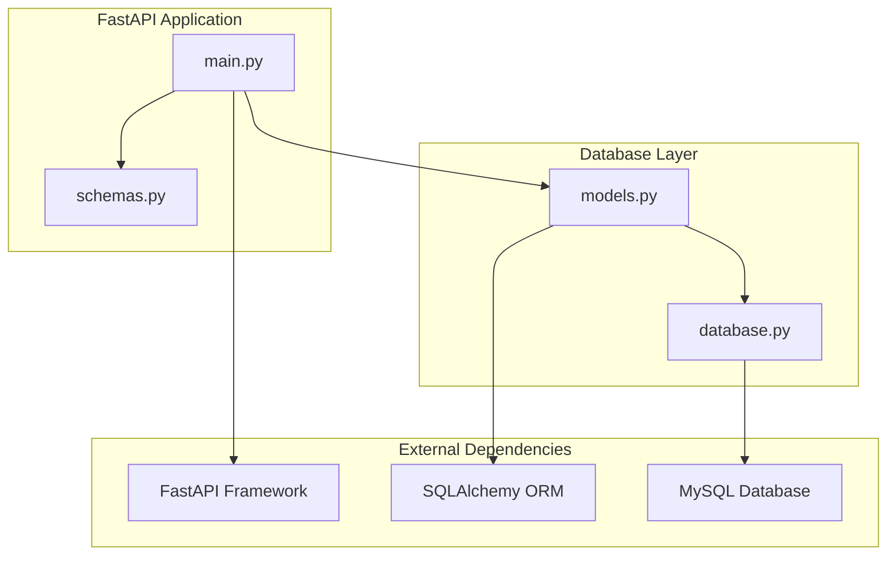
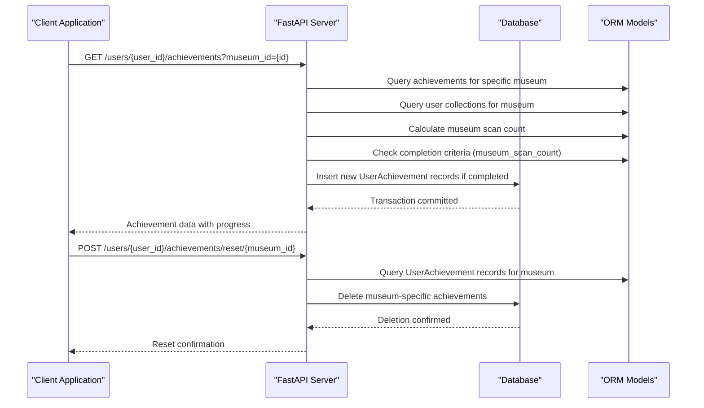
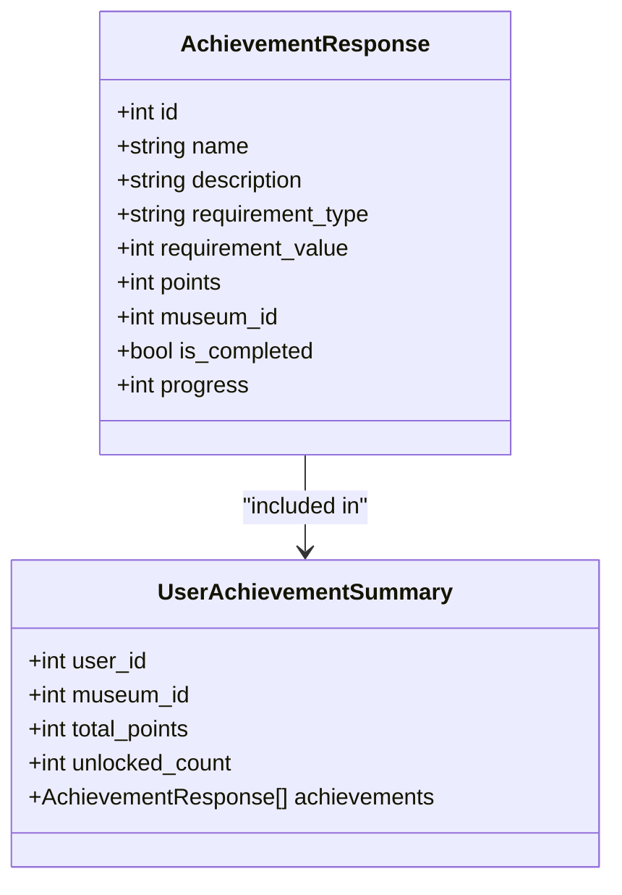
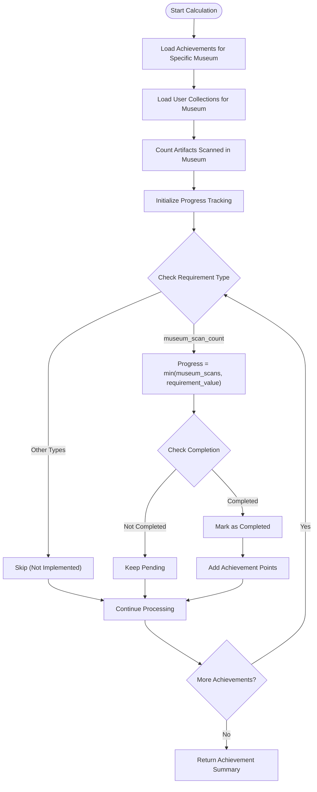
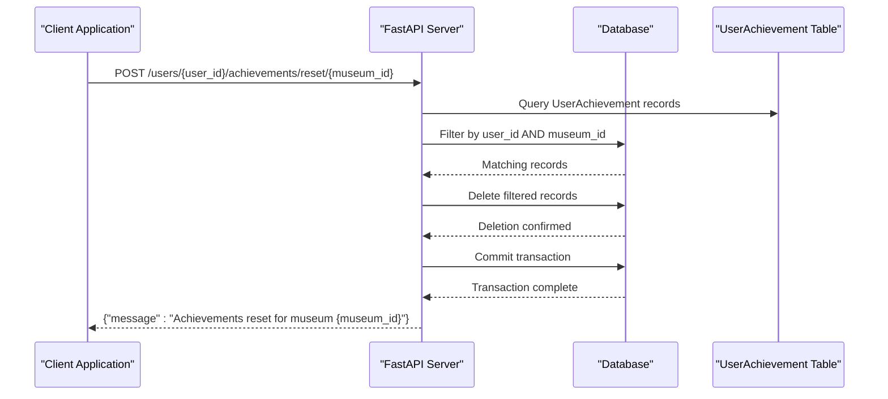
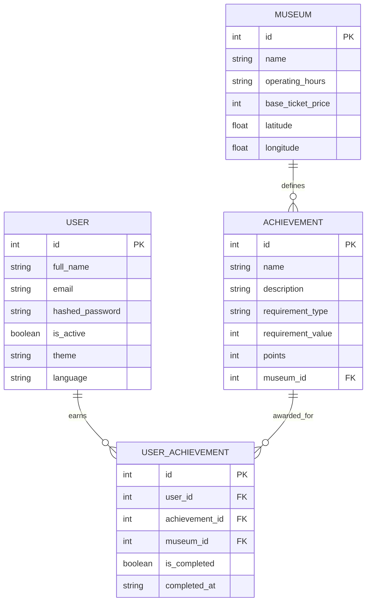
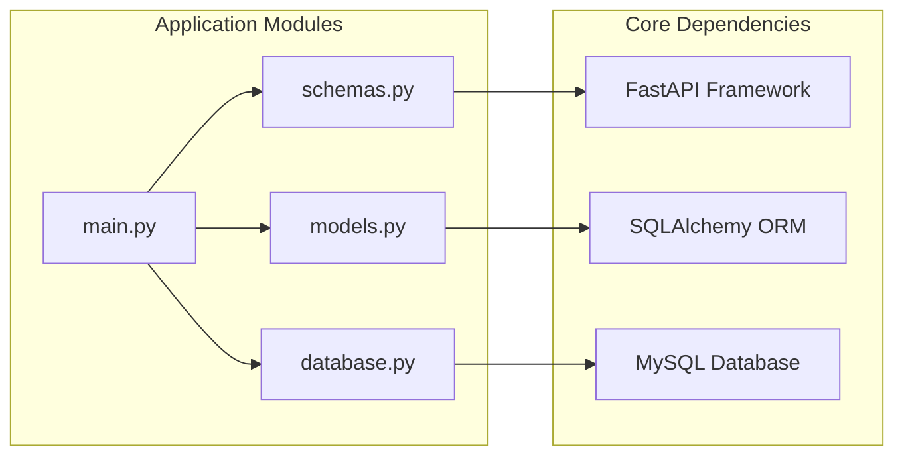

# Achievement System Endpoints

<cite>
**Referenced Files in This Document**
- [main.py](file://main.py)
- [models.py](file://models.py)
- [schemas.py](file://schemas.py)
- [database.py](file://database.py)
- [README.md](file://README.md)
</cite>

## Update Summary
**Changes Made**
- Updated performance optimization section to reflect enhanced SQLAlchemy join capabilities in get_user_achievements function
- Documented single-query execution improvements replacing previous inefficient individual queries approach
- Updated achievement calculation logic to leverage efficient join-based point summation
- Enhanced performance considerations section with specific optimization details

## Table of Contents
1. [Introduction](#introduction)
2. [Project Structure](#project-structure)
3. [Core Components](#core-components)
4. [Architecture Overview](#architecture-overview)
5. [Detailed Component Analysis](#detailed-component-analysis)
6. [Performance Optimizations](#performance-optimizations)
7. [Dependency Analysis](#dependency-analysis)
8. [Troubleshooting Guide](#troubleshooting-guide)
9. [Conclusion](#conclusion)

## Introduction
This document provides comprehensive API documentation for the achievement system endpoints in the MuseAmigo backend. The system has been refactored to focus exclusively on museum-specific achievements with a simplified approach centered around scan count requirements.

The achievement system now provides two primary endpoints:
- GET /users/{user_id}/achievements: Calculates and retrieves user achievements for a specific museum with progress tracking and completion status
- POST /users/{user_id}/achievements/reset/{museum_id}: Resets user achievements specific to a museum

**Updated** The system now operates under a simplified architecture focusing on museum_scan_count requirements with explicit museum_id context, removing support for global achievements and complex requirement types.

## Project Structure
The achievement system is implemented within a FastAPI application with SQLAlchemy ORM models. The key components are organized as follows:
- FastAPI application with routing for achievement endpoints
- SQLAlchemy models for achievements and user achievements
- Pydantic schemas for request/response validation
- Database connection management



**Diagram sources**
- [main.py:1-15](file://main.py#L1-L15)
- [models.py:1-107](file://models.py#L1-L107)
- [database.py:1-38](file://database.py#L1-L38)

**Section sources**
- [main.py:1-15](file://main.py#L1-L15)
- [models.py:1-107](file://models.py#L1-L107)
- [database.py:1-38](file://database.py#L1-L38)

## Core Components
The achievement system consists of several core components that work together to manage user progress and rewards:

### Achievement Models
The system uses two primary models:
- Achievement: Defines achievement criteria with museum_id context and points
- UserAchievement: Tracks individual user progress and completion status for specific museums

**Updated** The system now operates under a simplified model structure focused on museum-specific achievements, with the Achievement model containing museum_id as a required foreign key rather than supporting global achievements.

### Achievement Requirement Types
**Updated** The system now supports only one achievement type:
- museum_scan_count: Requires scanning artifacts within a specific museum

**Removed** Previous requirement types (scan_count, museum_visit, all_museums, area_complete, first_steps) have been removed as part of the simplification effort.

### Point System
Each achievement has an associated point value that contributes to the user's total points. Points are calculated cumulatively based on completed achievements within the specified museum context.

**Section sources**
- [models.py:88-107](file://models.py#L88-L107)
- [main.py:706-795](file://main.py#L706-L795)

## Architecture Overview
The achievement system follows a RESTful architecture with clear separation of concerns and focuses on museum-specific achievement tracking:



**Diagram sources**
- [main.py:706-795](file://main.py#L706-L795)
- [main.py:693-703](file://main.py#L693-L703)

## Detailed Component Analysis

### GET /users/{user_id}/achievements Endpoint

#### Endpoint Definition
- **Method**: GET
- **Path**: /users/{user_id}/achievements
- **Description**: Calculates and retrieves user achievements for a specific museum with progress tracking and completion status

**Updated** The endpoint now requires a museum_id query parameter to specify which museum's achievements to calculate and retrieve.

#### Request Parameters
- user_id (path parameter): Integer identifier of the user whose achievements to retrieve
- museum_id (query parameter): Integer identifier of the museum whose achievements to calculate

#### Response Structure
The endpoint returns a comprehensive achievement summary for the specified museum:



**Diagram sources**
- [schemas.py:104-125](file://schemas.py#L104-L125)

#### Progress Calculation Algorithm
**Updated** The system now calculates progress using a simplified algorithm focused on museum_scan_count requirements:



**Diagram sources**
- [main.py:750-795](file://main.py#L750-L795)

#### Achievement Requirement Types and Logic

**Updated** The system now supports only one requirement type:

##### museum_scan_count
- **Description**: Requires scanning a specific number of artifacts within a specific museum
- **Calculation**: progress = min(museum_scans, requirement_value)
- **Completion**: museum_scans >= requirement_value
- **Scope**: Limited to artifacts from the specified museum only

**Removed** Previous requirement types (scan_count, museum_visit, all_museums, area_complete, first_steps) have been removed as part of the simplification effort.

**Section sources**
- [main.py:750-795](file://main.py#L750-L795)
- [main.py:759-762](file://main.py#L759-L762)

### POST /users/{user_id}/achievements/reset/{museum_id} Endpoint

#### Endpoint Definition
- **Method**: POST
- **Path**: /users/{user_id}/achievements/reset/{museum_id}
- **Description**: Resets user achievements specific to a museum

**Updated** The reset operation now works exclusively with museum-specific achievements, removing support for global achievement resets.

#### Request Parameters
- user_id (path parameter): Integer identifier of the user
- museum_id (path parameter): Integer identifier of the museum whose achievements to reset

#### Reset Workflow
The reset operation follows this process:



**Diagram sources**
- [main.py:693-703](file://main.py#L693-L703)

#### Reset Behavior
- Only museum-specific achievements are reset (not global achievements)
- The operation removes all UserAchievement records for the specified user and museum combination
- After reset, the user can earn the achievements again upon meeting the criteria
- Reset operations are scoped to the specific museum context

**Section sources**
- [main.py:693-703](file://main.py#L693-L703)

### Data Models and Relationships

#### Achievement Model
**Updated** The Achievement model now enforces museum-specific requirements:



**Diagram sources**
- [models.py:88-107](file://models.py#L88-L107)

**Updated** The Achievement model now requires a museum_id foreign key, eliminating support for global achievements. All achievements are now museum-specific.

#### UserAchievement Model
The UserAchievement model tracks individual user progress:

- **user_id**: Links to the User table
- **achievement_id**: Links to the Achievement table
- **museum_id**: Tracks which museum the achievement was earned in (required for museum-specific achievements)
- **is_completed**: Boolean flag indicating achievement completion
- **completed_at**: Timestamp when the achievement was completed

**Updated** The UserAchievement model now requires museum_id context, aligning with the simplified achievement system that focuses on museum-specific tracking.

**Section sources**
- [models.py:88-107](file://models.py#L88-L107)

## Performance Optimizations

### Enhanced SQLAlchemy Join Capabilities

**Updated** The achievement system has been significantly optimized with enhanced SQLAlchemy join capabilities that enable single-query execution for improved performance.

#### Single-Query Point Calculation
The system now uses an efficient join-based approach to calculate total points from completed achievements:

```python
# Enhanced performance optimization in get_user_achievements function
total_points = sum(
    ach.points
    for ach in db.query(models.Achievement)
    .join(models.UserAchievement, models.Achievement.id == models.UserAchievement.achievement_id)
    .filter(
        models.UserAchievement.user_id == user_id,
        models.UserAchievement.museum_id == museum_id,
        models.UserAchievement.is_completed == True
    )
    .all()
)
```

This approach replaces the previous inefficient individual queries approach that would have required multiple database round trips for each achievement check.

#### Performance Benefits
- **Single Database Query**: All completed achievements are fetched in one optimized query
- **Reduced Network Overhead**: Eliminates multiple database round trips
- **Improved Response Time**: Faster achievement calculation for users with many completed achievements
- **Better Resource Utilization**: More efficient use of database connections and server resources

#### Database Connection Pooling
The system leverages connection pooling for optimal database performance:

```python
# Connection pool configuration for improved performance
engine = create_engine(
    SQLALCHEMY_DATABASE_URL,
    pool_size=10,          # Connection pool for better performance
    max_overflow=20,       # Additional connections when pool is full
    pool_pre_ping=True,    # Validate connections before use
    pool_recycle=3600,     # Recycle connections every hour
)
```

### Memory Management and Query Optimization
- Dictionary-based caching of completed achievements for O(1) lookup performance
- Efficient artifact ID extraction and filtering by museum context
- Minimal memory footprint for progress calculations
- Optimized query execution plans for achievement-related operations

**Section sources**
- [main.py:738-748](file://main.py#L738-L748)
- [database.py:18-24](file://database.py#L18-L24)

## Dependency Analysis
The achievement system has clear dependencies and relationships:



**Diagram sources**
- [main.py:1-10](file://main.py#L1-L10)
- [models.py:1-2](file://models.py#L1-L2)
- [database.py:1-5](file://database.py#L1-L5)

### External Dependencies
- **FastAPI**: Web framework for API endpoints
- **SQLAlchemy**: ORM for database operations
- **Pydantic**: Data validation and serialization
- **MySQL**: Database storage

### Internal Dependencies
- main.py depends on models.py for database schema definitions
- main.py depends on schemas.py for request/response validation
- database.py provides database connection management

**Section sources**
- [main.py:1-10](file://main.py#L1-L10)
- [models.py:1-2](file://models.py#L1-L2)
- [database.py:1-5](file://database.py#L1-L5)

## Troubleshooting Guide

### Common Issues and Solutions

#### Achievement Not Completing
**Symptoms**: Achievement shows progress but never completes
**Causes**:
- Requirement value not met for museum context
- Database synchronization issues
- Incorrect requirement type configuration

**Solutions**:
- Verify requirement values in the database for the specific museum
- Check user collection records for the correct museum
- Confirm achievement type matches expected behavior

#### Reset Not Working
**Symptoms**: POST /users/{user_id}/achievements/reset/{museum_id} returns success but achievements remain
**Causes**:
- Wrong museum_id parameter
- User has achievements from other museums that weren't reset
- Database transaction issues

**Solutions**:
- Verify museum_id corresponds to actual museum
- Check that only museum-specific achievements were reset
- Review database logs for transaction errors

#### Performance Issues
**Symptoms**: Slow achievement calculation response times
**Causes**:
- Large number of user collections
- Complex achievement requirements
- Database connection bottlenecks

**Solutions**:
- Optimize database indexes
- Consider pagination for large datasets
- Implement caching for frequently accessed data

#### Achievement Calculation Errors
**Symptoms**: Incorrect point totals or achievement states
**Causes**:
- Database join query issues
- Inconsistent achievement state tracking
- Race conditions in achievement updates

**Solutions**:
- Verify database join conditions are correct
- Check for concurrent achievement updates
- Review transaction isolation levels

**Section sources**
- [main.py:693-703](file://main.py#L693-L703)
- [main.py:750-795](file://main.py#L750-L795)

## Conclusion
The MuseAmigo achievement system has been successfully refactored to focus exclusively on museum-specific achievements with a simplified approach. The system now provides a streamlined framework for tracking user progress within individual museums, emphasizing museum_scan_count requirements with clear progression logic.

**Updated** Key performance improvements include enhanced SQLAlchemy join capabilities that enable single-query execution for achievement calculations, significantly reducing database overhead and improving response times.

Key strengths of the simplified implementation include:
- Clear focus on museum-specific achievement tracking
- Real-time progress calculation with automatic completion detection for museum contexts
- Flexible reset mechanism for museum-specific achievements
- Clear separation of concerns between achievement definitions and user progress tracking
- Efficient database operations with proper indexing and connection management
- **Enhanced performance optimization** through single-query execution and connection pooling

The system maintains its extensibility while providing a more focused and manageable achievement system that aligns with the current museum-based experience design. Future enhancements can be built upon this simplified foundation while maintaining the core principle of museum-specific achievement tracking.