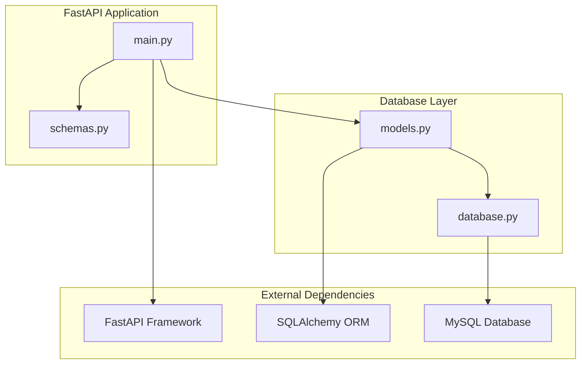
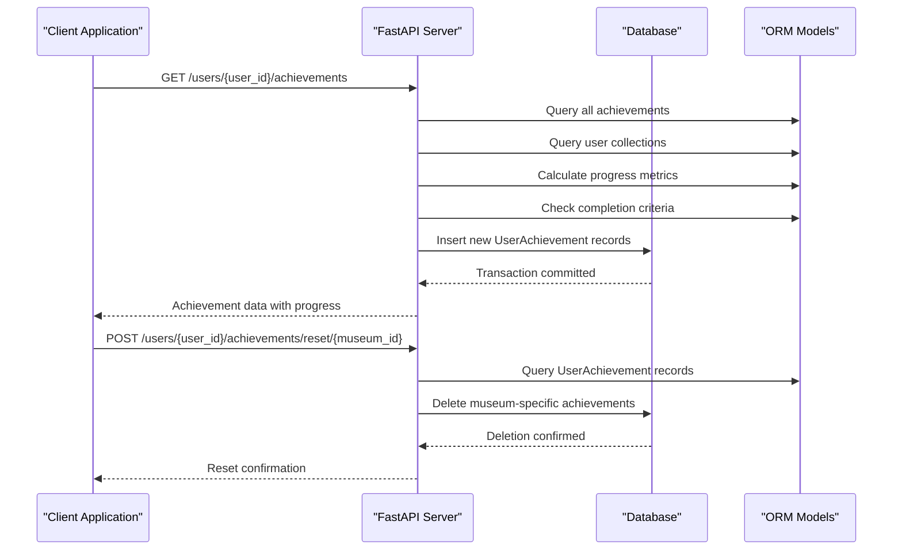
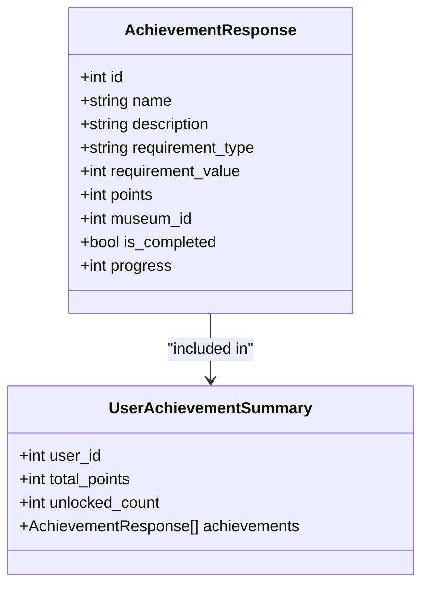
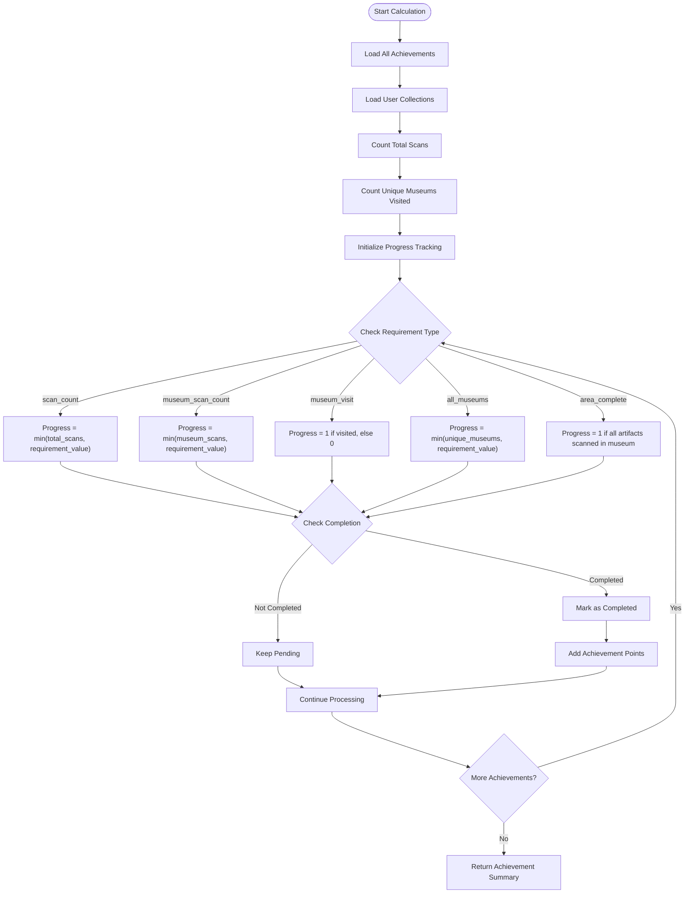
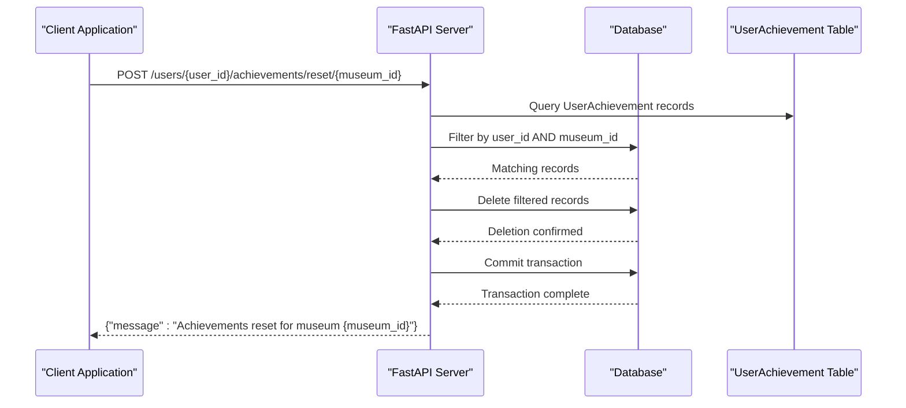
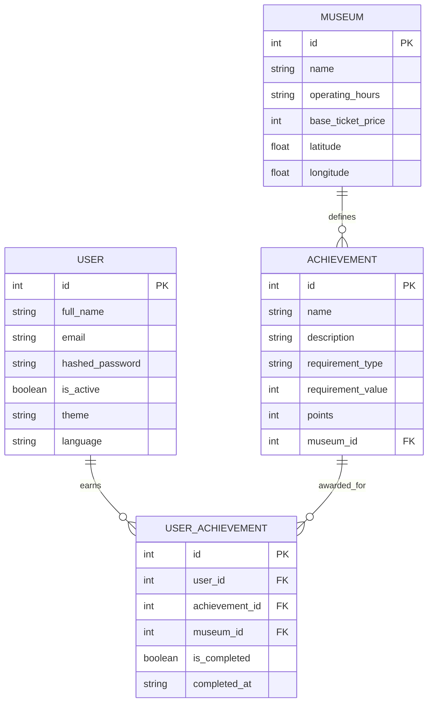
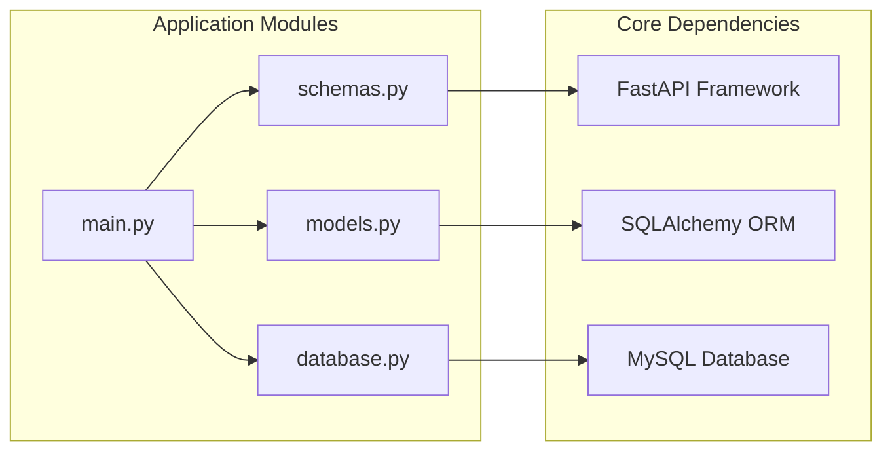

# Achievement System Endpoints

<cite>
**Referenced Files in This Document**
- [main.py](file://main.py)
- [models.py](file://models.py)
- [schemas.py](file://schemas.py)
- [database.py](file://database.py)
- [README.md](file://README.md)
</cite>

## Table of Contents
1. [Introduction](#introduction)
2. [Project Structure](#project-structure)
3. [Core Components](#core-components)
4. [Architecture Overview](#architecture-overview)
5. [Detailed Component Analysis](#detailed-component-analysis)
6. [Dependency Analysis](#dependency-analysis)
7. [Performance Considerations](#performance-considerations)
8. [Troubleshooting Guide](#troubleshooting-guide)
9. [Conclusion](#conclusion)

## Introduction
This document provides comprehensive API documentation for the achievement system endpoints in the MuseAmigo backend. It covers two primary endpoints:
- GET /users/{user_id}/achievements: Calculates and retrieves user achievements with progress tracking, completion status, and point calculations.
- POST /users/{user_id}/achievements/reset/{museum_id}: Resets user achievements specific to a museum.

The documentation explains achievement requirement types, progress calculation algorithms, point system implementation, and integration with the UserAchievement model. It also provides examples of achievement calculation and reset workflows.

## Project Structure
The achievement system is implemented within a FastAPI application with SQLAlchemy ORM models. The key components are organized as follows:
- FastAPI application with routing for achievement endpoints
- SQLAlchemy models for achievements and user achievements
- Pydantic schemas for request/response validation
- Database connection management

**Diagram sources**
- [main.py:1-15](file://main.py#L1-L15)
- [models.py:1-105](file://models.py#L1-L105)
- [database.py:1-38](file://database.py#L1-L38)

**Section sources**
- [main.py:1-15](file://main.py#L1-L15)
- [models.py:1-105](file://models.py#L1-L105)
- [database.py:1-38](file://database.py#L1-L38)

## Core Components
The achievement system consists of several core components that work together to manage user progress and rewards:

### Achievement Models
The system uses two primary models:
- Achievement: Defines achievement criteria, points, and scope (global or museum-specific)
- UserAchievement: Tracks individual user progress and completion status

### Achievement Requirement Types
The system supports multiple achievement types:
- scan_count: Requires scanning a specific number of artifacts globally
- museum_scan_count: Requires scanning artifacts within a specific museum
- museum_visit: Requires visiting a specific museum (presence of any artifact scan)
- all_museums: Requires visiting a specific number of museums
- area_complete: Requires scanning all artifacts in a specific museum
- first_steps: Special case for initial artifact scan

### Point System
Each achievement has an associated point value that contributes to the user's total points. Points are calculated cumulatively based on completed achievements.

**Section sources**
- [models.py:86-105](file://models.py#L86-L105)
- [main.py:352-488](file://main.py#L352-L488)

## Architecture Overview
The achievement system follows a RESTful architecture with clear separation of concerns:

**Diagram sources**
- [main.py:738-844](file://main.py#L738-L844)
- [main.py:725-735](file://main.py#L725-L735)

## Detailed Component Analysis

### GET /users/{user_id}/achievements Endpoint

#### Endpoint Definition
- **Method**: GET
- **Path**: /users/{user_id}/achievements
- **Description**: Calculates and retrieves user achievements with progress tracking and completion status

#### Request Parameters
- user_id (path parameter): Integer identifier of the user whose achievements to retrieve

#### Response Structure
The endpoint returns a comprehensive achievement summary:

**Diagram sources**
- [schemas.py:104-125](file://schemas.py#L104-L125)

#### Progress Calculation Algorithm
The system calculates progress using the following algorithm:

**Diagram sources**
- [main.py:777-837](file://main.py#L777-L837)

#### Achievement Requirement Types and Logic

##### scan_count
- **Description**: Requires scanning a specific number of artifacts globally
- **Calculation**: progress = min(total_scans, requirement_value)
- **Completion**: total_scans >= requirement_value

##### museum_scan_count
- **Description**: Requires scanning artifacts within a specific museum
- **Calculation**: progress = min(museum_scans, requirement_value)
- **Completion**: museum_scans >= requirement_value

##### museum_visit
- **Description**: Requires visiting a specific museum (presence of any artifact scan)
- **Calculation**: progress = 1 if museum visited, else 0
- **Completion**: True if any artifact from the museum is scanned

##### all_museums
- **Description**: Requires visiting a specific number of museums
- **Calculation**: progress = min(unique_museums, requirement_value)
- **Completion**: unique_museums >= requirement_value

##### area_complete
- **Description**: Requires scanning all artifacts in a specific museum
- **Calculation**: progress = 1 if all artifacts scanned, else 0
- **Completion**: museum_scans >= total_artifacts_in_museum

**Section sources**
- [main.py:777-837](file://main.py#L777-L837)
- [main.py:787-812](file://main.py#L787-L812)

### POST /users/{user_id}/achievements/reset/{museum_id} Endpoint

#### Endpoint Definition
- **Method**: POST
- **Path**: /users/{user_id}/achievements/reset/{museum_id}
- **Description**: Resets user achievements specific to a museum

#### Request Parameters
- user_id (path parameter): Integer identifier of the user
- museum_id (path parameter): Integer identifier of the museum whose achievements to reset

#### Reset Workflow
The reset operation follows this process:

**Diagram sources**
- [main.py:725-735](file://main.py#L725-L735)

#### Reset Behavior
- Only museum-specific achievements are reset (not global achievements)
- The operation removes all UserAchievement records for the specified user and museum combination
- After reset, the user can earn the achievements again upon meeting the criteria

**Section sources**
- [main.py:725-735](file://main.py#L725-L735)

### Data Models and Relationships

#### Achievement Model
The Achievement model defines the structure for achievement definitions:

**Diagram sources**
- [models.py:86-105](file://models.py#L86-L105)

#### UserAchievement Model
The UserAchievement model tracks individual user progress:

- **user_id**: Links to the User table
- **achievement_id**: Links to the Achievement table
- **museum_id**: Tracks which museum the achievement was earned in (nullable for global achievements)
- **is_completed**: Boolean flag indicating achievement completion
- **completed_at**: Timestamp when the achievement was completed

**Section sources**
- [models.py:86-105](file://models.py#L86-L105)

## Dependency Analysis
The achievement system has clear dependencies and relationships:

**Diagram sources**
- [main.py:1-10](file://main.py#L1-L10)
- [models.py:1-2](file://models.py#L1-L2)
- [database.py:1-5](file://database.py#L1-L5)

### External Dependencies
- **FastAPI**: Web framework for API endpoints
- **SQLAlchemy**: ORM for database operations
- **Pydantic**: Data validation and serialization
- **MySQL**: Database storage

### Internal Dependencies
- main.py depends on models.py for database schema definitions
- main.py depends on schemas.py for request/response validation
- database.py provides database connection management

**Section sources**
- [main.py:1-10](file://main.py#L1-L10)
- [models.py:1-2](file://models.py#L1-L2)
- [database.py:1-5](file://database.py#L1-L5)

## Performance Considerations
The achievement system implements several performance optimizations:

### Database Query Optimization
- Single pass through achievements to calculate progress
- Efficient counting of museum scans using dictionary aggregation
- Batch processing of achievement updates

### Memory Management
- Dictionary-based caching of completed achievements
- Efficient artifact ID extraction and filtering
- Minimal memory footprint for progress calculations

### Database Connection Management
- Proper session management with automatic cleanup
- Connection pooling for improved performance
- Transaction batching for achievement insertions

## Troubleshooting Guide

### Common Issues and Solutions

#### Achievement Not Completing
**Symptoms**: Achievement shows progress but never completes
**Causes**:
- Requirement value not met
- Database synchronization issues
- Incorrect requirement type configuration

**Solutions**:
- Verify requirement values in the database
- Check user collection records
- Confirm achievement type matches expected behavior

#### Reset Not Working
**Symptoms**: POST /users/{user_id}/achievements/reset/{museum_id} returns success but achievements remain
**Causes**:
- Wrong museum_id parameter
- User has global achievements that weren't reset
- Database transaction issues

**Solutions**:
- Verify museum_id corresponds to actual museum
- Check that only museum-specific achievements were reset
- Review database logs for transaction errors

#### Performance Issues
**Symptoms**: Slow achievement calculation response times
**Causes**:
- Large number of user collections
- Complex achievement requirements
- Database connection bottlenecks

**Solutions**:
- Optimize database indexes
- Consider pagination for large datasets
- Implement caching for frequently accessed data

**Section sources**
- [main.py:725-735](file://main.py#L725-L735)
- [main.py:777-837](file://main.py#L777-L837)

## Conclusion
The MuseAmigo achievement system provides a robust framework for tracking user progress and rewarding engagement with museum artifacts. The system supports multiple achievement types with clear progression logic and integrates seamlessly with the existing user collection system.

Key strengths of the implementation include:
- Comprehensive achievement requirement types covering various user behaviors
- Real-time progress calculation with automatic completion detection
- Flexible reset mechanism for museum-specific achievements
- Clear separation of concerns between achievement definitions and user progress tracking
- Efficient database operations with proper indexing and connection management

The system is designed to be extensible, allowing for easy addition of new achievement types and requirements as the application evolves.