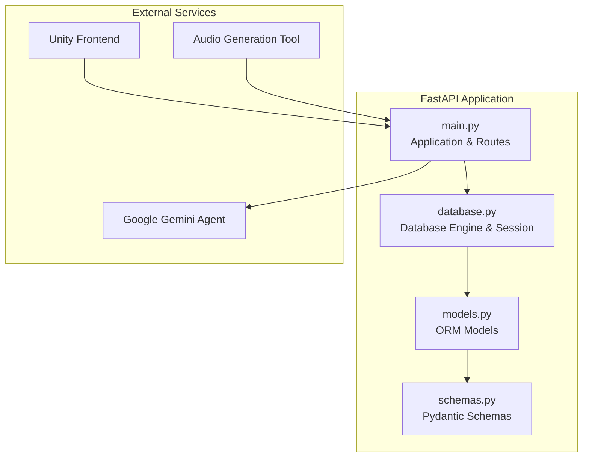
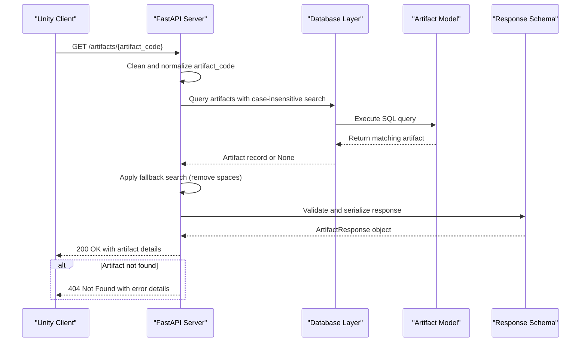
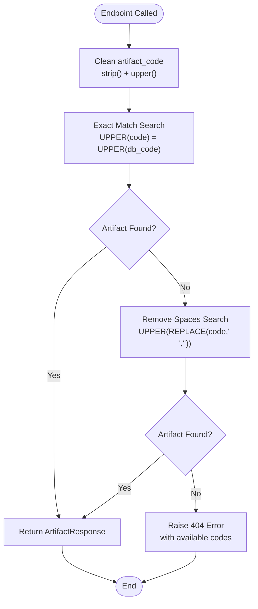
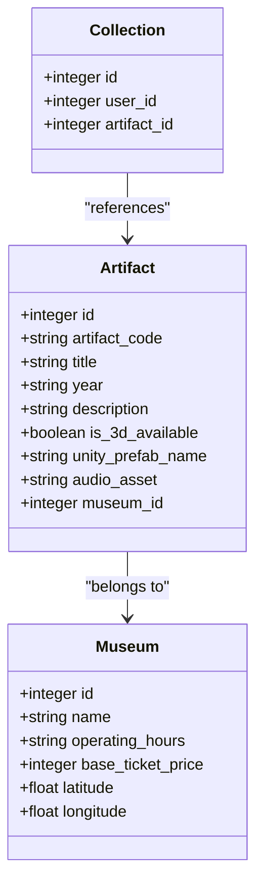
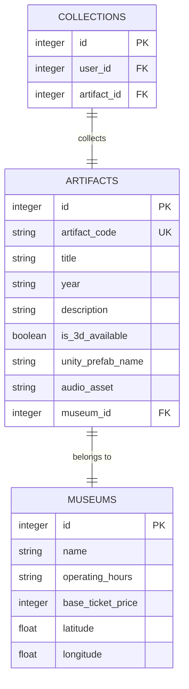
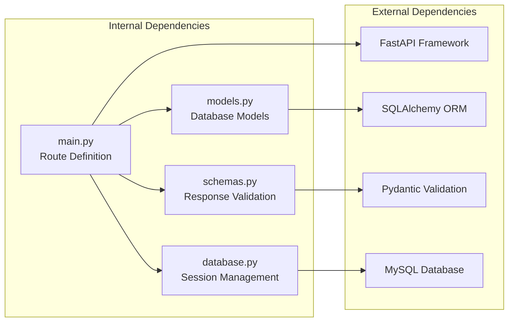

# Artifact Discovery Endpoints

<cite>
**Referenced Files in This Document**
- [main.py](file://main.py)
- [models.py](file://models.py)
- [schemas.py](file://schemas.py)
- [database.py](file://database.py)
- [generate_audio.py](file://generate_audio.py)
- [README.md](file://README.md)
</cite>

## Table of Contents
1. [Introduction](#introduction)
2. [Project Structure](#project-structure)
3. [Core Components](#core-components)
4. [Architecture Overview](#architecture-overview)
5. [Detailed Component Analysis](#detailed-component-analysis)
6. [Dependency Analysis](#dependency-analysis)
7. [Performance Considerations](#performance-considerations)
8. [Troubleshooting Guide](#troubleshooting-guide)
9. [Conclusion](#conclusion)
10. [Appendices](#appendices)

## Introduction
This document provides comprehensive API documentation for artifact discovery endpoints, focusing on the GET /artifacts/{artifact_code} endpoint that enables artifact lookup by QR code. The endpoint supports flexible search capabilities including case-insensitive matching and space handling, returning a structured ArtifactResponse containing artifact details such as artifact_code, title, year, description, 3D availability flags, Unity prefab names, and audio asset paths. The documentation covers artifact code formatting requirements, search algorithms, error handling for not found artifacts, integration with the Artifact model, relationships between artifacts and museums, 3D model integration, and audio asset generation. It also includes examples of artifact codes and response structures.

## Project Structure
The backend is built with FastAPI and SQLAlchemy, providing REST endpoints for museum and artifact management. The artifact discovery endpoint is implemented alongside other endpoints for authentication, collections, exhibitions, tickets, routes, achievements, and AI chat assistance.



**Diagram sources**
- [main.py:15-23](file://main.py#L15-L23)
- [database.py:18-38](file://database.py#L18-L38)
- [models.py:1-105](file://models.py#L1-L105)
- [schemas.py:1-137](file://schemas.py#L1-L137)

**Section sources**
- [main.py:15-23](file://main.py#L15-L23)
- [database.py:18-38](file://database.py#L18-L38)
- [models.py:1-105](file://models.py#L1-L105)
- [schemas.py:1-137](file://schemas.py#L1-L137)

## Core Components
The artifact discovery system consists of several key components:

- **Artifact Model**: Defines the database structure for artifacts with fields for artifact_code, title, year, description, 3D availability flags, Unity prefab names, audio assets, and museum associations
- **ArtifactResponse Schema**: Validates and serializes artifact data for API responses
- **Database Session Management**: Provides dependency injection for database operations
- **Search Algorithm**: Implements flexible artifact lookup with case-insensitive and space-handling capabilities

Key implementation highlights:
- Artifact codes are stored in uppercase format in the database
- Search supports both exact matches and matches with spaces removed
- Audio asset paths are optional and default to empty strings
- Museum relationships enable geographic and thematic organization

**Section sources**
- [models.py:27-42](file://models.py#L27-L42)
- [schemas.py:36-48](file://schemas.py#L36-L48)
- [main.py:610-632](file://main.py#L610-L632)

## Architecture Overview
The artifact discovery endpoint follows a layered architecture pattern with clear separation of concerns:



**Diagram sources**
- [main.py:610-632](file://main.py#L610-L632)
- [models.py:27-42](file://models.py#L27-L42)
- [schemas.py:36-48](file://schemas.py#L36-L48)

## Detailed Component Analysis

### GET /artifacts/{artifact_code} Endpoint
The artifact discovery endpoint provides flexible artifact lookup capabilities:

#### Request Parameters
- **artifact_code** (path parameter): The QR code identifier for the artifact
- **Validation**: Case-insensitive matching with automatic whitespace normalization

#### Search Algorithm Implementation
The endpoint implements a two-tier search strategy:



**Diagram sources**
- [main.py:610-632](file://main.py#L610-L632)

#### Response Model: ArtifactResponse
The endpoint returns a structured ArtifactResponse containing:

| Field | Type | Description | Example |
|-------|------|-------------|---------|
| id | integer | Unique artifact identifier | 1 |
| artifact_code | string | QR code identifier | "IP-001" |
| title | string | Artifact name/title | "Presidential Desk" |
| year | string | Historical period/year | "1960s" |
| description | string | Detailed artifact description | "The original presidential desk..." |
| is_3d_available | boolean | 3D model availability flag | true |
| museum_id | integer | Associated museum identifier | 1 |
| unity_prefab_name | string | Unity 3D prefab reference | "Model_Presidential_Desk" |
| audio_asset | string | Audio asset file path | "assets/audio/artifact_001.wav" |

#### Artifact Code Formatting Requirements
- **Case Sensitivity**: Automatically converted to uppercase for storage and comparison
- **Whitespace Handling**: Spaces are preserved in database storage but ignored during search
- **Format Examples**: "IP-001", "WRM-002", "FAM-001", "HCM-002"
- **Museum Prefixes**: IP (Independence Palace), WRM (War Remnants Museum), FAM (Fine Arts Museum), HCM (HCMC Museum)

#### Error Handling
The endpoint implements comprehensive error handling:
- **404 Not Found**: When artifact code is not found in either exact or space-removed search
- **Error Message**: Includes the requested code and available artifact codes for debugging
- **Graceful Degradation**: Falls back from exact match to space-removed match automatically

**Section sources**
- [main.py:610-632](file://main.py#L610-L632)
- [schemas.py:36-48](file://schemas.py#L36-L48)
- [models.py:27-42](file://models.py#L27-L42)

### Artifact Model Integration
The Artifact model defines the complete data structure and relationships:



**Diagram sources**
- [models.py:27-42](file://models.py#L27-L42)
- [models.py:16-26](file://models.py#L16-L26)
- [models.py:43-51](file://models.py#L43-L51)

#### Museum Relationship
Artifacts are associated with museums through foreign key relationships, enabling:
- Geographic organization of artifacts
- Museum-specific achievements and routes
- Location-based filtering and navigation

#### 3D Model Integration
The Unity prefab system integrates seamlessly with the artifact data:
- **Prefab Names**: Direct mapping to Unity asset bundles
- **Availability Flags**: Enable/disable 3D rendering based on content availability
- **Asset Paths**: Standardized naming convention for Unity asset loading

#### Audio Asset Generation
Audio assets enhance the artifact experience through narration:
- **Generation Tool**: Automated WAV file creation for artifact descriptions
- **Placeholder System**: Sine wave tones serve as initial placeholders
- **Production Ready**: Replaceable with actual historical narrations

**Section sources**
- [models.py:27-42](file://models.py#L27-L42)
- [generate_audio.py:41-77](file://generate_audio.py#L41-L77)

### Database Schema and Relationships
The database design supports efficient artifact discovery and management:



**Diagram sources**
- [models.py:27-42](file://models.py#L27-L42)
- [models.py:16-26](file://models.py#L16-L26)
- [models.py:43-51](file://models.py#L43-L51)

**Section sources**
- [models.py:1-105](file://models.py#L1-L105)
- [database.py:18-38](file://database.py#L18-L38)

## Dependency Analysis
The artifact discovery endpoint has minimal external dependencies while maintaining robust functionality:



**Diagram sources**
- [main.py:1-897](file://main.py#L1-L897)
- [models.py:1-105](file://models.py#L1-L105)
- [schemas.py:1-137](file://schemas.py#L1-L137)
- [database.py:1-38](file://database.py#L1-L38)

### External Dependencies
- **FastAPI**: Web framework providing automatic OpenAPI documentation and request validation
- **SQLAlchemy**: ORM for database operations and model definitions
- **Pydantic**: Data validation and serialization for request/response models
- **MySQL**: Database backend for persistent artifact storage

**Section sources**
- [main.py:1-897](file://main.py#L1-L897)
- [models.py:1-105](file://models.py#L1-L105)
- [schemas.py:1-137](file://schemas.py#L1-L137)
- [database.py:1-38](file://database.py#L1-L38)

## Performance Considerations
The artifact discovery endpoint is optimized for efficiency:

- **Database Indexing**: Artifact codes are indexed for O(log n) lookup performance
- **Case-Insensitive Search**: Uses UPPER() function for consistent indexing
- **Two-Tier Search**: Minimizes database queries through immediate fallback
- **Connection Pooling**: SQLAlchemy connection pooling reduces overhead
- **Memory Efficiency**: Streaming responses prevent memory bloat

### Search Performance Characteristics
- **Exact Match**: O(log n) database lookup with index utilization
- **Space-Removed Match**: Additional O(log n) lookup with REPLACE() function
- **Average Complexity**: O(log n) for typical artifact lookup scenarios
- **Scalability**: Linear growth with database size, maintained by indexing

## Troubleshooting Guide

### Common Issues and Solutions

#### 404 Not Found Errors
**Symptoms**: Endpoint returns 404 with error message including available codes
**Causes**:
- Incorrect artifact code format
- Case sensitivity issues
- Missing spaces in QR code
- Non-existent artifact code

**Solutions**:
- Verify artifact code matches available formats
- Check case sensitivity (codes are stored uppercase)
- Ensure QR code includes proper spacing
- Confirm artifact exists in database

#### Database Connection Issues
**Symptoms**: Internal server errors during artifact lookup
**Causes**:
- Database connectivity problems
- Session management failures
- Connection pool exhaustion

**Solutions**:
- Verify DATABASE_URL environment variable
- Check database server availability
- Review connection pool settings
- Monitor database performance metrics

#### Audio Asset Loading Problems
**Symptoms**: Empty or missing audio in Unity client
**Causes**:
- Missing audio asset files
- Incorrect audio_asset paths
- File permission issues

**Solutions**:
- Generate audio assets using provided script
- Verify file paths match Unity asset bundle structure
- Check file permissions and existence
- Validate audio format compatibility

**Section sources**
- [main.py:627-630](file://main.py#L627-L630)
- [database.py:12-24](file://database.py#L12-L24)
- [generate_audio.py:41-77](file://generate_audio.py#L41-L77)

## Conclusion
The artifact discovery endpoint provides a robust, flexible solution for QR code-based artifact lookup with comprehensive error handling and performance optimization. The implementation supports case-insensitive matching, space handling, and integrates seamlessly with Unity's 3D and audio systems. The modular architecture ensures maintainability while the database design supports scalable artifact management across multiple museums.

Key strengths include:
- Flexible search algorithms accommodating various QR code formats
- Comprehensive error handling with informative messages
- Efficient database design with proper indexing
- Seamless integration with Unity's asset pipeline
- Automated audio asset generation capabilities

## Appendices

### API Reference Details

#### Endpoint Specifications
- **Method**: GET
- **Path**: `/artifacts/{artifact_code}`
- **Authentication**: Not required for artifact lookup
- **Response**: `ArtifactResponse` object
- **Status Codes**: 200 OK, 404 Not Found

#### Example Artifact Codes
- **Independence Palace**: IP-001, IP-002, IP-003
- **War Remnants Museum**: WRM-001, WRM-002
- **Fine Arts Museum**: FAM-001, FAM-002
- **HCMC Museum**: HCM-001, HCM-002

#### Response Structure Example
```json
{
  "id": 1,
  "artifact_code": "IP-001",
  "title": "Presidential Desk",
  "year": "1960s",
  "description": "The original presidential desk used by President Nguyễn Văn Thiệu...",
  "is_3d_available": true,
  "museum_id": 1,
  "unity_prefab_name": "Model_Presidential_Desk",
  "audio_asset": "assets/audio/artifact_001.wav"
}
```

**Section sources**
- [main.py:610-632](file://main.py#L610-L632)
- [schemas.py:36-48](file://schemas.py#L36-L48)
- [README.md:24-33](file://README.md#L24-L33)