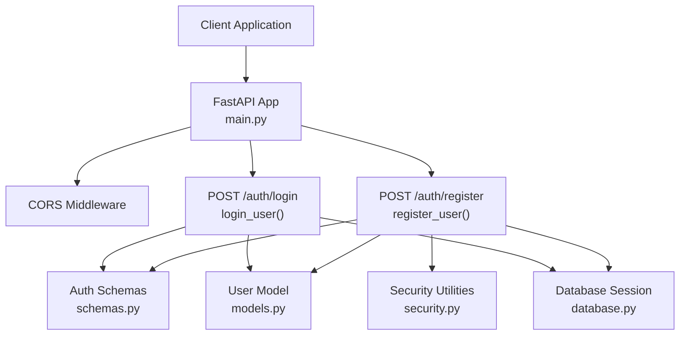
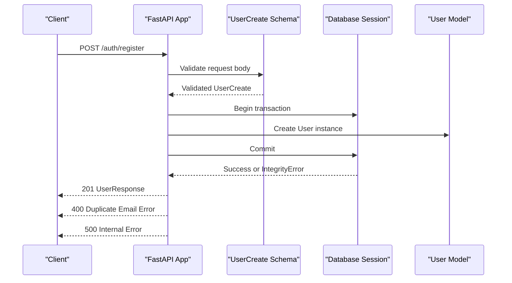
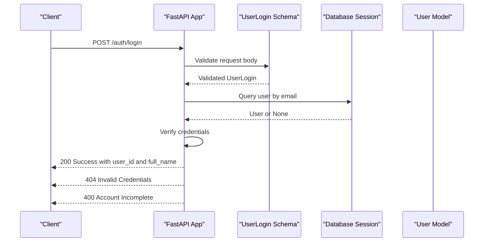
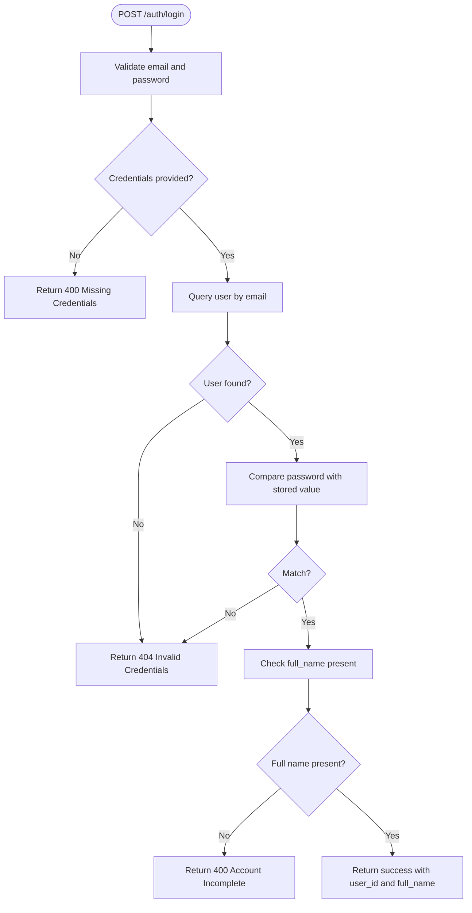
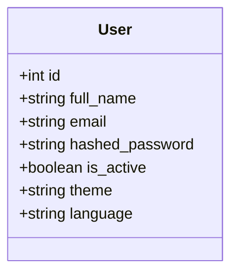
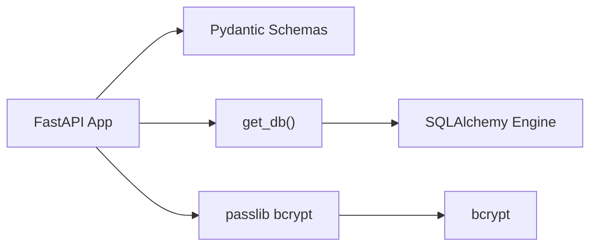

# Authentication Endpoints

<cite>
**Referenced Files in This Document**
- [main.py](file://main.py)
- [schemas.py](file://schemas.py)
- [models.py](file://models.py)
- [security.py](file://security.py)
- [database.py](file://database.py)
- [requirements.txt](file://requirements.txt)
</cite>

## Table of Contents
1. [Introduction](#introduction)
2. [Project Structure](#project-structure)
3. [Core Components](#core-components)
4. [Architecture Overview](#architecture-overview)
5. [Detailed Component Analysis](#detailed-component-analysis)
6. [Dependency Analysis](#dependency-analysis)
7. [Performance Considerations](#performance-considerations)
8. [Troubleshooting Guide](#troubleshooting-guide)
9. [Conclusion](#conclusion)

## Introduction
This document provides comprehensive API documentation for the authentication endpoints in the MuseAmigo backend. It focuses on:
- POST /auth/register: user registration with validation and duplicate email handling
- POST /auth/login: user authentication with credential verification and response model

It also covers the integration with the User model, password handling considerations, security recommendations, and common error scenarios.

## Project Structure
The authentication endpoints are implemented in a FastAPI application with SQLAlchemy ORM models and Pydantic schemas. The key files involved are:
- main.py: FastAPI application definition, CORS middleware, and authentication routes
- schemas.py: Request/response models for authentication
- models.py: SQLAlchemy User model
- security.py: Password hashing and verification utilities
- database.py: Database engine and session management
- requirements.txt: Dependencies including FastAPI, SQLAlchemy, Pydantic, and passlib/bcrypt

**Diagram sources**
- [main.py:537-601](file://main.py#L537-L601)
- [schemas.py:4-23](file://schemas.py#L4-L23)
- [models.py:4-15](file://models.py#L4-L15)
- [database.py:33-38](file://database.py#L33-L38)
- [security.py:1-12](file://security.py#L1-L12)

**Section sources**
- [main.py:15-23](file://main.py#L15-L23)
- [schemas.py:4-23](file://schemas.py#L4-L23)
- [models.py:4-15](file://models.py#L4-L15)
- [database.py:33-38](file://database.py#L33-L38)
- [security.py:1-12](file://security.py#L1-L12)

## Core Components
- Authentication routes:
  - POST /auth/register: Validates input, persists user, handles duplicate email errors
  - POST /auth/login: Validates credentials, checks user completeness, returns user identifiers
- Pydantic schemas:
  - UserCreate: request body for registration
  - UserResponse: response body for registration and settings updates
  - UserLogin: request body for login
- SQLAlchemy User model:
  - Fields: id, full_name, email, hashed_password, is_active, theme, language
- Security utilities:
  - Password hashing and verification helpers for bcrypt
- Database session:
  - Dependency injection for database operations

**Section sources**
- [main.py:537-601](file://main.py#L537-L601)
- [schemas.py:4-23](file://schemas.py#L4-L23)
- [models.py:4-15](file://models.py#L4-L15)
- [security.py:1-12](file://security.py#L1-L12)
- [database.py:33-38](file://database.py#L33-L38)

## Architecture Overview
The authentication flow integrates FastAPI request handling, Pydantic validation, SQLAlchemy ORM, and database transactions. The following sequence diagrams illustrate the two primary flows.

### Registration Flow

**Diagram sources**
- [main.py:537-568](file://main.py#L537-L568)
- [schemas.py:4-17](file://schemas.py#L4-L17)
- [models.py:4-15](file://models.py#L4-L15)
- [database.py:33-38](file://database.py#L33-L38)

### Login Flow

**Diagram sources**
- [main.py:569-601](file://main.py#L569-L601)
- [schemas.py:20-23](file://schemas.py#L20-L23)
- [models.py:4-15](file://models.py#L4-L15)
- [database.py:33-38](file://database.py#L33-L38)

## Detailed Component Analysis

### POST /auth/register
- Purpose: Register a new user with validated credentials
- Request schema (UserCreate):
  - full_name: string, required
  - email: string, required
  - password: string, required
- Response model (UserResponse):
  - id: integer
  - full_name: string
  - email: string
  - theme: string
  - language: string
- Validation rules:
  - full_name required and trimmed
  - password required and minimum length 6
- Error handling:
  - 400: Username required
  - 400: Password required
  - 400: Password must be at least 6 characters
  - 400: Duplicate email detected
  - 500: System error during persistence
- Persistence:
  - Creates a User instance with email and hashed_password set to the provided password
  - Commits and refreshes to obtain the persisted record
- Notes:
  - Current implementation stores plaintext password in hashed_password field for demonstration
  - Security enhancement pending: integrate password hashing

**Diagram sources**
- [main.py:537-568](file://main.py#L537-L568)
- [schemas.py:4-17](file://schemas.py#L4-L17)
- [models.py:4-15](file://models.py#L4-L15)

**Section sources**
- [main.py:537-568](file://main.py#L537-L568)
- [schemas.py:4-17](file://schemas.py#L4-L17)
- [models.py:4-15](file://models.py#L4-L15)

### POST /auth/login
- Purpose: Authenticate an existing user
- Request schema (UserLogin):
  - email: string, required
  - password: string, required
- Successful response:
  - message: string
  - user_id: integer
  - full_name: string
- Validation and error handling:
  - 400: Email required
  - 400: Password required
  - 404: Invalid credentials
  - 400: Account incomplete (missing full_name)
- Credential verification:
  - Queries user by email
  - Compares provided password with stored value (plaintext in current implementation)
  - Ensures full_name is present
- Notes:
  - Current implementation compares plaintext passwords
  - Security enhancement pending: enforce bcrypt hashing and verification

**Diagram sources**
- [main.py:569-601](file://main.py#L569-L601)
- [schemas.py:20-23](file://schemas.py#L20-L23)
- [models.py:4-15](file://models.py#L4-L15)

**Section sources**
- [main.py:569-601](file://main.py#L569-L601)
- [schemas.py:20-23](file://schemas.py#L20-L23)
- [models.py:4-15](file://models.py#L4-L15)

### Integration with User Model
- The User model defines the persistent structure for users, including:
  - id, full_name, email, hashed_password, is_active, theme, language
- Registration creates a new User row with provided values
- Login retrieves a User by email and verifies credentials against stored values

**Diagram sources**
- [models.py:4-15](file://models.py#L4-L15)

**Section sources**
- [models.py:4-15](file://models.py#L4-L15)

### Security Considerations and Password Handling
- Current state:
  - Registration stores plaintext password in the hashed_password field
  - Login compares plaintext password with stored value
- Recommended enhancements:
  - Integrate bcrypt hashing for password storage
  - Use verify_password for login comparisons
  - Ensure hashed_password is populated via get_password_hash
- Dependencies:
  - bcrypt and passlib are included in requirements

**Section sources**
- [security.py:1-12](file://security.py#L1-L12)
- [requirements.txt:4-59](file://requirements.txt#L4-L59)

## Dependency Analysis
- FastAPI app depends on:
  - SQLAlchemy engine/session for database operations
  - Pydantic schemas for request/response validation
  - Security utilities for password hashing/verification
- Database session dependency:
  - get_db yields a scoped session per request
- External dependencies:
  - passlib with bcrypt scheme for hashing
  - PyMySQL driver for MySQL connectivity

**Diagram sources**
- [main.py:537-601](file://main.py#L537-L601)
- [database.py:33-38](file://database.py#L33-L38)
- [security.py:1-12](file://security.py#L1-L12)
- [requirements.txt:4-59](file://requirements.txt#L4-L59)

**Section sources**
- [main.py:537-601](file://main.py#L537-L601)
- [database.py:33-38](file://database.py#L33-L38)
- [security.py:1-12](file://security.py#L1-L12)
- [requirements.txt:4-59](file://requirements.txt#L4-L59)

## Performance Considerations
- Database pooling:
  - Connection pool configured with pool_size and max_overflow
  - Pre-ping enabled to validate connections
- Session lifecycle:
  - Sessions are yielded per request and closed in a finally block
- Recommendations:
  - Consider rate limiting for authentication endpoints
  - Add caching for frequently accessed user data if needed
  - Monitor IntegrityError occurrences for duplicate email patterns

[No sources needed since this section provides general guidance]

## Troubleshooting Guide
Common error scenarios and resolutions:
- Registration
  - 400 Username required: Ensure full_name is provided and non-empty
  - 400 Password required: Ensure password is provided and non-empty
  - 400 Password must be at least 6 characters: Increase password length
  - 400 Duplicate email: Use a unique email address
  - 500 System error: Retry after checking database connectivity
- Login
  - 400 Email required: Provide a valid email
  - 400 Password required: Provide a password
  - 404 Invalid credentials: Verify email and password combination
  - 400 Account incomplete: Contact support to complete profile

**Section sources**
- [main.py:537-568](file://main.py#L537-L568)
- [main.py:569-601](file://main.py#L569-L601)

## Conclusion
The authentication endpoints provide a clear registration and login flow with basic validation and error handling. The current implementation stores plaintext passwords and compares them directly, which is insecure. The recommended next steps are to integrate bcrypt-based hashing and verification, aligning the registration and login flows with secure password handling practices.