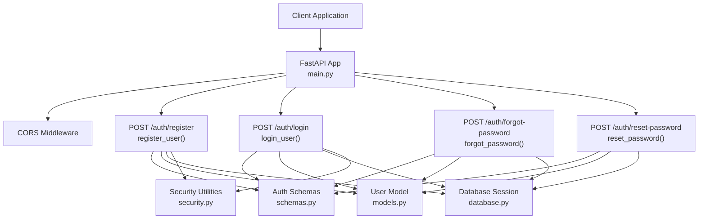
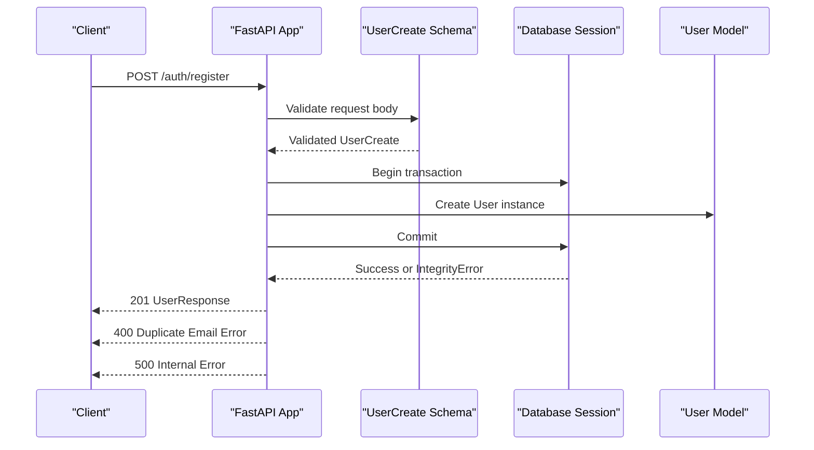
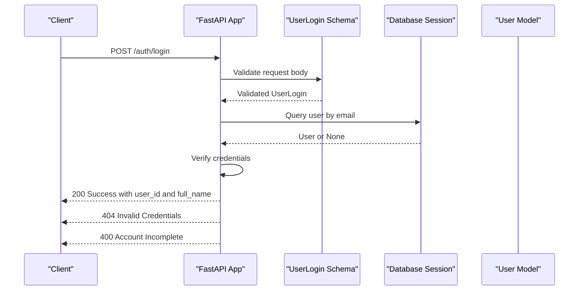
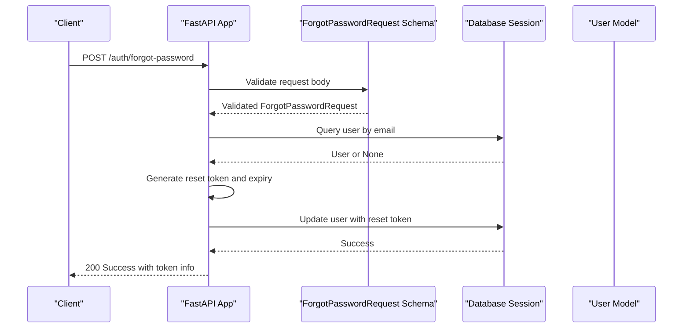
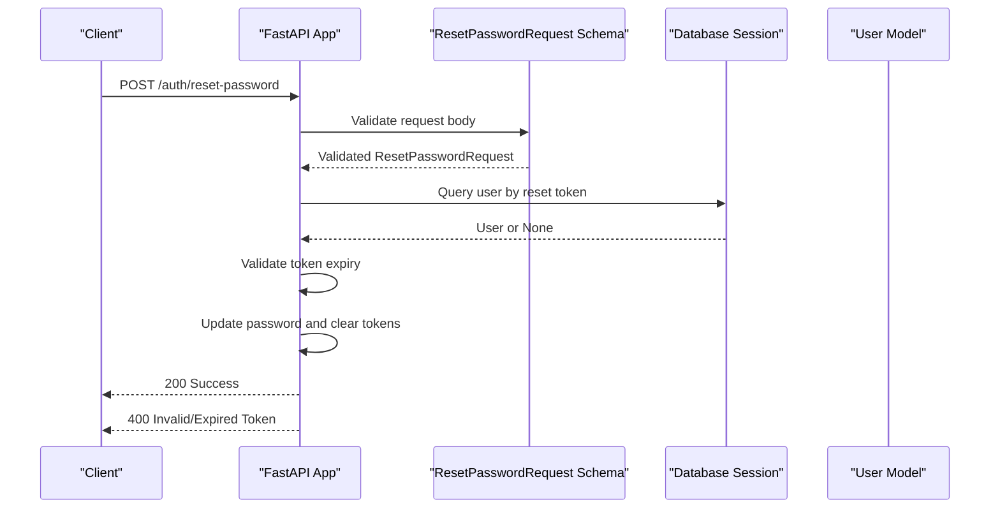
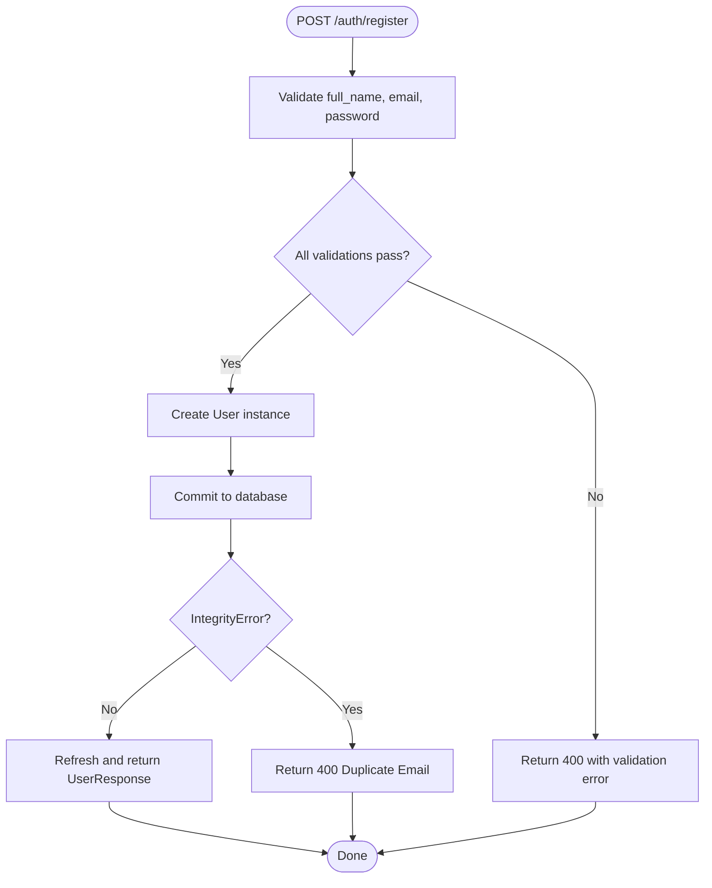
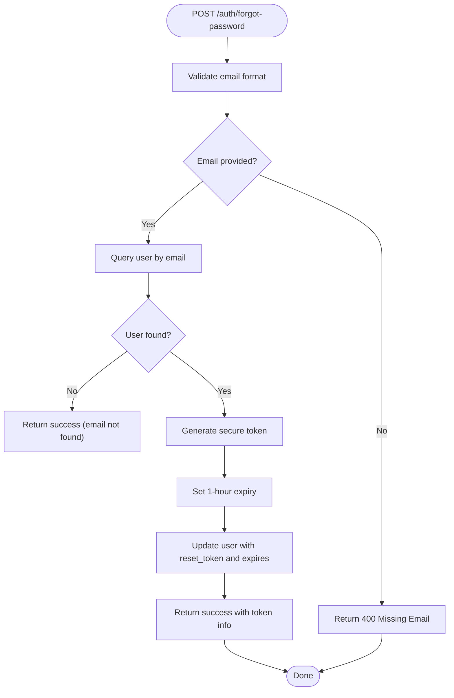
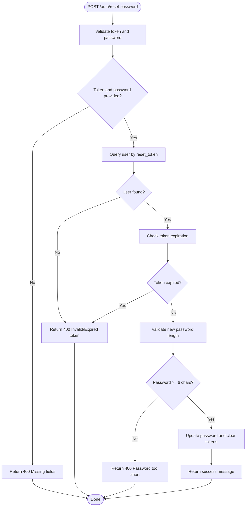
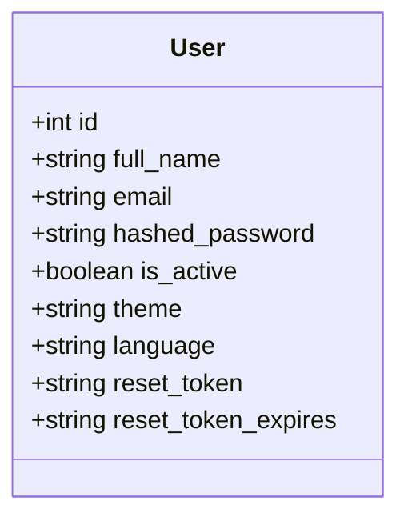
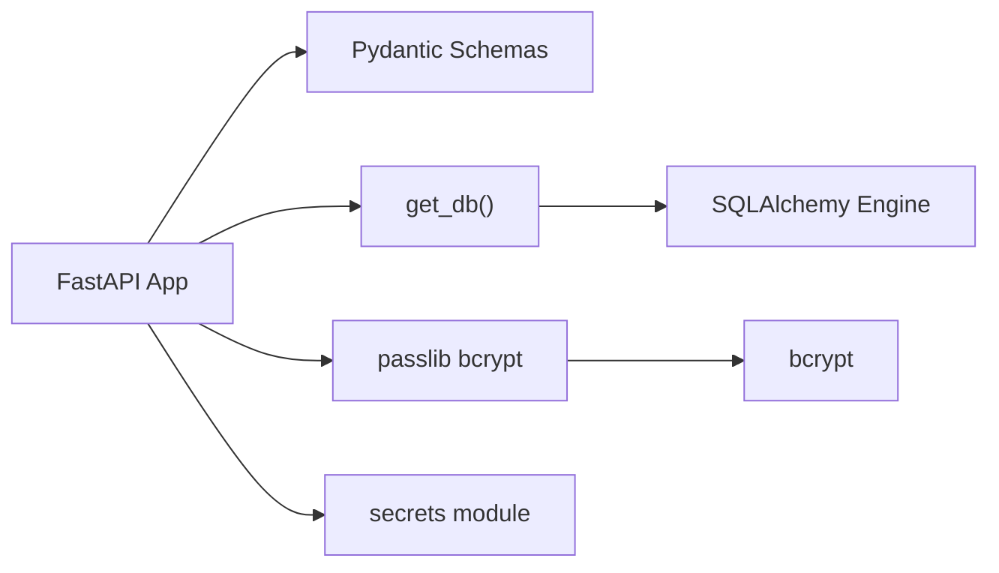

# Authentication Endpoints

<cite>
**Referenced Files in This Document**
- [main.py](file://main.py)
- [schemas.py](file://schemas.py)
- [models.py](file://models.py)
- [security.py](file://security.py)
- [database.py](file://database.py)
- [requirements.txt](file://requirements.txt)
</cite>

## Update Summary
**Changes Made**
- Added comprehensive password reset system with two new endpoints
- Enhanced User model with reset_token and reset_token_expires fields
- Added ForgotPasswordRequest and ResetPasswordRequest Pydantic schemas
- Updated authentication flow to include password reset functionality
- Enhanced security considerations for password reset tokens

## Table of Contents
1. [Introduction](#introduction)
2. [Project Structure](#project-structure)
3. [Core Components](#core-components)
4. [Architecture Overview](#architecture-overview)
5. [Detailed Component Analysis](#detailed-component-analysis)
6. [Dependency Analysis](#dependency-analysis)
7. [Performance Considerations](#performance-considerations)
8. [Troubleshooting Guide](#troubleshooting-guide)
9. [Conclusion](#conclusion)

## Introduction
This document provides comprehensive API documentation for the authentication endpoints in the MuseAmigo backend. It focuses on:
- POST /auth/register: user registration with validation and duplicate email handling
- POST /auth/login: user authentication with credential verification and response model
- POST /auth/forgot-password: password reset request with token generation
- POST /auth/reset-password: password reset completion with token validation

It also covers the integration with the User model, password handling considerations, security recommendations, and common error scenarios.

## Project Structure
The authentication endpoints are implemented in a FastAPI application with SQLAlchemy ORM models and Pydantic schemas. The key files involved are:
- main.py: FastAPI application definition, CORS middleware, and authentication routes
- schemas.py: Request/response models for authentication including new password reset schemas
- models.py: SQLAlchemy User model with enhanced reset token fields
- security.py: Password hashing and verification utilities
- database.py: Database engine and session management
- requirements.txt: Dependencies including FastAPI, SQLAlchemy, Pydantic, and passlib/bcrypt

**Diagram sources**
- [main.py:459-571](file://main.py#L459-L571)
- [schemas.py:4-23](file://schemas.py#L4-L23)
- [models.py:4-17](file://models.py#L4-L17)
- [database.py:33-38](file://database.py#L33-L38)
- [security.py:1-12](file://security.py#L1-L12)

**Section sources**
- [main.py:15-23](file://main.py#L15-L23)
- [schemas.py:4-23](file://schemas.py#L4-L23)
- [models.py:4-17](file://models.py#L4-L17)
- [database.py:33-38](file://database.py#L33-L38)
- [security.py:1-12](file://security.py#L1-L12)

## Core Components
- Authentication routes:
  - POST /auth/register: Validates input, persists user, handles duplicate email errors
  - POST /auth/login: Validates credentials, checks user completeness, returns user identifiers
  - POST /auth/forgot-password: Generates reset token for password recovery
  - POST /auth/reset-password: Validates token and resets user password
- Pydantic schemas:
  - UserCreate: request body for registration
  - UserResponse: response body for registration and settings updates
  - UserLogin: request body for login
  - ForgotPasswordRequest: request body for password reset initiation
  - ResetPasswordRequest: request body for password reset completion
- SQLAlchemy User model:
  - Fields: id, full_name, email, hashed_password, is_active, theme, language, reset_token, reset_token_expires
- Security utilities:
  - Password hashing and verification helpers for bcrypt
- Database session:
  - Dependency injection for database operations

**Section sources**
- [main.py:459-571](file://main.py#L459-L571)
- [schemas.py:4-23](file://schemas.py#L4-L23)
- [models.py:4-17](file://models.py#L4-L17)
- [security.py:1-12](file://security.py#L1-L12)
- [database.py:33-38](file://database.py#L33-L38)

## Architecture Overview
The authentication flow integrates FastAPI request handling, Pydantic validation, SQLAlchemy ORM, and database transactions. The following sequence diagrams illustrate the four primary flows.

### Registration Flow

**Diagram sources**
- [main.py:459-491](file://main.py#L459-L491)
- [schemas.py:4-17](file://schemas.py#L4-L17)
- [models.py:4-17](file://models.py#L4-L17)
- [database.py:33-38](file://database.py#L33-L38)

### Login Flow

**Diagram sources**
- [main.py:492-523](file://main.py#L492-L523)
- [schemas.py:20-23](file://schemas.py#L20-L23)
- [models.py:4-17](file://models.py#L4-L17)
- [database.py:33-38](file://database.py#L33-L38)

### Password Reset Initiation Flow

**Diagram sources**
- [main.py:525-543](file://main.py#L525-L543)
- [schemas.py:131-133](file://schemas.py#L131-L133)
- [models.py:4-17](file://models.py#L4-L17)
- [database.py:33-38](file://database.py#L33-L38)

### Password Reset Completion Flow

**Diagram sources**
- [main.py:545-571](file://main.py#L545-L571)
- [schemas.py:134-136](file://schemas.py#L134-L136)
- [models.py:4-17](file://models.py#L4-L17)
- [database.py:33-38](file://database.py#L33-L38)

## Detailed Component Analysis

### POST /auth/register
- Purpose: Register a new user with validated credentials
- Request schema (UserCreate):
  - full_name: string, required
  - email: string, required
  - password: string, required
- Response model (UserResponse):
  - id: integer
  - full_name: string
  - email: string
  - theme: string
  - language: string
- Validation rules:
  - full_name required and trimmed
  - password required and minimum length 6
- Error handling:
  - 400: Username required
  - 400: Password required
  - 400: Password must be at least 6 characters
  - 400: Duplicate email detected
  - 500: System error during persistence
- Persistence:
  - Creates a User instance with email and hashed_password set to the provided password
  - Commits and refreshes to obtain the persisted record
- Notes:
  - Current implementation stores plaintext password in hashed_password field for demonstration
  - Security enhancement pending: integrate password hashing

**Diagram sources**
- [main.py:459-491](file://main.py#L459-L491)
- [schemas.py:4-17](file://schemas.py#L4-L17)
- [models.py:4-17](file://models.py#L4-L17)

**Section sources**
- [main.py:459-491](file://main.py#L459-L491)
- [schemas.py:4-17](file://schemas.py#L4-L17)
- [models.py:4-17](file://models.py#L4-L17)

### POST /auth/login
- Purpose: Authenticate an existing user
- Request schema (UserLogin):
  - email: string, required
  - password: string, required
- Successful response:
  - message: string
  - user_id: integer
  - full_name: string
- Validation and error handling:
  - 400: Email required
  - 400: Password required
  - 404: Invalid credentials
  - 400: Account incomplete (missing full_name)
- Credential verification:
  - Queries user by email
  - Compares provided password with stored value (plaintext in current implementation)
  - Ensures full_name is present
- Notes:
  - Current implementation compares plaintext passwords
  - Security enhancement pending: enforce bcrypt hashing and verification

**Diagram sources**
- [main.py:492-523](file://main.py#L492-L523)
- [schemas.py:20-23](file://schemas.py#L20-L23)
- [models.py:4-17](file://models.py#L4-L17)

**Section sources**
- [main.py:492-523](file://main.py#L492-L523)
- [schemas.py:20-23](file://schemas.py#L20-L23)
- [models.py:4-17](file://models.py#L4-L17)

### POST /auth/forgot-password
- Purpose: Initiate password reset process by generating a reset token
- Request schema (ForgotPasswordRequest):
  - email: string, required
- Response model:
  - message: string
  - token: string (included for demo purposes)
  - expires: string (ISO format timestamp)
- Validation and error handling:
  - 200: Success (email not found returns success to prevent email enumeration)
  - 500: System error during token generation
- Token generation:
  - Generates cryptographically secure URL-safe token
  - Sets expiration to 1 hour from current UTC time
  - Updates user record with reset_token and reset_token_expires
- Security considerations:
  - Returns success even for non-existent emails to prevent email enumeration attacks
  - Uses secrets module for secure token generation
  - Stores token as plain text (enhancement pending: store hashed version)

**Diagram sources**
- [main.py:525-543](file://main.py#L525-L543)
- [schemas.py:131-133](file://schemas.py#L131-L133)
- [models.py:4-17](file://models.py#L4-L17)

**Section sources**
- [main.py:525-543](file://main.py#L525-L543)
- [schemas.py:131-133](file://schemas.py#L131-L133)
- [models.py:4-17](file://models.py#L4-L17)

### POST /auth/reset-password
- Purpose: Complete password reset process using a valid reset token
- Request schema (ResetPasswordRequest):
  - token: string, required
  - new_password: string, required
- Response model:
  - message: string
- Validation and error handling:
  - 400: Invalid or expired token
  - 400: Password must be at least 6 characters
  - 500: System error during password reset
- Token validation:
  - Verifies token exists in database
  - Checks token expiration against current UTC time
  - Rejects expired or malformed tokens
- Password reset:
  - Updates user's hashed_password with new password
  - Clears reset_token and reset_token_expires fields
  - Commits changes to database
- Security considerations:
  - One-time use tokens (cleared after successful reset)
  - 1-hour expiration window
  - Minimum password length enforcement

**Diagram sources**
- [main.py:545-571](file://main.py#L545-L571)
- [schemas.py:134-136](file://schemas.py#L134-L136)
- [models.py:4-17](file://models.py#L4-L17)

**Section sources**
- [main.py:545-571](file://main.py#L545-L571)
- [schemas.py:134-136](file://schemas.py#L134-L136)
- [models.py:4-17](file://models.py#L4-L17)

### Integration with User Model
- The User model defines the persistent structure for users, including:
  - id, full_name, email, hashed_password, is_active, theme, language
  - reset_token, reset_token_expires (newly added for password reset)
- Registration creates a new User row with provided values
- Login retrieves a User by email and verifies credentials against stored values
- Password reset uses reset_token and reset_token_expires fields for security

**Diagram sources**
- [models.py:4-17](file://models.py#L4-L17)

**Section sources**
- [models.py:4-17](file://models.py#L4-L17)

### Security Considerations and Password Handling
- Current state:
  - Registration stores plaintext password in the hashed_password field
  - Login compares plaintext password with stored value
  - Password reset tokens are stored as plain text
- Recommended enhancements:
  - Integrate bcrypt hashing for password storage using get_password_hash
  - Use verify_password for login comparisons
  - Store hashed versions of reset tokens in database
  - Implement rate limiting for password reset attempts
  - Add CSRF protection for password reset endpoints
- Dependencies:
  - bcrypt and passlib are included in requirements

**Section sources**
- [security.py:1-12](file://security.py#L1-L12)
- [requirements.txt:4-59](file://requirements.txt#L4-L59)

## Dependency Analysis
- FastAPI app depends on:
  - SQLAlchemy engine/session for database operations
  - Pydantic schemas for request/response validation
  - Security utilities for password hashing/verification
- Database session dependency:
  - get_db yields a scoped session per request
- External dependencies:
  - passlib with bcrypt scheme for hashing
  - PyMySQL driver for MySQL connectivity
  - secrets module for secure token generation

**Diagram sources**
- [main.py:459-571](file://main.py#L459-L571)
- [database.py:33-38](file://database.py#L33-L38)
- [security.py:1-12](file://security.py#L1-L12)
- [requirements.txt:4-59](file://requirements.txt#L4-L59)

**Section sources**
- [main.py:459-571](file://main.py#L459-L571)
- [database.py:33-38](file://database.py#L33-L38)
- [security.py:1-12](file://security.py#L1-L12)
- [requirements.txt:4-59](file://requirements.txt#L4-L59)

## Performance Considerations
- Database pooling:
  - Connection pool configured with pool_size and max_overflow
  - Pre-ping enabled to validate connections
- Session lifecycle:
  - Sessions are yielded per request and closed in a finally block
- Password reset optimization:
  - Token generation uses cryptographically secure secrets module
  - Expiration checks use UTC timestamps for consistency
  - Database queries use indexed email and reset_token fields
- Recommendations:
  - Consider rate limiting for authentication endpoints
  - Add caching for frequently accessed user data if needed
  - Monitor IntegrityError occurrences for duplicate email patterns
  - Implement token cleanup job for expired reset tokens

## Troubleshooting Guide
Common error scenarios and resolutions:
- Registration
  - 400 Username required: Ensure full_name is provided and non-empty
  - 400 Password required: Ensure password is provided and non-empty
  - 400 Password must be at least 6 characters: Increase password length
  - 400 Duplicate email: Use a unique email address
  - 500 System error: Retry after checking database connectivity
- Login
  - 400 Email required: Provide a valid email
  - 400 Password required: Provide a password
  - 404 Invalid credentials: Verify email and password combination
  - 400 Account incomplete: Contact support to complete profile
- Password Reset Initiation
  - 500 System error: Check database connectivity and token generation
  - No error for non-existent emails: This is expected behavior for security
- Password Reset Completion
  - 400 Invalid or expired token: Request a new password reset
  - 400 Password must be at least 6 characters: Use a stronger password
  - 500 System error: Check database connectivity and token validation

**Section sources**
- [main.py:459-571](file://main.py#L459-L571)

## Conclusion
The authentication endpoints provide a comprehensive authentication and password reset system with basic validation and error handling. The current implementation stores plaintext passwords and compares them directly, which is insecure. The password reset system includes token generation and validation but currently stores tokens as plain text. The recommended next steps are to integrate bcrypt-based hashing and verification, implement secure token storage, and add comprehensive security measures including rate limiting and CSRF protection.