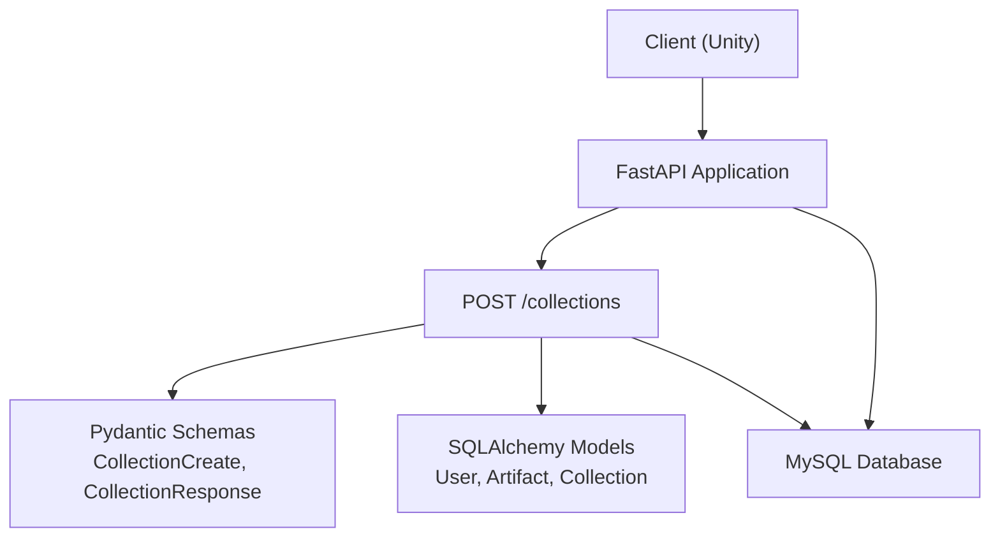
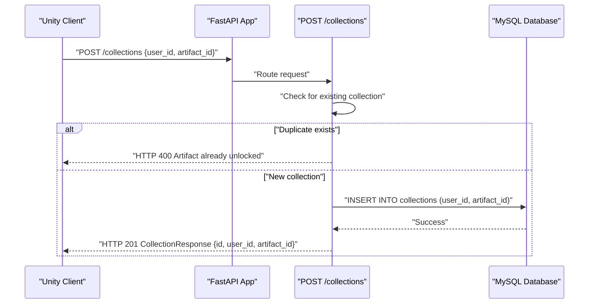
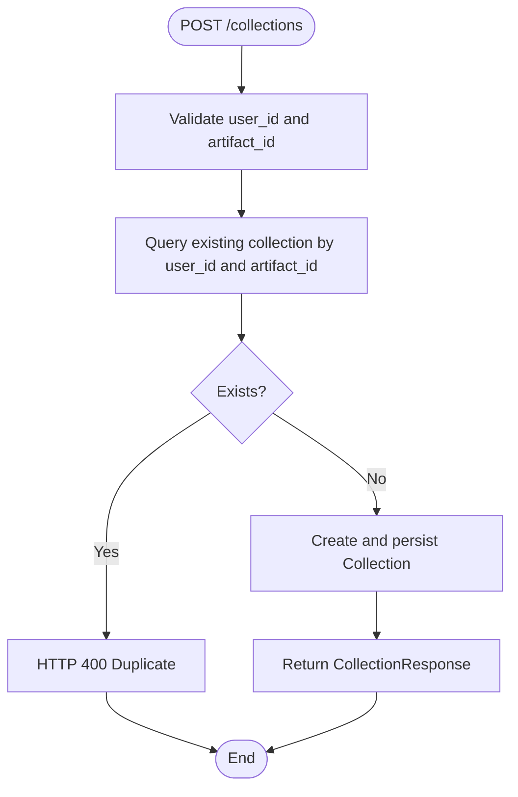
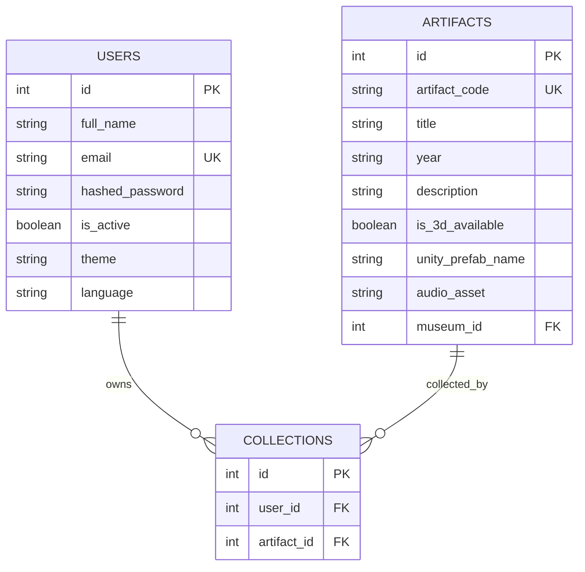
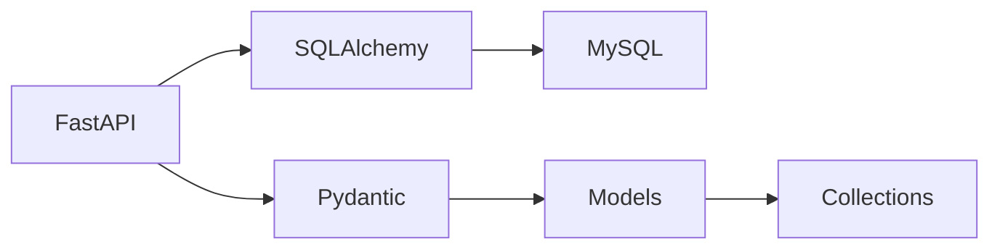

# Collection Management Endpoints

<cite>
**Referenced Files in This Document**
- [main.py](file://main.py)
- [models.py](file://models.py)
- [schemas.py](file://schemas.py)
- [database.py](file://database.py)
- [README.md](file://README.md)
- [requirements.txt](file://requirements.txt)
</cite>

## Table of Contents
1. [Introduction](#introduction)
2. [Project Structure](#project-structure)
3. [Core Components](#core-components)
4. [Architecture Overview](#architecture-overview)
5. [Detailed Component Analysis](#detailed-component-analysis)
6. [Dependency Analysis](#dependency-analysis)
7. [Performance Considerations](#performance-considerations)
8. [Troubleshooting Guide](#troubleshooting-guide)
9. [Conclusion](#conclusion)
10. [Appendices](#appendices)

## Introduction
This document provides comprehensive API documentation for collection management endpoints, focusing on the POST /collections endpoint used to add artifacts to user collections. It covers request and response schemas, validation rules, duplicate prevention logic, database constraints, error handling, and integration with the Collection model. It also explains the relationships between users, artifacts, and collections, along with collection persistence and retrieval patterns.

## Project Structure
The backend is built with FastAPI and SQLAlchemy, using a MySQL database. The collection management feature is implemented as a single endpoint that validates inputs, prevents duplicates, persists the relationship, and returns the created record.

**Diagram sources**
- [main.py:634-661](file://main.py#L634-L661)
- [schemas.py:50-62](file://schemas.py#L50-L62)
- [models.py:43-51](file://models.py#L43-L51)
- [database.py:18-38](file://database.py#L18-L38)

**Section sources**
- [main.py:15-23](file://main.py#L15-L23)
- [database.py:18-38](file://database.py#L18-L38)
- [requirements.txt:12-47](file://requirements.txt#L12-L47)

## Core Components
- POST /collections endpoint: Adds a new artifact to a user’s collection with duplicate prevention.
- Request schema CollectionCreate: user_id and artifact_id.
- Response schema CollectionResponse: id, user_id, artifact_id.
- Collection model: links users and artifacts via foreign keys.

Key implementation highlights:
- Duplicate prevention: Queries existing collection records by user_id and artifact_id.
- Persistence: Creates a new Collection record and commits to the database.
- Error handling: Raises HTTP 400 when a duplicate is detected.

**Section sources**
- [main.py:634-661](file://main.py#L634-L661)
- [schemas.py:50-62](file://schemas.py#L50-L62)
- [models.py:43-51](file://models.py#L43-L51)

## Architecture Overview
The collection management flow integrates FastAPI routing, Pydantic validation, SQLAlchemy ORM, and MySQL persistence.

**Diagram sources**
- [main.py:634-661](file://main.py#L634-L661)
- [schemas.py:50-62](file://schemas.py#L50-L62)
- [models.py:43-51](file://models.py#L43-L51)

## Detailed Component Analysis

### POST /collections Endpoint
Purpose: Add an artifact to a user’s collection while preventing duplicates.

- HTTP Method: POST
- Path: /collections
- Request Body: CollectionCreate (user_id, artifact_id)
- Response: CollectionResponse (id, user_id, artifact_id)
- Status Codes:
  - 201 Created: Successfully added
  - 400 Bad Request: Duplicate entry

Processing Logic:
1. Query existing collection entries matching user_id and artifact_id.
2. If found, return HTTP 400 with a descriptive message.
3. Otherwise, create a new Collection record and persist it.
4. Return the created record as CollectionResponse.

Validation Rules:
- user_id must be a positive integer.
- artifact_id must be a positive integer.
- Duplicate prevention ensures uniqueness per user-artifact pair.

Database Constraints:
- collections.user_id references users.id.
- collections.artifact_id references artifacts.id.
- The combination of user_id and artifact_id enforces uniqueness at the application level (duplicate detection logic).

Error Handling:
- HTTP 400 raised when attempting to add a duplicate artifact to a user’s collection.
- No explicit database-level unique constraint is shown in the model definition; the application enforces uniqueness via pre-insert checks.

Integration with Collection Model:
- Uses models.Collection with user_id and artifact_id fields.
- Returns a CollectionResponse that mirrors the persisted record.

Example Workflows:
- Successful Addition:
  - Request: POST /collections with user_id=1, artifact_id=5
  - Response: 201 with id, user_id, artifact_id
- Duplicate Prevention:
  - Request: POST /collections with user_id=1, artifact_id=5 (already exists)
  - Response: 400 with “Artifact already unlocked in your collection!”

**Diagram sources**
- [main.py:634-661](file://main.py#L634-L661)
- [schemas.py:50-62](file://schemas.py#L50-L62)
- [models.py:43-51](file://models.py#L43-L51)

**Section sources**
- [main.py:634-661](file://main.py#L634-L661)
- [schemas.py:50-62](file://schemas.py#L50-L62)
- [models.py:43-51](file://models.py#L43-L51)

### Data Models and Relationships
The Collection model defines the many-to-many relationship between users and artifacts through foreign keys.

Notes:
- Users and Artifacts are linked via COLLECTIONS.
- The model does not define a unique constraint on (user_id, artifact_id); uniqueness is enforced by the endpoint logic.

**Diagram sources**
- [models.py:4-15](file://models.py#L4-L15)
- [models.py:27-43](file://models.py#L27-L43)
- [models.py:43-51](file://models.py#L43-L51)

**Section sources**
- [models.py:4-15](file://models.py#L4-L15)
- [models.py:27-43](file://models.py#L27-L43)
- [models.py:43-51](file://models.py#L43-L51)

### Request and Response Schemas
- CollectionCreate: user_id (int), artifact_id (int)
- CollectionResponse: id (int), user_id (int), artifact_id (int)

These schemas are used by the endpoint to validate incoming data and serialize outgoing responses.

**Section sources**
- [schemas.py:50-62](file://schemas.py#L50-L62)

### Database Layer
- Engine and Session creation are configured in database.py.
- The application creates all tables on startup and uses a connection pool for performance.

**Section sources**
- [database.py:18-38](file://database.py#L18-L38)
- [main.py:12-13](file://main.py#L12-L13)

## Dependency Analysis
- FastAPI: Routing and HTTP handling.
- SQLAlchemy: ORM and database connectivity.
- Pydantic: Request/response validation.
- MySQL: Persistent storage for collections and related entities.

**Diagram sources**
- [requirements.txt:12-47](file://requirements.txt#L12-L47)
- [database.py:18-38](file://database.py#L18-L38)
- [models.py:43-51](file://models.py#L43-L51)

**Section sources**
- [requirements.txt:12-47](file://requirements.txt#L12-L47)
- [database.py:18-38](file://database.py#L18-L38)
- [models.py:43-51](file://models.py#L43-L51)

## Performance Considerations
- Connection pooling: The database engine uses a pool with configurable size and pre-ping to maintain healthy connections.
- Endpoint efficiency: The duplicate check is a simple query on two integer fields; ensure appropriate indexing on collections.user_id and collections.artifact_id for optimal performance.
- Batch operations: If adding multiple artifacts, consider batching to reduce round-trips.

[No sources needed since this section provides general guidance]

## Troubleshooting Guide
Common issues and resolutions:
- HTTP 400 “Artifact already unlocked in your collection!”
  - Cause: Attempting to add an artifact that already exists in the user’s collection.
  - Resolution: Verify that the artifact is not already present before calling the endpoint.
- HTTP 404 “Not Found” for artifacts
  - Cause: artifact_id does not correspond to an existing artifact.
  - Resolution: Ensure artifact_id is valid and corresponds to an existing artifact.
- Integrity errors
  - Cause: Database-level constraints or connection issues.
  - Resolution: Check database connectivity and constraints; review logs for specific error messages.

**Section sources**
- [main.py:634-661](file://main.py#L634-L661)

## Conclusion
The POST /collections endpoint provides a straightforward mechanism to add artifacts to user collections with robust duplicate prevention. It integrates cleanly with the existing data models and schemas, ensuring predictable behavior and clear error signaling. The endpoint’s design balances simplicity with reliability, enabling seamless collection management within the MuseAmigo ecosystem.

[No sources needed since this section summarizes without analyzing specific files]

## Appendices

### API Definition Summary
- Endpoint: POST /collections
- Request Schema: CollectionCreate (user_id:int, artifact_id:int)
- Response Schema: CollectionResponse (id:int, user_id:int, artifact_id:int)
- Behavior: Prevents duplicates; returns 201 on success, 400 on duplicate

**Section sources**
- [main.py:634-661](file://main.py#L634-L661)
- [schemas.py:50-62](file://schemas.py#L50-L62)

### Relationship Between Users, Artifacts, and Collections
- Users collect artifacts through the collections table.
- Each row represents a unique ownership relationship.
- Retrieval patterns:
  - List a user’s collections by filtering collections.user_id.
  - Retrieve artifact details by joining collections.artifact_id with artifacts.id.

**Section sources**
- [models.py:43-51](file://models.py#L43-L51)

### Integration Notes
- The endpoint depends on database.py for session management and engine configuration.
- Swagger UI is available for testing at the documented URL.

**Section sources**
- [database.py:18-38](file://database.py#L18-L38)
- [README.md:24-33](file://README.md#L24-L33)