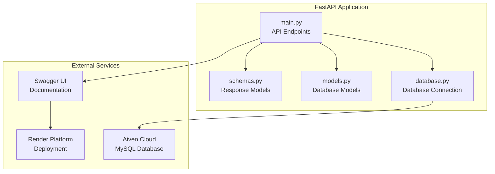
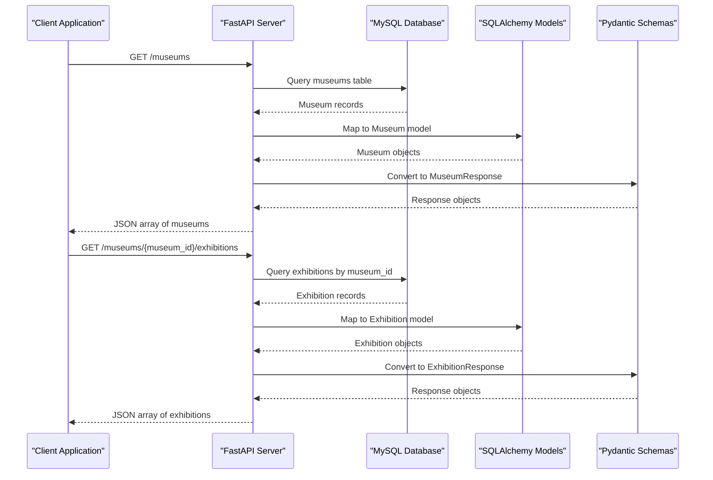
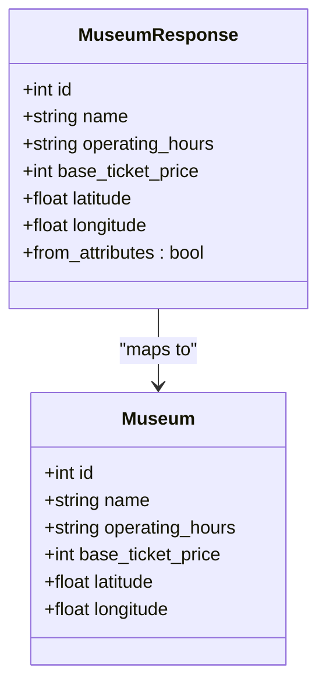
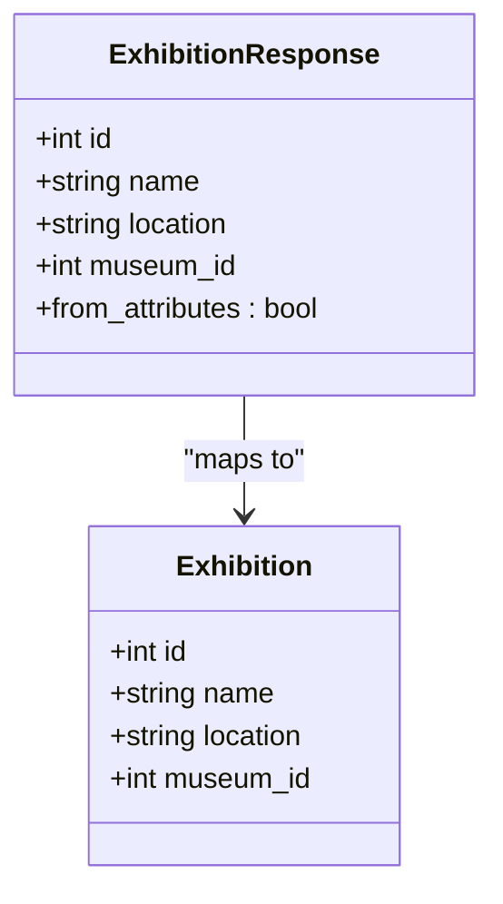
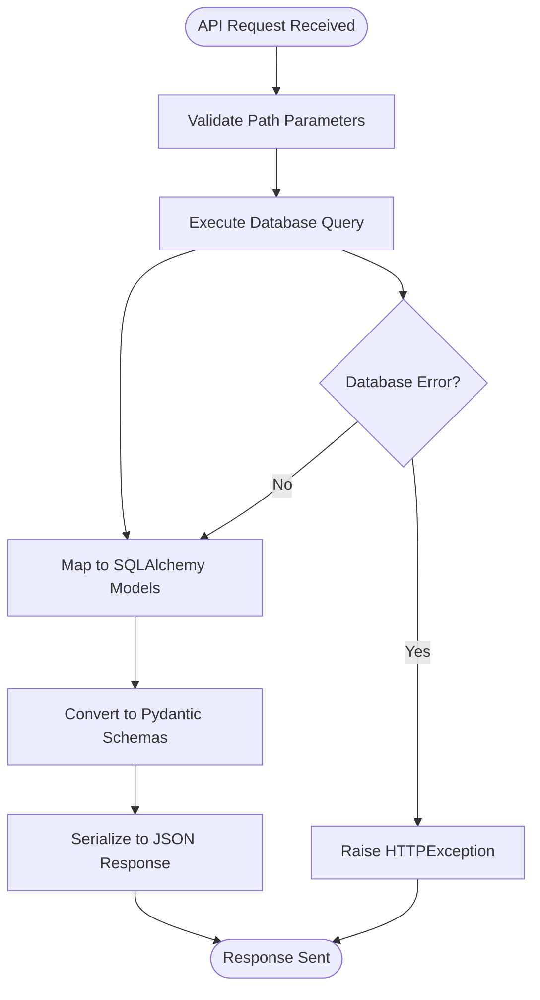
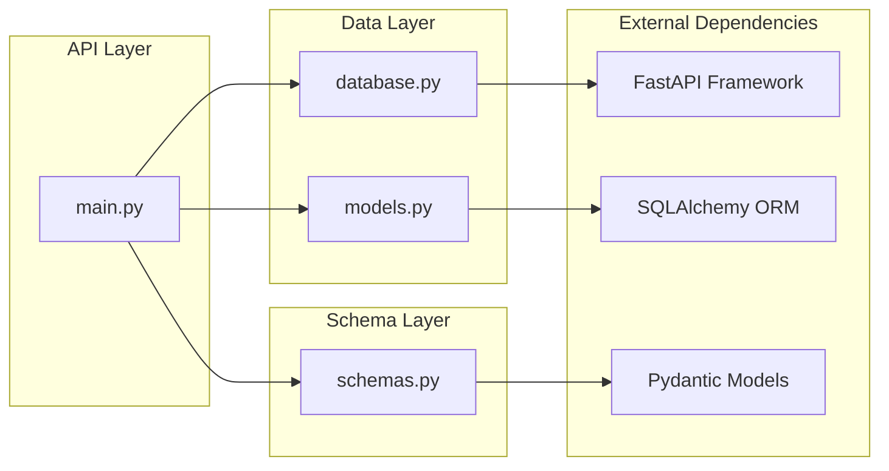
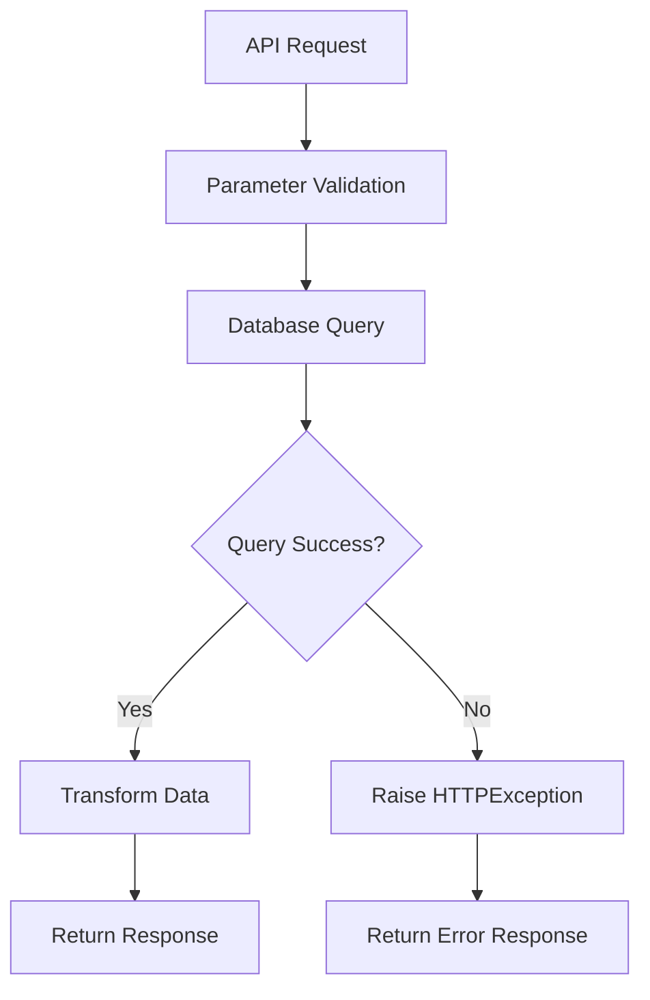

# Museum Management Endpoints

<cite>
**Referenced Files in This Document**
- [main.py](file://main.py)
- [models.py](file://models.py)
- [schemas.py](file://schemas.py)
- [database.py](file://database.py)
- [README.md](file://README.md)
</cite>

## Table of Contents
1. [Introduction](#introduction)
2. [Project Structure](#project-structure)
3. [Core Components](#core-components)
4. [Architecture Overview](#architecture-overview)
5. [Detailed Component Analysis](#detailed-component-analysis)
6. [Dependency Analysis](#dependency-analysis)
7. [Performance Considerations](#performance-considerations)
8. [Troubleshooting Guide](#troubleshooting-guide)
9. [Conclusion](#conclusion)

## Introduction
This document provides comprehensive API documentation for museum management endpoints in the MuseAmigo backend system. It focuses on two primary endpoints: retrieving all museums and fetching exhibitions specific to a museum. The documentation covers request parameters, response schemas, error handling, and integration with the underlying Museum and Exhibition models.

## Project Structure
The backend is built with FastAPI and SQLAlchemy, featuring a clear separation between API endpoints, data models, and response schemas. The project includes database seeding utilities and integrates with external services for AI assistance.

**Diagram sources**
- [main.py:15-23](file://main.py#L15-L23)
- [database.py:12-24](file://database.py#L12-L24)

**Section sources**
- [main.py:15-23](file://main.py#L15-L23)
- [database.py:12-24](file://database.py#L12-L24)

## Core Components
This section documents the two primary endpoints for museum management:

### GET /museums
Retrieves a list of all museums with their operational details.

**Endpoint**: `GET /museums`

**Response Model**: List of `MuseumResponse` objects

**Response Schema**:
- `id`: Integer identifier
- `name`: String name of the museum
- `operating_hours`: String operating hours
- `base_ticket_price`: Integer base ticket price
- `latitude`: Float latitude coordinate
- `longitude`: Float longitude coordinate

**Implementation Details**:
- Query: Retrieves all records from the `museums` table
- Response: Returns a list of MuseumResponse objects
- Error Handling: No explicit validation for invalid IDs (as this endpoint returns all museums)

**Section sources**
- [main.py:603-607](file://main.py#L603-L607)
- [schemas.py:24-35](file://schemas.py#L24-L35)
- [models.py:16-26](file://models.py#L16-L26)

### GET /museums/{museum_id}/exhibitions
Fetches exhibitions specific to a given museum.

**Endpoint**: `GET /museums/{museum_id}/exhibitions`

**Path Parameter**:
- `museum_id`: Integer identifier of the target museum

**Response Model**: List of `ExhibitionResponse` objects

**Response Schema**:
- `id`: Integer identifier
- `name`: String exhibition name
- `location`: String exhibition location
- `museum_id`: Integer foreign key linking to the museum

**Implementation Details**:
- Query: Filters exhibitions by `museum_id` foreign key
- Response: Returns a list of ExhibitionResponse objects
- Error Handling: No explicit validation for invalid museum IDs

**Section sources**
- [main.py:663-667](file://main.py#L663-L667)
- [schemas.py:65-73](file://schemas.py#L65-L73)
- [models.py:52-61](file://models.py#L52-L61)

## Architecture Overview
The API follows a layered architecture with clear separation between presentation, business logic, and data persistence layers.

**Diagram sources**
- [main.py:603-607](file://main.py#L603-L607)
- [main.py:663-667](file://main.py#L663-L667)
- [database.py:32-38](file://database.py#L32-L38)

## Detailed Component Analysis

### MuseumResponse Model
The MuseumResponse schema defines the structure for museum data transmission.

**Diagram sources**
- [schemas.py:24-35](file://schemas.py#L24-L35)
- [models.py:16-26](file://models.py#L16-L26)

**Section sources**
- [schemas.py:24-35](file://schemas.py#L24-L35)
- [models.py:16-26](file://models.py#L16-L26)

### ExhibitionResponse Model
The ExhibitionResponse schema structures exhibition data for client consumption.

**Diagram sources**
- [schemas.py:65-73](file://schemas.py#L65-L73)
- [models.py:52-61](file://models.py#L52-L61)

**Section sources**
- [schemas.py:65-73](file://schemas.py#L65-L73)
- [models.py:52-61](file://models.py#L52-L61)

### Database Integration Flow
The endpoints demonstrate a clean integration pattern between FastAPI, SQLAlchemy, and the database layer.

**Diagram sources**
- [main.py:603-607](file://main.py#L603-L607)
- [main.py:663-667](file://main.py#L663-L667)
- [database.py:32-38](file://database.py#L32-L38)

**Section sources**
- [main.py:603-607](file://main.py#L603-L607)
- [main.py:663-667](file://main.py#L663-L667)
- [database.py:32-38](file://database.py#L32-L38)

## Dependency Analysis
The system exhibits clear dependency relationships between components:

**Diagram sources**
- [main.py:1-10](file://main.py#L1-L10)
- [models.py:1-2](file://models.py#L1-L2)
- [schemas.py:1](file://schemas.py#L1)

**Section sources**
- [main.py:1-10](file://main.py#L1-L10)
- [models.py:1-2](file://models.py#L1-L2)
- [schemas.py:1](file://schemas.py#L1)

## Performance Considerations
The application implements several performance optimization strategies:

- **Connection Pooling**: Database connections are pooled with configurable limits
- **Pre-ping Validation**: Connections are validated before use to prevent stale connections
- **Automatic Cleanup**: Database sessions are automatically closed after each request
- **Efficient Queries**: Direct table queries without unnecessary joins

**Section sources**
- [database.py:18-24](file://database.py#L18-L24)
- [database.py:32-38](file://database.py#L32-L38)

## Troubleshooting Guide

### Common Issues and Solutions

**Issue**: Empty museum list response
- **Cause**: Database seeding not executed or empty database
- **Solution**: Verify database connectivity and ensure seeding process runs on startup

**Issue**: Exhibition endpoint returns empty list
- **Cause**: Museum ID doesn't exist or no exhibitions associated
- **Solution**: Verify museum exists in the database and has related exhibition records

**Issue**: CORS errors in development
- **Cause**: Cross-origin requests blocked
- **Solution**: Verify CORS middleware configuration allows all origins during development

**Section sources**
- [main.py:17-23](file://main.py#L17-L23)
- [main.py:512-526](file://main.py#L512-L526)

### Error Handling Patterns
The endpoints follow consistent error handling patterns:

**Diagram sources**
- [main.py:603-607](file://main.py#L603-L607)
- [main.py:663-667](file://main.py#L663-L667)

**Section sources**
- [main.py:603-607](file://main.py#L603-L607)
- [main.py:663-667](file://main.py#L663-L667)

## Conclusion
The museum management endpoints provide a robust foundation for museum data retrieval and exhibition listing. The implementation demonstrates clean architectural separation, efficient database integration, and consistent error handling patterns. The system is designed for scalability and maintains clear boundaries between concerns while providing straightforward APIs for frontend consumption.