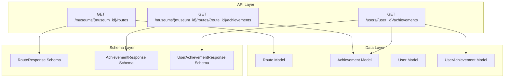
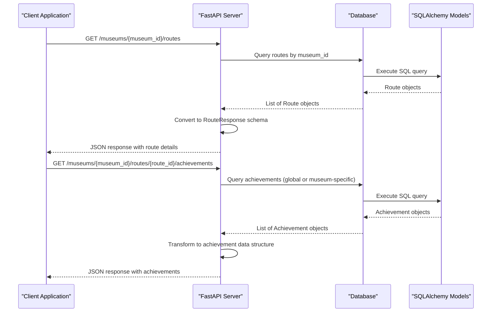
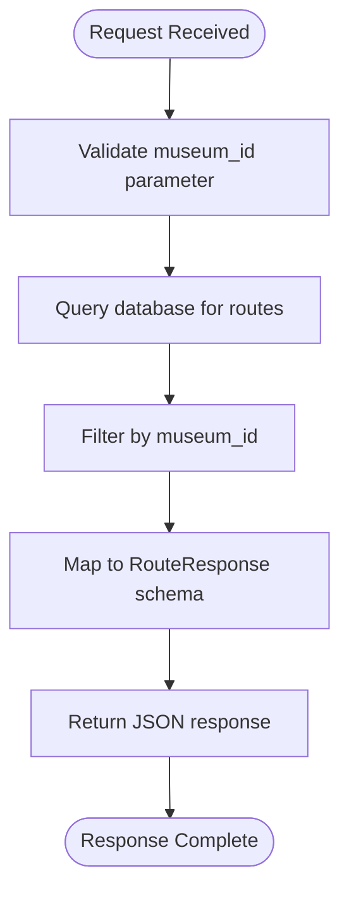
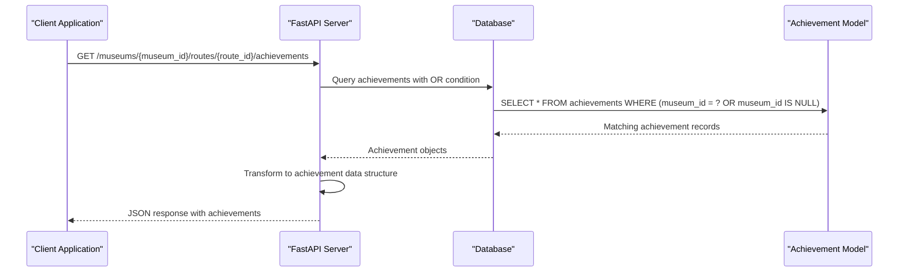
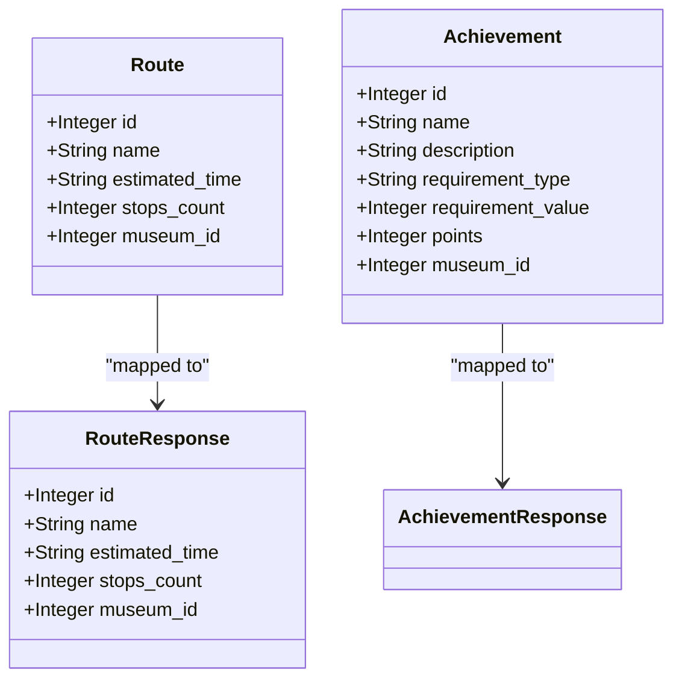
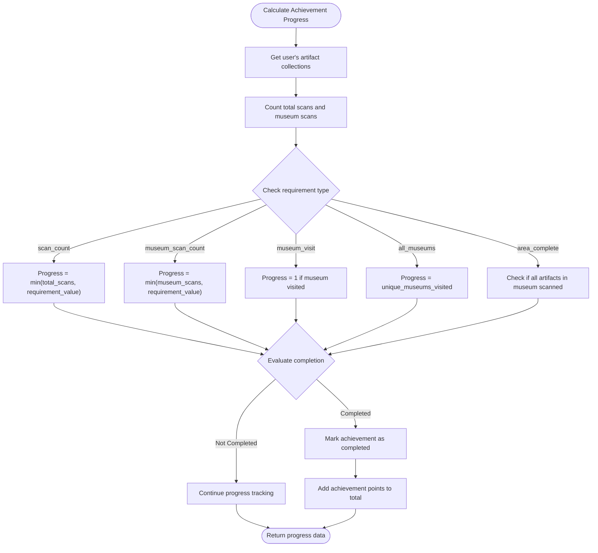
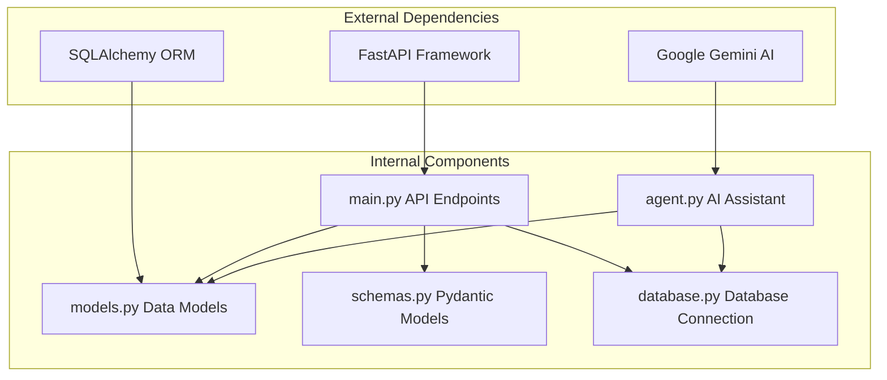

# Navigation System Endpoints

<cite>
**Referenced Files in This Document**
- [main.py](file://main.py)
- [models.py](file://models.py)
- [schemas.py](file://schemas.py)
- [agent.py](file://agent.py)
- [README.md](file://README.md)
</cite>

## Table of Contents
1. [Introduction](#introduction)
2. [Project Structure](#project-structure)
3. [Core Components](#core-components)
4. [Architecture Overview](#architecture-overview)
5. [Detailed Component Analysis](#detailed-component-analysis)
6. [Dependency Analysis](#dependency-analysis)
7. [Performance Considerations](#performance-considerations)
8. [Troubleshooting Guide](#troubleshooting-guide)
9. [Conclusion](#conclusion)

## Introduction
This document provides comprehensive API documentation for the navigation system endpoints in the MuseAmigo backend. It focuses on two key endpoints:
- GET /museums/{museum_id}/routes: Retrieves navigation routes for a specific museum
- GET /museums/{museum_id}/routes/{route_id}/achievements: Retrieves achievements associated with a specific route, including filtering by museum scope (global vs museum-specific)

The documentation covers response models, data structures, achievement calculation logic, and integration with the Route and Achievement models. It also includes practical examples of route planning and achievement-based navigation.

## Project Structure
The navigation system is built with FastAPI and SQLAlchemy, featuring a modular structure with clear separation between models, schemas, and API endpoints.

**Diagram sources**
- [main.py:696-722](file://main.py#L696-L722)
- [models.py:75-105](file://models.py#L75-L105)
- [schemas.py:94-126](file://schemas.py#L94-L126)

**Section sources**
- [main.py:15-23](file://main.py#L15-L23)
- [models.py:1-105](file://models.py#L1-105)
- [schemas.py:1-137](file://schemas.py#L1-L137)

## Core Components
The navigation system consists of several core components that work together to provide route discovery and achievement tracking capabilities.

### Route Management
Routes represent curated pathways through museums with metadata about duration and stop counts. Each route is associated with a specific museum through a foreign key relationship.

### Achievement System
The achievement system tracks user progress toward various goals, with both global achievements (available across all museums) and museum-specific achievements. Achievements have different requirement types and point values.

### Data Models
The system uses SQLAlchemy models to define the database structure, with clear relationships between routes, achievements, users, and collections.

**Section sources**
- [models.py:75-105](file://models.py#L75-L105)
- [schemas.py:94-126](file://schemas.py#L94-L126)

## Architecture Overview
The navigation system follows a layered architecture pattern with clear separation of concerns:

**Diagram sources**
- [main.py:696-722](file://main.py#L696-L722)
- [models.py:75-95](file://models.py#L75-L95)

The architecture ensures loose coupling between components while maintaining clear data flow patterns. The system supports both route discovery and achievement-based navigation experiences.

## Detailed Component Analysis

### GET /museums/{museum_id}/routes Endpoint

This endpoint retrieves all navigation routes available for a specific museum, returning detailed information about each route including name, estimated time, and stop count.

#### Request Parameters
- **museum_id** (path parameter): Integer identifier of the target museum

#### Response Model
The endpoint returns a list of RouteResponse objects with the following structure:
- id: Route identifier
- name: Route name/description
- estimated_time: Duration string (e.g., "45 min")
- stops_count: Number of stops/locations in the route
- museum_id: Associated museum identifier

#### Implementation Details
The endpoint performs a simple database query filtered by museum_id, returning all matching routes. The response is automatically validated against the RouteResponse schema.

**Diagram sources**
- [main.py:696-700](file://main.py#L696-L700)
- [schemas.py:94-102](file://schemas.py#L94-L102)

**Section sources**
- [main.py:696-700](file://main.py#L696-L700)
- [schemas.py:94-102](file://schemas.py#L94-L102)

### GET /museums/{museum_id}/routes/{route_id}/achievements Endpoint

This endpoint retrieves achievements that are relevant to a specific route, combining both global achievements and museum-specific achievements.

#### Request Parameters
- **museum_id** (path parameter): Integer identifier of the museum
- **route_id** (path parameter): Integer identifier of the route

#### Response Structure
The endpoint returns a structured response containing:
- route_id: The requested route identifier
- museum_id: The associated museum identifier
- achievements: Array of achievement objects with:
  - id: Achievement identifier
  - name: Achievement name
  - description: Achievement description
  - points: Point value for completing achievement

#### Achievement Filtering Logic
The endpoint implements museum-scoped filtering using SQL OR conditions:
- Achievements where museum_id equals the requested museum_id
- Achievements where museum_id is NULL (global achievements)

This allows for flexible achievement presentation that can include both universal challenges and museum-specific goals.

**Diagram sources**
- [main.py:703-722](file://main.py#L703-L722)
- [models.py:86-95](file://models.py#L86-L95)

**Section sources**
- [main.py:703-722](file://main.py#L703-L722)
- [models.py:86-95](file://models.py#L86-L95)

### Route Data Structure

The Route model defines the core navigation data structure with the following attributes:

**Diagram sources**
- [models.py:75-95](file://models.py#L75-L95)
- [schemas.py:94-114](file://schemas.py#L94-L114)

#### Route Attributes
- **id**: Unique identifier for the route
- **name**: Descriptive name for the route
- **estimated_time**: Duration string indicating expected visit time
- **stops_count**: Number of locations/stops included in the route
- **museum_id**: Foreign key linking to the associated museum

#### Achievement Data Structure
Achievements have a comprehensive structure supporting different requirement types and scopes:

- **id**: Unique achievement identifier
- **name**: Achievement title
- **description**: Detailed description of the achievement
- **requirement_type**: Type of requirement (scan_count, museum_scan_count, museum_visit, all_museums, area_complete)
- **requirement_value**: Target value for the requirement
- **points**: Points awarded upon completion
- **museum_id**: Scope indicator (NULL for global, specific museum_id for scoped achievements)

**Section sources**
- [models.py:75-105](file://models.py#L75-L105)
- [schemas.py:94-126](file://schemas.py#L94-L126)

### Achievement Calculation Logic

The system includes comprehensive achievement calculation logic that evaluates user progress and determines completion status. This logic is primarily implemented in the user achievements endpoint but informs the route-based achievement filtering.

#### Requirement Types and Logic

**Diagram sources**
- [main.py:738-844](file://main.py#L738-L844)

#### Achievement Scoring System
The achievement system uses a tiered scoring approach:
- **Global Achievements**: Available across all museums, focusing on overall user activity
- **Museum-Specific Achievements**: Targeted challenges within individual museums
- **Point Values**: Vary based on achievement difficulty and importance

#### Progress Tracking Mechanisms
- **Scan Count Progression**: Tracks cumulative artifact scanning across all museums
- **Museum-Specific Scanning**: Monitors progress within individual museum contexts
- **Visit Completion**: Recognizes museum visits regardless of artifact scanning
- **Collection Completion**: Awards special recognition for completing entire museum collections

**Section sources**
- [main.py:738-844](file://main.py#L738-L844)

## Dependency Analysis

The navigation system exhibits clear dependency relationships between components:

**Diagram sources**
- [main.py:1-10](file://main.py#L1-L10)
- [agent.py:1-16](file://agent.py#L1-L16)
- [models.py:1-2](file://models.py#L1-L2)

### Component Coupling
The system maintains low coupling through:
- Clear separation between API endpoints and data models
- Schema-based validation preventing data inconsistencies
- Modular database connection handling
- Independent AI assistant functionality

### Integration Points
Key integration points include:
- Database layer integration for all CRUD operations
- AI assistant integration for contextual route information
- External API integrations for external services

**Section sources**
- [main.py:1-10](file://main.py#L1-L10)
- [agent.py:1-16](file://agent.py#L1-L16)
- [models.py:1-2](file://models.py#L1-L2)

## Performance Considerations

### Database Query Optimization
The navigation endpoints use straightforward queries that are optimized for their specific use cases:
- Route queries filter by museum_id for efficient retrieval
- Achievement queries use OR conditions for scope filtering
- No complex joins are required for these endpoints

### Caching Opportunities
Potential caching strategies could include:
- Route data caching for frequently accessed museums
- Achievement data caching for static achievement definitions
- User achievement progress caching for real-time updates

### Scalability Factors
- Current implementation scales linearly with museum size
- Achievement calculations could benefit from indexed user collections
- Route and achievement data are relatively static, suitable for caching

## Troubleshooting Guide

### Common Issues and Solutions

#### Route Retrieval Issues
- **Problem**: Routes not appearing for specific museums
- **Solution**: Verify museum_id parameter and ensure routes exist in the database
- **Debugging**: Check database entries for matching museum_id values

#### Achievement Filtering Problems
- **Problem**: Achievements not displaying correctly for route pages
- **Solution**: Verify achievement museum_id relationships and NULL handling
- **Debugging**: Test both global and museum-specific achievement queries

#### Data Model Consistency
- **Problem**: Inconsistent data between models and schemas
- **Solution**: Ensure all model changes are reflected in corresponding schemas
- **Debugging**: Validate Pydantic model configurations and field mappings

### Error Handling
The system implements robust error handling:
- HTTPException for invalid parameters and missing resources
- Database integrity checks for concurrent operations
- Graceful fallbacks for AI assistant failures

**Section sources**
- [main.py:560-601](file://main.py#L560-L601)
- [main.py:627-631](file://main.py#L627-L631)

## Conclusion

The navigation system provides a comprehensive foundation for museum route discovery and achievement-based navigation. The two primary endpoints offer distinct but complementary functionality:

1. **Route Discovery**: The GET /museums/{museum_id}/routes endpoint provides essential navigation information for visitors
2. **Achievement Context**: The GET /museums/{museum_id}/routes/{route_id}/achievements endpoint enhances the visitor experience by connecting routes with relevant challenges

The system's architecture supports scalability and maintainability while providing clear pathways for future enhancements. The achievement calculation logic demonstrates sophisticated user engagement tracking that could be expanded for more complex gamification scenarios.

Future improvements could include route optimization algorithms, dynamic achievement generation based on route difficulty, and enhanced AI integration for personalized route recommendations.