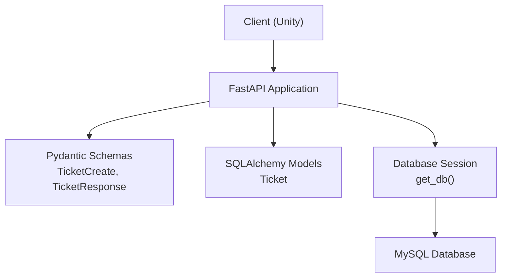
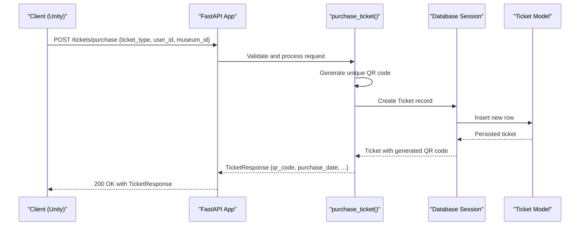
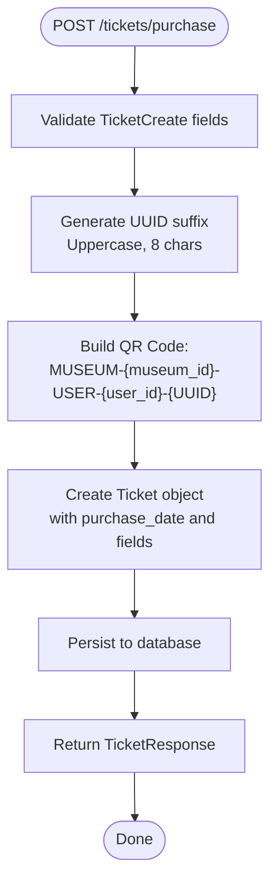
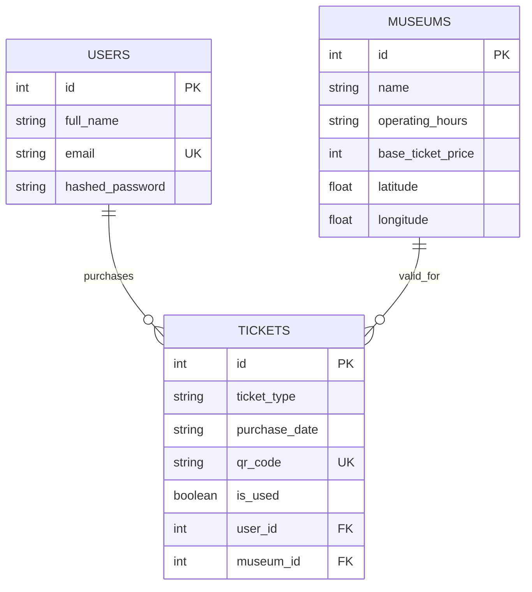
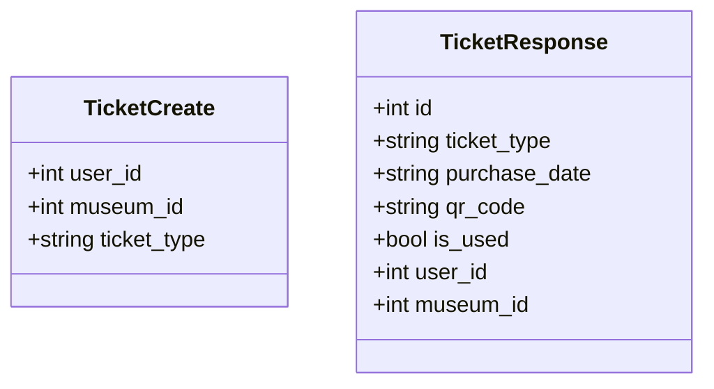
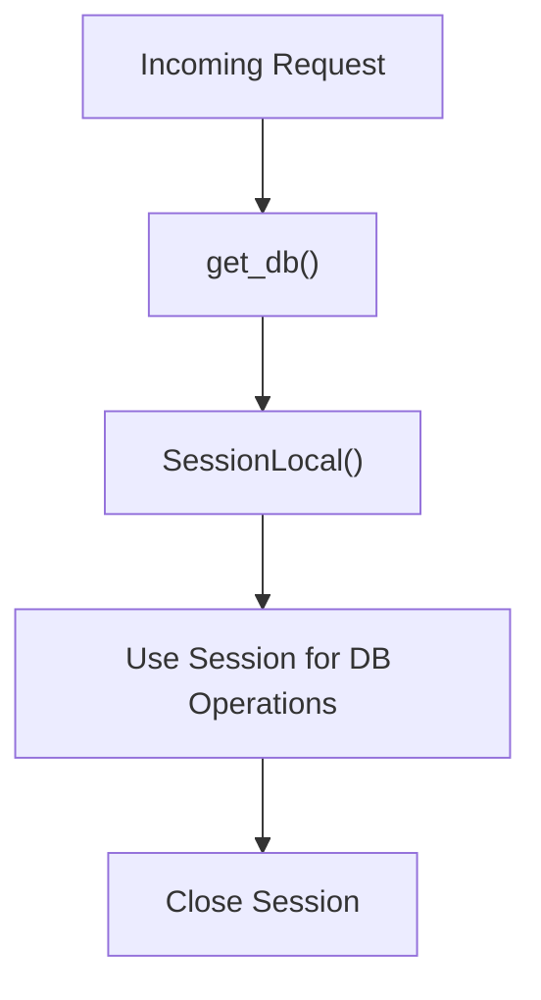
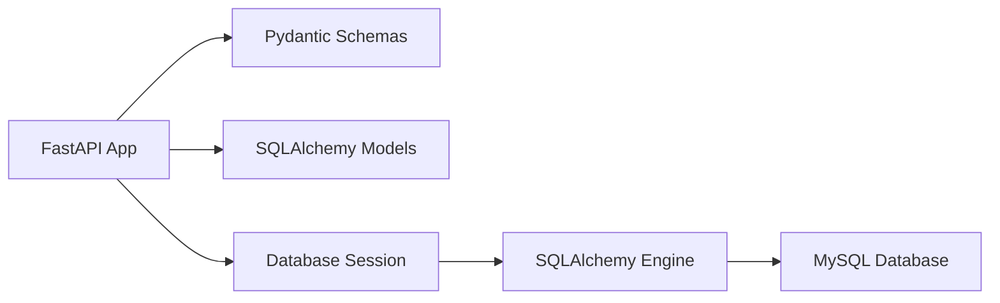

# Ticket Management Endpoints

<cite>
**Referenced Files in This Document**
- [main.py](file://main.py)
- [models.py](file://models.py)
- [schemas.py](file://schemas.py)
- [database.py](file://database.py)
- [README.md](file://README.md)
</cite>

## Table of Contents
1. [Introduction](#introduction)
2. [Project Structure](#project-structure)
3. [Core Components](#core-components)
4. [Architecture Overview](#architecture-overview)
5. [Detailed Component Analysis](#detailed-component-analysis)
6. [Dependency Analysis](#dependency-analysis)
7. [Performance Considerations](#performance-considerations)
8. [Troubleshooting Guide](#troubleshooting-guide)
9. [Conclusion](#conclusion)
10. [Appendices](#appendices)

## Introduction
This document provides comprehensive API documentation for the ticket management endpoints, focusing on the POST /tickets/purchase endpoint. It explains the request schema, response model, QR code generation algorithm, unique identifier creation, ticket data structure, and integration with the Ticket model. It also covers ticket validation, QR code format specifications, and ticket lifecycle management, along with practical examples and troubleshooting guidance.

## Project Structure
The backend is built with FastAPI and SQLAlchemy, exposing REST endpoints for ticket purchases and integrating with a MySQL database. The key components involved in ticket management are:
- FastAPI application and routing
- Pydantic models for request/response schemas
- SQLAlchemy models for persistence
- Database session management and connection pooling

**Diagram sources**
- [main.py:15-23](file://main.py#L15-L23)
- [schemas.py:75-92](file://schemas.py#L75-L92)
- [models.py:62-74](file://models.py#L62-L74)
- [database.py:33-38](file://database.py#L33-L38)

**Section sources**
- [main.py:15-23](file://main.py#L15-L23)
- [schemas.py:75-92](file://schemas.py#L75-L92)
- [models.py:62-74](file://models.py#L62-L74)
- [database.py:33-38](file://database.py#L33-L38)

## Core Components
- POST /tickets/purchase
  - Purpose: Purchase a virtual ticket and generate a QR code for museum entry.
  - Request Schema: TicketCreate with user_id, museum_id, and ticket_type.
  - Response Model: TicketResponse including generated QR code, purchase date, and ticket details.
  - QR Code Generation: Unique identifier created using UUID and structured format.
  - Ticket Lifecycle: Creation, storage, and readiness for use.

Key implementation references:
- Endpoint definition and handler: [purchase_ticket:669-694](file://main.py#L669-L694)
- Request schema: [TicketCreate:76-80](file://schemas.py#L76-L80)
- Response schema: [TicketResponse:82-92](file://schemas.py#L82-L92)
- Ticket model: [Ticket:62-74](file://models.py#L62-L74)

**Section sources**
- [main.py:669-694](file://main.py#L669-L694)
- [schemas.py:76-92](file://schemas.py#L76-L92)
- [models.py:62-74](file://models.py#L62-L74)

## Architecture Overview
The ticket purchase flow integrates client requests, schema validation, QR code generation, and database persistence.

**Diagram sources**
- [main.py:669-694](file://main.py#L669-L694)
- [schemas.py:76-92](file://schemas.py#L76-L92)
- [models.py:62-74](file://models.py#L62-L74)
- [database.py:33-38](file://database.py#L33-L38)

## Detailed Component Analysis

### POST /tickets/purchase
- Endpoint: POST /tickets/purchase
- Purpose: Create a ticket purchase and return a generated QR code for entry.
- Request Schema: TicketCreate
  - Fields: user_id, museum_id, ticket_type
  - Validation: Enforced by Pydantic model; no explicit runtime checks in handler.
- Response Model: TicketResponse
  - Fields: id, ticket_type, purchase_date, qr_code, is_used, user_id, museum_id
- QR Code Generation Algorithm
  - UUID-based unique suffix: uuid.uuid4().hex[:8].upper()
  - Format: "MUSEUM-{museum_id}-USER-{user_id}-{UUID_SUFFIX}"
  - Uniqueness: qr_code is unique and indexed in the database.
- Ticket Data Structure
  - Stored fields: ticket_type, purchase_date, qr_code, is_used, user_id, museum_id
  - Defaults: is_used defaults to False.
- Ticket Lifecycle Management
  - Creation: New ticket inserted upon purchase.
  - Use: is_used remains False until validated at the museum entrance.
  - Retrieval: Response includes QR code and purchase date for client-side display.

**Diagram sources**
- [main.py:669-694](file://main.py#L669-L694)
- [schemas.py:76-92](file://schemas.py#L76-L92)
- [models.py:62-74](file://models.py#L62-L74)

**Section sources**
- [main.py:669-694](file://main.py#L669-L694)
- [schemas.py:76-92](file://schemas.py#L76-L92)
- [models.py:62-74](file://models.py#L62-L74)

### Ticket Model and Database Integration
- Table: tickets
- Columns:
  - id, ticket_type, purchase_date, qr_code (unique), is_used, user_id (FK), museum_id (FK)
- Relationships:
  - user_id links to users table
  - museum_id links to museums table
- Constraints:
  - qr_code is unique and indexed for fast lookup.

**Diagram sources**
- [models.py:62-74](file://models.py#L62-L74)

**Section sources**
- [models.py:62-74](file://models.py#L62-L74)

### Request and Response Schemas
- TicketCreate
  - Purpose: Payload for ticket purchase request.
  - Fields: user_id, museum_id, ticket_type.
- TicketResponse
  - Purpose: Response payload including generated QR code and purchase metadata.
  - Fields: id, ticket_type, purchase_date, qr_code, is_used, user_id, museum_id.

**Diagram sources**
- [schemas.py:76-92](file://schemas.py#L76-L92)

**Section sources**
- [schemas.py:76-92](file://schemas.py#L76-L92)

### Database Session and Connection Pooling
- Session factory: SessionLocal bound to engine
- Dependency injection: get_db() yields a session per request
- Connection pooling: pool_size, max_overflow, pool_pre_ping, pool_recycle configured

**Diagram sources**
- [database.py:33-38](file://database.py#L33-L38)

**Section sources**
- [database.py:33-38](file://database.py#L33-L38)

## Dependency Analysis
- FastAPI app depends on:
  - Pydantic schemas for validation
  - SQLAlchemy models for persistence
  - Database session factory for transactions
- Ticket endpoint depends on:
  - uuid for unique suffix generation
  - date for purchase_date
  - SQLAlchemy ORM for insert and refresh

**Diagram sources**
- [main.py:1-10](file://main.py#L1-L10)
- [database.py:18-24](file://database.py#L18-L24)

**Section sources**
- [main.py:1-10](file://main.py#L1-L10)
- [database.py:18-24](file://database.py#L18-L24)

## Performance Considerations
- Connection pooling: Configured via pool_size and max_overflow to handle concurrent requests efficiently.
- Pre-ping: pool_pre_ping validates connections before use to reduce stale connection errors.
- Indexing: qr_code is unique and indexed, optimizing lookups and preventing duplicates.
- UUID suffix: Short, uppercase, fixed-length suffix ensures compact QR codes and minimal collision risk.

[No sources needed since this section provides general guidance]

## Troubleshooting Guide
Common issues and resolutions:
- Duplicate QR Code
  - Symptom: Integrity error when inserting ticket.
  - Cause: Non-unique qr_code value.
  - Resolution: Ensure UUID suffix generation is executed per purchase; verify uniqueness constraints.
  - Reference: [Ticket.qr_code unique constraint:68-68](file://models.py#L68-L68)
- Invalid Request Payload
  - Symptom: 422 Unprocessable Entity.
  - Cause: Missing or invalid fields in TicketCreate.
  - Resolution: Validate user_id, museum_id, and ticket_type against schema.
  - Reference: [TicketCreate schema:76-80](file://schemas.py#L76-L80)
- Database Connection Failures
  - Symptom: Operational errors or timeouts.
  - Cause: Connection pool exhaustion or network issues.
  - Resolution: Review pool settings; ensure DATABASE_URL is configured; monitor pool_recycle.
  - Reference: [Database configuration:12-24](file://database.py#L12-L24)
- Cold Start Delays
  - Symptom: Slow first request after idle period.
  - Cause: Server sleeping on free tier hosting.
  - Resolution: Expect initial delay; subsequent requests are faster.
  - Reference: [README note on cold start:92-92](file://README.md#L92-L92)

**Section sources**
- [models.py:68-68](file://models.py#L68-L68)
- [schemas.py:76-80](file://schemas.py#L76-L80)
- [database.py:12-24](file://database.py#L12-L24)
- [README.md:92-92](file://README.md#L92-L92)

## Conclusion
The ticket management endpoint POST /tickets/purchase provides a streamlined workflow for purchasing virtual tickets and generating QR codes. The implementation leverages UUID-based identifiers, robust schema validation, and efficient database persistence. While the current handler does not enforce strict runtime validations beyond schema compliance, the underlying model enforces uniqueness and integrity. Future enhancements could include explicit validation for user and museum existence, QR code format verification, and ticket usage tracking updates.

[No sources needed since this section summarizes without analyzing specific files]

## Appendices

### API Definition: POST /tickets/purchase
- Path: /tickets/purchase
- Method: POST
- Request Body: TicketCreate
  - user_id: integer
  - museum_id: integer
  - ticket_type: string
- Response Body: TicketResponse
  - id: integer
  - ticket_type: string
  - purchase_date: string (YYYY-MM-DD)
  - qr_code: string (unique)
  - is_used: boolean
  - user_id: integer
  - museum_id: integer
- Status Codes:
  - 200 OK: Successful purchase and QR code generation
  - 400 Bad Request: Integrity or validation errors
  - 422 Unprocessable Entity: Schema validation failure
  - 500 Internal Server Error: Unexpected server error

**Section sources**
- [main.py:669-694](file://main.py#L669-L694)
- [schemas.py:76-92](file://schemas.py#L76-L92)

### QR Code Format Specifications
- Format: "MUSEUM-{museum_id}-USER-{user_id}-{UUID_SUFFIX}"
- UUID_SUFFIX:
  - Length: 8 characters
  - Characters: Uppercase hexadecimal letters
  - Generation: uuid.uuid4().hex[:8].upper()
- Uniqueness: qr_code is unique and indexed in the database.

**Section sources**
- [main.py:673-676](file://main.py#L673-L676)
- [models.py:68-68](file://models.py#L68-L68)

### Ticket Lifecycle Management
- Creation: New ticket inserted with purchase_date and qr_code.
- Use: is_used remains False; intended to be updated upon museum validation.
- Retrieval: Client receives QR code and purchase date for display and validation.

**Section sources**
- [main.py:681-694](file://main.py#L681-L694)
- [models.py:69-69](file://models.py#L69-L69)

### Example Workflows
- Successful Purchase Workflow
  1. Client sends POST /tickets/purchase with {ticket_type, user_id, museum_id}.
  2. Server generates qr_code using UUID suffix.
  3. Server persists ticket and returns TicketResponse.
  4. Client displays QR code for museum entry.
- Error Scenarios
  - Invalid payload: 422 Unprocessable Entity.
  - Duplicate QR code: Integrity error; investigate UUID generation.
  - Database connectivity: 500 Internal Server Error; check pool settings.

**Section sources**
- [main.py:669-694](file://main.py#L669-L694)
- [schemas.py:76-92](file://schemas.py#L76-L92)
- [models.py:68-68](file://models.py#L68-L68)