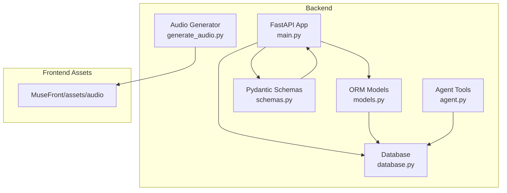
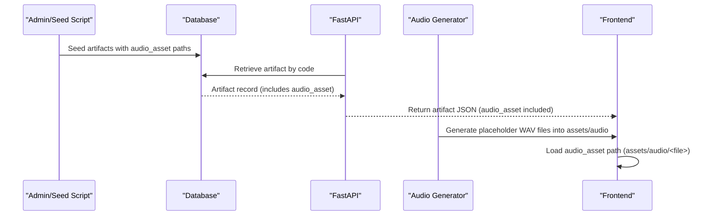
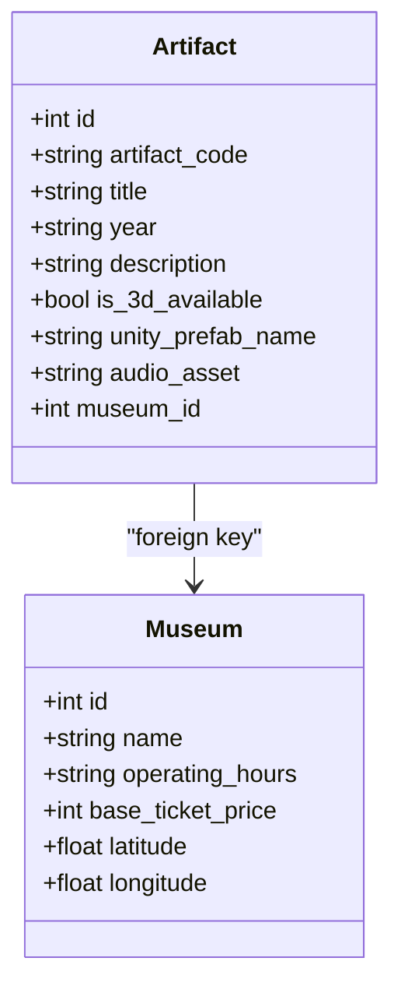
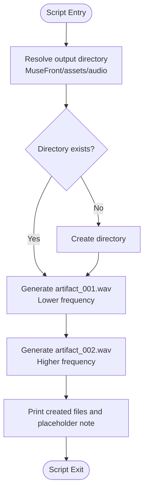
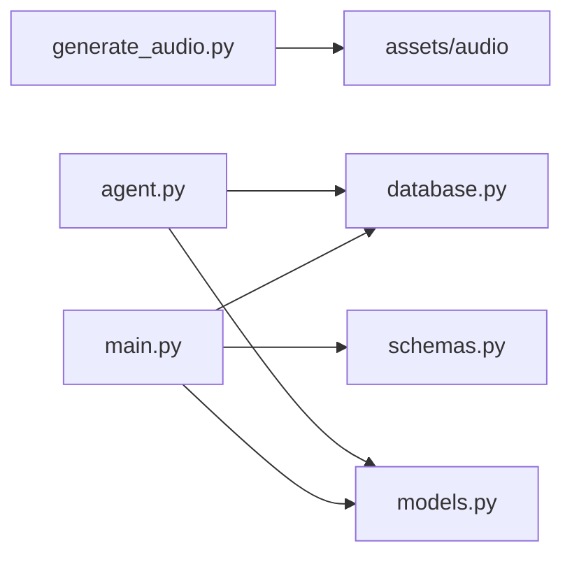

# Audio Asset Management

<cite>
**Referenced Files in This Document**
- [generate_audio.py](file://generate_audio.py)
- [models.py](file://models.py)
- [schemas.py](file://schemas.py)
- [database.py](file://database.py)
- [main.py](file://main.py)
- [agent.py](file://agent.py)
- [requirements.txt](file://requirements.txt)
- [test_output.txt](file://test_output.txt)
</cite>

## Table of Contents
1. [Introduction](#introduction)
2. [Project Structure](#project-structure)
3. [Core Components](#core-components)
4. [Architecture Overview](#architecture-overview)
5. [Detailed Component Analysis](#detailed-component-analysis)
6. [Dependency Analysis](#dependency-analysis)
7. [Performance Considerations](#performance-considerations)
8. [Troubleshooting Guide](#troubleshooting-guide)
9. [Conclusion](#conclusion)

## Introduction
This document describes the audio asset management system in the MuseAmigo Backend. It focuses on how audio assets are represented in the data model, how placeholder audio files are generated, how artifact descriptions are associated with audio assets, and how the system integrates with the frontend audio assets directory. It also covers the audio file naming convention, file organization, and the current state of audio generation (placeholder sine waves) versus potential future integration with text-to-speech systems.

## Project Structure
The backend is organized around a FastAPI application with SQLAlchemy ORM models and Pydantic schemas. Audio asset metadata is stored in the database alongside artifact records, while placeholder audio files are generated into a dedicated assets directory for the frontend.

**Diagram sources**
- [main.py:12-13](file://main.py#L12-L13)
- [database.py:18-24](file://database.py#L18-L24)
- [models.py:27-42](file://models.py#L27-L42)
- [schemas.py:36-48](file://schemas.py#L36-L48)
- [generate_audio.py:41-74](file://generate_audio.py#L41-L74)
- [agent.py:17-36](file://agent.py#L17-L36)

**Section sources**
- [main.py:12-13](file://main.py#L12-L13)
- [database.py:18-24](file://database.py#L18-L24)
- [models.py:27-42](file://models.py#L27-L42)
- [schemas.py:36-48](file://schemas.py#L36-L48)
- [generate_audio.py:41-74](file://generate_audio.py#L41-L74)
- [agent.py:17-36](file://agent.py#L17-L36)

## Core Components
- Audio asset field in the artifact model: The Artifact entity includes an audio_asset field that stores a path to the audio file associated with the artifact.
- Audio generation script: A standalone script generates placeholder WAV files and writes them to the frontend assets directory.
- Frontend integration: The audio_asset path points to files under MuseFront/assets/audio, enabling the frontend to load audio assets directly.
- Data seeding: During application startup, seed_artifacts populates the database with artifact records that include audio_asset paths.

Key implementation references:
- Artifact audio_asset column definition and usage in seeding.
- Audio file generation and output directory resolution.
- Audio asset path format used by artifacts.

**Section sources**
- [models.py:39-42](file://models.py#L39-L42)
- [main.py:75-187](file://main.py#L75-L187)
- [generate_audio.py:41-74](file://generate_audio.py#L41-L74)

## Architecture Overview
The audio asset management architecture consists of:
- Data model layer: Artifact model defines the audio_asset field.
- Persistence layer: SQLAlchemy-backed database with seeded artifact data containing audio_asset paths.
- API layer: FastAPI endpoints expose artifact data, including audio_asset paths.
- Generation layer: A separate script creates placeholder audio files in the frontend assets directory.
- Frontend consumption: The frontend reads audio_asset paths and loads corresponding WAV files.

**Diagram sources**
- [main.py:75-187](file://main.py#L75-L187)
- [main.py:609-632](file://main.py#L609-L632)
- [generate_audio.py:41-74](file://generate_audio.py#L41-L74)

## Detailed Component Analysis

### Audio Asset Data Model
The Artifact model includes an audio_asset field that stores the path to the associated audio file. This path is used by the frontend to locate and play the audio asset.

**Diagram sources**
- [models.py:27-42](file://models.py#L27-L42)
- [models.py:16-26](file://models.py#L16-L26)

Implementation highlights:
- audio_asset is a string field with a default empty value, allowing artifacts to exist without audio until assigned.
- The field is populated during seeding to point to files under MuseFront/assets/audio.

**Section sources**
- [models.py:27-42](file://models.py#L27-L42)

### Audio Asset Naming Convention and File Organization
The system uses a simple naming convention for audio files:
- File names are numeric identifiers padded to three digits (e.g., artifact_001.wav).
- Files are stored under MuseFront/assets/audio in the repository.
- The audio_asset field in the Artifact model stores a path relative to the frontend assets root.

File generation workflow:
- The generator script resolves the output directory as MuseFront/assets/audio.
- Two placeholder WAV files are created: artifact_001.wav and artifact_002.wav.
- The generator prints the created files and notes they are placeholders.

Naming and organization references:
- Output directory construction and file naming.
- Placeholder file creation and console logs.

**Section sources**
- [generate_audio.py:41-74](file://generate_audio.py#L41-L74)

### Placeholder Audio Generation Workflow
Placeholder audio generation is implemented as a standalone script that:
- Creates the output directory if it does not exist.
- Generates two sine wave tones with different frequencies.
- Writes WAV files with standard mono, 16-bit, 44.1 kHz settings.
- Prints a summary of created files and a note that they are placeholders.

Algorithm flow:
- Compute number of samples based on duration and sample rate.
- Generate sine wave samples and pack them into frames.
- Configure WAV header fields (channels, sample width, frame rate).
- Write frames to disk.

**Diagram sources**
- [generate_audio.py:41-74](file://generate_audio.py#L41-L74)
- [generate_audio.py:12-38](file://generate_audio.py#L12-L38)

**Section sources**
- [generate_audio.py:41-74](file://generate_audio.py#L41-L74)
- [generate_audio.py:12-38](file://generate_audio.py#L12-L38)

### Artifact Descriptions and Audio Asset Association
During application startup, the seed_artifacts function populates the database with artifact records. Each record includes:
- artifact_code, title, year, description, is_3d_available, and unity_prefab_name.
- audio_asset pointing to a file under MuseFront/assets/audio.
- museum_id linking the artifact to a specific museum.

This establishes the association between artifact descriptions and audio assets at the data level. The frontend retrieves the artifact JSON via the API endpoint and plays the audio file referenced by audio_asset.

Association references:
- Seeding logic that assigns audio_asset paths.
- API endpoint that returns artifact data including audio_asset.

**Section sources**
- [main.py:75-187](file://main.py#L75-L187)
- [main.py:609-632](file://main.py#L609-L632)

### Audio Format Specifications and Quality Settings
The placeholder audio generator uses the following format specifications:
- Format: WAV (RIFF)
- Channels: Mono
- Sample width: 16 bits
- Sample rate: 44.1 kHz
- Duration: 3 seconds per file

These settings are defined in the generator and are suitable for short narration clips commonly used in museum apps.

Format references:
- WAV header configuration and sample packing.
- Duration and frequency parameters.

**Section sources**
- [generate_audio.py:32-36](file://generate_audio.py#L32-L36)
- [generate_audio.py:56-67](file://generate_audio.py#L56-L67)

### File Size Considerations
File size depends on duration, sample rate, and bit depth:
- For 3 seconds at 44.1 kHz, 16-bit, mono:
  - Samples = 3 × 44,100 = 132,300
  - Bytes = 132,300 × 2 bytes/sample = 264,600 bytes ≈ 260 KB
- Two files ≈ 520 KB total for the placeholder set.

These estimates align with typical short narration audio sizes and are efficient for mobile delivery.

Size references:
- Duration and sample rate parameters.
- Sample width and channel configuration.

**Section sources**
- [generate_audio.py:12-38](file://generate_audio.py#L12-L38)
- [generate_audio.py:56-67](file://generate_audio.py#L56-L67)

### Text-to-Speech Integration (Current Status)
The repository includes a placeholder audio generator and agent tools for retrieving artifact details, but does not include a text-to-speech integration. The audio_asset field is populated with static file paths, and the agent’s get_artifact_details function returns textual descriptions for AI use.

Integration references:
- Audio asset population during seeding.
- Agent tool that returns artifact details as text.

**Section sources**
- [main.py:75-187](file://main.py#L75-L187)
- [agent.py:17-36](file://agent.py#L17-L36)

### Audio Asset Updates and Synchronization
The system synchronizes audio assets with artifact data through:
- Startup migration: Ensures the audio_asset column exists in the artifacts table.
- Seeding: Populates audio_asset paths during initial data load.
- Retrieval: The API endpoint returns artifact data including audio_asset, enabling the frontend to load the correct audio file.

Synchronization references:
- Migration function to add audio_asset column.
- Seeding logic that updates existing artifacts and sets audio_asset.
- Artifact retrieval endpoint.

**Section sources**
- [main.py:491-510](file://main.py#L491-L510)
- [main.py:75-187](file://main.py#L75-L187)
- [main.py:609-632](file://main.py#L609-L632)

## Dependency Analysis
The audio asset management system has clear dependencies:
- generate_audio.py depends on Python’s wave module and constructs file paths relative to the repository root.
- main.py seeds artifacts with audio_asset paths and exposes an endpoint to retrieve artifacts.
- models.py defines the Artifact model with audio_asset.
- schemas.py defines the ArtifactResponse schema that includes audio_asset.
- database.py configures the SQLAlchemy engine and session factory used by main.py and agent.py.
- agent.py uses database sessions to query artifact details for AI assistance.

**Diagram sources**
- [generate_audio.py:41-74](file://generate_audio.py#L41-L74)
- [main.py:12-13](file://main.py#L12-L13)
- [database.py:18-24](file://database.py#L18-L24)
- [models.py:27-42](file://models.py#L27-L42)
- [schemas.py:36-48](file://schemas.py#L36-L48)
- [agent.py:17-36](file://agent.py#L17-L36)

**Section sources**
- [generate_audio.py:41-74](file://generate_audio.py#L41-L74)
- [main.py:12-13](file://main.py#L12-L13)
- [database.py:18-24](file://database.py#L18-L24)
- [models.py:27-42](file://models.py#L27-L42)
- [schemas.py:36-48](file://schemas.py#L36-L48)
- [agent.py:17-36](file://agent.py#L17-L36)

## Performance Considerations
- Short audio files: 3-second WAV files are lightweight and suitable for mobile environments.
- Single-channel, 16-bit, 44.1 kHz: Balanced quality and size for narration.
- Database retrieval: The artifact endpoint performs a straightforward query and returns the audio_asset path, minimizing processing overhead.
- Generation script: Runs offline and does not impact runtime performance.

[No sources needed since this section provides general guidance]

## Troubleshooting Guide
Common issues and resolutions:
- Audio file not found by frontend:
  - Ensure the audio_asset path matches the actual file name and directory under MuseFront/assets/audio.
  - Verify the generation script ran and created the files.
- Incorrect audio asset path:
  - Confirm the audio_asset value in the database matches the intended file name.
  - Check the seeding logic for correct path assignment.
- Audio generation errors:
  - Confirm the output directory MuseFront/assets/audio exists or can be created.
  - Review permissions for writing to the directory.
- Agent tool errors:
  - Ensure GOOGLE_API_KEY is configured in .env if using agent features.
  - Address deprecation warnings in agent.py imports.

**Section sources**
- [generate_audio.py:41-74](file://generate_audio.py#L41-L74)
- [main.py:75-187](file://main.py#L75-L187)
- [agent.py:14-15](file://agent.py#L14-L15)
- [test_output.txt:1-12](file://test_output.txt#L1-L12)

## Conclusion
The MuseAmigo Backend implements a straightforward audio asset management system:
- Audio asset paths are stored in the Artifact model and populated during seeding.
- Placeholder WAV files are generated into MuseFront/assets/audio with a simple naming convention.
- The API exposes artifact data including audio_asset, enabling the frontend to load audio assets.
- The system is ready for future integration with text-to-speech services, while maintaining backward compatibility with the current placeholder approach.

[No sources needed since this section summarizes without analyzing specific files]