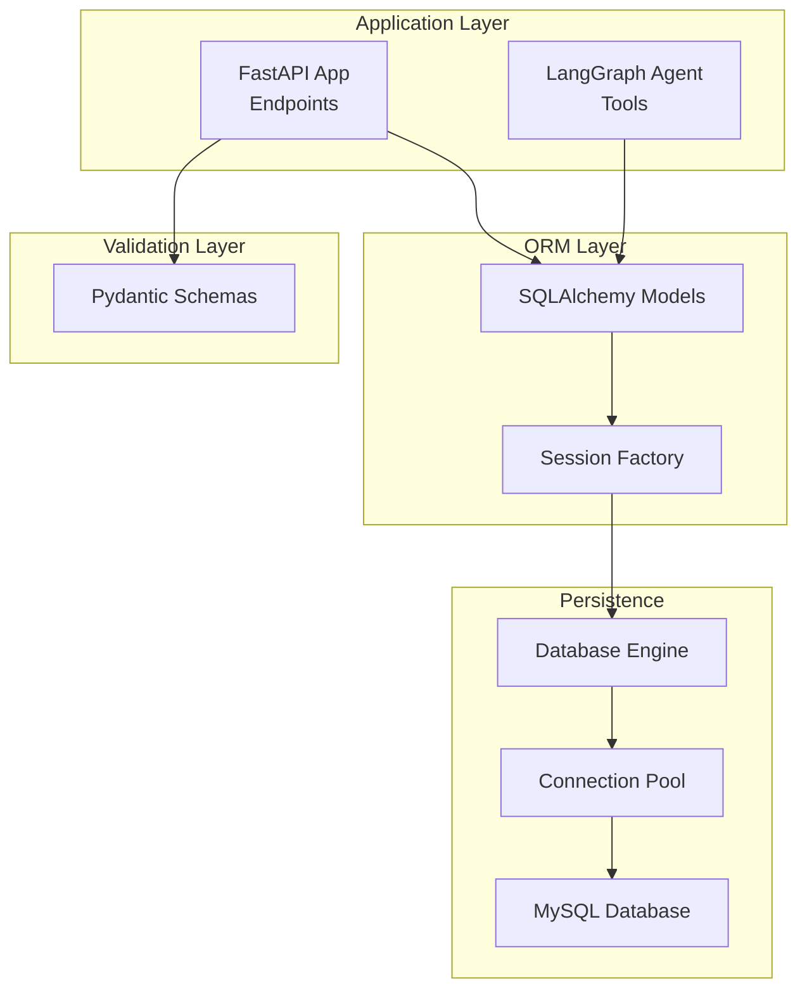
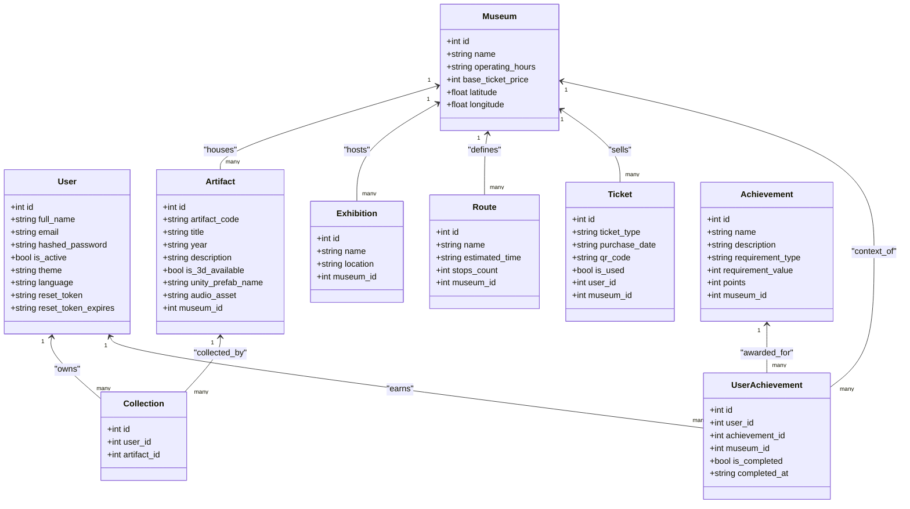
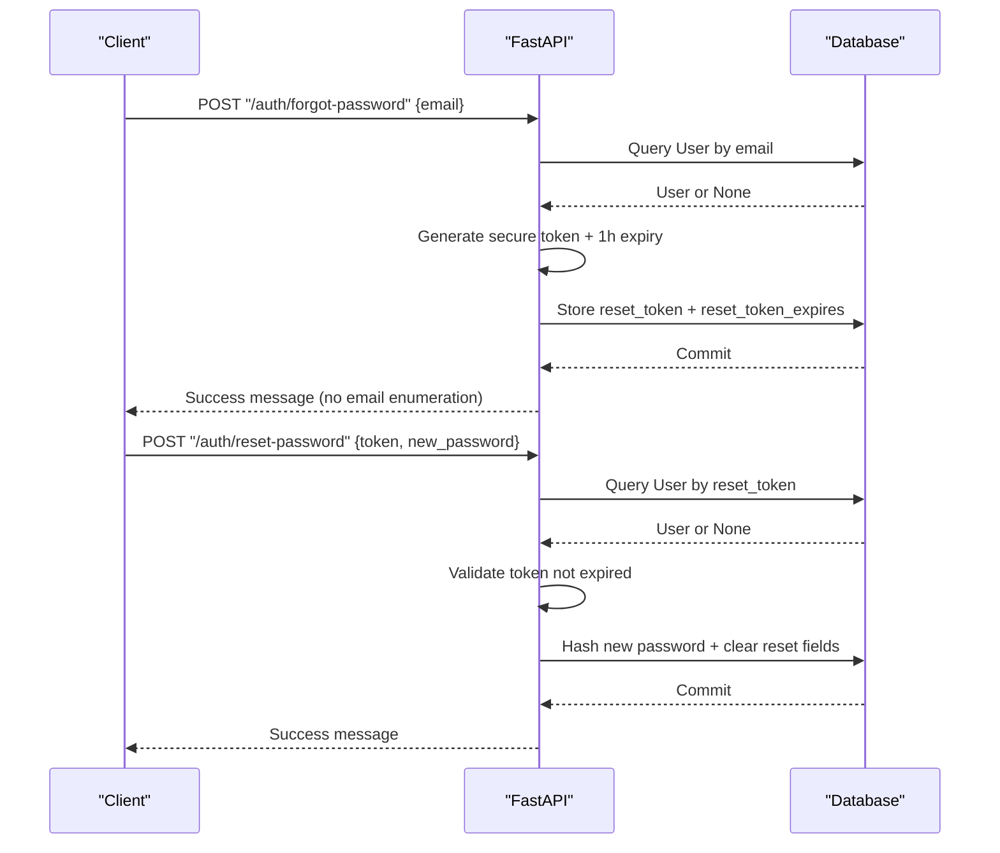
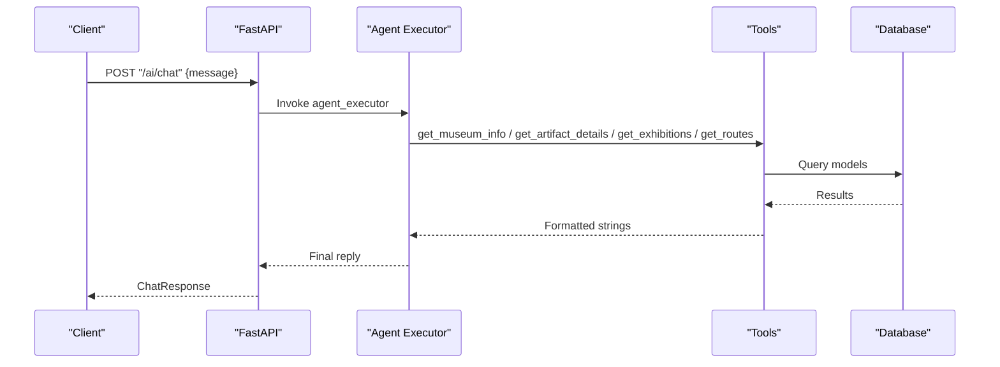
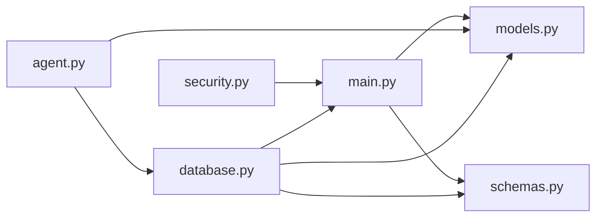

# Data Models & Database Design

<cite>
**Referenced Files in This Document**
- [models.py](file://models.py)
- [schemas.py](file://schemas.py)
- [database.py](file://database.py)
- [main.py](file://main.py)
- [security.py](file://security.py)
- [agent.py](file://agent.py)
- [requirements.txt](file://requirements.txt)
</cite>

## Update Summary
**Changes Made**
- Updated User model documentation to include new reset_token and reset_token_expires fields
- Added password reset functionality documentation with new endpoints and schemas
- Enhanced security section to cover password reset workflow
- Updated Pydantic validation schemas to include password reset request models

## Table of Contents
1. [Introduction](#introduction)
2. [Project Structure](#project-structure)
3. [Core Components](#core-components)
4. [Architecture Overview](#architecture-overview)
5. [Detailed Component Analysis](#detailed-component-analysis)
6. [Dependency Analysis](#dependency-analysis)
7. [Performance Considerations](#performance-considerations)
8. [Troubleshooting Guide](#troubleshooting-guide)
9. [Conclusion](#conclusion)
10. [Appendices](#appendices)

## Introduction
This document describes the data model and database design for the MuseAmigo Backend. It covers entity definitions, relationships, constraints, indexes, and how SQLAlchemy ORM models map to Pydantic validation schemas. It also explains database connection management, session handling, connection pooling, and performance considerations. Finally, it documents business logic constraints, data integrity requirements, and security enhancements including password reset functionality.

## Project Structure
The backend is organized around four primary modules:
- models.py: SQLAlchemy declarative models for all entities
- schemas.py: Pydantic models for request/response validation
- database.py: Database engine, session factory, and dependency
- main.py: FastAPI application, endpoints, seeding, migrations, and business logic
- security.py: Password hashing and verification utilities
- agent.py: LangGraph agent with tools that query the database
- requirements.txt: Dependencies including SQLAlchemy, FastAPI, Pydantic, and others

**Diagram sources**
- [main.py:12-23](file://main.py#L12-L23)
- [database.py:18-38](file://database.py#L18-L38)
- [schemas.py:1-144](file://schemas.py#L1-L144)
- [models.py:1-107](file://models.py#L1-L107)
- [agent.py:6-105](file://agent.py#L6-L105)

**Section sources**
- [main.py:12-23](file://main.py#L12-L23)
- [database.py:18-38](file://database.py#L18-L38)
- [schemas.py:1-144](file://schemas.py#L1-L144)
- [models.py:1-107](file://models.py#L1-L107)
- [agent.py:6-105](file://agent.py#L6-L105)

## Core Components
This section documents each core model, its fields, data types, constraints, indexes, and relationships. It also explains how Pydantic schemas map to SQLAlchemy models and how endpoints use them.

- User
  - Purpose: Stores user profile, authentication, preferences, and password reset tokens.
  - Fields: id (Integer, PK, indexed), full_name (String), email (String, unique, indexed), hashed_password (String), is_active (Boolean), theme (String), language (String), reset_token (String, nullable), reset_token_expires (String, nullable).
  - Constraints: Unique email; default theme and language; default active flag; reset token fields are nullable for security.
  - Indexes: id, email.
  - Relationships: None (standalone).
  - Pydantic mapping: UserCreate (input), UserResponse (output), UserSettingsUpdate (partial update), ForgotPasswordRequest (password reset input), ResetPasswordRequest (password reset input).

- Museum
  - Purpose: Stores museum metadata and geographic coordinates.
  - Fields: id (Integer, PK, indexed), name (String, indexed), operating_hours (String), base_ticket_price (Integer), latitude (Float), longitude (Float).
  - Constraints: None.
  - Indexes: id, name.
  - Relationships: One-to-many with Artifact, Exhibition, Route, Ticket.
  - Pydantic mapping: MuseumResponse.

- Artifact
  - Purpose: Represents museum artifacts with QR code identifiers and media assets.
  - Fields: id (Integer, PK, indexed), artifact_code (String, unique, indexed), title (String), year (String), description (String), is_3d_available (Boolean), unity_prefab_name (String), audio_asset (String), museum_id (Integer, FK to Museum.id).
  - Constraints: Unique artifact_code; defaults for availability and audio asset.
  - Indexes: id, artifact_code.
  - Relationships: Many-to-one Museum; many-to-one Collection.
  - Pydantic mapping: ArtifactResponse.

- Collection
  - Purpose: Tracks which users have collected which artifacts.
  - Fields: id (Integer, PK, indexed), user_id (Integer, FK to User.id), artifact_id (Integer, FK to Artifact.id).
  - Constraints: Composite uniqueness on (user_id, artifact_id) enforced by application logic.
  - Indexes: id.
  - Relationships: Many-to-one User; many-to-one Artifact.
  - Pydantic mapping: CollectionCreate (input), CollectionResponse (output).

- Exhibition
  - Purpose: Describes temporary or permanent exhibitions within a museum.
  - Fields: id (Integer, PK, indexed), name (String), location (String), museum_id (Integer, FK to Museum.id).
  - Constraints: None.
  - Indexes: id.
  - Relationships: Many-to-one Museum.
  - Pydantic mapping: ExhibitionResponse.

- Ticket
  - Purpose: Manages admission tickets with unique QR codes.
  - Fields: id (Integer, PK, indexed), ticket_type (String), purchase_date (String), qr_code (String, unique, indexed), is_used (Boolean), user_id (Integer, FK to User.id), museum_id (Integer, FK to Museum.id).
  - Constraints: Unique qr_code; default is_used false.
  - Indexes: id, qr_code.
  - Relationships: Many-to-one User; many-to-one Museum.
  - Pydantic mapping: TicketCreate (input), TicketResponse (output).

- Route
  - Purpose: Defines guided tours/route plans for museums.
  - Fields: id (Integer, PK, indexed), name (String), estimated_time (String), stops_count (Integer), museum_id (Integer, FK to Museum.id).
  - Constraints: None.
  - Indexes: id.
  - Relationships: Many-to-one Museum.
  - Pydantic mapping: RouteResponse.

- Achievement
  - Purpose: Defines unlockable achievements with requirements and points.
  - Fields: id (Integer, PK, indexed), name (String), description (String), requirement_type (String), requirement_value (Integer), points (Integer), museum_id (Integer, FK to Museum.id, nullable).
  - Constraints: Points default 50; museum_id null for global achievements.
  - Indexes: id.
  - Relationships: Many-to-one Museum; many-to-many via UserAchievement.
  - Pydantic mapping: AchievementResponse.

- UserAchievement
  - Purpose: Tracks which achievements a user has completed and when.
  - Fields: id (Integer, PK, indexed), user_id (Integer, FK to User.id), achievement_id (Integer, FK to Achievement.id), museum_id (Integer, FK to Museum.id, nullable), is_completed (Boolean), completed_at (String, nullable).
  - Constraints: Defaults for completion and null completed_at; museum_id nullable.
  - Indexes: id.
  - Relationships: Many-to-one User; many-to-one Achievement; many-to-one Museum.
  - Pydantic mapping: UserAchievementResponse.

**Section sources**
- [models.py:4-107](file://models.py#L4-L107)
- [schemas.py:4-144](file://schemas.py#L4-L144)

## Architecture Overview
The backend follows a layered architecture:
- Validation: Pydantic schemas define request/response contracts and enable automatic serialization/deserialization from SQLAlchemy models.
- ORM: SQLAlchemy declarative models define tables and relationships.
- Persistence: SQLAlchemy engine and session factory manage connections and transactions.
- Application: FastAPI endpoints orchestrate business logic, enforce constraints, and return validated responses.
- AI Agent: LangGraph tools query the database to provide contextual answers.

**Diagram sources**
- [models.py:4-107](file://models.py#L4-L107)

## Detailed Component Analysis

### Database Schema and Constraints
- Primary Keys: All entities use auto-increment integer primary keys.
- Foreign Keys: Museum.id, User.id, Artifact.id, Achievement.id, Route.id, Exhibition.id, Ticket.id are referenced by child entities.
- Unique Constraints:
  - Users.email is unique.
  - Artifacts.artifact_code is unique.
  - Tickets.qr_code is unique.
- Indexes:
  - All entities have id indexed.
  - Users.email, Artifacts.artifact_code, Tickets.qr_code, Museums.name are indexed.
- Nullable Fields:
  - Achievements.museum_id may be null (global achievements).
  - UserAchievements.museum_id may be null (global/unscoped).
  - UserAchievements.completed_at may be null until completion.
  - **Updated**: User.reset_token and User.reset_token_expires are nullable for security.

**Section sources**
- [models.py:7-107](file://models.py#L7-L107)

### SQLAlchemy ORM Relationships
- One-to-many:
  - Museum → Artifact, Exhibition, Route, Ticket
  - User → Collection, UserAchievement
  - Achievement → UserAchievement
- Many-to-one:
  - Artifact → Museum
  - Collection → User, Artifact
  - Exhibition → Museum
  - Route → Museum
  - Ticket → User, Museum
  - Achievement → Museum
  - UserAchievement → User, Achievement, Museum

Note: While explicit relationship declarations are not present in the models, the foreign key fields and shared primary keys define these associations. Application-level logic enforces composite uniqueness for Collection.

**Section sources**
- [models.py:4-107](file://models.py#L4-L107)

### Pydantic Validation Schemas and Mapping
- Input/Output Contracts:
  - Authentication: UserCreate, UserLogin, UserResponse
  - Discovery: ArtifactResponse, CollectionCreate, CollectionResponse
  - Exhibitions: ExhibitionResponse
  - Tickets: TicketCreate, TicketResponse
  - Routes: RouteResponse
  - Achievements: AchievementResponse, UserAchievementResponse
  - Settings: UserSettingsUpdate
  - **Updated**: Password Reset: ForgotPasswordRequest, ResetPasswordRequest
  - AI Chat: ChatRequest, ChatResponse
- Mapping Behavior:
  - Pydantic models set from_attributes to True to allow reading from SQLAlchemy instances, simplifying serialization.
- Validation Rules:
  - Registration enforces non-empty full_name and password length ≥ 6; email uniqueness handled by database constraint.
  - Login validates presence of email and password and compares stored password field against provided plaintext (placeholder).
  - Artifact retrieval trims and normalizes artifact_code for case-insensitive matching and partial-space normalization.
  - Collection creation prevents duplicate entries for the same user-artifact pair.
  - **Updated**: Password reset requests validate email format; reset requests validate token format and expiration.

**Section sources**
- [schemas.py:4-144](file://schemas.py#L4-L144)
- [main.py:525-570](file://main.py#L525-L570)

### Business Logic and Data Integrity
- Registration:
  - Validates input, persists User, handles IntegrityError for duplicate email, and returns UserResponse.
- Login:
  - Checks presence of credentials, verifies user existence by email, and compares password field to provided plaintext (placeholder).
- Artifact Retrieval:
  - Case-insensitive exact match and partial-space normalization to support flexible scanning inputs.
- Collection Management:
  - Prevents duplicate collection entries for the same user-artifact pair.
- Ticket Purchase:
  - Generates a unique QR code string and persists Ticket record.
- Achievement Calculation:
  - Computes progress based on scan counts per museum, total scans, and museum visits; auto-completes achievements and updates UserAchievement records.
- **Updated**: Password Reset Workflow:
  - Forgot Password: Generates secure random token, sets expiration to 1 hour, stores in database, returns success message (email enumeration protection).
  - Reset Password: Validates token existence and expiration, hashes new password, clears reset fields, returns success.
- Seeding and Migration:
  - On startup, ensures artifacts table has audio_asset column and seeds Museums, Artifacts, Exhibitions, Routes, and Achievements.

**Diagram sources**
- [main.py:525-570](file://main.py#L525-L570)

**Section sources**
- [main.py:525-570](file://main.py#L525-L570)
- [main.py:512-526](file://main.py#L512-L526)
- [main.py:491-510](file://main.py#L491-L510)

### AI Agent Integration
- Tools:
  - get_artifact_details: Searches by title or artifact_code.
  - get_museum_info: Retrieves operating hours, ticket price, and coordinates.
  - get_exhibitions: Lists exhibitions for a given museum.
  - get_routes: Lists available routes for a given museum.
- Execution:
  - Uses LangGraph's create_react_agent with a Gemini LLM and the above tools.
  - Each tool opens a new session, queries the database, and closes the session.

**Diagram sources**
- [agent.py:17-105](file://agent.py#L17-L105)
- [main.py:869-897](file://main.py#L869-L897)

**Section sources**
- [agent.py:17-105](file://agent.py#L17-L105)
- [main.py:869-897](file://main.py#L869-L897)

### Sample Data Structures
- User
  - Input: UserCreate {full_name, email, password}
  - Output: UserResponse {id, full_name, email, theme, language}
  - **Updated**: Password Reset: ForgotPasswordRequest {email}, ResetPasswordRequest {token, new_password}
- Artifact
  - Output: ArtifactResponse {id, artifact_code, title, year, description, is_3d_available, museum_id, unity_prefab_name, audio_asset}
- Collection
  - Input: CollectionCreate {user_id, artifact_id}
  - Output: CollectionResponse {id, user_id, artifact_id}
- Ticket
  - Input: TicketCreate {user_id, museum_id, ticket_type}
  - Output: TicketResponse {id, ticket_type, purchase_date, qr_code, is_used, user_id, museum_id}
- Exhibition
  - Output: ExhibitionResponse {id, name, location, museum_id}
- Route
  - Output: RouteResponse {id, name, estimated_time, stops_count, museum_id}
- Achievement
  - Output: AchievementResponse {id, name, description, requirement_type, requirement_value, points, museum_id}
- UserAchievement
  - Output: UserAchievementResponse {id, user_id, achievement_id, museum_id, is_completed, completed_at}

**Section sources**
- [schemas.py:4-144](file://schemas.py#L4-L144)

## Dependency Analysis
- Database Layer
  - database.py defines engine, session factory, and dependency get_db().
- ORM Models
  - models.py defines all entities and relationships via foreign keys.
- Validation Schemas
  - schemas.py defines Pydantic models with from_attributes enabled.
- Application Layer
  - main.py wires endpoints, seeds data, runs migrations, and orchestrates business logic.
- Security
  - security.py provides password hashing and verification utilities (not yet integrated in login).
- AI Agent
  - agent.py uses SessionLocal to query the database via tools.

**Diagram sources**
- [database.py:18-38](file://database.py#L18-L38)
- [models.py:1-107](file://models.py#L1-L107)
- [schemas.py:1-144](file://schemas.py#L1-L144)
- [main.py:12-23](file://main.py#L12-L23)
- [security.py:1-12](file://security.py#L1-L12)
- [agent.py:6-105](file://agent.py#L6-L105)

**Section sources**
- [database.py:18-38](file://database.py#L18-L38)
- [models.py:1-107](file://models.py#L1-L107)
- [schemas.py:1-144](file://schemas.py#L1-L144)
- [main.py:12-23](file://main.py#L12-L23)
- [security.py:1-12](file://security.py#L1-L12)
- [agent.py:6-105](file://agent.py#L6-L105)

## Performance Considerations
- Connection Pooling
  - Engine configured with pool_size=10, max_overflow=20, pool_pre_ping=True, pool_recycle=3600 to improve concurrency and handle stale connections.
- Indexes
  - id is indexed on all tables; additional indexes on email, artifact_code, qr_code, and name optimize frequent lookups.
- Query Patterns
  - Endpoints leverage filtered queries with joins and aggregations (e.g., counting artifacts per museum for "area_complete" achievements).
- Session Management
  - get_db() yields a session per request and closes it in a finally block; agent tools open/close sessions per tool invocation.
- **Updated**: Password Reset Performance
  - Token generation uses cryptographically secure secrets.token_urlsafe(32) for 256-bit entropy.
  - Expiration checking uses ISO format timestamps for efficient parsing and comparison.
- Recommendations
  - Add composite indexes for frequently filtered pairs (e.g., Collection(user_id, artifact_id)).
  - Consider pagination for large lists (e.g., /museums, /museums/{museum_id}/exhibitions).
  - Use bulk inserts for seeding operations to reduce round-trips.
  - **Updated**: Consider adding indexes on reset_token and reset_token_expires for token lookup performance.

**Section sources**
- [database.py:18-38](file://database.py#L18-L38)
- [models.py:7-107](file://models.py#L7-L107)
- [main.py:664-700](file://main.py#L664-L700)
- [main.py:738-844](file://main.py#L738-L844)
- [main.py:525-570](file://main.py#L525-L570)

## Troubleshooting Guide
- IntegrityError on Registration
  - Cause: Duplicate email violates unique constraint.
  - Resolution: Return a 400 error with a user-friendly message.
- Login Credential Issues
  - Cause: Missing email/password or mismatched password field.
  - Resolution: Validate presence and compare stored password field to provided plaintext (placeholder).
- Artifact Not Found
  - Cause: artifact_code does not match normalized inputs.
  - Resolution: Normalize input (trim, uppercase, remove spaces) and retry query.
- Duplicate Collection Entry
  - Cause: Same user attempting to collect the same artifact twice.
  - Resolution: Check existing record and return a 400 error if found.
- **Updated**: Password Reset Issues
  - Forgot Password: Email not found returns success message (no email enumeration).
  - Invalid Token: Token not found or expired returns 400 error.
  - Expired Token: Token timestamp check fails returns 400 error.
  - Weak Password: New password less than 6 characters returns 400 error.
- Migration Errors
  - Cause: Attempting to add an already-existing column.
  - Resolution: Catch exceptions and log a note; continue.

**Section sources**
- [main.py:525-570](file://main.py#L525-L570)
- [main.py:609-632](file://main.py#L609-L632)
- [main.py:634-661](file://main.py#L634-L661)
- [main.py:491-510](file://main.py#L491-L510)

## Conclusion
The MuseAmigo Backend employs a clean separation of concerns: Pydantic schemas for validation, SQLAlchemy models for persistence, and FastAPI for orchestration. The schema emphasizes user-centric discovery, museum navigation, and gamification through achievements. Robust indexing and connection pooling support performance, while explicit validation and integrity checks ensure data quality. The AI agent augments the system by dynamically querying the database to provide contextual assistance. **Updated**: Enhanced security measures now include comprehensive password reset functionality with secure token generation, expiration handling, and protection against email enumeration attacks.

## Appendices

### Database Connection Management
- Engine and Pool
  - Engine configured with pool_size, max_overflow, pool_pre_ping, and pool_recycle.
- Session Factory
  - SessionLocal bound to engine; get_db() dependency yields a session per request and closes it afterward.
- Agent Sessions
  - Tools open and close sessions per invocation to avoid long-lived connections.

**Section sources**
- [database.py:18-38](file://database.py#L18-L38)
- [agent.py:20-35](file://agent.py#L20-L35)
- [agent.py:40-51](file://agent.py#L40-L51)
- [agent.py:56-71](file://agent.py#L56-L71)
- [agent.py:76-91](file://agent.py#L76-L91)

### Security Notes
- Password Hashing
  - security.py provides hashing and verification utilities; login currently compares plaintext to stored password (placeholder).
- **Updated**: Password Reset Security
  - Tokens use cryptographically secure random generation with 256-bit entropy.
  - Expiration set to 1 hour for time-limited access.
  - Email enumeration protection: success response regardless of email existence.
  - Token validation includes existence, format, and expiration checks.
- Recommendations
  - Replace plaintext comparison with hashed password verification.
  - Enforce stronger password policies and consider rate limiting for login attempts.
  - **Updated**: Consider implementing rate limiting for password reset requests.

**Section sources**
- [security.py:1-12](file://security.py#L1-L12)
- [main.py:525-570](file://main.py#L525-L570)

### Dependencies Overview
- Core libraries include FastAPI, SQLAlchemy, Pydantic, PyMySQL, python-dotenv, bcrypt, passlib, and LangChain/LangGraph for AI capabilities.

**Section sources**
- [requirements.txt:1-59](file://requirements.txt#L1-L59)

### Password Reset Workflow Details
- **Forgot Password Endpoint** (`/auth/forgot-password`)
  - Validates email format
  - Queries user by email (case-sensitive)
  - Generates secure token using `secrets.token_urlsafe(32)`
  - Sets expiration to 1 hour using `timedelta(hours=1)`
  - Stores both token and expiration in database
  - Returns success message regardless of email existence
- **Reset Password Endpoint** (`/auth/reset-password`)
  - Validates token format and new password length
  - Queries user by reset_token
  - Parses ISO format expiration timestamp
  - Compares current UTC time with expiration
  - Hashes new password using security utilities
  - Clears reset token fields upon successful reset
  - Returns success message

**Section sources**
- [main.py:525-570](file://main.py#L525-L570)
- [security.py:1-12](file://security.py#L1-L12)