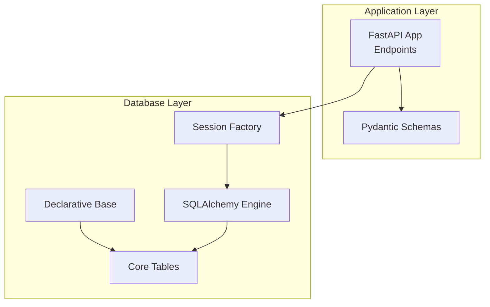
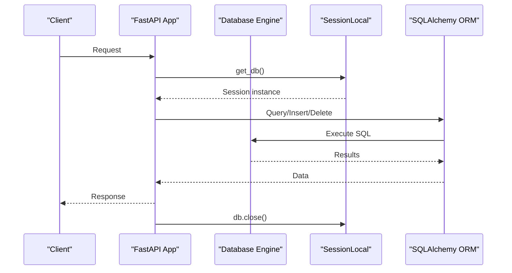
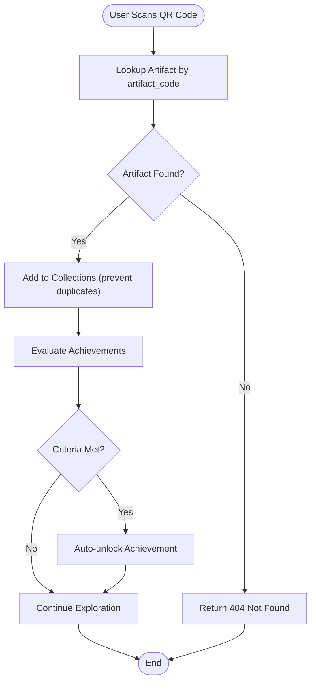

# Database Schema Overview

<cite>
**Referenced Files in This Document**
- [models.py](file://models.py)
- [database.py](file://database.py)
- [schemas.py](file://schemas.py)
- [main.py](file://main.py)
- [README.md](file://README.md)
- [requirements.txt](file://requirements.txt)
</cite>

## Table of Contents
1. [Introduction](#introduction)
2. [Project Structure](#project-structure)
3. [Core Components](#core-components)
4. [Architecture Overview](#architecture-overview)
5. [Detailed Component Analysis](#detailed-component-analysis)
6. [Dependency Analysis](#dependency-analysis)
7. [Performance Considerations](#performance-considerations)
8. [Troubleshooting Guide](#troubleshooting-guide)
9. [Conclusion](#conclusion)
10. [Appendices](#appendices)

## Introduction
This document provides a comprehensive database schema overview for the MuseAmigo Backend. It documents all nine core tables, their primary keys, foreign key relationships, constraints, and indexes. It also explains how the schema supports interactive museum features such as QR code scanning, artifact collection, achievement tracking, and route planning. The backend uses SQLAlchemy with a declarative Base class, a configured engine, and session handling patterns suitable for FastAPI applications.

## Project Structure
The database schema is defined in the models module and integrated with the database engine and session factory. The main application initializes tables, seeds initial data, and exposes endpoints that rely on the schema.



**Diagram sources**
- [database.py:18-38](file://database.py#L18-L38)
- [models.py:1-105](file://models.py#L1-L105)
- [main.py:12-13](file://main.py#L12-L13)

**Section sources**
- [database.py:1-38](file://database.py#L1-L38)
- [models.py:1-105](file://models.py#L1-L105)
- [main.py:12-13](file://main.py#L12-L13)

## Core Components
This section documents each of the nine core tables, their columns, constraints, and indexes. It also describes how they relate to each other.

- Users
  - Purpose: Stores user profiles and preferences.
  - Primary key: id
  - Indexes: id (primary), email (unique, index)
  - Constraints: email unique; default theme and language
  - Related tables: Collections, Tickets, UserAchievements

- Museums
  - Purpose: Stores museum metadata and geographic coordinates.
  - Primary key: id
  - Indexes: id (primary), name (index)
  - Columns: operating_hours, base_ticket_price, latitude, longitude
  - Related tables: Artifacts, Exhibitions, Tickets, Routes, Achievements

- Artifacts
  - Purpose: Stores artifact details and QR code identifiers.
  - Primary key: id
  - Indexes: id (primary), artifact_code (unique, index)
  - Foreign key: museum_id -> Museums.id
  - Columns: artifact_code (unique), title, year, description, is_3d_available, unity_prefab_name, audio_asset
  - Related tables: Collections

- Collections
  - Purpose: Tracks which users own which artifacts.
  - Primary key: id
  - Foreign keys: user_id -> Users.id, artifact_id -> Artifacts.id
  - Constraints: composite uniqueness enforced by application logic (prevents duplicate entries)

- Exhibitions
  - Purpose: Stores exhibition details within a museum.
  - Primary key: id
  - Foreign key: museum_id -> Museums.id
  - Columns: name, location

- Tickets
  - Purpose: Manages entry tickets with QR codes.
  - Primary key: id
  - Indexes: id (primary), qr_code (unique, index)
  - Foreign keys: user_id -> Users.id, museum_id -> Museums.id
  - Columns: ticket_type, purchase_date, qr_code, is_used

- Routes
  - Purpose: Defines curated navigation routes within a museum.
  - Primary key: id
  - Foreign key: museum_id -> Museums.id
  - Columns: name, estimated_time, stops_count

- Achievements
  - Purpose: Defines achievement criteria and rewards.
  - Primary key: id
  - Foreign key: museum_id -> Museums.id (nullable for global achievements)
  - Columns: name, description, requirement_type, requirement_value, points

- UserAchievements
  - Purpose: Tracks which achievements a user has completed.
  - Primary key: id
  - Foreign keys: user_id -> Users.id, achievement_id -> Achievements.id, museum_id -> Museums.id (nullable)
  - Columns: is_completed, completed_at

**Section sources**
- [models.py:4-15](file://models.py#L4-L15)
- [models.py:16-26](file://models.py#L16-L26)
- [models.py:27-42](file://models.py#L27-L42)
- [models.py:43-51](file://models.py#L43-L51)
- [models.py:52-61](file://models.py#L52-L61)
- [models.py:62-74](file://models.py#L62-L74)
- [models.py:75-85](file://models.py#L75-L85)
- [models.py:86-96](file://models.py#L86-L96)
- [models.py:97-105](file://models.py#L97-L105)

## Architecture Overview
The database architecture follows a normalized relational design with explicit foreign keys and indexes to support:
- Interactive museum features (QR scanning, artifact collection, achievements, route planning)
- Scalable session management via SQLAlchemy
- FastAPI endpoint integration

```mermaid
erDiagram
USERS {
int id PK
string full_name
string email UK
string hashed_password
boolean is_active
string theme
string language
}
MUSEUMS {
int id PK
string name IDX
string operating_hours
int base_ticket_price
float latitude
float longitude
}
ARTIFACTS {
int id PK
string artifact_code UK IDX
string title
string year
string description
boolean is_3d_available
string unity_prefab_name
string audio_asset
int museum_id FK
}
COLLECTIONS {
int id PK
int user_id FK
int artifact_id FK
}
EXHIBITIONS {
int id PK
string name
string location
int museum_id FK
}
TICKETS {
int id PK
string ticket_type
string purchase_date
string qr_code UK IDX
boolean is_used
int user_id FK
int museum_id FK
}
ROUTES {
int id PK
string name
string estimated_time
int stops_count
int museum_id FK
}
ACHIEVEMENTS {
int id PK
string name
string description
string requirement_type
int requirement_value
int points
int museum_id FK
}
USER_ACHIEVEMENTS {
int id PK
int user_id FK
int achievement_id FK
int museum_id FK
boolean is_completed
string completed_at
}
USERS ||--o{ COLLECTIONS : "owns"
USERS ||--o{ TICKETS : "purchases"
USERS ||--o{ USER_ACHIEVEMENTS : "earns"
ARTIFACTS ||--o{ COLLECTIONS : "collected_by"
MUSEUMS ||--o{ ARTIFACTS : "contains"
MUSEUMS ||--o{ EXHIBITIONS : "hosts"
MUSEUMS ||--o{ TICKETS : "sells"
MUSEUMS ||--o{ ROUTES : "defines"
MUSEUMS ||--o{ ACHIEVEMENTS : "provides"
ACHIEVEMENTS ||--o{ USER_ACHIEVEMENTS : "awarded_to"
```

**Diagram sources**
- [models.py:4-15](file://models.py#L4-L15)
- [models.py:16-26](file://models.py#L16-L26)
- [models.py:27-42](file://models.py#L27-L42)
- [models.py:43-51](file://models.py#L43-L51)
- [models.py:52-61](file://models.py#L52-L61)
- [models.py:62-74](file://models.py#L62-L74)
- [models.py:75-85](file://models.py#L75-L85)
- [models.py:86-96](file://models.py#L86-L96)
- [models.py:97-105](file://models.py#L97-L105)

## Detailed Component Analysis

### Users and Authentication
- Purpose: Store user profile and preferences; authentication is handled via email and password fields.
- Key constraints: email is unique; defaults for theme and language.
- Integration: Used by Tickets (purchase), Collections (ownership), and UserAchievements (tracking).

**Section sources**
- [models.py:4-15](file://models.py#L4-L15)
- [main.py:538-601](file://main.py#L538-L601)

### Museums and Geographic Data
- Purpose: Define museums and their operational attributes.
- Columns: operating_hours, base_ticket_price, latitude, longitude.
- Integration: Foreign key links to Artifacts, Exhibitions, Tickets, Routes, Achievements.

**Section sources**
- [models.py:16-26](file://models.py#L16-L26)
- [main.py:26-73](file://main.py#L26-L73)

### Artifacts and QR Code Scanning
- Purpose: Represent artifacts with unique identifiers for QR scanning.
- Unique constraints: artifact_code is unique and indexed.
- Integration: Linked to Museums; used by Collections; supports 3D and audio assets.

**Section sources**
- [models.py:27-42](file://models.py#L27-L42)
- [main.py:609-632](file://main.py#L609-L632)

### Collections and Artifact Ownership
- Purpose: Track which users own which artifacts.
- Constraints: Application-level uniqueness prevents duplicate entries for the same user-artifact pair.
- Integration: Links Users and Artifacts.

**Section sources**
- [models.py:43-51](file://models.py#L43-L51)
- [main.py:634-661](file://main.py#L634-L661)

### Exhibitions and Route Planning
- Purpose: Define exhibitions within museums and curated routes.
- Integration: Both link to Museums; routes support navigation planning.

**Section sources**
- [models.py:52-61](file://models.py#L52-L61)
- [models.py:75-85](file://models.py#L75-L85)
- [main.py:663-700](file://main.py#L663-L700)

### Tickets and QR Code Entry
- Purpose: Manage ticket purchases and QR code entry.
- Unique constraints: qr_code is unique and indexed.
- Integration: Links Users and Museums.

**Section sources**
- [models.py:62-74](file://models.py#L62-L74)
- [main.py:669-694](file://main.py#L669-L694)

### Achievements and User Progression
- Purpose: Define achievement criteria and track completion per user.
- Requirement types: scan_count, museum_scan_count, museum_visit, all_museums, area_complete.
- Integration: Links Users, Achievements, and Museums; auto-completion logic updates UserAchievements.

**Section sources**
- [models.py:86-96](file://models.py#L86-L96)
- [models.py:97-105](file://models.py#L97-L105)
- [main.py:737-844](file://main.py#L737-L844)

### Database Connection Management
- Engine configuration: Connection pooling, pre-ping, recycle settings for reliability.
- Session factory: Autocommit/autoflush disabled; bound to engine.
- Dependency: get_db yields a session per request and closes it afterward.
- Initialization: create_all binds Base to engine to create tables on startup.



**Diagram sources**
- [database.py:18-38](file://database.py#L18-L38)
- [main.py:12-13](file://main.py#L12-L13)

**Section sources**
- [database.py:18-38](file://database.py#L18-L38)
- [main.py:12-13](file://main.py#L12-L13)

### Indexing Strategies and Unique Constraints
- Users: email unique and indexed; id indexed.
- Artifacts: artifact_code unique and indexed; id indexed.
- Tickets: qr_code unique and indexed; id indexed.
- Museums: id indexed; name indexed.
- Collections: composite uniqueness enforced by application logic (user_id, artifact_id).
- Achievements: id indexed; museum_id indexed (nullable).
- Routes: id indexed; museum_id indexed.
- UserAchievements: id indexed; museum_id indexed (nullable).

**Section sources**
- [models.py:4-15](file://models.py#L4-L15)
- [models.py:27-42](file://models.py#L27-L42)
- [models.py:62-74](file://models.py#L62-L74)
- [models.py:16-26](file://models.py#L16-L26)
- [models.py:43-51](file://models.py#L43-L51)
- [models.py:86-96](file://models.py#L86-L96)
- [models.py:75-85](file://models.py#L75-L85)
- [models.py:97-105](file://models.py#L97-L105)

### Data Integrity Rules
- Foreign key integrity: All foreign keys enforce referential integrity at the database level.
- Not-null constraints: Many columns are implicitly not null; application logic enforces additional checks (e.g., user registration).
- Uniqueness: artifact_code, email, and qr_code are unique; application prevents duplicate collection entries.
- Nullable fields: museum_id in Achievements and UserAchievements can be null for global achievements.

**Section sources**
- [models.py:43-51](file://models.py#L43-L51)
- [models.py:62-74](file://models.py#L62-L74)
- [models.py:86-96](file://models.py#L86-L96)
- [models.py:97-105](file://models.py#L97-L105)
- [main.py:538-601](file://main.py#L538-L601)

### Supporting Interactive Features
- QR Code Scanning: artifact_code is unique and indexed; endpoints support case-insensitive matching and partial matching.
- Artifact Collection: Collections prevent duplicates; endpoints validate ownership and existence.
- Achievement Tracking: Dynamic calculation of progress based on user collections; automatic completion and persistence.
- Route Planning: Routes are linked to museums; exhibitions and artifacts inform route content.



**Diagram sources**
- [models.py:27-42](file://models.py#L27-L42)
- [models.py:43-51](file://models.py#L43-L51)
- [models.py:86-96](file://models.py#L86-L96)
- [main.py:609-632](file://main.py#L609-L632)
- [main.py:634-661](file://main.py#L634-L661)
- [main.py:737-844](file://main.py#L737-L844)

## Dependency Analysis
The application’s database layer depends on SQLAlchemy and environment configuration. The engine and session factory are configured centrally and reused across endpoints.


**Diagram sources**
- [database.py:12-24](file://database.py#L12-L24)
- [database.py:27-38](file://database.py#L27-L38)
- [main.py:12-13](file://main.py#L12-L13)

**Section sources**
- [database.py:12-24](file://database.py#L12-L24)
- [database.py:27-38](file://database.py#L27-L38)
- [main.py:12-13](file://main.py#L12-L13)
- [requirements.txt:47](file://requirements.txt#L47)

## Performance Considerations
- Connection pooling: Engine configured with pool_size and max_overflow to handle concurrent requests efficiently.
- Connection health: pool_pre_ping validates connections before use to reduce stale connection issues.
- Connection lifecycle: Sessions are short-lived per request and closed promptly to prevent leaks.
- Indexes: Strategic indexes on frequently queried columns (email, artifact_code, qr_code, museum_id) improve query performance.
- Data seeding: Initial data is inserted once on startup to minimize runtime overhead.

**Section sources**
- [database.py:18-24](file://database.py#L18-L24)
- [main.py:512-526](file://main.py#L512-L526)

## Troubleshooting Guide
- Email already exists: Registration raises a conflict when attempting to create a user with an existing email.
- Invalid credentials: Login requires a matching email and password; missing or invalid credentials return errors.
- Artifact not found: QR scanning endpoints return 404 if artifact_code does not match any artifact; supports case-insensitive and partial matching.
- Duplicate collection: Adding an artifact to a user’s collection fails if the pairing already exists.
- Achievement reset: Endpoint deletes user achievements scoped to a specific museum.

**Section sources**
- [main.py:538-601](file://main.py#L538-L601)
- [main.py:609-632](file://main.py#L609-L632)
- [main.py:634-661](file://main.py#L634-L661)
- [main.py:724-735](file://main.py#L724-L735)

## Conclusion
The MuseAmigo Backend employs a well-structured relational schema that supports interactive museum experiences. The schema’s foreign keys, indexes, and constraints ensure data integrity while enabling efficient queries for QR scanning, artifact collection, achievement tracking, and route planning. SQLAlchemy’s Base, engine, and session patterns integrate seamlessly with FastAPI, providing reliable and scalable database operations.

## Appendices
- Environment configuration: DATABASE_URL loaded from .env; defaults to a local MySQL connection string.
- Cloud connectivity: README provides Aiven MySQL connection parameters for DBeaver.

**Section sources**
- [database.py:12-15](file://database.py#L12-L15)
- [README.md:7-18](file://README.md#L7-L18)