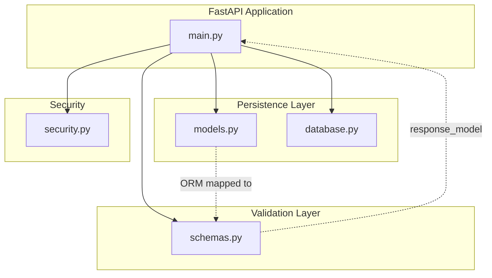
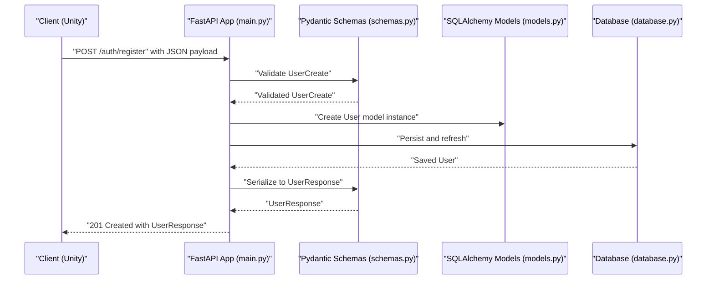
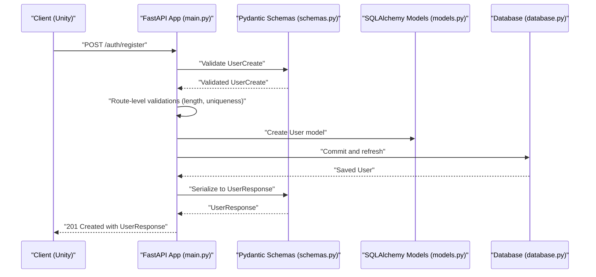
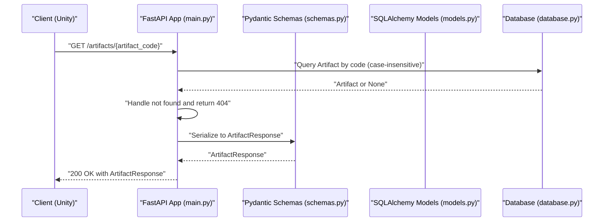
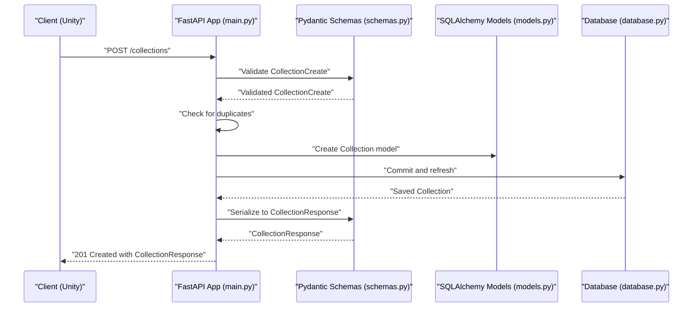
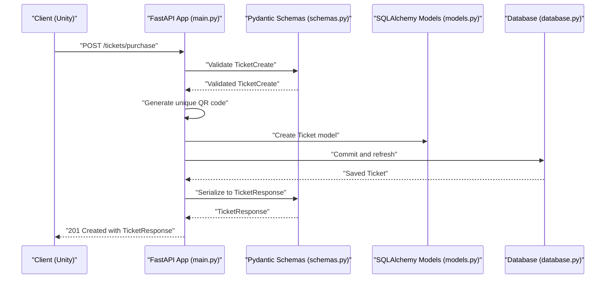
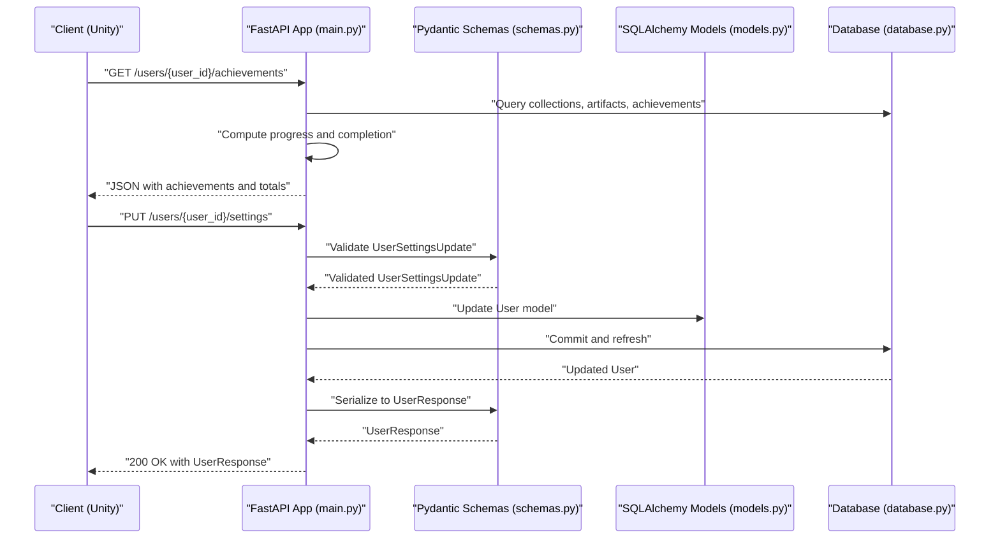
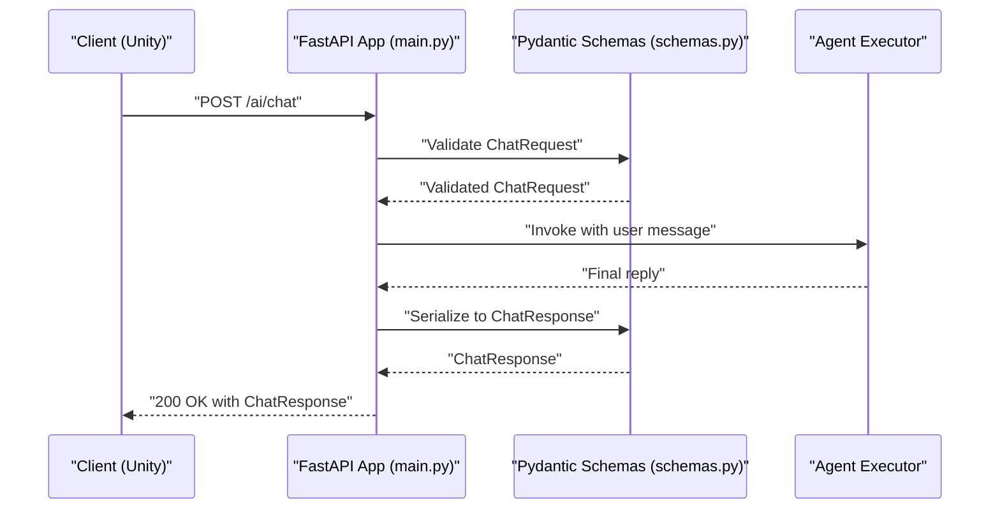
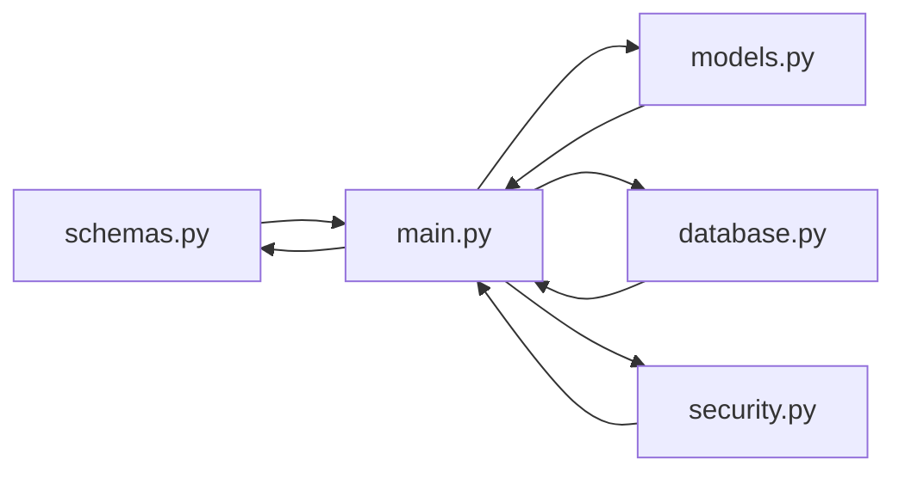

# Pydantic Validation Schemas

<cite>
**Referenced Files in This Document**
- [schemas.py](file://schemas.py)
- [models.py](file://models.py)
- [main.py](file://main.py)
- [database.py](file://database.py)
- [security.py](file://security.py)
- [requirements.txt](file://requirements.txt)
- [README.md](file://README.md)
</cite>

## Table of Contents
1. [Introduction](#introduction)
2. [Project Structure](#project-structure)
3. [Core Components](#core-components)
4. [Architecture Overview](#architecture-overview)
5. [Detailed Component Analysis](#detailed-component-analysis)
6. [Dependency Analysis](#dependency-analysis)
7. [Performance Considerations](#performance-considerations)
8. [Troubleshooting Guide](#troubleshooting-guide)
9. [Conclusion](#conclusion)
10. [Appendices](#appendices)

## Introduction
This document provides comprehensive Pydantic validation schema documentation for the MuseAmigo Backend API. It focuses on the request and response validation classes used across endpoints, including UserCreate, UserLogin, MuseumResponse, ArtifactResponse, CollectionCreate, CollectionResponse, AchievementResponse, UserAchievementResponse, TicketCreate, TicketResponse, ExhibitionResponse, RouteResponse, UserSettingsUpdate, ChatRequest, and ChatResponse. It explains field validation rules, data types, optional versus required fields, and validation constraints. It also details how Pydantic integrates with FastAPI for automatic request validation and response serialization, custom validators, field aliases, and serialization patterns. Finally, it covers the relationship between database models and validation schemas, including field mappings and data transformations, validation error messages, status codes, and client-side validation patterns used throughout the API.

## Project Structure
The backend is organized around a few core modules:
- schemas.py defines Pydantic models used for request and response validation.
- models.py defines SQLAlchemy ORM models representing database tables.
- main.py defines FastAPI routes and integrates Pydantic models with SQLAlchemy for validation and serialization.
- database.py configures the database connection and session management.
- security.py provides password hashing and verification utilities.
- requirements.txt lists dependencies including Pydantic and SQLAlchemy.
- README.md provides deployment and testing guidance.

**Diagram sources**
- [main.py:1-10](file://main.py#L1-L10)
- [schemas.py:1-137](file://schemas.py#L1-L137)
- [models.py:1-105](file://models.py#L1-L105)
- [database.py:1-38](file://database.py#L1-L38)
- [security.py:1-12](file://security.py#L1-L12)

**Section sources**
- [main.py:1-10](file://main.py#L1-L10)
- [schemas.py:1-137](file://schemas.py#L1-L137)
- [models.py:1-105](file://models.py#L1-L105)
- [database.py:1-38](file://database.py#L1-L38)
- [security.py:1-12](file://security.py#L1-L12)
- [requirements.txt:1-59](file://requirements.txt#L1-L59)

## Core Components
This section documents the primary Pydantic validation schemas used by the API, including their fields, types, and validation characteristics.

- UserCreate
  - Purpose: Request payload for user registration.
  - Fields:
    - full_name: string
    - email: string
    - password: string
  - Validation rules:
    - All fields are required.
    - Password length is validated in the route handler (minimum 6 characters).
  - Notes:
    - No explicit Pydantic validators are defined in the schema; validation occurs in the route handler.

- UserLogin
  - Purpose: Request payload for user login.
  - Fields:
    - email: string
    - password: string
  - Validation rules:
    - All fields are required.
    - Email and password are validated in the route handler (non-empty checks).
  - Notes:
    - No explicit Pydantic validators are defined in the schema.

- UserResponse
  - Purpose: Response payload for user-related operations.
  - Fields:
    - id: integer
    - full_name: string
    - email: string
    - theme: string
    - language: string
  - Validation rules:
    - All fields are required.
    - Config.from_attributes is enabled to allow reading from SQLAlchemy models.
  - Notes:
    - Used as response_model in several endpoints.

- MuseumResponse
  - Purpose: Response payload for museums.
  - Fields:
    - id: integer
    - name: string
    - operating_hours: string
    - base_ticket_price: integer
    - latitude: float
    - longitude: float
  - Validation rules:
    - All fields are required.
    - Config.from_attributes is enabled.
  - Notes:
    - Used as response_model for retrieving museums.

- ArtifactResponse
  - Purpose: Response payload for artifacts.
  - Fields:
    - id: integer
    - artifact_code: string
    - title: string
    - year: string
    - description: string
    - is_3d_available: boolean
    - museum_id: integer
    - unity_prefab_name: string
    - audio_asset: string (default empty)
  - Validation rules:
    - All fields are required except audio_asset.
    - Config.from_attributes is enabled.
  - Notes:
    - Used as response_model for artifact retrieval by code.

- CollectionCreate
  - Purpose: Request payload to add an artifact to a user’s collection.
  - Fields:
    - user_id: integer
    - artifact_id: integer
  - Validation rules:
    - All fields are required.
    - Duplicate prevention is handled in the route handler.
  - Notes:
    - No explicit Pydantic validators are defined in the schema.

- CollectionResponse
  - Purpose: Response payload confirming collection addition.
  - Fields:
    - id: integer
    - user_id: integer
    - artifact_id: integer
  - Validation rules:
    - All fields are required.
    - Config.from_attributes is enabled.
  - Notes:
    - Used as response_model for collection creation.

- ExhibitionResponse
  - Purpose: Response payload for exhibitions.
  - Fields:
    - id: integer
    - name: string
    - location: string
    - museum_id: integer
  - Validation rules:
    - All fields are required.
    - Config.from_attributes is enabled.
  - Notes:
    - Used as response_model for retrieving exhibitions.

- TicketCreate
  - Purpose: Request payload for purchasing a ticket.
  - Fields:
    - user_id: integer
    - museum_id: integer
    - ticket_type: string
  - Validation rules:
    - All fields are required.
  - Notes:
    - No explicit Pydantic validators are defined in the schema.

- TicketResponse
  - Purpose: Response payload for ticket purchase, including QR code.
  - Fields:
    - id: integer
    - ticket_type: string
    - purchase_date: string
    - qr_code: string
    - is_used: boolean
    - user_id: integer
    - museum_id: integer
  - Validation rules:
    - All fields are required.
    - Config.from_attributes is enabled.
  - Notes:
    - Used as response_model for ticket purchase.

- RouteResponse
  - Purpose: Response payload for navigation routes.
  - Fields:
    - id: integer
    - name: string
    - estimated_time: string
    - stops_count: integer
    - museum_id: integer
  - Validation rules:
    - All fields are required.
    - Config.from_attributes is enabled.
  - Notes:
    - Used as response_model for retrieving routes.

- AchievementResponse
  - Purpose: Response payload for achievements.
  - Fields:
    - id: integer
    - name: string
    - description: string
    - requirement_type: string
    - requirement_value: integer
    - points: integer
    - museum_id: integer or null
  - Validation rules:
    - All fields are required.
    - museum_id is optional.
    - Config.from_attributes is enabled.
  - Notes:
    - Used as response_model for retrieving achievements.

- UserAchievementResponse
  - Purpose: Response payload for user-specific achievement records.
  - Fields:
    - id: integer
    - user_id: integer
    - achievement_id: integer
    - museum_id: integer or null
    - is_completed: boolean
    - completed_at: string or null
  - Validation rules:
    - All fields are required.
    - museum_id and completed_at are optional.
    - Config.from_attributes is enabled.
  - Notes:
    - Used as response_model for user achievement operations.

- UserSettingsUpdate
  - Purpose: Request payload to update user settings.
  - Fields:
    - theme: string
    - language: string
  - Validation rules:
    - All fields are required.
  - Notes:
    - No explicit Pydantic validators are defined in the schema.

- ChatRequest
  - Purpose: Request payload for AI chat assistant.
  - Fields:
    - message: string
  - Validation rules:
    - All fields are required.
  - Notes:
    - No explicit Pydantic validators are defined in the schema.

- ChatResponse
  - Purpose: Response payload for AI chat assistant.
  - Fields:
    - reply: string
  - Validation rules:
    - All fields are required.
  - Notes:
    - No explicit Pydantic validators are defined in the schema.

**Section sources**
- [schemas.py:4-137](file://schemas.py#L4-L137)

## Architecture Overview
The API leverages FastAPI and Pydantic for automatic request validation and response serialization. Pydantic models define the shape of incoming/outgoing data, while SQLAlchemy models define persistence. FastAPI routes use these models as type hints and response_model annotations to enforce validation and produce standardized JSON responses. The database layer manages persistence and exposes ORM objects that Pydantic can serialize via from_attributes.

**Diagram sources**
- [main.py:538-568](file://main.py#L538-L568)
- [schemas.py:4-17](file://schemas.py#L4-L17)
- [models.py:4-15](file://models.py#L4-L15)
- [database.py:33-38](file://database.py#L33-L38)

**Section sources**
- [main.py:538-568](file://main.py#L538-L568)
- [schemas.py:4-17](file://schemas.py#L4-L17)
- [models.py:4-15](file://models.py#L4-L15)
- [database.py:33-38](file://database.py#L33-L38)

## Detailed Component Analysis

### User Registration and Login Validation
- UserCreate and UserLogin are used as request models for registration and login endpoints.
- Validation is performed in the route handlers:
  - Registration enforces non-empty full_name and password, and a minimum password length.
  - Login enforces non-empty email and password and performs credential checks against the database.
- Responses:
  - Registration returns UserResponse, which reads from the SQLAlchemy User model via from_attributes.
  - Login returns a custom JSON object with success message and user details.

**Diagram sources**
- [main.py:538-568](file://main.py#L538-L568)
- [schemas.py:4-17](file://schemas.py#L4-L17)
- [models.py:4-15](file://models.py#L4-L15)

**Section sources**
- [main.py:538-568](file://main.py#L538-L568)
- [schemas.py:4-17](file://schemas.py#L4-L17)
- [models.py:4-15](file://models.py#L4-L15)

### Artifact Retrieval Validation
- Artifact retrieval uses ArtifactResponse as the response model.
- The endpoint validates artifact codes and handles case-insensitive and space-insensitive matching.
- The response serializes an Artifact SQLAlchemy model to ArtifactResponse.

**Diagram sources**
- [main.py:610-632](file://main.py#L610-L632)
- [schemas.py:36-48](file://schemas.py#L36-L48)
- [models.py:27-42](file://models.py#L27-L42)

**Section sources**
- [main.py:610-632](file://main.py#L610-L632)
- [schemas.py:36-48](file://schemas.py#L36-L48)
- [models.py:27-42](file://models.py#L27-L42)

### Collection Management Validation
- CollectionCreate is used as the request model for adding items to a user’s collection.
- The route handler prevents duplicate entries and persists the record.
- CollectionResponse is used as the response model.

**Diagram sources**
- [main.py:634-661](file://main.py#L634-L661)
- [schemas.py:51-62](file://schemas.py#L51-L62)
- [models.py:43-50](file://models.py#L43-L50)

**Section sources**
- [main.py:634-661](file://main.py#L634-L661)
- [schemas.py:51-62](file://schemas.py#L51-L62)
- [models.py:43-50](file://models.py#L43-L50)

### Ticket Purchase Validation
- TicketCreate is used as the request model for purchasing tickets.
- The route handler generates a unique QR code and persists the record.
- TicketResponse is used as the response model.

**Diagram sources**
- [main.py:670-694](file://main.py#L670-L694)
- [schemas.py:76-92](file://schemas.py#L76-L92)
- [models.py:62-73](file://models.py#L62-L73)

**Section sources**
- [main.py:670-694](file://main.py#L670-L694)
- [schemas.py:76-92](file://schemas.py#L76-L92)
- [models.py:62-73](file://models.py#L62-L73)

### Achievement Calculation and Serialization
- AchievementResponse and UserAchievementResponse are used for achievement-related endpoints.
- The route handler calculates progress and completion status and returns structured data.
- UserResponse is used for updating user settings.

**Diagram sources**
- [main.py:738-844](file://main.py#L738-L844)
- [schemas.py:104-125](file://schemas.py#L104-L125)
- [schemas.py:127-129](file://schemas.py#L127-L129)
- [models.py:4-15](file://models.py#L4-L15)

**Section sources**
- [main.py:738-844](file://main.py#L738-L844)
- [schemas.py:104-125](file://schemas.py#L104-L125)
- [schemas.py:127-129](file://schemas.py#L127-L129)
- [models.py:4-15](file://models.py#L4-L15)

### AI Chat Assistant Validation
- ChatRequest is used as the request model for the AI chat endpoint.
- ChatResponse is used as the response model.
- The route handler orchestrates the agent and returns a structured reply.

**Diagram sources**
- [main.py:870-897](file://main.py#L870-L897)
- [schemas.py:132-137](file://schemas.py#L132-L137)

**Section sources**
- [main.py:870-897](file://main.py#L870-L897)
- [schemas.py:132-137](file://schemas.py#L132-L137)

## Dependency Analysis
- Pydantic models are used as:
  - Request models for endpoints (e.g., UserCreate, UserLogin, CollectionCreate, TicketCreate, UserSettingsUpdate, ChatRequest).
  - Response models for endpoints (e.g., UserResponse, MuseumResponse, ArtifactResponse, CollectionResponse, TicketResponse, ExhibitionResponse, RouteResponse, AchievementResponse, UserAchievementResponse, ChatResponse).
- SQLAlchemy models are used for persistence and are serialized via from_attributes in Pydantic models.
- Security utilities (password hashing/verification) are available for future enhancements to the authentication flow.
- Database configuration is centralized in database.py and injected via get_db().

**Diagram sources**
- [schemas.py:1-137](file://schemas.py#L1-L137)
- [models.py:1-105](file://models.py#L1-L105)
- [main.py:1-10](file://main.py#L1-L10)
- [database.py:1-38](file://database.py#L1-L38)
- [security.py:1-12](file://security.py#L1-L12)

**Section sources**
- [schemas.py:1-137](file://schemas.py#L1-L137)
- [models.py:1-105](file://models.py#L1-L105)
- [main.py:1-10](file://main.py#L1-L10)
- [database.py:1-38](file://database.py#L1-L38)
- [security.py:1-12](file://security.py#L1-L12)

## Performance Considerations
- Pydantic from_attributes enables efficient serialization of SQLAlchemy ORM objects without manual field mapping.
- FastAPI automatically validates request payloads and serializes responses, reducing boilerplate and potential errors.
- Database session management via get_db() ensures proper lifecycle handling and resource cleanup.
- Consider adding Pydantic validators for stricter field constraints (e.g., email regex, numeric ranges) to improve robustness and reduce runtime checks.

[No sources needed since this section provides general guidance]

## Troubleshooting Guide
Common validation and error scenarios:
- Registration failures:
  - Missing or empty full_name or password.
  - Password shorter than the required minimum.
  - Duplicate email address.
- Login failures:
  - Missing or empty email or password.
  - Non-existent user or incorrect password.
  - Incomplete user profile.
- Artifact retrieval failures:
  - Invalid or unknown artifact code.
- Collection creation failures:
  - Duplicate collection entry.
- Ticket purchase failures:
  - Missing required fields in the request payload.
- Achievement calculation:
  - Ensure user collections and artifact associations are correctly populated for accurate progress computation.
- AI chat failures:
  - Agent executor exceptions are caught and returned as internal server errors.

Status codes commonly used:
- 200 OK: Successful GET requests and updates.
- 201 Created: Successful POST requests for creation endpoints.
- 400 Bad Request: Validation errors and duplicate entries.
- 404 Not Found: Resource not found (e.g., artifact code).
- 500 Internal Server Error: Unexpected errors in AI chat or database operations.

**Section sources**
- [main.py:538-568](file://main.py#L538-L568)
- [main.py:569-601](file://main.py#L569-L601)
- [main.py:610-632](file://main.py#L610-L632)
- [main.py:634-661](file://main.py#L634-L661)
- [main.py:670-694](file://main.py#L670-L694)
- [main.py:870-897](file://main.py#L870-L897)

## Conclusion
The MuseAmigo Backend API employs Pydantic models to define strict request and response schemas, integrated seamlessly with FastAPI for automatic validation and serialization. While many validations are currently handled in route handlers, leveraging Pydantic validators would enhance type safety, reduce runtime checks, and improve developer experience. The from_attributes configuration allows straightforward serialization from SQLAlchemy models, aligning validation schemas closely with database models. Future enhancements could include Pydantic validators for richer constraints, password hashing/verification via security utilities, and expanded schema coverage for additional endpoints.

[No sources needed since this section summarizes without analyzing specific files]

## Appendices

### Field Mapping Between Database Models and Validation Schemas
- User
  - Database columns: id, full_name, email, hashed_password, is_active, theme, language.
  - Validation fields: id, full_name, email, theme, language (UserResponse).
  - Notes: hashed_password is not exposed in responses; theme and language are part of UserResponse.

- Museum
  - Database columns: id, name, operating_hours, base_ticket_price, latitude, longitude.
  - Validation fields: id, name, operating_hours, base_ticket_price, latitude, longitude (MuseumResponse).

- Artifact
  - Database columns: id, artifact_code, title, year, description, is_3d_available, unity_prefab_name, audio_asset, museum_id.
  - Validation fields: id, artifact_code, title, year, description, is_3d_available, museum_id, unity_prefab_name, audio_asset (ArtifactResponse).

- Collection
  - Database columns: id, user_id, artifact_id.
  - Validation fields: id, user_id, artifact_id (CollectionCreate, CollectionResponse).

- Exhibition
  - Database columns: id, name, location, museum_id.
  - Validation fields: id, name, location, museum_id (ExhibitionResponse).

- Ticket
  - Database columns: id, ticket_type, purchase_date, qr_code, is_used, user_id, museum_id.
  - Validation fields: id, ticket_type, purchase_date, qr_code, is_used, user_id, museum_id (TicketResponse).

- Route
  - Database columns: id, name, estimated_time, stops_count, museum_id.
  - Validation fields: id, name, estimated_time, stops_count, museum_id (RouteResponse).

- Achievement
  - Database columns: id, name, description, requirement_type, requirement_value, points, museum_id.
  - Validation fields: id, name, description, requirement_type, requirement_value, points, museum_id (AchievementResponse).

- UserAchievement
  - Database columns: id, user_id, achievement_id, museum_id, is_completed, completed_at.
  - Validation fields: id, user_id, achievement_id, museum_id, is_completed, completed_at (UserAchievementResponse).

**Section sources**
- [models.py:4-105](file://models.py#L4-L105)
- [schemas.py:10-137](file://schemas.py#L10-L137)

### Pydantic Integration with FastAPI
- Automatic request validation: FastAPI uses Pydantic models as type hints to validate incoming JSON payloads.
- Automatic response serialization: FastAPI uses response_model annotations to serialize SQLAlchemy models via from_attributes.
- Error handling: Pydantic validation errors are surfaced as HTTP 422 Unprocessable Entity responses; custom route-level validations raise HTTPException with appropriate status codes.

**Section sources**
- [main.py:538-568](file://main.py#L538-L568)
- [main.py:610-632](file://main.py#L610-L632)
- [main.py:634-661](file://main.py#L634-L661)
- [main.py:670-694](file://main.py#L670-L694)
- [main.py:738-844](file://main.py#L738-L844)
- [main.py:870-897](file://main.py#L870-L897)
- [schemas.py:16-17](file://schemas.py#L16-L17)
- [schemas.py:33-34](file://schemas.py#L33-L34)
- [schemas.py:47-48](file://schemas.py#L47-L48)
- [schemas.py:61-62](file://schemas.py#L61-L62)
- [schemas.py:71-72](file://schemas.py#L71-L72)
- [schemas.py:91-92](file://schemas.py#L91-L92)
- [schemas.py:101-102](file://schemas.py#L101-L102)
- [schemas.py:113-114](file://schemas.py#L113-L114)
- [schemas.py:124-125](file://schemas.py#L124-L125)

### Client-Side Validation Patterns
- Unity client should validate required fields before sending requests.
- For registration, enforce non-empty full_name and password length checks.
- For login, enforce non-empty email and password.
- For artifact retrieval, handle case-insensitive and space-insensitive codes gracefully.
- For collection creation, prevent duplicate submissions.
- For ticket purchase, ensure required fields are present.
- For settings update, validate theme and language choices.

**Section sources**
- [main.py:538-568](file://main.py#L538-L568)
- [main.py:569-601](file://main.py#L569-L601)
- [main.py:610-632](file://main.py#L610-L632)
- [main.py:634-661](file://main.py#L634-L661)
- [main.py:670-694](file://main.py#L670-L694)
- [main.py:846-867](file://main.py#L846-L867)

### Example Request Payloads and Response Structures
- Register User
  - Request: UserCreate fields (full_name, email, password).
  - Response: UserResponse fields (id, full_name, email, theme, language).

- Login User
  - Request: UserLogin fields (email, password).
  - Response: JSON with message, user_id, full_name.

- Get Artifacts
  - Request: None.
  - Response: Array of ArtifactResponse objects.

- Add to Collection
  - Request: CollectionCreate fields (user_id, artifact_id).
  - Response: CollectionResponse fields (id, user_id, artifact_id).

- Purchase Ticket
  - Request: TicketCreate fields (user_id, museum_id, ticket_type).
  - Response: TicketResponse fields (id, ticket_type, purchase_date, qr_code, is_used, user_id, museum_id).

- Get Achievements
  - Request: None.
  - Response: JSON with achievements array containing AchievementResponse-like fields and totals.

- Update Settings
  - Request: UserSettingsUpdate fields (theme, language).
  - Response: UserResponse fields (id, full_name, email, theme, language).

- AI Chat
  - Request: ChatRequest fields (message).
  - Response: ChatResponse fields (reply).

**Section sources**
- [main.py:538-568](file://main.py#L538-L568)
- [main.py:569-601](file://main.py#L569-L601)
- [main.py:604-607](file://main.py#L604-L607)
- [main.py:610-632](file://main.py#L610-L632)
- [main.py:634-661](file://main.py#L634-L661)
- [main.py:670-694](file://main.py#L670-L694)
- [main.py:703-722](file://main.py#L703-L722)
- [main.py:738-844](file://main.py#L738-L844)
- [main.py:846-867](file://main.py#L846-L867)
- [main.py:870-897](file://main.py#L870-L897)
- [schemas.py:4-137](file://schemas.py#L4-L137)

### Validation Error Messages and Status Codes
- Registration:
  - Missing full_name or password: 400 with descriptive message.
  - Password too short: 400 with descriptive message.
  - Duplicate email: 400 with descriptive message.
- Login:
  - Missing email or password: 400 with descriptive message.
  - Invalid credentials: 404 with descriptive message.
  - Incomplete profile: 400 with descriptive message.
- Artifact retrieval:
  - Unknown artifact code: 404 with descriptive message.
- Collection creation:
  - Duplicate entry: 400 with descriptive message.
- Ticket purchase:
  - Missing fields: 422 (automatic from Pydantic) or 400 (route-level).
- AI chat:
  - Agent failure: 500 with error details.

**Section sources**
- [main.py:538-568](file://main.py#L538-L568)
- [main.py:569-601](file://main.py#L569-L601)
- [main.py:610-632](file://main.py#L610-L632)
- [main.py:634-661](file://main.py#L634-L661)
- [main.py:670-694](file://main.py#L670-L694)
- [main.py:870-897](file://main.py#L870-L897)

### Deployment and Testing Context
- Swagger UI is available for testing endpoints.
- Database connection is configured via environment variables with a fallback to local MySQL.
- The README provides instructions for connecting via DBeaver and testing with Swagger UI.

**Section sources**
- [README.md:24-33](file://README.md#L24-L33)
- [README.md:7-18](file://README.md#L7-L18)
- [database.py:12-15](file://database.py#L12-L15)