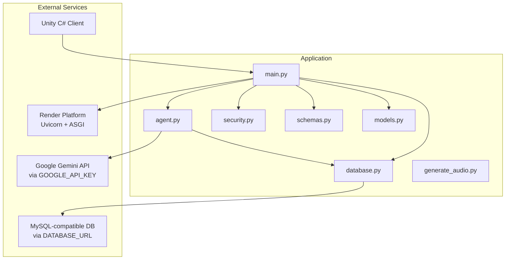
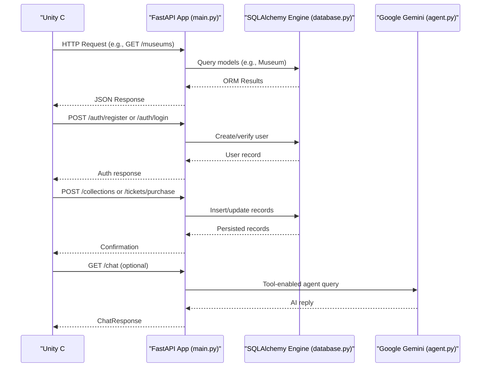
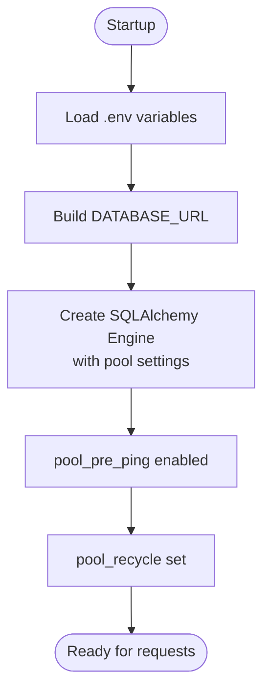
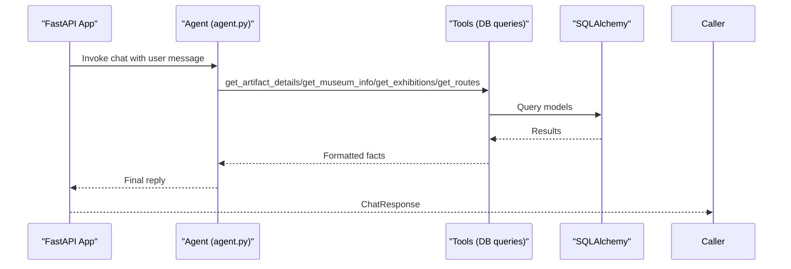
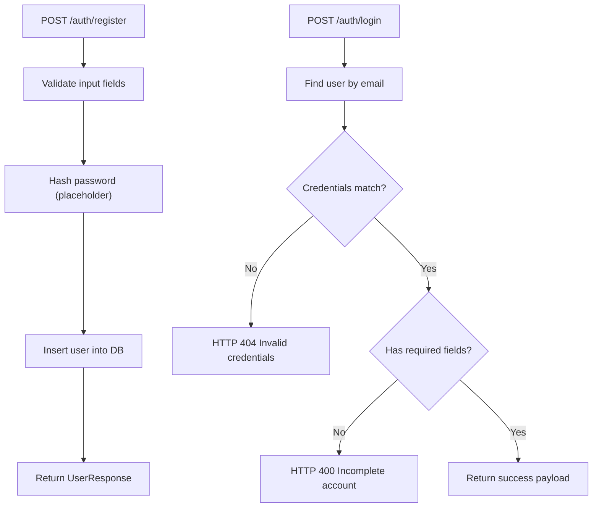
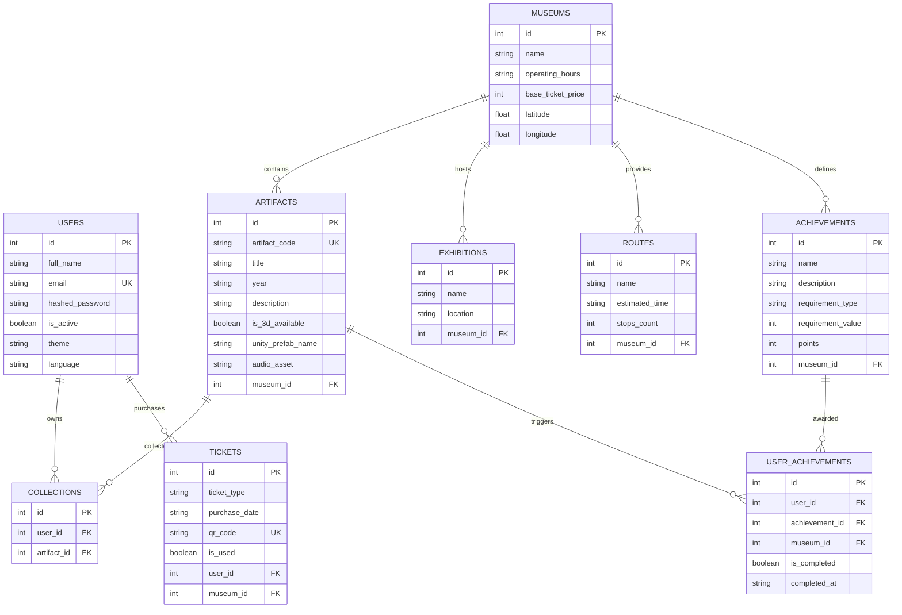
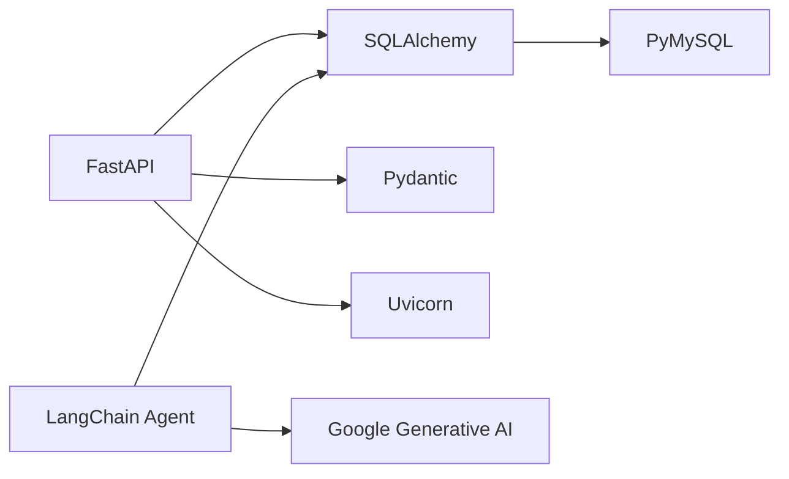

# Deployment & Production

<cite>
**Referenced Files in This Document**
- [README.md](file://README.md)
- [requirements.txt](file://requirements.txt)
- [main.py](file://main.py)
- [database.py](file://database.py)
- [schemas.py](file://schemas.py)
- [models.py](file://models.py)
- [security.py](file://security.py)
- [agent.py](file://agent.py)
- [generate_audio.py](file://generate_audio.py)
</cite>

## Table of Contents
1. [Introduction](#introduction)
2. [Project Structure](#project-structure)
3. [Core Components](#core-components)
4. [Architecture Overview](#architecture-overview)
5. [Detailed Component Analysis](#detailed-component-analysis)
6. [Dependency Analysis](#dependency-analysis)
7. [Performance Considerations](#performance-considerations)
8. [Troubleshooting Guide](#troubleshooting-guide)
9. [Conclusion](#conclusion)
10. [Appendices](#appendices)

## Introduction
This document provides comprehensive deployment and production guidance for the MuseAmigo Backend. It covers production deployment on Render, environment configuration, database URL setup, API key management, CI/CD workflow via GitHub integration, frontend integration with the Unity C# client, performance considerations (cold starts, connection pooling, memory management), monitoring and logging strategies, error handling, maintenance procedures, scaling, backups, disaster recovery, and troubleshooting.

## Project Structure
The backend is a FastAPI application with SQLAlchemy ORM, integrated with a MySQL-compatible cloud database and Google Gemini for conversational AI. The repository includes:
- Application entry and routing: main.py
- Database configuration and connection pooling: database.py
- Data models and schemas: models.py, schemas.py
- Security helpers: security.py
- AI agent integration: agent.py
- Audio generation utilities: generate_audio.py
- Dependencies: requirements.txt
- Deployment and usage guidance: README.md

**Diagram sources**
- [main.py](file://main.py)
- [database.py](file://database.py)
- [models.py](file://models.py)
- [schemas.py](file://schemas.py)
- [security.py](file://security.py)
- [agent.py](file://agent.py)
- [generate_audio.py](file://generate_audio.py)

**Section sources**
- [README.md](file://README.md)
- [requirements.txt](file://requirements.txt)
- [main.py](file://main.py)
- [database.py](file://database.py)
- [models.py](file://models.py)
- [schemas.py](file://schemas.py)
- [security.py](file://security.py)
- [agent.py](file://agent.py)
- [generate_audio.py](file://generate_audio.py)

## Core Components
- FastAPI application with CORS middleware and database initialization on startup
- SQLAlchemy engine with connection pooling and pre-ping/recycle settings
- Environment-driven database URL and optional fallback to local MySQL
- AI agent powered by Google Gemini with tooling for artifact, museum, exhibition, and route queries
- Unity integration endpoints for museums, artifacts, collections, tickets, routes, and achievements
- Password hashing utilities for secure credential handling

Key production-relevant elements:
- Environment variables: DATABASE_URL, GOOGLE_API_KEY
- Startup seeding of museums, artifacts, exhibitions, routes, and achievements
- Endpoint coverage for frontend consumption

**Section sources**
- [main.py](file://main.py)
- [database.py](file://database.py)
- [models.py](file://models.py)
- [schemas.py](file://schemas.py)
- [security.py](file://security.py)
- [agent.py](file://agent.py)

## Architecture Overview
The backend runs on Render with Uvicorn as the ASGI server. Requests flow from the Unity client to FastAPI endpoints, which interact with SQLAlchemy ORM to query the MySQL-compatible database. Conversational AI features leverage Google Gemini via an API key stored in environment variables.

**Diagram sources**
- [main.py](file://main.py)
- [database.py](file://database.py)
- [agent.py](file://agent.py)

## Detailed Component Analysis

### Database Layer
- Environment-driven URL with fallback to local MySQL
- Connection pooling configured with pool_size, max_overflow, pool_pre_ping, and pool_recycle
- Session factory and dependency injection for route handlers
- Startup migration to add audio_asset column if missing

**Diagram sources**
- [database.py](file://database.py)

**Section sources**
- [database.py](file://database.py)
- [main.py](file://main.py)

### AI Agent Integration
- Loads GOOGLE_API_KEY from .env and validates presence
- Provides tools to query artifacts, museums, exhibitions, and routes
- Uses LangChain React agent with Google Gemini LLM

**Diagram sources**
- [agent.py](file://agent.py)
- [database.py](file://database.py)
- [models.py](file://models.py)

**Section sources**
- [agent.py](file://agent.py)
- [database.py](file://database.py)
- [models.py](file://models.py)

### Authentication and Security
- Password hashing and verification utilities
- Registration and login endpoints with validation and integrity handling
- CORS configured for development; adjust for production origins

**Diagram sources**
- [main.py](file://main.py)
- [security.py](file://security.py)

**Section sources**
- [main.py](file://main.py)
- [security.py](file://security.py)

### Data Models and Schemas
- Users, Museums, Artifacts, Collections, Exhibitions, Tickets, Routes, Achievements, UserAchievements
- Pydantic schemas for request/response serialization
- Relationships defined via foreign keys

**Diagram sources**
- [models.py](file://models.py)
- [schemas.py](file://schemas.py)

**Section sources**
- [models.py](file://models.py)
- [schemas.py](file://schemas.py)

### API Coverage for Unity Integration
Endpoints commonly consumed by the Unity client include:
- GET /museums
- GET /artifacts/{artifact_code}
- POST /collections
- POST /tickets/purchase
- GET /museums/{museum_id}/exhibitions
- GET /museums/{museum_id}/routes
- GET /museums/{museum_id}/routes/{route_id}/achievements
- POST /users/{user_id}/achievements/reset/{museum_id}
- GET /users/{user_id}/achievements
- POST /auth/register
- POST /auth/login

These endpoints align with the Unity integration pattern described in the repository’s README.

**Section sources**
- [main.py](file://main.py)
- [README.md](file://README.md)

## Dependency Analysis
Runtime dependencies include FastAPI, Uvicorn, SQLAlchemy, PyMySQL, Pydantic, LangChain, and Google Generative AI. The application relies on environment variables for database connectivity and AI API access.

**Diagram sources**
- [requirements.txt](file://requirements.txt)
- [main.py](file://main.py)
- [agent.py](file://agent.py)
- [database.py](file://database.py)

**Section sources**
- [requirements.txt](file://requirements.txt)
- [main.py](file://main.py)
- [agent.py](file://agent.py)
- [database.py](file://database.py)

## Performance Considerations
- Cold start handling for free-tier hosting:
  - Expect initial request latency after idle periods on Render Free tier.
  - Plan for first-run delays and cache warm-up strategies.
- Connection pooling optimization:
  - Connection pool size and overflow are configured in the database engine.
  - Enable pre-ping to validate connections and recycle periodically to avoid stale connections.
- Memory management:
  - Ensure database sessions are closed in all code paths (context managers or try/finally).
  - Limit payload sizes and pagination for large lists.
  - Avoid loading unnecessary fields in ORM queries.
- AI agent performance:
  - Keep tool queries efficient; limit result sets.
  - Consider caching frequently accessed facts if appropriate.
- Endpoint-level optimizations:
  - Add response caching for read-heavy endpoints where safe.
  - Use database indexes on frequently filtered columns (e.g., artifact_code, user_id).

[No sources needed since this section provides general guidance]

## Troubleshooting Guide
Common production issues and resolutions:
- Database connectivity failures:
  - Verify DATABASE_URL environment variable is set on Render.
  - Confirm network access to the cloud database endpoint.
- Missing GOOGLE_API_KEY:
  - Ensure GOOGLE_API_KEY is present in environment variables for AI features.
- CORS errors in production:
  - Configure allow_origins to specific domains instead of wildcard.
- Integrity errors on registration:
  - Handle duplicate emails gracefully and return user-friendly messages.
- Slow initial requests:
  - Accept cold start delays on free tier; consider keep-alive or scheduled pings.
- Session leaks:
  - Ensure get_db() is used as a dependency and sessions are closed in all branches.

**Section sources**
- [database.py](file://database.py)
- [agent.py](file://agent.py)
- [main.py](file://main.py)

## Conclusion
This document outlined production deployment of the MuseAmigo Backend on Render, environment configuration, database and API key management, CI/CD workflow, Unity integration, performance tuning, monitoring/logging, error handling, maintenance, scaling, backups, and disaster recovery. Adhering to these practices will help maintain a reliable, scalable, and observable backend for the Unity client.

[No sources needed since this section summarizes without analyzing specific files]

## Appendices

### A. Production Deployment on Render
- Platform: Render with Uvicorn + ASGI
- Environment variables to configure:
  - DATABASE_URL: Cloud database connection string
  - GOOGLE_API_KEY: Google Gemini API key
- Build command and start command are inferred from the runtime; ensure requirements.txt is accurate.
- Swagger UI endpoint for testing is exposed at the Render domain.

**Section sources**
- [README.md](file://README.md)
- [database.py](file://database.py)
- [agent.py](file://agent.py)

### B. CI/CD Workflow via GitHub Integration
- Commit and push changes to the main branch.
- Render will trigger a build and deploy the latest commit automatically.
- Typical build time is a few minutes.

**Section sources**
- [README.md](file://README.md)

### C. Frontend Integration with Unity C#
- Base URL for production: https://museamigo-backend.onrender.com
- Example patterns:
  - GET /museums
  - GET /artifacts/{artifact_code}
  - POST /collections
  - POST /tickets/purchase
  - GET /museums/{museum_id}/exhibitions
  - GET /museums/{museum_id}/routes
  - GET /museums/{museum_id}/routes/{route_id}/achievements
  - POST /users/{user_id}/achievements/reset/{museum_id}
  - GET /users/{user_id}/achievements
  - POST /auth/register
  - POST /auth/login

**Section sources**
- [README.md](file://README.md)
- [main.py](file://main.py)

### D. Monitoring and Logging Strategies
- Enable structured logging in production (e.g., JSON logs).
- Centralize logs on Render or a log aggregation service.
- Monitor uptime, response times, error rates, and cold start durations.
- Set up alerts for sustained high error rates or slow response times.

[No sources needed since this section provides general guidance]

### E. Scaling, Backups, and Disaster Recovery
- Scaling:
  - Horizontal scaling with multiple instances behind a load balancer.
  - Stateless design to enable easy scaling.
- Backups:
  - Schedule regular logical backups of the MySQL-compatible database.
  - Store backups securely and test restore procedures periodically.
- Disaster recovery:
  - Maintain a documented RTO/RPO.
  - Automate restoration steps and validate them regularly.

[No sources needed since this section provides general guidance]