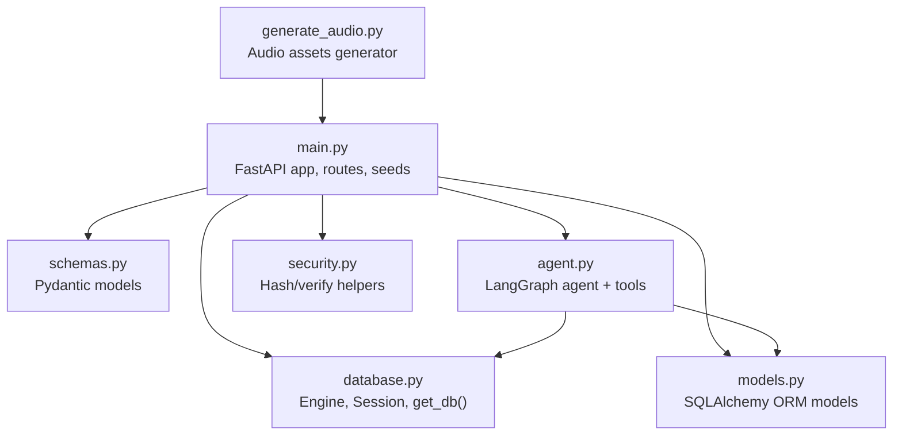
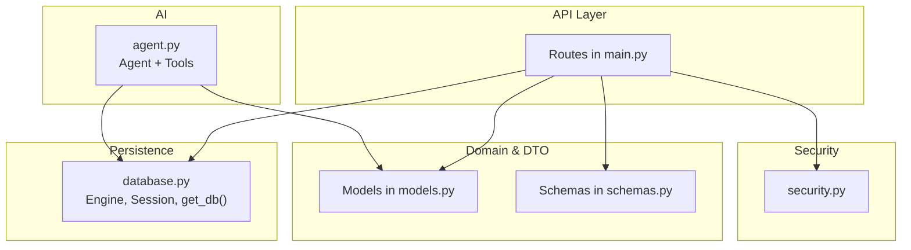
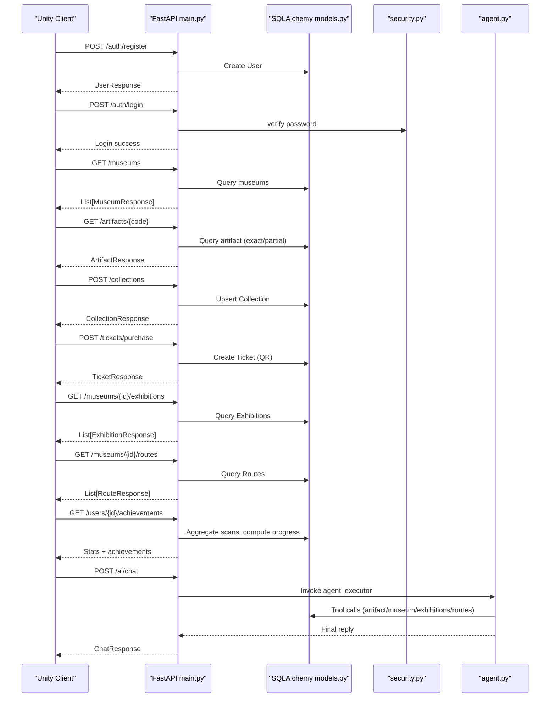
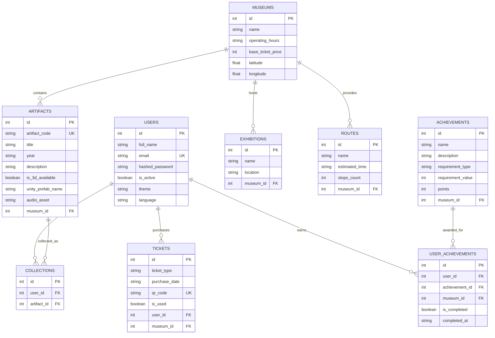
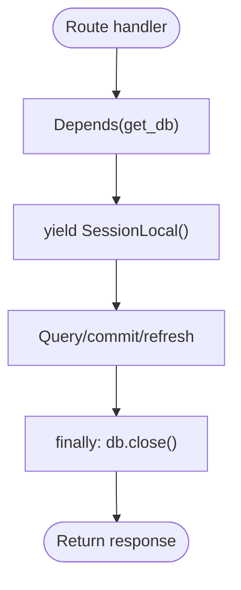
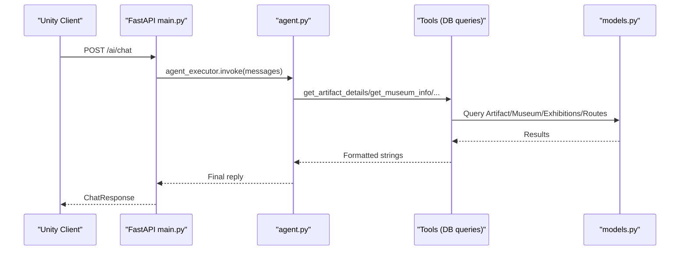
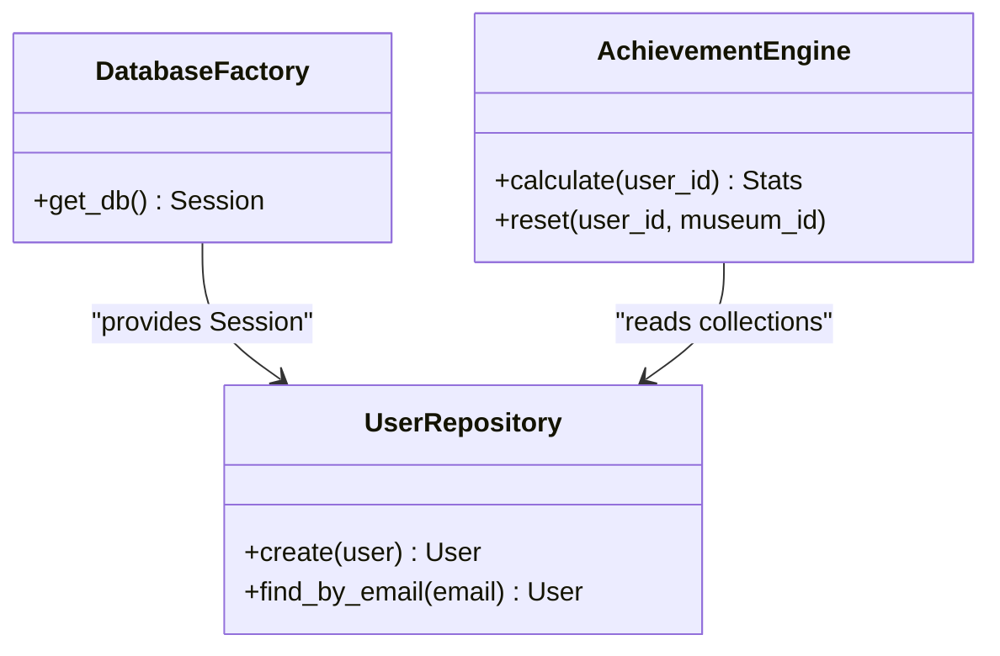
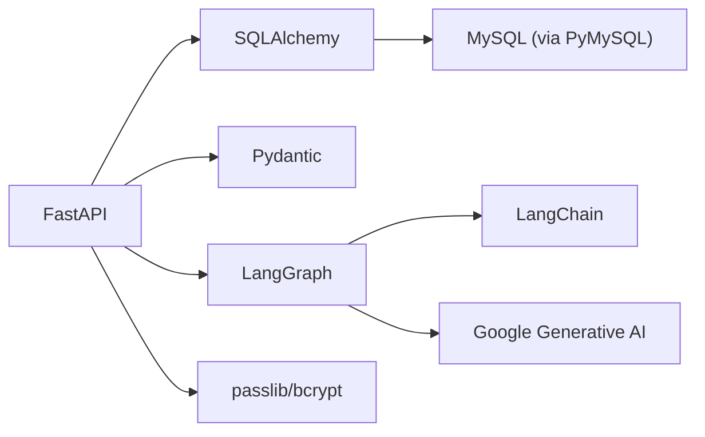

# Development Guidelines

<cite>
**Referenced Files in This Document**
- [main.py](file://main.py)
- [models.py](file://models.py)
- [schemas.py](file://schemas.py)
- [database.py](file://database.py)
- [security.py](file://security.py)
- [agent.py](file://agent.py)
- [generate_audio.py](file://generate_audio.py)
- [requirements.txt](file://requirements.txt)
- [README.md](file://README.md)
- [test_output.txt](file://test_output.txt)
</cite>

## Table of Contents
1. [Introduction](#introduction)
2. [Project Structure](#project-structure)
3. [Core Components](#core-components)
4. [Architecture Overview](#architecture-overview)
5. [Detailed Component Analysis](#detailed-component-analysis)
6. [Dependency Analysis](#dependency-analysis)
7. [Performance Considerations](#performance-considerations)
8. [Troubleshooting Guide](#troubleshooting-guide)
9. [Conclusion](#conclusion)
10. [Appendices](#appendices)

## Introduction
This document provides comprehensive development guidelines for contributors working on the MuseAmigo Backend. It explains the code organization, module structure, import patterns, FastAPI dependency injection, routing and endpoint organization, coding standards, naming conventions, architectural patterns, testing strategy, debugging/logging practices, and development workflow optimization. It also covers how to add new features, extend existing functionality, and maintain code quality in collaboration.

## Project Structure
The backend follows a modular Python structure with clear separation of concerns:
- Application entry and routing: main.py
- Data modeling: models.py
- Request/response schemas: schemas.py
- Database configuration and dependency: database.py
- Security helpers: security.py
- AI agent and tools: agent.py
- Asset generation utilities: generate_audio.py
- Dependencies: requirements.txt
- Developer documentation: README.md
- Known issue logs: test_output.txt

**Diagram sources**
- [main.py:1-15](file://main.py#L1-L15)
- [database.py:18-38](file://database.py#L18-L38)
- [models.py:1-105](file://models.py#L1-L105)
- [schemas.py:1-137](file://schemas.py#L1-L137)
- [agent.py:1-122](file://agent.py#L1-L122)
- [security.py:1-12](file://security.py#L1-L12)
- [generate_audio.py:1-78](file://generate_audio.py#L1-L78)

**Section sources**
- [main.py:1-15](file://main.py#L1-L15)
- [database.py:18-38](file://database.py#L18-L38)
- [models.py:1-105](file://models.py#L1-L105)
- [schemas.py:1-137](file://schemas.py#L1-L137)
- [agent.py:1-122](file://agent.py#L1-L122)
- [generate_audio.py:1-78](file://generate_audio.py#L1-L78)
- [requirements.txt:1-59](file://requirements.txt#L1-L59)

## Core Components
- FastAPI application and dependency injection
  - CORS middleware enabled for development
  - Database dependency get_db() yields a scoped Session
  - Startup event seeds initial data and migrates schema
- SQLAlchemy models define domain entities and relationships
- Pydantic schemas define request/response contracts
- Security helpers for hashing and verifying passwords
- LangGraph agent with tools for artifact, museum, exhibition, and route retrieval
- Audio asset generator for artifact descriptions

Key patterns:
- Dependency injection via Depends(get_db()) in route handlers
- Response models configured with from_attributes for seamless ORM-to-JSON conversion
- Seed/migration logic runs on startup to ensure schema and baseline data consistency

**Section sources**
- [main.py:17-23](file://main.py#L17-L23)
- [main.py:512-526](file://main.py#L512-L526)
- [database.py:32-38](file://database.py#L32-L38)
- [schemas.py:16-17](file://schemas.py#L16-L17)
- [schemas.py:33-34](file://schemas.py#L33-L34)
- [schemas.py:47-48](file://schemas.py#L47-L48)
- [agent.py:104-105](file://agent.py#L104-L105)

## Architecture Overview
The backend uses FastAPI with SQLAlchemy for persistence and LangGraph for AI-assisted chat. The system is organized around:
- API layer: routes in main.py
- Domain models: models.py
- Data transfer objects: schemas.py
- Persistence: database.py
- Security: security.py
- AI agent: agent.py

**Diagram sources**
- [main.py:538-601](file://main.py#L538-L601)
- [models.py:1-105](file://models.py#L1-L105)
- [schemas.py:1-137](file://schemas.py#L1-L137)
- [database.py:18-38](file://database.py#L18-L38)
- [agent.py:17-105](file://agent.py#L17-L105)
- [security.py:1-12](file://security.py#L1-L12)

## Detailed Component Analysis

### FastAPI Routing and Endpoints
- Authentication: register, login
- Museum discovery: list museums
- Artifact lookup: by code with flexible matching
- Collections: add artifact to user collection
- Exhibitions: fetch by museum
- Tickets: purchase and generate QR code
- Routes: fetch by museum
- Achievements: calculate, reset, per-route listing
- User settings: update theme/language
- AI chat: Ogima assistant powered by LangGraph

**Diagram sources**
- [main.py:538-601](file://main.py#L538-L601)
- [main.py:604-632](file://main.py#L604-L632)
- [main.py:634-661](file://main.py#L634-L661)
- [main.py:669-694](file://main.py#L669-L694)
- [main.py:664-667](file://main.py#L664-L667)
- [main.py:697-700](file://main.py#L697-L700)
- [main.py:738-844](file://main.py#L738-L844)
- [main.py:869-897](file://main.py#L869-L897)
- [agent.py:17-105](file://agent.py#L17-L105)
- [security.py:11-12](file://security.py#L11-L12)

**Section sources**
- [main.py:538-601](file://main.py#L538-L601)
- [main.py:604-632](file://main.py#L604-L632)
- [main.py:634-661](file://main.py#L634-L661)
- [main.py:669-694](file://main.py#L669-L694)
- [main.py:664-667](file://main.py#L664-L667)
- [main.py:697-700](file://main.py#L697-L700)
- [main.py:738-844](file://main.py#L738-L844)
- [main.py:869-897](file://main.py#L869-L897)

### Data Models and Relationships
The domain model defines entities and foreign keys that reflect museum, artifact, collection, exhibition, ticket, route, achievement, and user achievement relationships.

**Diagram sources**
- [models.py:4-105](file://models.py#L4-L105)

**Section sources**
- [models.py:4-105](file://models.py#L4-L105)

### Dependency Injection and Database Sessions
- get_db() creates a SessionLocal instance and yields it to route handlers
- Session is closed in a finally block to avoid leaks
- Engine is configured with connection pooling and pre-ping/recycle

**Diagram sources**
- [database.py:32-38](file://database.py#L32-L38)

**Section sources**
- [database.py:18-38](file://database.py#L18-L38)
- [database.py:32-38](file://database.py#L32-L38)

### AI Agent and Tools
- Agent uses Google Gemini via LangChain and LangGraph
- Tools: artifact details, museum info, exhibitions, routes
- Agent executor is created and invoked by the chat endpoint

**Diagram sources**
- [main.py:869-897](file://main.py#L869-L897)
- [agent.py:17-105](file://agent.py#L17-L105)

**Section sources**
- [agent.py:17-105](file://agent.py#L17-L105)
- [main.py:869-897](file://main.py#L869-L897)

### Coding Standards and Naming Conventions
- Module-level imports grouped and ordered logically
- Handler functions prefixed with domain intent (e.g., get_, post_, put_)
- Response models suffixed with Response
- Database models use PascalCase
- Pydantic models use PascalCase
- Constants and configuration derived from environment variables
- Clear separation between request DTOs and response DTOs

**Section sources**
- [main.py:1-11](file://main.py#L1-L11)
- [schemas.py:1-137](file://schemas.py#L1-L137)
- [models.py:1-105](file://models.py#L1-L105)

### Architectural Patterns
- Repository pattern: SQLAlchemy ORM acts as a repository for each entity
- Factory pattern: get_db() produces database sessions
- Observer pattern: Achievements computed and persisted when conditions change

**Diagram sources**
- [database.py:32-38](file://database.py#L32-L38)
- [models.py:4-105](file://models.py#L4-L105)
- [main.py:738-844](file://main.py#L738-L844)

**Section sources**
- [database.py:32-38](file://database.py#L32-L38)
- [main.py:738-844](file://main.py#L738-L844)

## Dependency Analysis
External libraries include FastAPI, SQLAlchemy, Pydantic, LangChain/LangGraph, Google Generative AI, passlib/bcrypt, and PyMySQL. The project relies on a MySQL-compatible database and environment-driven configuration.

**Diagram sources**
- [requirements.txt:12-59](file://requirements.txt#L12-L59)

**Section sources**
- [requirements.txt:12-59](file://requirements.txt#L12-L59)

## Performance Considerations
- Connection pooling: Engine configured with pool_size, max_overflow, pre_ping, and recycle
- Minimal ORM overhead: Selective field exposure via Pydantic from_attributes
- Efficient queries: Exact/partial artifact lookup reduces unnecessary scans
- AI tool calls: Limit tool scope to essential operations

[No sources needed since this section provides general guidance]

## Troubleshooting Guide
Common issues and resolutions:
- Database connectivity
  - Verify DATABASE_URL in .env; fallback defaults are provided
  - Ensure MySQL service is reachable
- AI agent errors
  - GOOGLE_API_KEY must be present in .env
  - Known deprecation warning indicates import path change; adjust agent creation accordingly
- Integrity errors
  - Email uniqueness enforced; handle duplicate registration gracefully
- Cold start delays
  - Render free tier may sleep; expect slower first request

**Section sources**
- [database.py:12-15](file://database.py#L12-L15)
- [agent.py:14-15](file://agent.py#L14-L15)
- [test_output.txt:1-12](file://test_output.txt#L1-L12)
- [main.py:560-567](file://main.py#L560-L567)

## Conclusion
This backend leverages FastAPI, SQLAlchemy, and LangGraph to deliver a cohesive museum experience. Contributors should adhere to established import patterns, dependency injection, schema contracts, and architectural practices. Use the provided testing and debugging guidance to maintain stability and performance as new features are added.

[No sources needed since this section summarizes without analyzing specific files]

## Appendices

### Adding New Features
- Define a new Pydantic schema in schemas.py for request/response
- Add a new SQLAlchemy model in models.py if needed
- Implement a route in main.py with proper Depends(get_db())
- Seed or migrate data if required
- Keep error handling explicit and return appropriate HTTP status codes
- Document new endpoints in Swagger UI

**Section sources**
- [schemas.py:1-137](file://schemas.py#L1-L137)
- [models.py:1-105](file://models.py#L1-L105)
- [main.py:512-526](file://main.py#L512-L526)

### Extending Existing Functionality
- For new endpoints, reuse get_db() dependency
- For AI assistance, add a new tool in agent.py and wire it into the agent executor
- For audio assets, use generate_audio.py to produce placeholders and update artifact entries

**Section sources**
- [database.py:32-38](file://database.py#L32-L38)
- [agent.py:17-105](file://agent.py#L17-L105)
- [generate_audio.py:41-78](file://generate_audio.py#L41-L78)

### Testing Strategy
- Unit tests: Validate schemas and helper functions (e.g., password hashing)
- Integration tests: Use FastAPI TestClient to exercise routes with mocked DB sessions
- API tests: Use Swagger UI to manually validate endpoints and responses
- CI/CD: Automate tests and linting in the pipeline

**Section sources**
- [README.md:24-33](file://README.md#L24-L33)

### Debugging and Logging Practices
- Use structured logging in handlers for request/response inspection
- Wrap AI tool calls with try/catch to prevent server failures
- Log exceptions with context and return user-friendly messages
- Leverage database transaction rollback on failure

**Section sources**
- [main.py:560-567](file://main.py#L560-L567)
- [main.py:895-897](file://main.py#L895-L897)

### Development Workflow Optimization
- Keep requirements.txt updated after installing new packages
- Commit and push changes; Render will auto-deploy
- Use Swagger UI for quick smoke tests
- Avoid exposing secrets; keep DATABASE_URL and GOOGLE_API_KEY in .env

**Section sources**
- [README.md:36-48](file://README.md#L36-L48)
- [README.md:24-33](file://README.md#L24-L33)