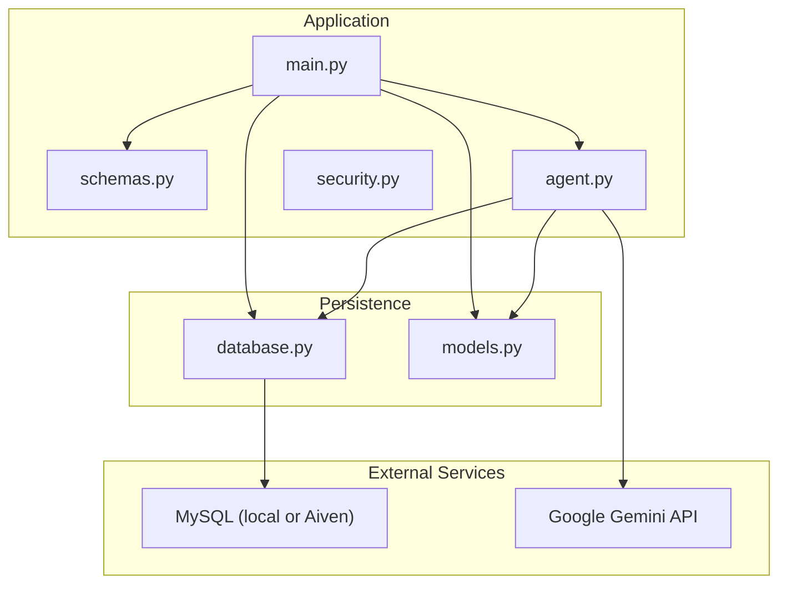
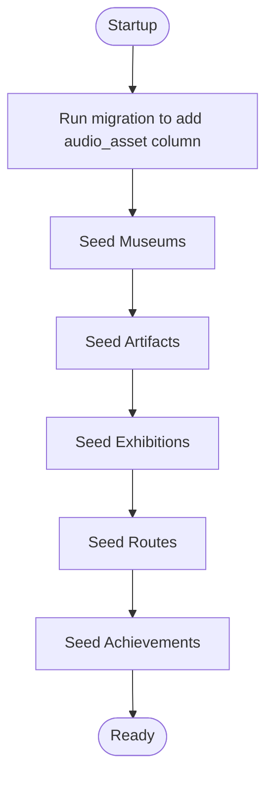
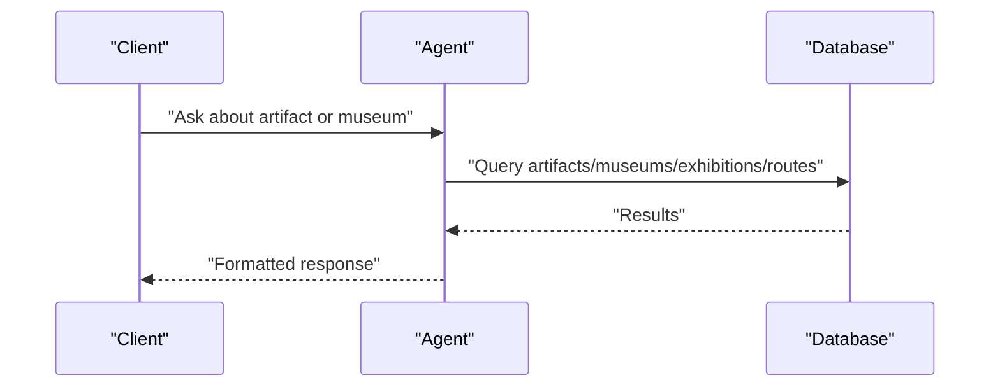

# Getting Started

<cite>
**Referenced Files in This Document**
- [README.md](file://README.md)
- [requirements.txt](file://requirements.txt)
- [main.py](file://main.py)
- [database.py](file://database.py)
- [models.py](file://models.py)
- [schemas.py](file://schemas.py)
- [agent.py](file://agent.py)
- [security.py](file://security.py)
- [generate_audio.py](file://generate_audio.py)
- [test_output.txt](file://test_output.txt)
</cite>

## Table of Contents
1. [Introduction](#introduction)
2. [Prerequisites](#prerequisites)
3. [Project Structure](#project-structure)
4. [Installation and Setup](#installation-and-setup)
5. [Environment Variables and Configuration](#environment-variables-and-configuration)
6. [Initial Data Seeding](#initial-data-seeding)
7. [Running the Application](#running-the-application)
8. [Testing Endpoints with Swagger UI](#testing-endpoints-with-swagger-ui)
9. [Connecting to Aiven MySQL Cloud](#connecting-to-aiven-mysql-cloud)
10. [Development vs Production Notes](#development-vs-production-notes)
11. [Common Setup Issues](#common-setup-issues)
12. [AI/LLM Integration Quick Start](#aillm-integration-quick-start)
13. [Troubleshooting Guide](#troubleshooting-guide)
14. [Conclusion](#conclusion)

## Introduction
MuseAmigo is a backend built with FastAPI that powers a museum discovery experience. It exposes REST endpoints for museums, artifacts, collections, tickets, routes, and achievements, and integrates an AI assistant powered by Google Gemini to answer questions about artifacts, museums, exhibitions, and routes. Data is persisted in a MySQL database, with optional cloud hosting via Aiven.

## Prerequisites
To work effectively with MuseAmigo Backend, you should be familiar with:
- Python 3.x fundamentals and virtual environments
- REST APIs and HTTP methods (GET, POST, etc.)
- Relational databases and SQL basics
- FastAPI basics (routing, dependency injection, Pydantic models)
- Basic AI/LLM concepts (prompting, tools, agents)

## Project Structure
The backend is organized around a few core modules:
- FastAPI application and routes
- Database configuration and ORM models
- Pydantic schemas for request/response validation
- AI agent integration using Google Gemini
- Security helpers for password hashing
- Optional audio generation utilities

**Diagram sources**
- [main.py:1-200](file://main.py#L1-L200)
- [database.py:1-38](file://database.py#L1-L38)
- [models.py:1-105](file://models.py#L1-L105)
- [schemas.py:1-137](file://schemas.py#L1-L137)
- [agent.py:1-122](file://agent.py#L1-L122)

**Section sources**
- [main.py:1-200](file://main.py#L1-L200)
- [database.py:1-38](file://database.py#L1-L38)
- [models.py:1-105](file://models.py#L1-L105)
- [schemas.py:1-137](file://schemas.py#L1-L137)
- [agent.py:1-122](file://agent.py#L1-L122)

## Installation and Setup
Follow these steps to set up the backend locally:

1. **Clone or download the repository** to your machine.
2. **Create a virtual environment**:
   - Use your preferred method (e.g., venv or conda).
3. **Install dependencies**:
   - Install packages from the requirements file.
4. **Set up the database**:
   - Configure a local MySQL server or connect to Aiven.
   - Ensure the database exists and is accessible.
5. **Run the application**:
   - Start the server using Uvicorn or the development server recommended by FastAPI.

Notes:
- The project uses Uvicorn as indicated by the requirements and FastAPI metadata.
- The application creates database tables on startup and seeds initial data.

**Section sources**
- [requirements.txt:1-59](file://requirements.txt#L1-L59)
- [main.py:12-14](file://main.py#L12-L14)
- [main.py:512-526](file://main.py#L512-L526)

## Environment Variables and Configuration
The backend relies on environment variables for database and AI configuration:

- Database URL
  - The application reads DATABASE_URL from the environment. If not present, it falls back to a local MySQL connection string.
  - Connection pooling and pre-ping are configured for reliability.

- AI/LLM
  - GOOGLE_API_KEY is required for the Gemini integration. The agent checks for this variable at startup.

- .env usage
  - The code loads environment variables from a .env file using python-dotenv.

Recommended .env keys:
- DATABASE_URL
- GOOGLE_API_KEY

Security note:
- Keep secrets in .env and never commit them to version control.

**Section sources**
- [database.py:8-24](file://database.py#L8-L24)
- [agent.py:10-15](file://agent.py#L10-L15)

## Initial Data Seeding
On application startup, the backend runs migrations and seeds the database with:
- Museums
- Artifacts
- Exhibitions
- Routes
- Achievements

This ensures the database is populated with realistic sample data for development and testing.

**Diagram sources**
- [main.py:491-526](file://main.py#L491-L526)
- [main.py:26-73](file://main.py#L26-L73)
- [main.py:75-188](file://main.py#L75-L188)
- [main.py:190-269](file://main.py#L190-L269)
- [main.py:271-351](file://main.py#L271-L351)
- [main.py:352-489](file://main.py#L352-L489)

**Section sources**
- [main.py:512-526](file://main.py#L512-L526)
- [main.py:26-73](file://main.py#L26-L73)
- [main.py:75-188](file://main.py#L75-L188)
- [main.py:190-269](file://main.py#L190-L269)
- [main.py:271-351](file://main.py#L271-L351)
- [main.py:352-489](file://main.py#L352-L489)

## Running the Application
Start the server using Uvicorn. The application listens on the port configured by Uvicorn and exposes:
- CORS enabled for development
- Swagger UI documentation endpoint

You can test endpoints locally using the interactive docs.

**Section sources**
- [requirements.txt:53-53](file://requirements.txt#L53-L53)
- [main.py:15-24](file://main.py#L15-L24)
- [README.md:24-33](file://README.md#L24-L33)

## Testing Endpoints with Swagger UI
After starting the server, open the interactive documentation:
- Navigate to the Swagger UI endpoint exposed by the application.
- Select an endpoint (for example, retrieving artifacts).
- Click “Try it out” and then “Execute”.
- Review the 200 OK response and the returned JSON.

This is the quickest way to validate that the backend is working.

**Section sources**
- [README.md:24-33](file://README.md#L24-L33)

## Connecting to Aiven MySQL Cloud
To connect to the Aiven-hosted MySQL database:
- Use the connection parameters provided in the repository documentation.
- Set DATABASE_URL in your environment to point to the Aiven instance.
- Ensure network access and firewall rules allow connections from your host.

Security reminder:
- Store credentials in .env and avoid committing sensitive information.

**Section sources**
- [README.md:7-21](file://README.md#L7-L21)
- [database.py:11-15](file://database.py#L11-L15)

## Development vs Production Notes
- Development
  - Use local MySQL or Aiven for testing.
  - Enable CORS for local frontend integration.
  - Use Swagger UI for quick validation.

- Production
  - Use HTTPS endpoints.
  - Ensure proper secrets management and environment configuration.
  - Monitor cold start delays on free tiers.

**Section sources**
- [README.md:50-95](file://README.md#L50-L95)

## Common Setup Issues
- Missing GOOGLE_API_KEY
  - The agent requires GOOGLE_API_KEY. If missing, the application raises an error at startup.
  - Add the key to your .env file.

- LangGraph API change warning
  - The agent uses a deprecated import path. Update the import to align with the latest LangGraph API.

- Database connectivity
  - Ensure DATABASE_URL is correctly set.
  - Verify the database server is reachable and the schema exists.

- Password hashing
  - The current login logic compares plain text passwords. For production, integrate secure password hashing.

**Section sources**
- [agent.py:10-15](file://agent.py#L10-L15)
- [test_output.txt:1-13](file://test_output.txt#L1-L13)
- [database.py:11-15](file://database.py#L11-L15)
- [main.py:570-595](file://main.py#L570-L595)
- [security.py:1-12](file://security.py#L1-L12)

## AI/LLM Integration Quick Start
The backend includes an AI agent that can answer questions about:
- Artifacts (by name or code)
- Museums (hours, pricing, location)
- Exhibitions
- Routes

To enable the AI:
- Obtain a Google AI API key.
- Store it in your .env as GOOGLE_API_KEY.
- Use the chat endpoint to ask questions; the agent will search the database and respond with formatted information.

**Diagram sources**
- [agent.py:17-105](file://agent.py#L17-L105)
- [models.py:4-105](file://models.py#L4-L105)

**Section sources**
- [agent.py:10-15](file://agent.py#L10-L15)
- [agent.py:17-105](file://agent.py#L17-L105)
- [models.py:4-105](file://models.py#L4-L105)

## Troubleshooting Guide
- Database errors
  - Verify DATABASE_URL and credentials.
  - Confirm the database server is running and accepting connections.

- CORS issues
  - Ensure CORS middleware allows your frontend origin.

- AI agent failures
  - Confirm GOOGLE_API_KEY is present.
  - Update deprecated imports if encountering errors.

- Audio assets
  - Use the included script to generate placeholder audio files for artifact descriptions.

**Section sources**
- [database.py:11-24](file://database.py#L11-L24)
- [main.py:17-23](file://main.py#L17-L23)
- [agent.py:10-15](file://agent.py#L10-L15)
- [generate_audio.py:41-78](file://generate_audio.py#L41-L78)

## Conclusion
You now have the essentials to install, configure, and run MuseAmigo Backend locally, connect to Aiven MySQL, and test endpoints via Swagger UI. Integrate the AI agent by adding your Google API key, and use the seeding logic to populate the database with sample data. For production, focus on secure secrets management, HTTPS, and robust error handling.