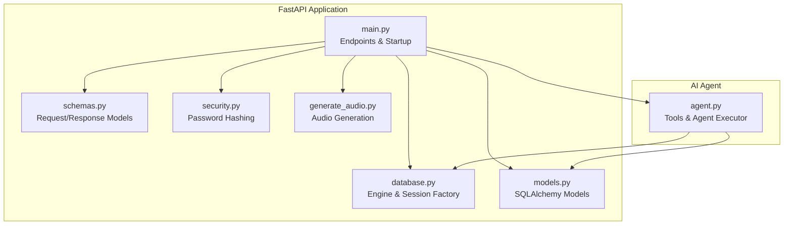
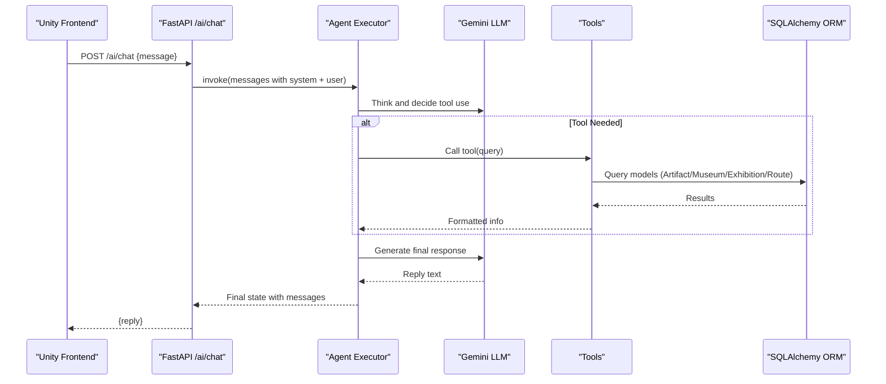
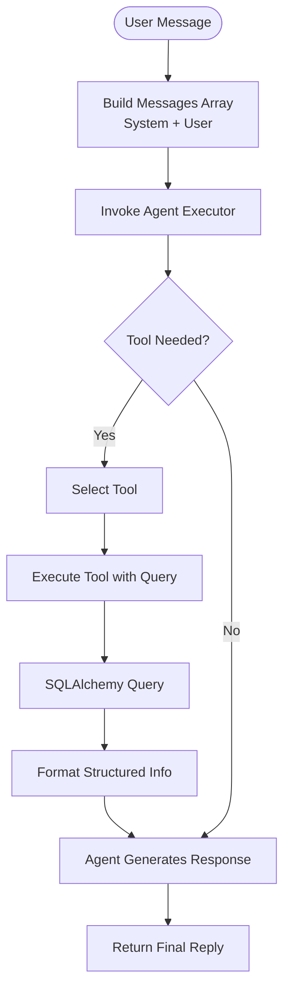
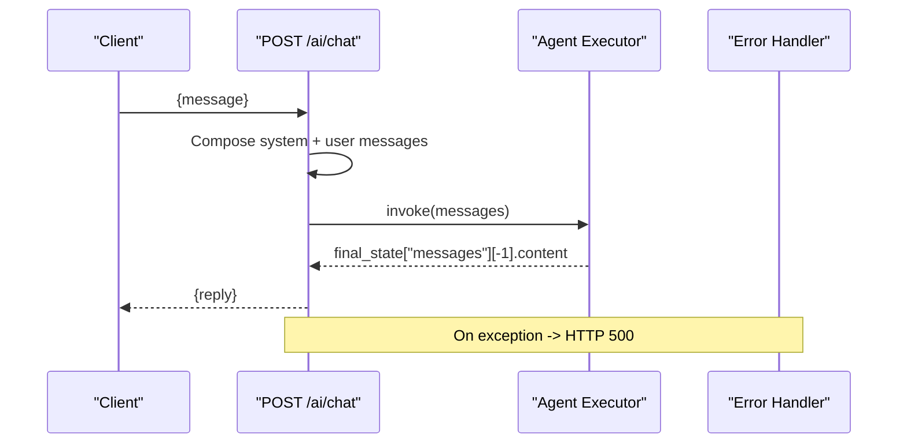
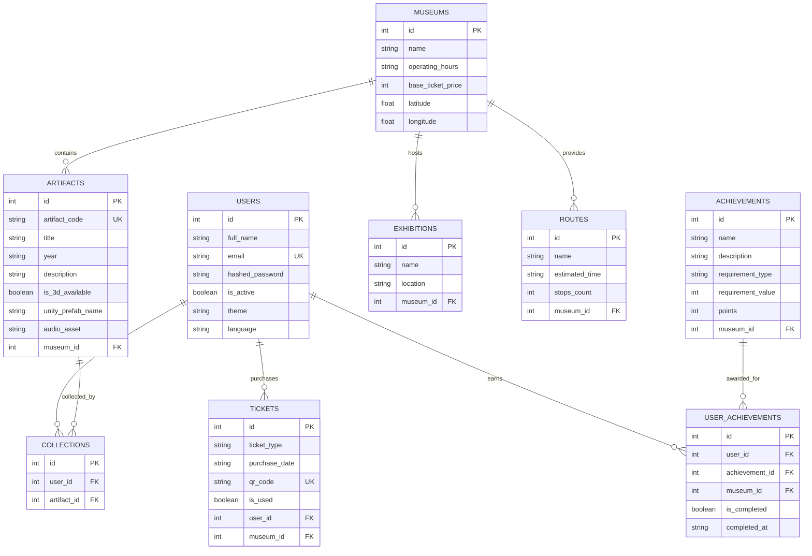
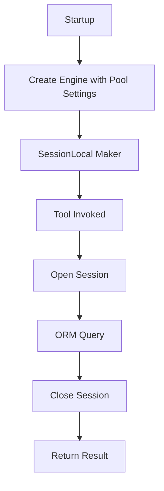
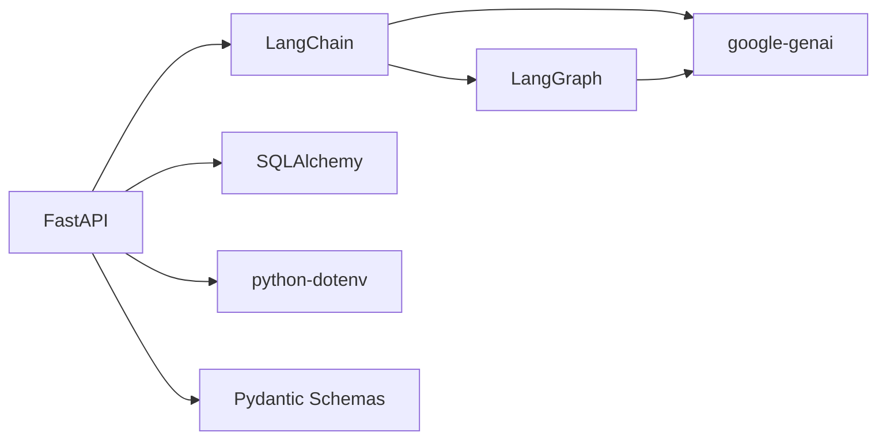

# AI Integration & Agent System

<cite>
**Referenced Files in This Document**
- [agent.py](file://agent.py)
- [main.py](file://main.py)
- [models.py](file://models.py)
- [schemas.py](file://schemas.py)
- [database.py](file://database.py)
- [requirements.txt](file://requirements.txt)
- [security.py](file://security.py)
- [generate_audio.py](file://generate_audio.py)
- [README.md](file://README.md)
- [test_output.txt](file://test_output.txt)
</cite>

## Table of Contents
1. [Introduction](#introduction)
2. [Project Structure](#project-structure)
3. [Core Components](#core-components)
4. [Architecture Overview](#architecture-overview)
5. [Detailed Component Analysis](#detailed-component-analysis)
6. [Dependency Analysis](#dependency-analysis)
7. [Performance Considerations](#performance-considerations)
8. [Troubleshooting Guide](#troubleshooting-guide)
9. [Conclusion](#conclusion)
10. [Appendices](#appendices)

## Introduction
This document explains the AI integration system powered by Google Gemini and LangChain. It covers the agent architecture, tool-based response system, and contextual information retrieval mechanisms. It documents all AI tools (artifact information retrieval, museum details lookup, exhibition search, and route guidance), agent configuration, memory management, and conversation context handling. It also describes integration patterns with the main FastAPI application, error handling strategies, fallback mechanisms, examples of AI-powered responses, tool invocation patterns, performance optimization for AI requests, and strategies for API key management, rate limiting, and cost optimization for Google Gemini integration.

## Project Structure
The backend is a FastAPI application that integrates an AI agent built with LangChain and Google Gemini. The agent exposes four tools for museum-related queries and orchestrates responses using a React-style agent loop. Data access is handled via SQLAlchemy models and a shared database session factory. Supporting utilities include audio generation helpers and security utilities.

**Diagram sources**
- [main.py:1-897](file://main.py#L1-L897)
- [schemas.py:1-137](file://schemas.py#L1-L137)
- [database.py:1-38](file://database.py#L1-L38)
- [models.py:1-105](file://models.py#L1-L105)
- [security.py:1-12](file://security.py#L1-L12)
- [generate_audio.py:1-78](file://generate_audio.py#L1-L78)
- [agent.py:1-122](file://agent.py#L1-L122)

**Section sources**
- [main.py:1-897](file://main.py#L1-L897)
- [schemas.py:1-137](file://schemas.py#L1-L137)
- [database.py:1-38](file://database.py#L1-L38)
- [models.py:1-105](file://models.py#L1-L105)
- [security.py:1-12](file://security.py#L1-L12)
- [generate_audio.py:1-78](file://generate_audio.py#L1-L78)
- [agent.py:1-122](file://agent.py#L1-L122)

## Core Components
- AI Agent and Tools
  - Tools: artifact details lookup, museum info, exhibitions listing, and route listing.
  - Agent executor configured with Google Gemini (ChatGoogleGenerativeAI) and tools.
  - System message embedded in the chat endpoint to guide the agent’s behavior.
- FastAPI Integration
  - Dedicated endpoint for AI chat that packages user messages with a system message and invokes the agent.
  - Robust error handling to prevent server crashes on AI failures.
- Database Layer
  - SQLAlchemy models for museums, artifacts, exhibitions, routes, tickets, collections, achievements, and user progress.
  - Session factory with connection pooling and lifecycle management.
- Supporting Utilities
  - Security utilities for password hashing.
  - Audio generation script for artifact audio assets.

**Section sources**
- [agent.py:17-105](file://agent.py#L17-L105)
- [main.py:869-897](file://main.py#L869-L897)
- [models.py:4-105](file://models.py#L4-L105)
- [database.py:18-38](file://database.py#L18-L38)
- [security.py:1-12](file://security.py#L1-L12)
- [generate_audio.py:1-78](file://generate_audio.py#L1-L78)

## Architecture Overview
The AI agent is initialized with Google Gemini and a set of tools. The FastAPI chat endpoint composes a system message and user message, then invokes the agent. The agent decides whether to use tools and how to format the final response. The agent’s tools query the database using SQLAlchemy and return structured information to the agent, which synthesizes a human-readable reply.

**Diagram sources**
- [main.py:869-897](file://main.py#L869-L897)
- [agent.py:94-105](file://agent.py#L94-L105)
- [models.py:27-84](file://models.py#L27-L84)

## Detailed Component Analysis

### AI Agent and Tools
- Tool Definitions
  - Artifact Details Lookup: Searches artifacts by title or code and returns formatted details.
  - Museum Info Lookup: Retrieves operating hours, ticket price, and coordinates by museum name.
  - Exhibitions Listing: Lists current exhibitions for a given museum.
  - Route Guidance: Lists available guided routes with estimated time and stop counts.
- Agent Configuration
  - Uses ChatGoogleGenerativeAI with a specific model and temperature.
  - Tools registered with the agent executor.
  - System message embedded in the chat endpoint to guide behavior.
- Memory and Conversation Context
  - The agent maintains conversation context via the messages field in the state passed to invoke.
  - The chat endpoint constructs a messages array with a system role and a user role.

**Diagram sources**
- [agent.py:17-105](file://agent.py#L17-L105)
- [main.py:869-897](file://main.py#L869-L897)

**Section sources**
- [agent.py:17-105](file://agent.py#L17-L105)
- [main.py:869-897](file://main.py#L869-L897)

### FastAPI Integration and Chat Endpoint
- Endpoint Definition
  - POST /ai/chat accepts a message payload and returns a reply.
- System Message Composition
  - The system message instructs the agent to use tools for museum-related queries and to gracefully handle unknowns.
- Agent Invocation
  - The agent executor is invoked with the constructed messages.
- Error Handling
  - Exceptions are caught and mapped to HTTP 500 with the error message.

**Diagram sources**
- [main.py:869-897](file://main.py#L869-L897)

**Section sources**
- [main.py:869-897](file://main.py#L869-L897)

### Database Models and Relationships
The data model defines entities for users, museums, artifacts, collections, exhibitions, tickets, routes, achievements, and user achievements. Relationships are established via foreign keys.

**Diagram sources**
- [models.py:4-105](file://models.py#L4-L105)

**Section sources**
- [models.py:4-105](file://models.py#L4-L105)

### Data Access and Session Management
- Engine and Pooling
  - Connection pooling with configurable pool size, overflow, pre-ping, and recycle settings.
- Session Factory
  - SessionLocal creates sessions bound to the engine.
  - get_db dependency yields a session and ensures closure.
- Tool Queries
  - Tools open a new session per invocation, query models, and close the session.

**Diagram sources**
- [database.py:18-38](file://database.py#L18-L38)
- [agent.py:20-35](file://agent.py#L20-L35)

**Section sources**
- [database.py:18-38](file://database.py#L18-L38)
- [agent.py:20-35](file://agent.py#L20-L35)

### Security Utilities
- Password Hashing
  - bcrypt-based hashing and verification utilities for user credentials.

**Section sources**
- [security.py:1-12](file://security.py#L1-L12)

### Audio Asset Generation
- Purpose
  - Generates placeholder WAV audio files for artifact descriptions.
- Usage
  - Creates sample sine wave tones and writes them to a target directory for the frontend.

**Section sources**
- [generate_audio.py:1-78](file://generate_audio.py#L1-L78)

## Dependency Analysis
External libraries and their roles:
- FastAPI: Web framework for endpoints and ASGI server.
- SQLAlchemy: ORM for database modeling and queries.
- LangChain and LangGraph: Agent orchestration and tool integration.
- google-genai and langchain-google-genai: Google Gemini integration.
- python-dotenv: Environment variable loading for secrets.

**Diagram sources**
- [requirements.txt:12-59](file://requirements.txt#L12-L59)
- [main.py:1-15](file://main.py#L1-L15)
- [agent.py:1-8](file://agent.py#L1-L8)

**Section sources**
- [requirements.txt:12-59](file://requirements.txt#L12-L59)
- [main.py:1-15](file://main.py#L1-L15)
- [agent.py:1-8](file://agent.py#L1-L8)

## Performance Considerations
- Connection Pooling
  - Configure pool size and overflow to handle concurrent requests efficiently.
- Tool Query Optimization
  - Use indexed columns (artifact_code, name) for faster lookups.
  - Limit result sets and format strings to reduce payload sizes.
- Agent Temperature
  - Adjust temperature for deterministic vs creative responses depending on use case.
- Caching
  - Consider caching frequent queries (e.g., museum info) to reduce latency and cost.
- Streaming Responses
  - For long-form replies, consider streaming partial responses to improve perceived performance.
- Cold Starts
  - Account for cold starts on free tiers; warm-up endpoints or keep-alive requests can mitigate delays.

[No sources needed since this section provides general guidance]

## Troubleshooting Guide
- Missing API Key
  - The agent checks for GOOGLE_API_KEY at runtime and raises an error if missing.
- Deprecation Warning and Import Error
  - The agent uses a deprecated import path for the agent executor. Update imports to align with LangGraph v1+.
- HTTP 500 on AI Failure
  - The chat endpoint catches exceptions and returns HTTP 500 with the error message.
- Database Session Lifecycle
  - Tools always close sessions to prevent leaks; ensure consistent usage across endpoints.

**Section sources**
- [agent.py:14-15](file://agent.py#L14-L15)
- [test_output.txt:1-12](file://test_output.txt#L1-L12)
- [main.py:895-897](file://main.py#L895-L897)
- [agent.py:34-35](file://agent.py#L34-L35)

## Conclusion
The AI integration system combines FastAPI, LangChain, and Google Gemini to deliver a robust, tool-augmented assistant for museum-related queries. The agent’s tools provide contextual information retrieval, while the chat endpoint manages conversation context and error handling. The SQLAlchemy layer ensures reliable data access, and the project’s structure supports scalability and maintainability. By addressing deprecations, optimizing queries, and implementing caching and rate-limiting strategies, the system can achieve improved performance and cost efficiency.

[No sources needed since this section summarizes without analyzing specific files]

## Appendices

### API Key Management and Cost Optimization
- API Key Management
  - Store GOOGLE_API_KEY in environment variables and load via python-dotenv.
  - Restrict access to environment files and avoid committing secrets to version control.
- Rate Limiting and Quota Control
  - Implement client-side throttling and server-side rate limiting to avoid quota exhaustion.
  - Monitor usage metrics and adjust model parameters (temperature, max tokens) to reduce costs.
- Model Selection and Prompt Engineering
  - Choose appropriate models for cost/performance trade-offs.
  - Refine prompts to minimize unnecessary tool calls and reduce token usage.

**Section sources**
- [agent.py:10-15](file://agent.py#L10-L15)
- [database.py:9-15](file://database.py#L9-L15)
- [README.md:19-20](file://README.md#L19-L20)

### Example AI-Powered Responses and Tool Invocation Patterns
- Example Queries
  - “What are the operating hours of the Independence Palace?”
  - “Are there any routes in the Independence Palace?”
- Tool Invocation Patterns
  - Artifact Details Lookup: Query by title or code; return formatted details.
  - Museum Info Lookup: Query by name; return hours, price, and coordinates.
  - Exhibitions Listing: Query exhibitions linked to a museum; return names and locations.
  - Route Guidance: Query routes linked to a museum; return names, estimated time, and stop counts.

**Section sources**
- [agent.py:17-91](file://agent.py#L17-L91)
- [main.py:108-122](file://main.py#L108-L122)