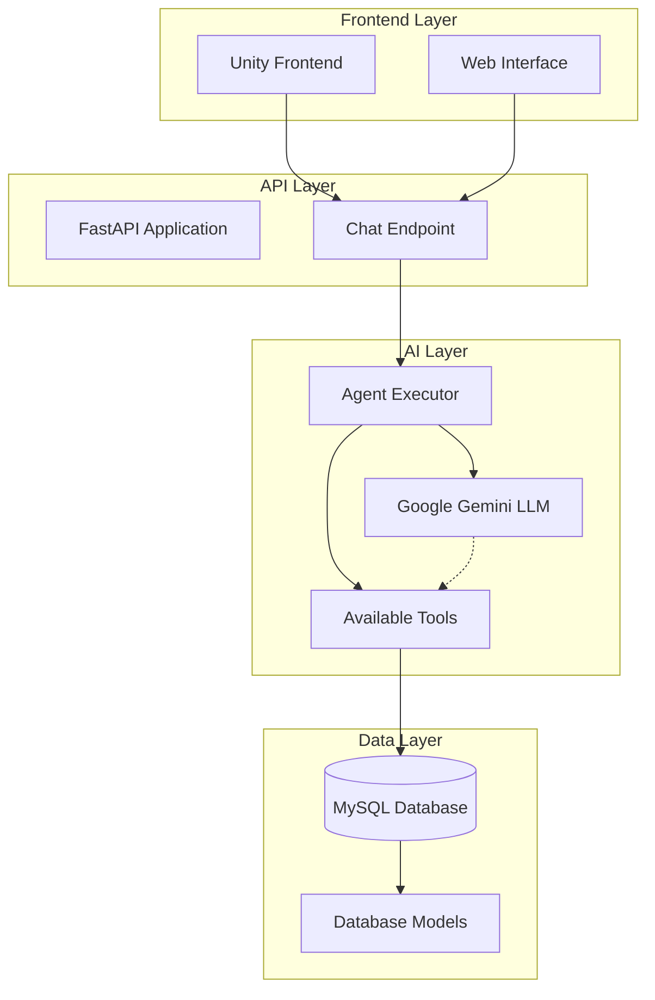
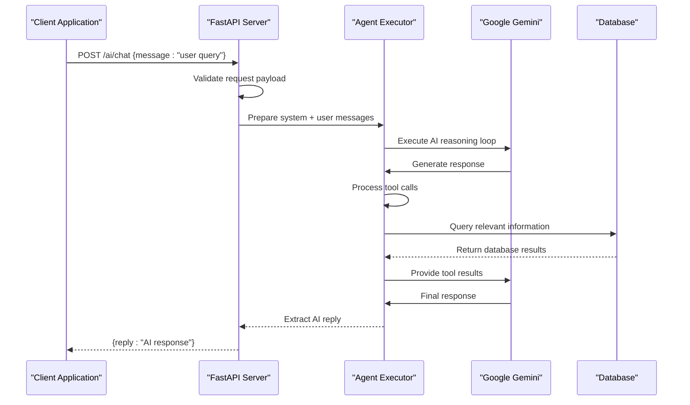
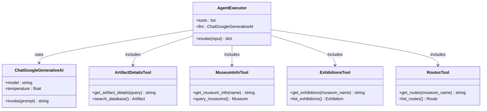
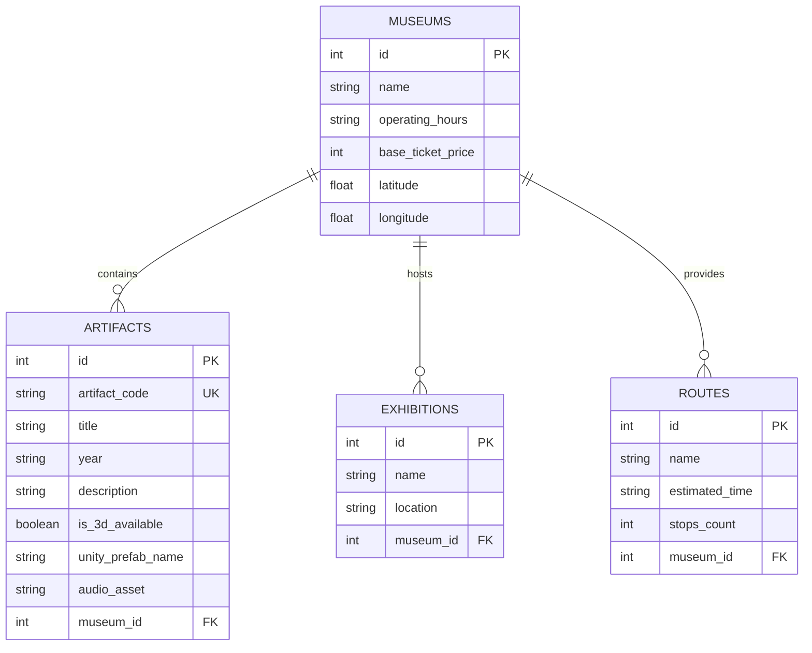
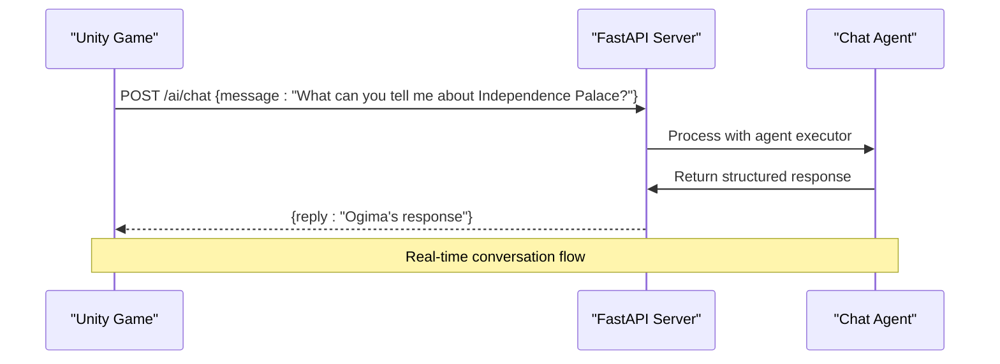

# AI Chat Assistant Endpoints

<cite>
**Referenced Files in This Document**
- [main.py](file://main.py)
- [agent.py](file://agent.py)
- [database.py](file://database.py)
- [models.py](file://models.py)
- [schemas.py](file://schemas.py)
- [README.md](file://README.md)
- [generate_audio.py](file://generate_audio.py)
- [security.py](file://security.py)
</cite>

## Table of Contents
1. [Introduction](#introduction)
2. [System Architecture](#system-architecture)
3. [Chat Endpoint Implementation](#chat-endpoint-implementation)
4. [Agent Configuration](#agent-configuration)
5. [Available Tools](#available-tools)
6. [Database Integration](#database-integration)
7. [Response Processing](#response-processing)
8. [Frontend Integration](#frontend-integration)
9. [Error Handling](#error-handling)
10. [Performance Considerations](#performance-considerations)
11. [Rate Limiting](#rate-limiting)
12. [Security Considerations](#security-considerations)
13. [Troubleshooting Guide](#troubleshooting-guide)
14. [Conclusion](#conclusion)

## Introduction

The MuseAmigo AI Chat Assistant provides an intelligent museum information service powered by LangChain agent executor. This system enables visitors to interact with a virtual guide named Ogima who can answer questions about museum collections, exhibits, routes, and general information. The chat system integrates seamlessly with the Unity frontend and provides a natural conversational experience for museum visitors.

The AI chat assistant operates as a specialized endpoint within the FastAPI application, leveraging Google Gemini AI capabilities combined with local database queries to provide accurate and contextually relevant information about Vietnamese museums and their collections.

## System Architecture

The AI chat system follows a modular architecture that separates concerns between the FastAPI application layer, the LangChain agent executor, and the database layer.

**Diagram sources**
- [main.py:869-897](file://main.py#L869-L897)
- [agent.py:94-105](file://agent.py#L94-L105)
- [database.py:18-27](file://database.py#L18-L27)

The architecture consists of four main layers:

1. **Frontend Layer**: Unity applications and web interfaces that send chat messages
2. **API Layer**: FastAPI endpoints that handle chat requests and responses
3. **AI Layer**: LangChain agent executor with Google Gemini integration
4. **Data Layer**: MySQL database with SQLAlchemy ORM models

## Chat Endpoint Implementation

The AI chat endpoint is implemented as a POST endpoint `/ai/chat` within the FastAPI application. This endpoint serves as the primary interface for chat interactions between the frontend and the AI system.

### Endpoint Definition

The chat endpoint follows FastAPI conventions with proper request/response typing:

**Diagram sources**
- [main.py:869-897](file://main.py#L869-L897)
- [schemas.py:131-137](file://schemas.py#L131-L137)

### Request Processing Workflow

The chat endpoint implements a comprehensive workflow for processing user messages:

1. **Message Packaging**: User input is packaged with a system message defining Ogima's role as a museum guide
2. **Agent Execution**: The LangChain agent executor processes the request through multiple reasoning steps
3. **Tool Integration**: Available tools are invoked based on the AI's decision-making process
4. **Database Querying**: Tools query the database for relevant information
5. **Response Generation**: The AI synthesizes information into a coherent response
6. **Error Handling**: Comprehensive error handling ensures system stability

**Section sources**
- [main.py:869-897](file://main.py#L869-L897)
- [schemas.py:131-137](file://schemas.py#L131-L137)

## Agent Configuration

The LangChain agent executor is configured with specific parameters to optimize performance and accuracy for museum information queries.

### LLM Configuration

The agent uses Google Gemini 2.5 Flash as the underlying language model with carefully tuned parameters:

- **Model**: `gemini-2.5-flash`
- **Temperature**: 0.7 (balanced creativity and factual accuracy)
- **System Message**: Defines Ogima's role as a helpful museum guide

### Tool Integration

The agent executor is initialized with four specialized tools that provide museum-specific functionality:

**Diagram sources**
- [agent.py:94-105](file://agent.py#L94-L105)
- [agent.py:17-91](file://agent.py#L17-L91)

**Section sources**
- [agent.py:94-105](file://agent.py#L94-L105)
- [agent.py:17-91](file://agent.py#L17-L91)

## Available Tools

The AI system provides four specialized tools that enable comprehensive museum information queries. Each tool is designed to handle specific types of information requests.

### Artifact Information Tool

The `get_artifact_details` tool searches the database for artifacts by name or code, providing detailed information about museum collections.

**Key Features**:
- Case-insensitive search by title or artifact code
- Comprehensive artifact details including year, description, and 3D availability
- Integration with Unity prefab naming for 3D model loading

### Museum Information Tool

The `get_museum_info` tool provides general information about museums, including operating hours, ticket prices, and geographic coordinates.

**Key Features**:
- Operating hours and pricing information
- Geographic coordinates for location services
- Museum identification and categorization

### Exhibition Lookup Tool

The `get_exhibitions` tool lists current exhibitions at specific museums, providing location details and exhibition descriptions.

**Key Features**:
- Current exhibition listings
- Location-based exhibition information
- Museum-specific exhibition catalogs

### Route Guidance Tool

The `get_routes` tool provides navigation routes available within museums, helping visitors plan their visit.

**Key Features**:
- Estimated time and stop counts for routes
- Route name and description
- Museum-specific routing information

**Section sources**
- [agent.py:17-91](file://agent.py#L17-L91)

## Database Integration

The AI tools integrate deeply with the SQLAlchemy-based database layer to provide accurate and up-to-date information.

### Database Connection Management

The system implements efficient database connection pooling to handle concurrent requests:

- **Connection Pool Size**: 10 concurrent connections
- **Overflow Capacity**: 20 additional connections when pool is exhausted
- **Connection Validation**: Pre-ping to ensure connection health
- **Connection Recycling**: Automatic recycling every hour

### Data Models Integration

The tools utilize the established database models to maintain consistency:

**Diagram sources**
- [models.py:16-84](file://models.py#L16-L84)

**Section sources**
- [database.py:18-27](file://database.py#L18-L27)
- [models.py:16-84](file://models.py#L16-L84)

## Response Processing

The AI chat system implements sophisticated response processing to ensure accurate and helpful information delivery.

### Message Formatting

The system uses structured message formatting to guide the AI's reasoning process:

1. **System Message**: Defines Ogima's persona and capabilities
2. **User Message**: Contains the visitor's query
3. **Tool Responses**: Structured database query results
4. **Final Response**: Coordinated AI synthesis

### Context Management

The system maintains context through the LangChain state management system, allowing for multi-turn conversations and context-aware responses.

### Response Validation

Responses undergo validation to ensure they meet quality standards and provide useful information to museum visitors.

**Section sources**
- [main.py:873-893](file://main.py#L873-L893)

## Frontend Integration

The AI chat system is designed for seamless integration with Unity frontend applications and other client interfaces.

### Unity Integration Pattern

The frontend communicates with the backend using standard HTTP protocols:

**Diagram sources**
- [README.md:50-89](file://README.md#L50-L89)

### Response Format

The system returns responses in a standardized JSON format that Unity can easily parse and display:

- **Field**: `reply` - Contains the AI-generated response text
- **Format**: Plain text suitable for speech synthesis
- **Encoding**: UTF-8 for international character support

**Section sources**
- [schemas.py:135-137](file://schemas.py#L135-L137)
- [README.md:50-89](file://README.md#L50-L89)

## Error Handling

The AI chat system implements comprehensive error handling to maintain system stability and provide meaningful feedback to users.

### AI Service Errors

The system handles various types of AI service failures:

- **Network Connectivity Issues**: Graceful degradation with fallback responses
- **API Rate Limiting**: Proper error propagation to clients
- **Model Unavailability**: Clear error messages indicating service downtime
- **Processing Failures**: Structured error responses with diagnostic information

### Database Connection Errors

The system manages database connectivity issues gracefully:

- **Connection Pool Exhaustion**: Queued requests with timeout handling
- **Query Timeout**: Timely failure with appropriate error codes
- **Transaction Rollbacks**: Consistent state management during errors

### Frontend Error Recovery

The Unity frontend receives structured error responses that can be displayed to users:

- **HTTP Status Codes**: Standardized error codes for different failure types
- **Error Messages**: Descriptive messages explaining the issue
- **Retry Logic**: Guidance for retrying failed operations

**Section sources**
- [main.py:895-897](file://main.py#L895-L897)

## Performance Considerations

The AI chat system is optimized for performance while maintaining accuracy and reliability.

### Connection Pooling

The database connection pool is configured for optimal performance:

- **Pool Size**: 10 connections to handle concurrent requests
- **Overflow**: 20 additional connections during peak loads
- **Validation**: Pre-ping connections to ensure health
- **Recycling**: Hourly connection recycling to prevent memory leaks

### Cold Start Mitigation

The system accounts for cloud platform cold start delays:

- **Render Platform**: Free tier servers may sleep between requests
- **First Request Latency**: 30-50 second delay for initial requests
- **Subsequent Requests**: Normal response times after warm-up

### Memory Management

The agent executor manages memory efficiently:

- **Tool Cleanup**: Proper resource cleanup after tool execution
- **Session Management**: Database sessions closed promptly
- **Response Streaming**: Large responses handled efficiently

**Section sources**
- [database.py:18-27](file://database.py#L18-L27)
- [README.md:90-95](file://README.md#L90-L95)

## Rate Limiting

The AI chat system implements multiple layers of rate limiting to ensure fair usage and system stability.

### API-Level Rate Limiting

The system can implement rate limiting at the API level:

- **Request Frequency**: Limits on chat requests per user per time period
- **Concurrent Sessions**: Maximum simultaneous chat sessions
- **Response Size**: Limits on AI response sizes to prevent abuse

### AI Provider Rate Limits

Google Gemini API has its own rate limiting:

- **Daily Quotas**: Account-level usage limits
- **Requests Per Minute**: API endpoint rate limits
- **Token Limits**: Daily token consumption limits

### Database Connection Limits

The MySQL database enforces connection limits:

- **Max Connections**: Database server connection limits
- **Query Timeouts**: Prevent long-running queries
- **Transaction Limits**: Prevent excessive transaction usage

## Security Considerations

The AI chat system implements several security measures to protect user data and system integrity.

### Authentication and Authorization

While the chat endpoint is currently open, the system supports authentication integration:

- **User Sessions**: Token-based authentication for authorized users
- **Role-Based Access**: Different permissions for staff vs. general users
- **Audit Logging**: Track chat interactions for security monitoring

### Input Validation

The system validates user input to prevent injection attacks:

- **Message Sanitization**: Remove potentially harmful content
- **Length Limits**: Prevent oversized message submissions
- **Content Filtering**: Block inappropriate content

### Data Privacy

The system respects user privacy and data protection:

- **Minimal Data Collection**: Only collect necessary information
- **Data Retention**: Define policies for chat history storage
- **GDPR Compliance**: Follow data protection regulations

**Section sources**
- [security.py:1-12](file://security.py#L1-12)

## Troubleshooting Guide

Common issues and their solutions for the AI chat system.

### AI Service Issues

**Problem**: AI responses are slow or timing out
**Solution**: Check Google Gemini API status, verify API key configuration, monitor connection pool usage

**Problem**: AI fails to provide relevant museum information
**Solution**: Verify database connectivity, check tool configuration, review system message prompts

### Database Connection Problems

**Problem**: Database connection errors during chat processing
**Solution**: Monitor connection pool statistics, check database server status, verify credentials

**Problem**: Slow database queries affecting chat performance
**Solution**: Review query optimization, check indexing, monitor database performance metrics

### Frontend Integration Issues

**Problem**: Unity frontend cannot connect to chat endpoint
**Solution**: Verify base URL configuration, check network connectivity, review CORS settings

**Problem**: Chat responses not displaying correctly in Unity
**Solution**: Check JSON parsing logic, verify response format, test with Swagger UI

**Section sources**
- [main.py:895-897](file://main.py#L895-L897)
- [README.md:90-95](file://README.md#L90-L95)

## Conclusion

The MuseAmigo AI Chat Assistant represents a sophisticated integration of modern AI technologies with museum information systems. The system successfully combines LangChain's agent capabilities with a comprehensive museum database to provide an engaging and informative experience for visitors.

Key strengths of the implementation include:

- **Modular Architecture**: Clean separation of concerns between API, AI, and database layers
- **Scalable Design**: Connection pooling and efficient resource management
- **Robust Error Handling**: Comprehensive error handling and graceful degradation
- **Frontend Flexibility**: Easy integration with Unity and other client applications
- **Performance Optimization**: Carefully tuned configurations for optimal response times

The system provides a solid foundation for museum visitors seeking information about collections, exhibits, and navigation within Vietnamese museums. Future enhancements could include advanced conversation management, personalized recommendations, and expanded multilingual support.