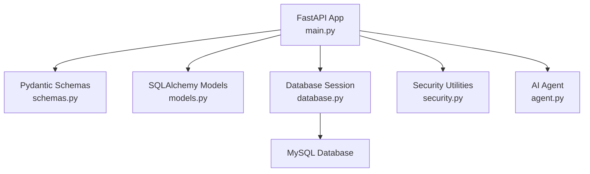
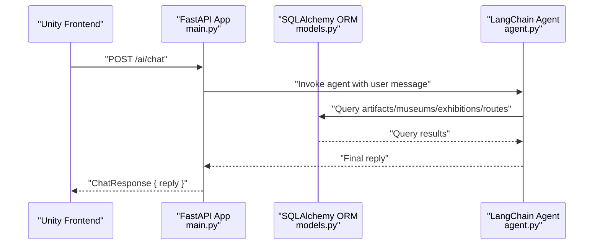
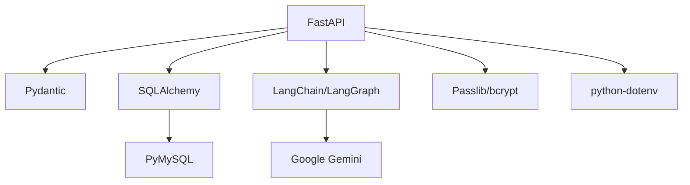

# API Reference

<cite>
**Referenced Files in This Document**
- [main.py](file://main.py)
- [schemas.py](file://schemas.py)
- [models.py](file://models.py)
- [database.py](file://database.py)
- [security.py](file://security.py)
- [agent.py](file://agent.py)
- [README.md](file://README.md)
- [requirements.txt](file://requirements.txt)
</cite>

## Table of Contents
1. [Introduction](#introduction)
2. [Project Structure](#project-structure)
3. [Core Components](#core-components)
4. [Architecture Overview](#architecture-overview)
5. [Detailed Component Analysis](#detailed-component-analysis)
6. [Dependency Analysis](#dependency-analysis)
7. [Performance Considerations](#performance-considerations)
8. [Troubleshooting Guide](#troubleshooting-guide)
9. [Conclusion](#conclusion)
10. [Appendices](#appendices)

## Introduction
This document provides comprehensive API documentation for the MuseAmigo Backend. It covers all backend endpoints, including authentication, museum management, artifact discovery, collections, navigation, achievements, ticket management, and the AI chat assistant. For each endpoint, you will find HTTP methods, URL patterns, request/response schemas using Pydantic models, authentication requirements, error codes, and practical usage examples. Integration patterns with the Unity frontend are included, along with rate limiting, CORS configuration, and security considerations.

## Project Structure
The backend is built with FastAPI and uses SQLAlchemy ORM for database operations. The project includes:
- Application entry and routing: main.py
- Pydantic models for request/response schemas: schemas.py
- SQLAlchemy models for database tables: models.py
- Database configuration and session management: database.py
- Password hashing utilities: security.py
- AI agent for chat assistance: agent.py
- Project documentation and deployment notes: README.md
- Dependencies: requirements.txt

**Diagram sources**
- [main.py:15-23](file://main.py#L15-L23)
- [schemas.py:1-137](file://schemas.py#L1-L137)
- [models.py:1-105](file://models.py#L1-L105)
- [database.py:18-38](file://database.py#L18-L38)
- [security.py:1-12](file://security.py#L1-L12)
- [agent.py:105-105](file://agent.py#L105-L105)

**Section sources**
- [main.py:15-23](file://main.py#L15-L23)
- [schemas.py:1-137](file://schemas.py#L1-L137)
- [models.py:1-105](file://models.py#L1-L105)
- [database.py:18-38](file://database.py#L18-L38)
- [security.py:1-12](file://security.py#L1-L12)
- [agent.py:105-105](file://agent.py#L105-L105)

## Core Components
- Authentication endpoints: register, login, update user settings
- Museum management: list museums
- Artifact discovery: retrieve artifact by code
- Collections: add artifact to user collection
- Exhibitions: list exhibitions for a museum
- Navigation: list routes for a museum
- Achievements: calculate user progress and reset museum-specific achievements
- Ticket management: purchase virtual tickets with QR code generation
- AI chat assistant: natural language queries with tool-augmented agent

**Section sources**
- [main.py:538-601](file://main.py#L538-L601)
- [main.py:604-632](file://main.py#L604-L632)
- [main.py:634-661](file://main.py#L634-L661)
- [main.py:664-667](file://main.py#L664-L667)
- [main.py:697-700](file://main.py#L697-L700)
- [main.py:738-844](file://main.py#L738-L844)
- [main.py:670-694](file://main.py#L670-L694)
- [main.py:870-897](file://main.py#L870-L897)

## Architecture Overview
The backend exposes REST endpoints via FastAPI. Requests are validated using Pydantic models, processed by SQLAlchemy ORM, and responses are serialized back to JSON. The AI chat assistant integrates a LangChain agent with Google Gemini to answer queries using database tools.

**Diagram sources**
- [main.py:870-897](file://main.py#L870-L897)
- [agent.py:17-105](file://agent.py#L17-L105)
- [models.py:27-105](file://models.py#L27-L105)

## Detailed Component Analysis

### Authentication Endpoints
- Register
  - Method: POST
  - URL: /auth/register
  - Request schema: UserCreate
  - Response schema: UserResponse
  - Validation:
    - Full name required
    - Email unique constraint enforced at DB level
    - Password minimum length 6
  - Errors:
    - 400: Username required, Password required, Password too short, Duplicate email
    - 500: Internal server error
  - Practical usage:
    - Unity sends UserCreate payload; receives UserResponse without sensitive fields.

- Login
  - Method: POST
  - URL: /auth/login
  - Request schema: UserLogin
  - Response: JSON with success message, user_id, and full_name
  - Validation:
    - Email and password required
    - Plain text comparison (passwords stored as plain text in current implementation)
  - Errors:
    - 404: Invalid credentials
    - 400: Account incomplete
  - Practical usage:
    - Unity sends UserLogin; receives success payload for session initialization.

- Update User Settings
  - Method: PUT
  - URL: /users/{user_id}/settings
  - Request schema: UserSettingsUpdate
  - Response schema: UserResponse
  - Errors:
    - 404: User not found
  - Practical usage:
    - Unity updates theme/language; receives updated UserResponse.

**Section sources**
- [main.py:538-568](file://main.py#L538-L568)
- [main.py:569-601](file://main.py#L569-L601)
- [main.py:846-867](file://main.py#L846-L867)
- [schemas.py:4-23](file://schemas.py#L4-L23)
- [schemas.py:127-130](file://schemas.py#L127-L130)
- [schemas.py:10-17](file://schemas.py#L10-L17)

### Museum Management Endpoints
- List Museums
  - Method: GET
  - URL: /museums
  - Response schema: list of MuseumResponse
  - Practical usage:
    - Unity loads museum list for navigation and ticket purchase.

**Section sources**
- [main.py:604-607](file://main.py#L604-L607)
- [schemas.py:24-35](file://schemas.py#L24-L35)

### Artifact Discovery Endpoints
- Retrieve Artifact by Code
  - Method: GET
  - URL: /artifacts/{artifact_code}
  - Path parameter: artifact_code (string)
  - Response schema: ArtifactResponse
  - Behavior:
    - Case-insensitive exact match
    - Fallback to partial match removing spaces
  - Errors:
    - 404: Artifact not found with suggested codes
  - Practical usage:
    - Unity passes scanned QR code; receives artifact details including 3D prefab name and audio asset.

**Section sources**
- [main.py:610-632](file://main.py#L610-L632)
- [schemas.py:36-49](file://schemas.py#L36-L49)

### Collection Management Endpoints
- Add Artifact to Collection
  - Method: POST
  - URL: /collections
  - Request schema: CollectionCreate
  - Response schema: CollectionResponse
  - Behavior:
    - Prevents duplicate entries for the same user-artifact pair
  - Errors:
    - 400: Artifact already unlocked in collection
  - Practical usage:
    - Unity triggers after artifact discovery; stores unlock event.

**Section sources**
- [main.py:634-661](file://main.py#L634-L661)
- [schemas.py:51-63](file://schemas.py#L51-L63)

### Navigation Endpoints
- List Exhibitions for a Museum
  - Method: GET
  - URL: /museums/{museum_id}/exhibitions
  - Path parameter: museum_id (int)
  - Response schema: list of ExhibitionResponse
  - Practical usage:
    - Unity displays exhibitions for selected museum.

- List Routes for a Museum
  - Method: GET
  - URL: /museums/{museum_id}/routes
  - Path parameter: museum_id (int)
  - Response schema: list of RouteResponse
  - Practical usage:
    - Unity shows guided tour options.

**Section sources**
- [main.py:664-667](file://main.py#L664-L667)
- [main.py:697-700](file://main.py#L697-L700)
- [schemas.py:65-73](file://schemas.py#L65-L73)
- [schemas.py:94-103](file://schemas.py#L94-L103)

### Achievement Endpoints
- Get Achievements for a Route
  - Method: GET
  - URL: /museums/{museum_id}/routes/{route_id}/achievements
  - Path parameters: museum_id (int), route_id (int)
  - Response: JSON with route_id, museum_id, and achievements list
  - Practical usage:
    - Unity shows achievable goals for a route.

- Reset Museum Achievements for a User
  - Method: POST
  - URL: /users/{user_id}/achievements/reset/{museum_id}
  - Path parameters: user_id (int), museum_id (int)
  - Response: JSON success message
  - Practical usage:
    - Unity allows resetting progress for a museum.

- Calculate User Achievements
  - Method: GET
  - URL: /users/{user_id}/achievements
  - Path parameter: user_id (int)
  - Response: JSON with user_id, total_points, unlocked_count, and achievements list
  - Calculation logic:
    - Global and museum-specific requirements
    - Scan counts, museum visits, area completion
    - Auto-completes achievements meeting criteria
  - Practical usage:
    - Unity displays user progress and points.

**Section sources**
- [main.py:703-722](file://main.py#L703-L722)
- [main.py:725-735](file://main.py#L725-L735)
- [main.py:738-844](file://main.py#L738-L844)
- [schemas.py:104-115](file://schemas.py#L104-L115)
- [schemas.py:116-126](file://schemas.py#L116-L126)

### Ticket Management Endpoints
- Purchase Ticket and Generate QR Code
  - Method: POST
  - URL: /tickets/purchase
  - Request schema: TicketCreate
  - Response schema: TicketResponse
  - Behavior:
    - Generates unique QR code in format: MUSEUM-{museum_id}-USER-{user_id}-{8-char-hex}
    - Records purchase date as today’s date
  - Practical usage:
    - Unity triggers after payment; receives ticket with QR code for entrance.

**Section sources**
- [main.py:670-694](file://main.py#L670-L694)
- [schemas.py:75-93](file://schemas.py#L75-L93)

### AI Chat Assistant Endpoints
- Chat with Ogima
  - Method: POST
  - URL: /ai/chat
  - Request schema: ChatRequest
  - Response schema: ChatResponse
  - Behavior:
    - Uses LangChain agent with Google Gemini
    - Tools: get_artifact_details, get_museum_info, get_exhibitions, get_routes
    - Returns final AI reply
  - Errors:
    - 500: Internal error if agent fails
  - Practical usage:
    - Unity sends user message; receives natural language reply.

**Section sources**
- [main.py:870-897](file://main.py#L870-L897)
- [agent.py:17-105](file://agent.py#L17-L105)
- [schemas.py:132-137](file://schemas.py#L132-L137)

## Dependency Analysis
Key dependencies and their roles:
- FastAPI: Web framework for routing and request/response handling
- SQLAlchemy: ORM for database models and queries
- Pydantic: Data validation and serialization
- passlib/bcrypt: Password hashing utilities
- langchain/langgraph/google-genai: AI agent and tool integration
- PyMySQL: MySQL driver
- python-dotenv: Environment variable loading

**Diagram sources**
- [requirements.txt:12-59](file://requirements.txt#L12-L59)
- [database.py:18-38](file://database.py#L18-L38)
- [security.py:1-12](file://security.py#L1-L12)
- [agent.py:94-105](file://agent.py#L94-L105)

**Section sources**
- [requirements.txt:12-59](file://requirements.txt#L12-L59)
- [database.py:18-38](file://database.py#L18-L38)
- [security.py:1-12](file://security.py#L1-L12)
- [agent.py:94-105](file://agent.py#L94-L105)

## Performance Considerations
- Database connection pooling:
  - Pool size: 10
  - Max overflow: 20
  - Pre-ping enabled
  - Recycle connections hourly
- Startup seeding:
  - On startup, migrations and seed data are executed to ensure schema and initial data consistency.
- AI agent:
  - Tool-based queries may introduce latency; consider caching frequent responses or optimizing tool queries.

[No sources needed since this section provides general guidance]

## Troubleshooting Guide
- CORS configuration:
  - Origins allowed: all (*)
  - Credentials disabled
  - Methods and headers allowed: all
- Rate limiting:
  - Not configured in the current implementation.
- Security considerations:
  - Passwords are stored as plain text in the current implementation; consider integrating bcrypt via security utilities.
  - Ensure environment variables (DATABASE_URL, GOOGLE_API_KEY) are set securely.
- Common errors:
  - 400 Bad Request: Validation failures (missing fields, duplicates, invalid input)
  - 404 Not Found: Resource not found (e.g., artifact code)
  - 500 Internal Server Error: Server-side exceptions (e.g., AI agent failure)

**Section sources**
- [main.py:17-23](file://main.py#L17-L23)
- [database.py:12-24](file://database.py#L12-L24)
- [main.py:560-567](file://main.py#L560-L567)
- [main.py:627-631](file://main.py#L627-L631)
- [main.py:895-897](file://main.py#L895-L897)

## Conclusion
This API reference documents all MuseAmigo Backend endpoints, their schemas, and integration patterns with Unity. It highlights current limitations (e.g., plain text passwords, lack of rate limiting) and provides actionable guidance for secure and scalable deployment.

[No sources needed since this section summarizes without analyzing specific files]

## Appendices

### Data Models Overview

```mermaid
erDiagram
USERS {
int id PK
string full_name
string email UK
string hashed_password
boolean is_active
string theme
string language
}
MUSEUMS {
int id PK
string name
string operating_hours
int base_ticket_price
float latitude
float longitude
}
ARTIFACTS {
int id PK
string artifact_code UK
string title
string year
string description
boolean is_3d_available
string unity_prefab_name
string audio_asset
int museum_id FK
}
COLLECTIONS {
int id PK
int user_id FK
int artifact_id FK
}
EXHIBITIONS {
int id PK
string name
string location
int museum_id FK
}
TICKETS {
int id PK
string ticket_type
string purchase_date
string qr_code UK
boolean is_used
int user_id FK
int museum_id FK
}
ROUTES {
int id PK
string name
string estimated_time
int stops_count
int museum_id FK
}
ACHIEVEMENTS {
int id PK
string name
string description
string requirement_type
int requirement_value
int points
int museum_id FK
}
USER_ACHIEVEMENTS {
int id PK
int user_id FK
int achievement_id FK
int museum_id FK
boolean is_completed
string completed_at
}
USERS ||--o{ COLLECTIONS : "owns"
USERS ||--o{ TICKETS : "purchases"
MUSEUMS ||--o{ ARTIFACTS : "contains"
MUSEUMS ||--o{ EXHIBITIONS : "hosts"
MUSEUMS ||--o{ ROUTES : "offers"
MUSEUMS ||--o{ ACHIEVEMENTS : "defines"
USERS ||--o{ USER_ACHIEVEMENTS : "earns"
ACHIEVEMENTS ||--o{ USER_ACHIEVEMENTS : "awarded_for"
```

**Diagram sources**
- [models.py:4-105](file://models.py#L4-L105)

### Unity Integration Patterns
- Base URL configuration:
  - Use HTTPS for production deployments.
- Example request to fetch artifacts:
  - GET /artifacts
  - Parse JSON response into Unity structs.
- AI chat:
  - POST /ai/chat with message payload; handle reply string.

**Section sources**
- [README.md:50-95](file://README.md#L50-L95)