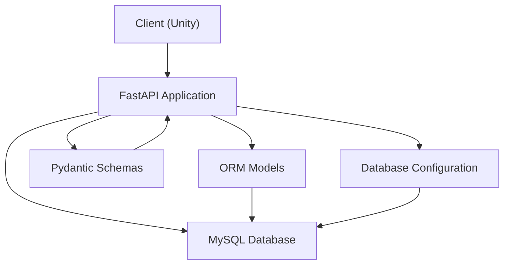
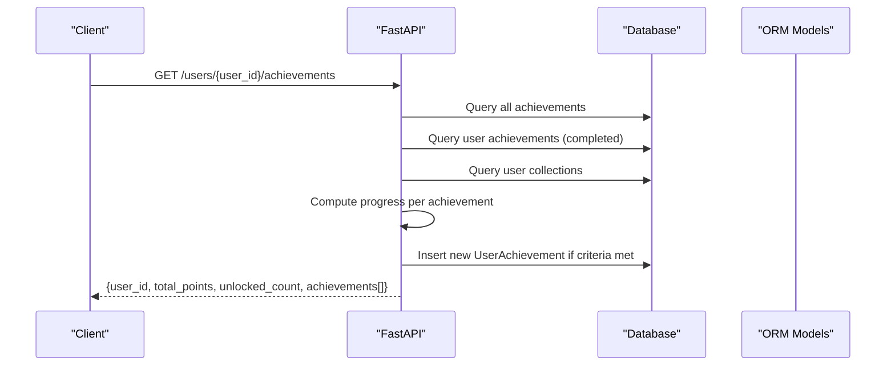
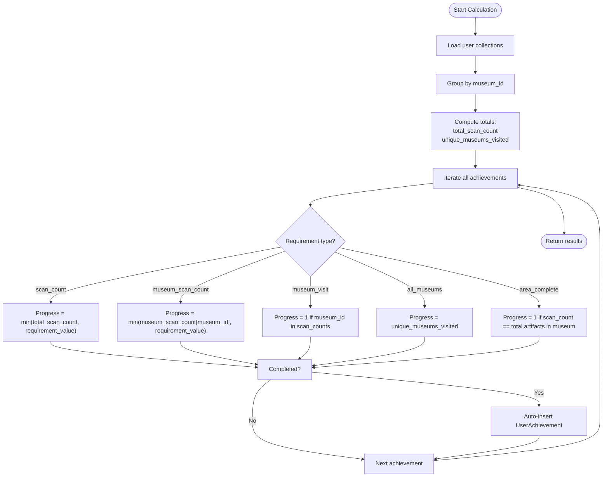
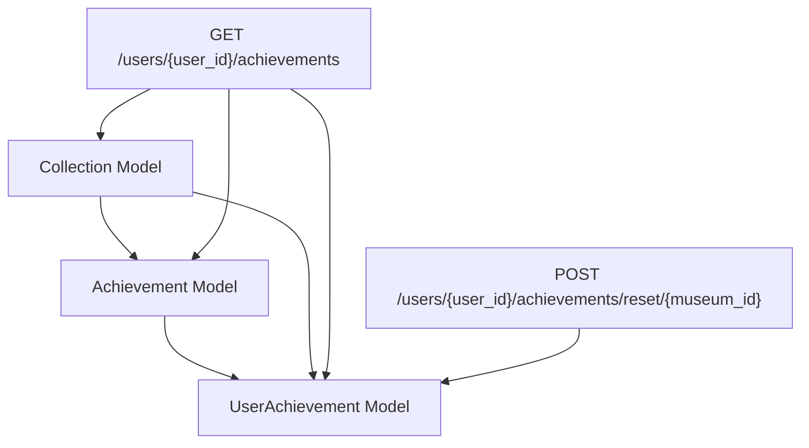
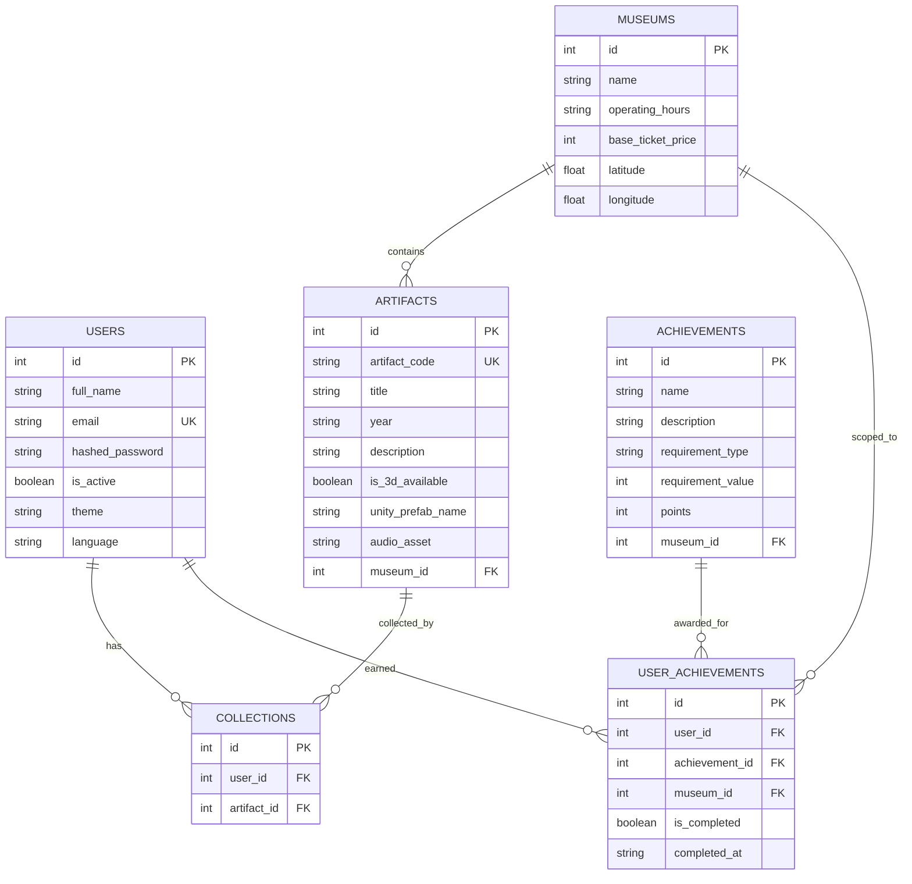

# Achievement System Endpoints

<cite>
**Referenced Files in This Document**
- [main.py](file://main.py)
- [models.py](file://models.py)
- [schemas.py](file://schemas.py)
- [database.py](file://database.py)
- [README.md](file://README.md)
</cite>

## Table of Contents
1. [Introduction](#introduction)
2. [Project Structure](#project-structure)
3. [Core Components](#core-components)
4. [Architecture Overview](#architecture-overview)
5. [Detailed Component Analysis](#detailed-component-analysis)
6. [Dependency Analysis](#dependency-analysis)
7. [Performance Considerations](#performance-considerations)
8. [Troubleshooting Guide](#troubleshooting-guide)
9. [Conclusion](#conclusion)
10. [Appendices](#appendices)

## Introduction
This document provides comprehensive API documentation for the achievement system endpoints, focusing on the GET /users/{user_id}/achievements endpoint. It explains how user achievements are calculated and retrieved, including progress computation for scan_count, museum_scan_count, museum_visit, and all_museums requirements. It also documents achievement types, point systems, completion tracking, and the relationship between user collections and achievement unlocking. Practical examples illustrate achievement calculation algorithms, progress monitoring, and integration with the gamification system.

## Project Structure
The achievement system is implemented as part of a FastAPI backend serving a museum discovery application. Key components include:
- API endpoints for user achievements and route-based achievements
- Data models for achievements and user progress
- Schemas for request/response serialization
- Database configuration and session management

**Diagram sources**
- [main.py:15-23](file://main.py#L15-L23)
- [database.py:18-24](file://database.py#L18-L24)
- [models.py:86-105](file://models.py#L86-L105)
- [schemas.py:104-126](file://schemas.py#L104-L126)

**Section sources**
- [main.py:15-23](file://main.py#L15-L23)
- [database.py:18-24](file://database.py#L18-L24)
- [models.py:86-105](file://models.py#L86-L105)
- [schemas.py:104-126](file://schemas.py#L104-L126)

## Core Components
- Achievement model: Defines achievement metadata, requirements, points, and scope (global or museum-specific).
- UserAchievement model: Tracks user progress and completion status for each achievement.
- Collection model: Links user scans to artifacts, forming the basis for progress calculations.
- API endpoints:
  - GET /users/{user_id}/achievements: Calculates and retrieves user achievements with progress and points.
  - GET /museums/{museum_id}/routes/{route_id}/achievements: Retrieves achievements associated with a route.
  - POST /users/{user_id}/achievements/reset/{museum_id}: Resets user achievements for a specific museum.

Key implementation references:
- Achievement seeding and requirements: [seed_achievements:352-489](file://main.py#L352-L489)
- Route achievements endpoint: [get_route_achievements:702-722](file://main.py#L702-L722)
- User achievements endpoint: [get_user_achievements:738-844](file://main.py#L738-L844)
- Achievement model definition: [Achievement:86-95](file://models.py#L86-L95)
- UserAchievement model definition: [UserAchievement:97-105](file://models.py#L97-L105)
- Collection model definition: [Collection:43-51](file://models.py#L43-L51)

**Section sources**
- [main.py:352-489](file://main.py#L352-L489)
- [main.py:702-722](file://main.py#L702-L722)
- [main.py:738-844](file://main.py#L738-L844)
- [models.py:43-51](file://models.py#L43-L51)
- [models.py:86-95](file://models.py#L86-L95)
- [models.py:97-105](file://models.py#L97-L105)

## Architecture Overview
The achievement system integrates with the broader application by:
- Using user collections as the primary data source for progress
- Calculating progress against achievement requirements
- Automatically awarding achievements upon meeting thresholds
- Returning cumulative points and unlock counts

**Diagram sources**
- [main.py:738-844](file://main.py#L738-L844)
- [models.py:86-105](file://models.py#L86-L105)

## Detailed Component Analysis

### GET /users/{user_id}/achievements
Purpose:
- Calculate and retrieve user achievements with progress and points.
- Auto-complete achievements when requirements are met.
- Aggregate total points and unlocked artifact count.

Processing logic:
- Retrieve all available achievements and user-completed achievements.
- Build a set of user collections (scanned artifacts).
- Compute:
  - Total scan count across all artifacts.
  - Scan count per museum.
  - Unique museums visited.
- For each achievement:
  - Determine progress based on requirement type.
  - Mark as completed if threshold reached.
  - Auto-insert UserAchievement record if newly completed.
- Return structured response with user totals and achievement details.

Requirement types and progress calculation:
- scan_count:
  - Progress = min(total_scan_count, requirement_value)
  - Completed when total_scan_count >= requirement_value
- museum_scan_count:
  - Progress = min(museum_scan_count[museum_id], requirement_value)
  - Completed when museum_scan_count[museum_id] >= requirement_value
- museum_visit:
  - Progress = 1 if user has scanned any artifact at museum_id
  - Completed immediately upon first visit
- all_museums:
  - Progress = unique_museums_visited
  - Completed when unique_museums_visited >= requirement_value
- area_complete:
  - Progress = 1 if user has scanned all artifacts in any single museum
  - Completed when scan count equals total artifacts in that museum

Points and completion tracking:
- Points are summed from completed achievements.
- Completion date is recorded when an achievement is auto-unlocked.

Response structure:
- user_id: integer
- total_points: integer
- unlocked_count: integer (total scan count)
- achievements[]: array of achievement objects with:
  - id, name, description, requirement_type, requirement_value, points, museum_id
  - is_completed: boolean
  - progress: integer

Integration with gamification:
- Achievement points contribute to a cumulative score.
- Unlock notifications are provided via is_completed flag and progress percentage.

Practical examples:
- Example 1: User scans 3 artifacts at Independence Palace (museum_id=1).
  - Progress for “Palace Explorer” (requirement_type=museum_scan_count, requirement_value=3) becomes 3 and completes.
  - Achievement “Presidential History” (museum_visit) completes with progress=1.
- Example 2: User visits all 4 museums.
  - Progress for “Museum Champion” (all_museums, requirement_value=4) becomes 4 and completes.
- Example 3: User scans all artifacts in one museum.
  - Progress for “Dynasty Master” (area_complete) becomes 1 and completes.

**Section sources**
- [main.py:738-844](file://main.py#L738-L844)
- [models.py:86-105](file://models.py#L86-L105)

### Achievement Types and Point Systems
Achievement categories and examples seeded in the system:
- Global achievements (museum_id=None):
  - First Steps: scan_count=1, points=50
  - Artifact Collector: scan_count=5, points=100
  - Museum Explorer: scan_count=10, points=200
  - History Hunter: scan_count=20, points=300
  - Artifact Master: scan_count=50, points=500
  - Dynasty Master: area_complete, points=400
  - Museum Champion: all_museums=4, points=600
- Museum-specific achievements:
  - Visit a specific museum (museum_visit=1) with points ranging from 100
  - Scan a fixed number of artifacts at a museum (museum_scan_count) with points ranging from 150

Requirement types:
- scan_count: Total artifacts discovered by the user
- museum_scan_count: Artifacts discovered at a specific museum
- museum_visit: Visited a specific museum (at least one artifact scanned)
- all_museums: Number of distinct museums visited
- area_complete: Discovered all artifacts in a single museum

Point allocation:
- Points are defined per achievement and summed for completed achievements.

**Section sources**
- [main.py:352-489](file://main.py#L352-L489)
- [models.py:86-95](file://models.py#L86-L95)

### Relationship Between Collections and Achievement Unlocking
User collections form the foundation of progress calculation:
- Collections link user_id to artifact_id.
- Progress metrics are derived from collections:
  - total_scan_count: number of collections
  - museum_scan_counts: grouped by artifact.museum_id
  - unique_museums_visited: distinct museum_id values
- Achievement unlocking occurs when computed progress meets or exceeds requirement_value.

**Diagram sources**
- [main.py:738-844](file://main.py#L738-L844)
- [models.py:43-51](file://models.py#L43-L51)

**Section sources**
- [main.py:738-844](file://main.py#L738-L844)
- [models.py:43-51](file://models.py#L43-L51)

### GET /museums/{museum_id}/routes/{route_id}/achievements
Purpose:
- Retrieve achievements scoped to a specific museum or global achievements.

Behavior:
- Filters achievements where museum_id equals the route’s museum or is null (global).
- Returns a simplified list of achievement identifiers and points.

Response structure:
- route_id: integer
- museum_id: integer
- achievements[]: array of achievement objects with:
  - id, name, description, points

**Section sources**
- [main.py:702-722](file://main.py#L702-L722)

### POST /users/{user_id}/achievements/reset/{museum_id}
Purpose:
- Reset user achievements for a specific museum.

Behavior:
- Deletes all UserAchievement records linked to the user and museum.
- Commits transaction and returns a confirmation message.

**Section sources**
- [main.py:724-735](file://main.py#L724-L735)

## Dependency Analysis
Achievement system dependencies:
- Database models:
  - Achievement: defines requirement_type, requirement_value, points, and museum_id
  - UserAchievement: tracks completion and date
  - Collection: links user scans to artifacts
- API endpoints depend on:
  - Database queries for achievements, user achievements, and collections
  - Computation of progress metrics from collections
  - Conditional insertion of UserAchievement when criteria are met

**Diagram sources**
- [models.py:43-51](file://models.py#L43-L51)
- [models.py:86-105](file://models.py#L86-L105)
- [main.py:738-844](file://main.py#L738-L844)
- [main.py:724-735](file://main.py#L724-L735)

**Section sources**
- [models.py:43-51](file://models.py#L43-L51)
- [models.py:86-105](file://models.py#L86-L105)
- [main.py:738-844](file://main.py#L738-L844)
- [main.py:724-735](file://main.py#L724-L735)

## Performance Considerations
- Query efficiency:
  - Single pass over collections to compute museum_scan_counts and unique_museums_visited.
  - Achievement iteration computes progress per achievement; keep achievement lists bounded.
- Auto-completion:
  - New UserAchievement insertions occur only when criteria are met; ensure indexes on foreign keys.
- Database tuning:
  - Connection pooling and pre-ping configured for reliability.
  - Consider indexing on user_id, achievement_id, and museum_id for frequent joins.

[No sources needed since this section provides general guidance]

## Troubleshooting Guide
Common issues and resolutions:
- Achievement not unlocking:
  - Verify user has sufficient scans for the requirement type.
  - Confirm requirement_value alignment with progress calculation.
- Incorrect progress values:
  - Check that collections are correctly inserted and artifact.museum_id is set.
  - Validate that scan_count and unique_museums_visited are computed from collections.
- Duplicate achievement entries:
  - Auto-completion inserts only when achievement is not already present.
- Reset not working:
  - Ensure correct user_id and museum_id are passed to reset endpoint.

**Section sources**
- [main.py:738-844](file://main.py#L738-L844)
- [main.py:724-735](file://main.py#L724-L735)

## Conclusion
The achievement system provides a robust, scalable mechanism for gamifying the museum experience. By basing progress on user collections, it ensures accurate tracking of discovery milestones. The endpoint returns comprehensive progress and points, enabling seamless integration with frontend experiences. Automatic achievement unlocking simplifies UX while maintaining fairness and transparency.

[No sources needed since this section summarizes without analyzing specific files]

## Appendices

### API Definition: GET /users/{user_id}/achievements
- Method: GET
- Path: /users/{user_id}/achievements
- Description: Calculates and retrieves user achievements with progress and points.
- Path parameters:
  - user_id: integer
- Response body:
  - user_id: integer
  - total_points: integer
  - unlocked_count: integer
  - achievements[]: array of achievement objects with:
    - id: integer
    - name: string
    - description: string
    - requirement_type: string
    - requirement_value: integer
    - points: integer
    - museum_id: integer or null
    - is_completed: boolean
    - progress: integer

**Section sources**
- [main.py:738-844](file://main.py#L738-L844)

### Achievement Requirement Types Reference
- scan_count: Total artifacts discovered by the user
- museum_scan_count: Artifacts discovered at a specific museum
- museum_visit: Visited a specific museum (at least one artifact scanned)
- all_museums: Number of distinct museums visited
- area_complete: Discovered all artifacts in a single museum

**Section sources**
- [main.py:738-844](file://main.py#L738-L844)
- [models.py:86-95](file://models.py#L86-L95)

### Database Schema Overview

**Diagram sources**
- [models.py:4-15](file://models.py#L4-L15)
- [models.py:16-26](file://models.py#L16-L26)
- [models.py:27-43](file://models.py#L27-L43)
- [models.py:43-51](file://models.py#L43-L51)
- [models.py:86-95](file://models.py#L86-L95)
- [models.py:97-105](file://models.py#L97-L105)