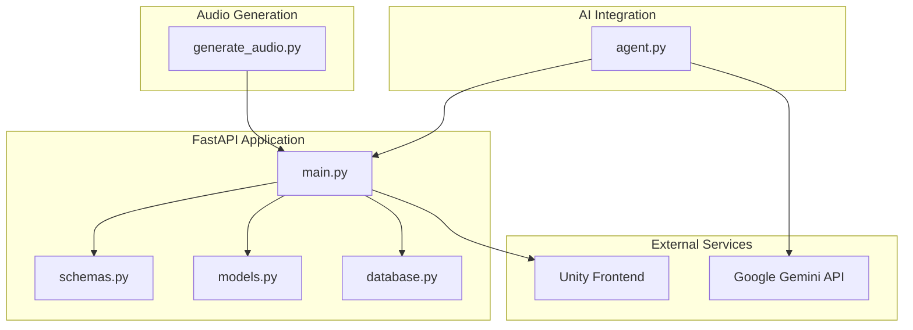
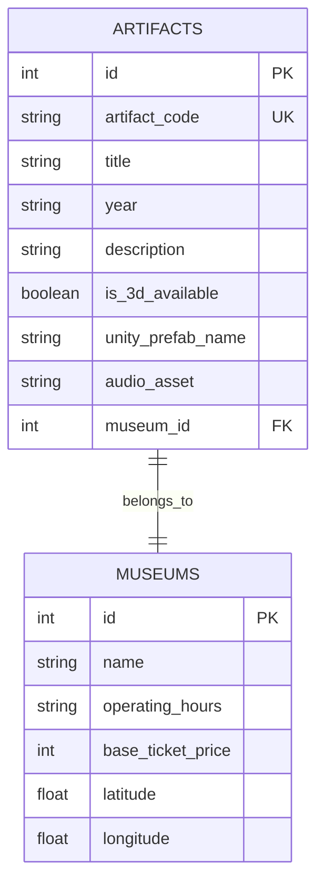
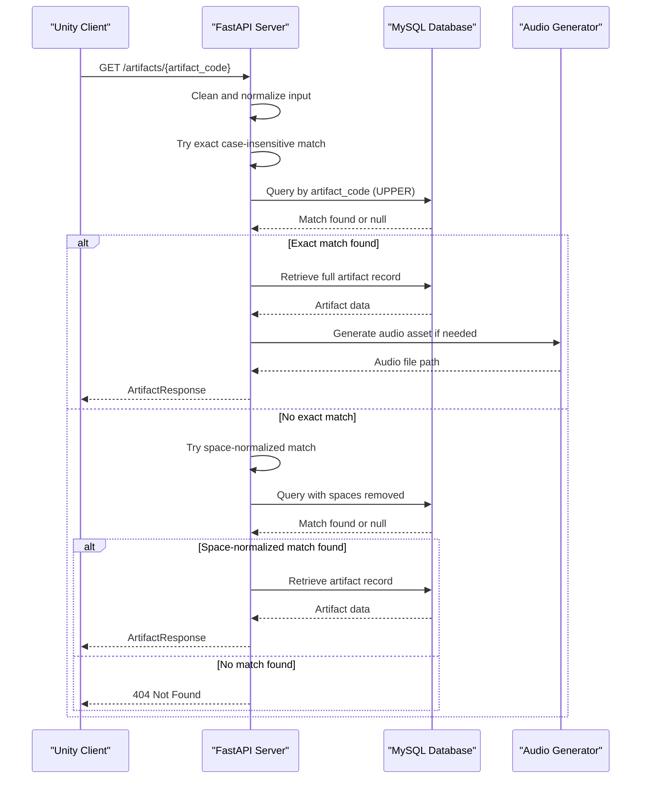
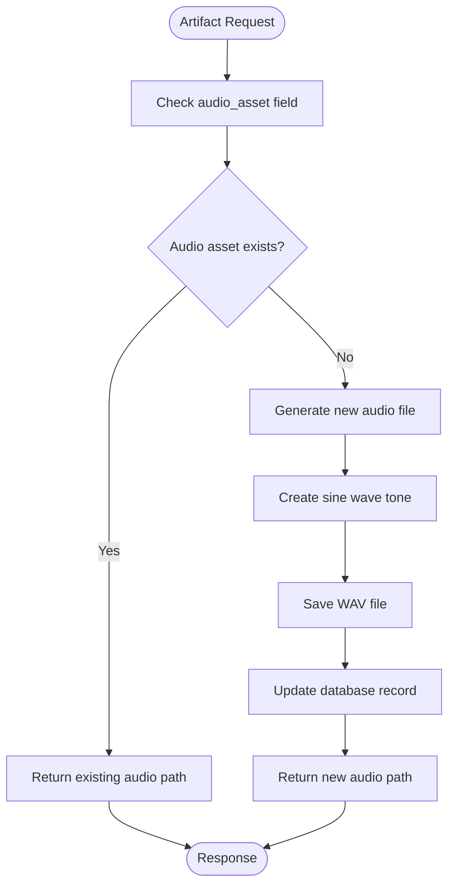
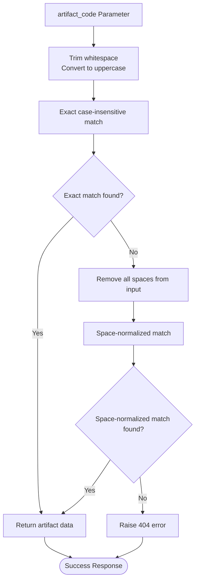
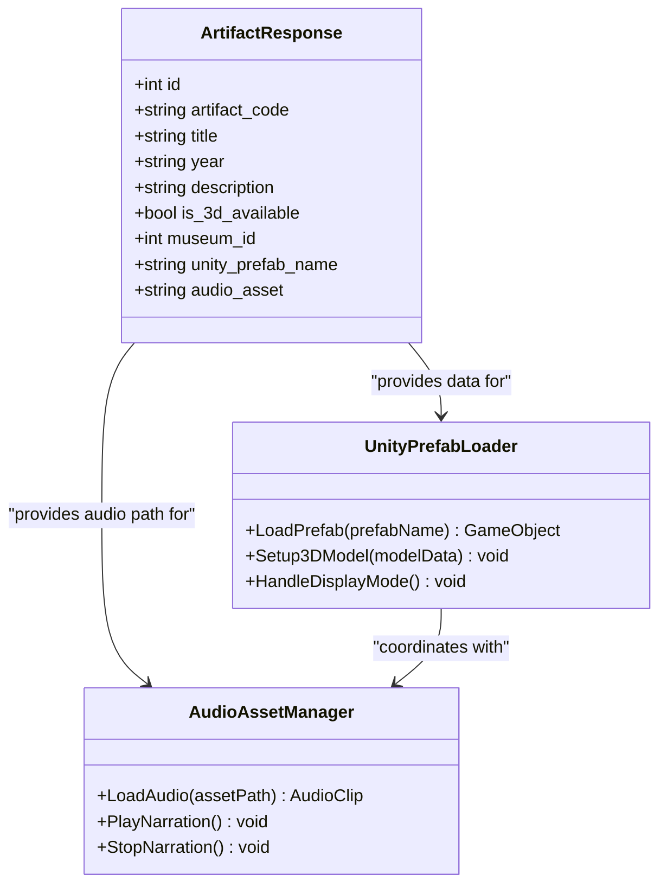
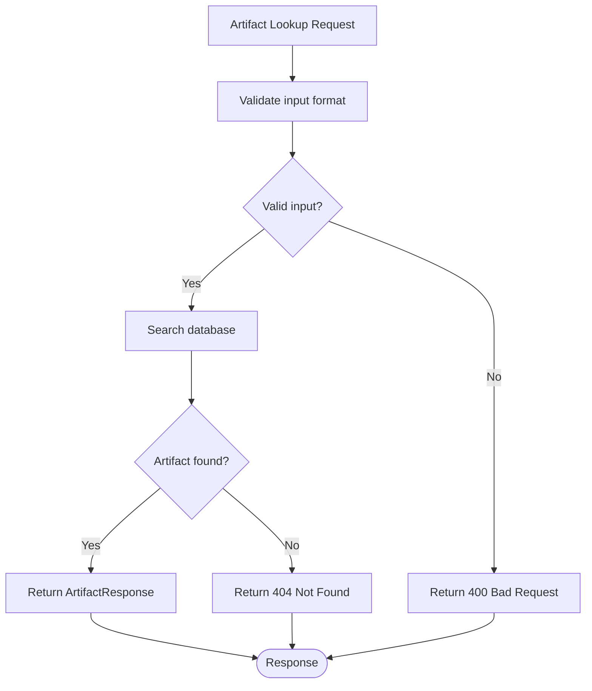
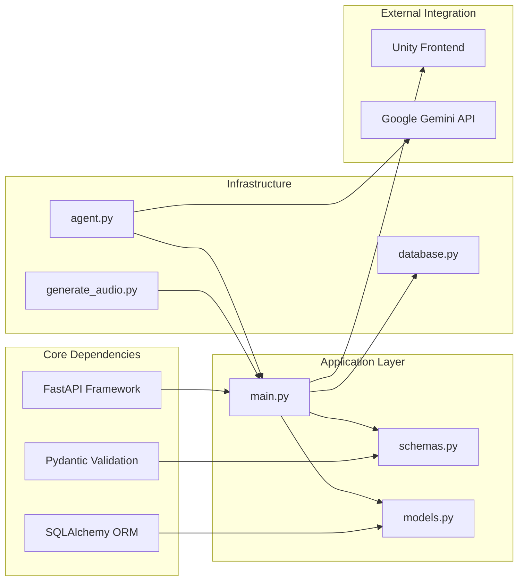
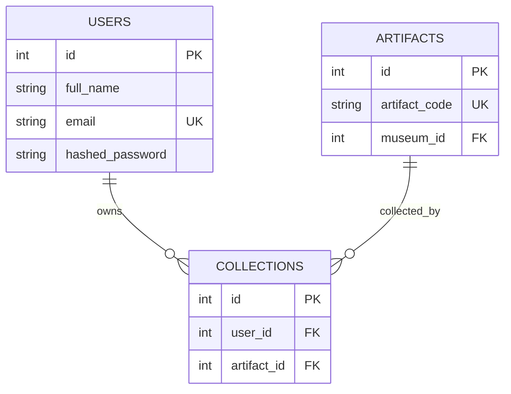

# Artifact Discovery Endpoints

<cite>
**Referenced Files in This Document**
- [main.py](file://main.py)
- [schemas.py](file://schemas.py)
- [models.py](file://models.py)
- [database.py](file://database.py)
- [README.md](file://README.md)
- [generate_audio.py](file://generate_audio.py)
- [agent.py](file://agent.py)
</cite>

## Table of Contents
1. [Introduction](#introduction)
2. [Project Structure](#project-structure)
3. [Core Components](#core-components)
4. [Architecture Overview](#architecture-overview)
5. [Detailed Component Analysis](#detailed-component-analysis)
6. [Dependency Analysis](#dependency-analysis)
7. [Performance Considerations](#performance-considerations)
8. [Troubleshooting Guide](#troubleshooting-guide)
9. [Conclusion](#conclusion)

## Introduction
This document provides comprehensive API documentation for the artifact discovery endpoints, focusing on the GET `/artifacts/{artifact_code}` endpoint that enables QR code scanning workflows. The endpoint retrieves artifact details with support for case-insensitive matching and flexible space handling for artifact codes. It integrates seamlessly with the Unity frontend's artifact display system and includes audio asset generation capabilities.

The MuseAmigo project is a museum interaction platform built with FastAPI, MySQL, and integrated with Google Gemini AI for contextual assistance. The artifact discovery system serves as the core mechanism for visitors to explore museum collections through QR code interactions.

## Project Structure
The backend follows a modular FastAPI architecture with clear separation of concerns:



**Diagram sources**
- [main.py:15-23](file://main.py#L15-L23)
- [schemas.py:1-137](file://schemas.py#L1-L137)
- [models.py:1-105](file://models.py#L1-L105)
- [database.py:1-38](file://database.py#L1-L38)

**Section sources**
- [main.py:15-23](file://main.py#L15-L23)
- [schemas.py:1-137](file://schemas.py#L1-L137)
- [models.py:1-105](file://models.py#L1-L105)
- [database.py:1-38](file://database.py#L1-L38)

## Core Components

### ArtifactResponse Schema
The artifact response schema defines the standardized data structure returned by the discovery endpoint:

| Field | Type | Description | Required |
|-------|------|-------------|----------|
| id | integer | Unique identifier for the artifact | Yes |
| artifact_code | string | QR code identifier (case-insensitive) | Yes |
| title | string | Artifact name/title | Yes |
| year | string | Historical period/year | Yes |
| description | string | Detailed artifact description | Yes |
| is_3d_available | boolean | 3D model availability flag | Yes |
| museum_id | integer | Associated museum identifier | Yes |
| unity_prefab_name | string | Unity prefab reference for 3D models | Conditional |
| audio_asset | string | Audio asset path for narration | Optional |

**Section sources**
- [schemas.py:36-48](file://schemas.py#L36-L48)
- [models.py:27-42](file://models.py#L27-L42)

### Database Model Integration
The artifact model maintains a direct relationship with the database schema, supporting both the discovery endpoint and Unity integration:



**Diagram sources**
- [models.py:27-42](file://models.py#L27-L42)
- [models.py:16-26](file://models.py#L16-L26)

**Section sources**
- [models.py:27-42](file://models.py#L27-L42)
- [models.py:16-26](file://models.py#L16-L26)

## Architecture Overview

### Artifact Discovery Workflow
The artifact discovery system implements a robust lookup mechanism supporting multiple input formats:



**Diagram sources**
- [main.py:609-632](file://main.py#L609-L632)
- [schemas.py:36-48](file://schemas.py#L36-L48)

### Audio Asset Generation Pipeline
The system includes automated audio asset generation for artifact descriptions:



**Diagram sources**
- [generate_audio.py:12-38](file://generate_audio.py#L12-L38)
- [generate_audio.py:41-77](file://generate_audio.py#L41-L77)

**Section sources**
- [main.py:609-632](file://main.py#L609-L632)
- [generate_audio.py:12-38](file://generate_audio.py#L12-L38)

## Detailed Component Analysis

### GET /artifacts/{artifact_code} Endpoint

#### Implementation Details
The artifact discovery endpoint implements sophisticated matching logic to handle various QR code input formats:



**Diagram sources**
- [main.py:611-632](file://main.py#L611-L632)

#### Response Schema Validation
The endpoint validates responses against the ArtifactResponse schema, ensuring consistent data delivery to Unity clients:

| Property | Validation | Purpose |
|----------|------------|---------|
| artifact_code | Case-insensitive match | QR code identification |
| title | String validation | Display name |
| year | String validation | Historical context |
| description | String validation | Detailed information |
| is_3d_available | Boolean validation | 3D model availability |
| unity_prefab_name | String validation | Unity prefab reference |
| audio_asset | String validation | Audio narration path |

**Section sources**
- [main.py:609-632](file://main.py#L609-L632)
- [schemas.py:36-48](file://schemas.py#L36-L48)

### Unity Frontend Integration

#### 3D Model Integration Patterns
The Unity frontend receives structured data enabling seamless 3D model loading:



**Diagram sources**
- [schemas.py:36-48](file://schemas.py#L36-L48)
- [models.py:37-40](file://models.py#L37-L40)

#### Audio Asset Generation
The system generates placeholder audio files for artifact descriptions:

| Audio File | Frequency | Duration | Purpose |
|------------|-----------|----------|---------|
| artifact_001.wav | 330 Hz (E note) | 3 seconds | Historical narration |
| artifact_002.wav | 494 Hz (B note) | 3 seconds | Museum guide voice |

**Section sources**
- [generate_audio.py:41-77](file://generate_audio.py#L41-L77)
- [models.py:39-40](file://models.py#L39-L40)

### Error Handling and Validation

#### Error Scenarios
The system implements comprehensive error handling for artifact lookup failures:



**Diagram sources**
- [main.py:626-630](file://main.py#L626-L630)

#### Practical Examples

##### QR Code Scanning Workflow
1. **Visitor scans QR code** at museum exhibit
2. **Unity client sends request** to `/artifacts/{artifact_code}`
3. **Server processes input** with case-insensitive matching
4. **Database query executes** with normalized artifact code
5. **Response returned** with complete artifact details
6. **Unity displays 3D model** if available
7. **Audio narration plays** for enhanced experience

##### Artifact Data Structure Examples
**Complete Artifact Record:**
```json
{
  "id": 1,
  "artifact_code": "IP-001",
  "title": "Presidential Desk",
  "year": "1960s",
  "description": "The original presidential desk used by President Nguyễn Văn Thiệu...",
  "is_3d_available": true,
  "museum_id": 1,
  "unity_prefab_name": "Model_Presidential_Desk",
  "audio_asset": "assets/audio/artifact_001.wav"
}
```

**Minimal Artifact Record:**
```json
{
  "id": 2,
  "artifact_code": "WRM-001",
  "title": "Guillotine",
  "year": "Early 1900s",
  "description": "A guillotine used during the French colonial period...",
  "is_3d_available": false,
  "museum_id": 2,
  "unity_prefab_name": "Model_Guillotine",
  "audio_asset": ""
}
```

**Section sources**
- [main.py:75-170](file://main.py#L75-L170)
- [schemas.py:36-48](file://schemas.py#L36-L48)

## Dependency Analysis

### Component Dependencies
The artifact discovery system relies on several interconnected components:



**Diagram sources**
- [main.py:1-10](file://main.py#L1-L10)
- [schemas.py:1-17](file://schemas.py#L1-L17)
- [models.py:1-2](file://models.py#L1-L2)
- [database.py:1-38](file://database.py#L1-L38)

### Database Relationship Management
The system maintains referential integrity through foreign key relationships:



**Diagram sources**
- [models.py:4-15](file://models.py#L4-L15)
- [models.py:43-51](file://models.py#L43-L51)

**Section sources**
- [models.py:4-15](file://models.py#L4-L15)
- [models.py:43-51](file://models.py#L43-L51)

## Performance Considerations

### Database Optimization
The artifact lookup implements efficient indexing strategies:

- **artifact_code**: Unique index for O(log n) lookups
- **artifact_code_upper**: Case-insensitive comparison using UPPER function
- **space-normalized**: Handles QR codes with embedded spaces

### Connection Pool Management
The database connection pool configuration ensures optimal performance:

| Parameter | Value | Purpose |
|-----------|--------|---------|
| pool_size | 10 | Concurrent connections |
| max_overflow | 20 | Additional connections when pool is full |
| pool_pre_ping | True | Validate connections before use |
| pool_recycle | 3600 | Recycle connections hourly |

### Caching Strategies
Consider implementing Redis caching for frequently accessed artifacts to reduce database load and improve response times for popular museum items.

## Troubleshooting Guide

### Common Issues and Solutions

#### 404 Not Found Errors
**Symptoms:** Artifact code not found despite correct input
**Causes:**
- Incorrect artifact code format
- Case sensitivity issues
- Spaces in QR code not handled
- Database synchronization delays

**Solutions:**
1. Verify artifact code format matches database entries
2. Ensure case-insensitive matching is working
3. Check for space-normalization functionality
4. Confirm database seeding completed successfully

#### Audio Asset Generation Failures
**Symptoms:** Missing audio assets or generation errors
**Causes:**
- File path permissions
- Directory creation failures
- Audio file corruption

**Solutions:**
1. Verify audio asset directory exists and is writable
2. Check file permissions for audio generation
3. Validate audio file integrity
4. Review generate_audio.py error handling

#### Unity Integration Issues
**Symptoms:** 3D models not displaying or audio not playing
**Causes:**
- Incorrect prefab names
- Missing audio asset paths
- Network connectivity issues
- CORS configuration problems

**Solutions:**
1. Validate unity_prefab_name matches Unity asset names
2. Check audio_asset paths are accessible
3. Verify network connectivity to API endpoints
4. Configure CORS middleware appropriately

**Section sources**
- [main.py:626-630](file://main.py#L626-L630)
- [generate_audio.py:40-77](file://generate_audio.py#L40-L77)
- [database.py:17-24](file://database.py#L17-L24)

## Conclusion

The artifact discovery endpoint provides a robust foundation for museum interaction through QR code scanning. Its sophisticated matching logic accommodates various QR code formats while maintaining data consistency through Pydantic validation. The integration with Unity enables immersive 3D experiences with synchronized audio narration.

Key strengths of the implementation include:
- Flexible artifact code matching (case-insensitive, space-handling)
- Comprehensive response schema validation
- Automated audio asset generation
- Seamless Unity frontend integration
- Scalable database design with proper indexing

Future enhancements could include caching mechanisms for improved performance, enhanced error logging for debugging, and expanded AI integration for contextual artifact information.