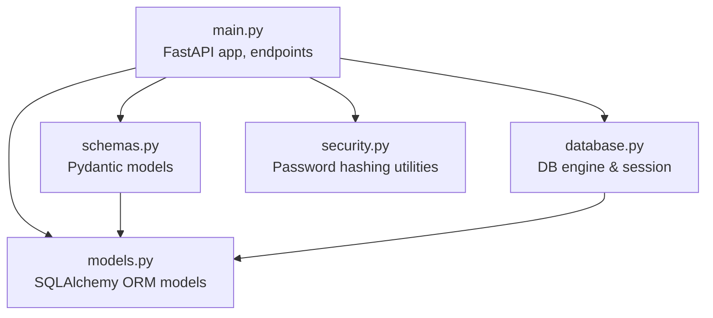
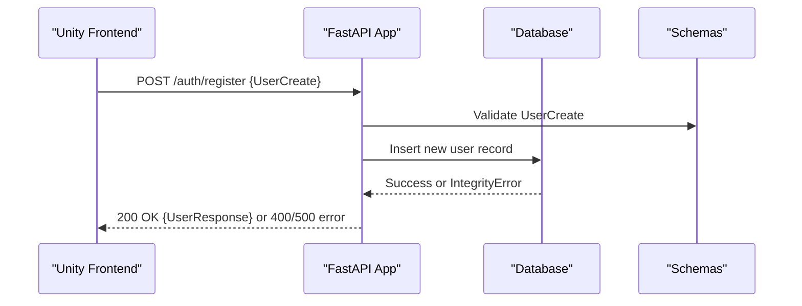
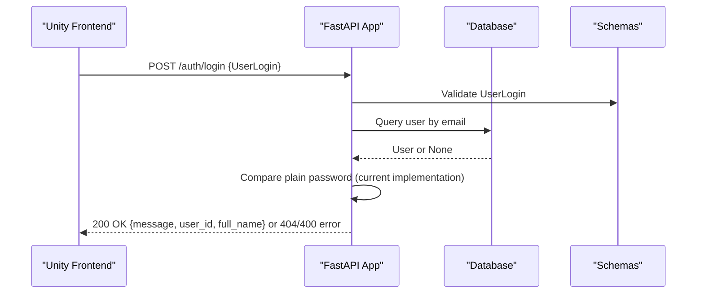
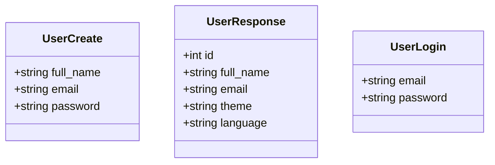
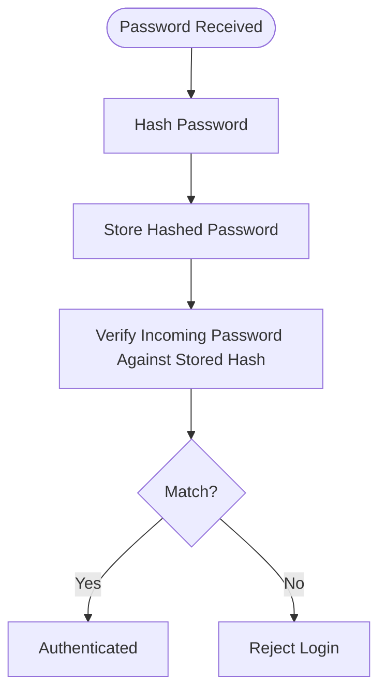
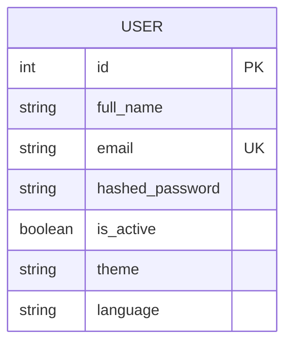
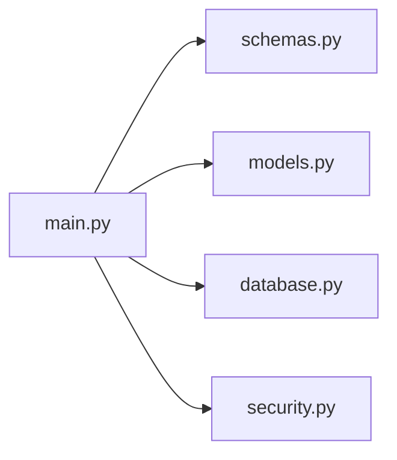

# Authentication Endpoints

<cite>
**Referenced Files in This Document**
- [main.py](file://main.py)
- [schemas.py](file://schemas.py)
- [security.py](file://security.py)
- [models.py](file://models.py)
- [database.py](file://database.py)
- [README.md](file://README.md)
</cite>

## Table of Contents
1. [Introduction](#introduction)
2. [Project Structure](#project-structure)
3. [Core Components](#core-components)
4. [Architecture Overview](#architecture-overview)
5. [Detailed Component Analysis](#detailed-component-analysis)
6. [Dependency Analysis](#dependency-analysis)
7. [Performance Considerations](#performance-considerations)
8. [Troubleshooting Guide](#troubleshooting-guide)
9. [Conclusion](#conclusion)
10. [Appendices](#appendices)

## Introduction
This document provides comprehensive API documentation for the authentication endpoints in the backend service. It focuses on:
- POST /auth/register for user registration, including request schema (UserCreate), response schema (UserResponse), validation rules for full_name and password, and error handling for duplicate emails.
- POST /auth/login for user authentication, including request schema (UserLogin), successful login response with user_id and full_name, and error handling for invalid credentials.

It also includes practical examples, integration patterns with the Unity frontend, security considerations, password validation requirements, and common error scenarios.

## Project Structure
The authentication endpoints are implemented in the FastAPI application with clear separation of concerns:
- Endpoints and routing logic are defined in main.py.
- Data schemas for requests/responses are defined in schemas.py.
- Password hashing utilities are provided in security.py.
- Database models and relationships are defined in models.py.
- Database connection and dependency injection are configured in database.py.

**Diagram sources**
- [main.py:538-601](file://main.py#L538-L601)
- [schemas.py:4-23](file://schemas.py#L4-L23)
- [models.py:4-15](file://models.py#L4-L15)
- [database.py:18-38](file://database.py#L18-L38)
- [security.py:1-12](file://security.py#L1-L12)

**Section sources**
- [main.py:15-24](file://main.py#L15-L24)
- [schemas.py:1-137](file://schemas.py#L1-L137)
- [models.py:1-105](file://models.py#L1-L105)
- [database.py:1-38](file://database.py#L1-L38)
- [security.py:1-12](file://security.py#L1-L12)

## Core Components
- Authentication endpoints:
  - POST /auth/register: Registers a new user with validated inputs and handles duplicate email errors.
  - POST /auth/login: Authenticates a user with provided credentials and returns user identifiers upon success.
- Schemas:
  - UserCreate: Request body for registration.
  - UserResponse: Response body for registration, excluding sensitive fields.
  - UserLogin: Request body for login.
- Security utilities:
  - Password hashing and verification helpers are available for future implementation.
- Database models:
  - User model defines fields including unique email and hashed_password placeholder.

**Section sources**
- [main.py:538-601](file://main.py#L538-L601)
- [schemas.py:4-23](file://schemas.py#L4-L23)
- [security.py:1-12](file://security.py#L1-L12)
- [models.py:4-15](file://models.py#L4-L15)

## Architecture Overview
The authentication flow integrates FastAPI request validation, database operations, and error handling. The following sequence diagrams illustrate the two primary flows.

**Diagram sources**
- [main.py:538-568](file://main.py#L538-L568)
- [schemas.py:4-17](file://schemas.py#L4-L17)
- [models.py:4-15](file://models.py#L4-L15)

**Diagram sources**
- [main.py:569-601](file://main.py#L569-L601)
- [schemas.py:20-23](file://schemas.py#L20-L23)
- [models.py:4-15](file://models.py#L4-L15)

## Detailed Component Analysis

### POST /auth/register
- Purpose: Register a new user with validated inputs.
- Request schema: UserCreate
  - Fields: full_name, email, password
  - Validation rules:
    - full_name is required and must not be blank.
    - password is required and must be at least 6 characters long.
- Response schema: UserResponse
  - Fields: id, full_name, email, theme, language
  - Note: Password is not returned in the response.
- Error handling:
  - 400 Bad Request if validation fails (missing full_name or password, or password too short).
  - 400 Bad Request if email already exists (IntegrityError).
  - 500 Internal Server Error for unexpected failures.

Practical example:
- Request payload (JSON):
  - {
    "full_name": "John Doe",
    "email": "john.doe@example.com",
    "password": "securepass"
  }
- Successful response payload (JSON):
  - {
    "id": 1,
    "full_name": "John Doe",
    "email": "john.doe@example.com",
    "theme": "light",
    "language": "en"
  }
- Error response payload (JSON):
  - {
    "detail": "Email này đã có chủ rồi bạn ơi!"
  }

Integration with Unity:
- Use UnityWebRequest or similar networking stack to POST to https://museamigo-backend.onrender.com/auth/register.
- Parse the returned UserResponse to initialize local user state.

Security considerations:
- Current implementation stores plaintext passwords in the hashed_password field. This is insecure and must be replaced with hashed passwords using the provided security utilities.

Common error scenarios:
- Missing required fields in UserCreate.
- Password shorter than 6 characters.
- Duplicate email detected during insert.

**Section sources**
- [main.py:538-568](file://main.py#L538-L568)
- [schemas.py:4-17](file://schemas.py#L4-L17)
- [models.py:4-15](file://models.py#L4-L15)

### POST /auth/login
- Purpose: Authenticate an existing user.
- Request schema: UserLogin
  - Fields: email, password
  - Validation rules:
    - email is required and must not be blank.
    - password is required and must not be blank.
- Successful response payload (JSON):
  - {
    "message": "Login successful!",
    "user_id": 1,
    "full_name": "John Doe"
  }
- Error handling:
  - 400 Bad Request if account is incomplete (missing full_name).
  - 404 Not Found if credentials are invalid (email not found or password mismatch).

Practical example:
- Request payload (JSON):
  - {
    "email": "john.doe@example.com",
    "password": "securepass"
  }
- Successful response payload (JSON):
  - {
    "message": "Login successful!",
    "user_id": 1,
    "full_name": "John Doe"
  }
- Error response payload (JSON):
  - {
    "detail": "Invalid credentials"
  }

Integration with Unity:
- After successful login, store user_id and full_name locally.
- Use these identifiers for subsequent authenticated requests (e.g., collections, tickets).

Security considerations:
- Current implementation compares plaintext passwords against stored plaintext. This is insecure and must be replaced with hashed password verification using the provided security utilities.

Common error scenarios:
- Missing email or password in UserLogin.
- Account missing required full_name.
- Credentials do not match any user.

**Section sources**
- [main.py:569-601](file://main.py#L569-L601)
- [schemas.py:20-23](file://schemas.py#L20-L23)
- [models.py:4-15](file://models.py#L4-L15)

### Supporting Components

#### Schemas
- UserCreate: Defines registration input fields.
- UserResponse: Defines registration output fields, excluding sensitive data.
- UserLogin: Defines login input fields.

**Diagram sources**
- [schemas.py:4-23](file://schemas.py#L4-L23)

**Section sources**
- [schemas.py:4-23](file://schemas.py#L4-L23)

#### Security Utilities
- Password hashing and verification helpers are available for future implementation.

**Diagram sources**
- [security.py:1-12](file://security.py#L1-L12)

**Section sources**
- [security.py:1-12](file://security.py#L1-L12)

#### Database Model
- User model includes unique email and hashed_password fields.

**Diagram sources**
- [models.py:4-15](file://models.py#L4-L15)

**Section sources**
- [models.py:4-15](file://models.py#L4-L15)

## Dependency Analysis
Authentication endpoints depend on:
- FastAPI routing and dependency injection for database sessions.
- Pydantic schemas for request/response validation.
- SQLAlchemy models for database operations.
- Security utilities for password hashing/verification.

**Diagram sources**
- [main.py:538-601](file://main.py#L538-L601)
- [schemas.py:4-23](file://schemas.py#L4-L23)
- [models.py:4-15](file://models.py#L4-L15)
- [database.py:18-38](file://database.py#L18-L38)
- [security.py:1-12](file://security.py#L1-L12)

**Section sources**
- [main.py:538-601](file://main.py#L538-L601)
- [schemas.py:4-23](file://schemas.py#L4-L23)
- [models.py:4-15](file://models.py#L4-L15)
- [database.py:18-38](file://database.py#L18-L38)
- [security.py:1-12](file://security.py#L1-L12)

## Performance Considerations
- Database connection pooling is configured to improve throughput and reduce latency under load.
- Consider adding rate limiting for authentication endpoints to mitigate brute-force attacks.
- Future improvements should include password hashing and JWT-based session tokens for scalable, stateless authentication.

[No sources needed since this section provides general guidance]

## Troubleshooting Guide
Common issues and resolutions:
- Registration fails with duplicate email:
  - Cause: Email already exists in the database.
  - Resolution: Prompt the user to use another email or initiate a password reset flow.
- Login fails with invalid credentials:
  - Cause: Incorrect email or password mismatch.
  - Resolution: Prompt the user to re-enter credentials or reset password.
- Login fails due to incomplete account:
  - Cause: Missing full_name in the user record.
  - Resolution: Contact support to update profile information.
- Unexpected server errors:
  - Cause: Database exceptions or unhandled errors.
  - Resolution: Retry the operation or contact support.

**Section sources**
- [main.py:538-568](file://main.py#L538-L568)
- [main.py:569-601](file://main.py#L569-L601)

## Conclusion
The authentication endpoints provide essential registration and login capabilities with clear request/response schemas and explicit validation rules. While functional, the current implementation stores plaintext passwords and compares plaintext credentials, which poses significant security risks. Immediate actions should include integrating password hashing and verification utilities and adopting secure session management for production readiness.

[No sources needed since this section summarizes without analyzing specific files]

## Appendices

### Practical Integration Patterns with Unity
- Base URL configuration:
  - Use the production URL for live deployments.
- Registration flow:
  - Send POST /auth/register with UserCreate payload.
  - On success, parse UserResponse to initialize local user state.
- Login flow:
  - Send POST /auth/login with UserLogin payload.
  - On success, store user_id and full_name for subsequent authenticated requests.

**Section sources**
- [README.md:50-95](file://README.md#L50-L95)
- [main.py:538-601](file://main.py#L538-L601)
- [schemas.py:4-23](file://schemas.py#L4-L23)