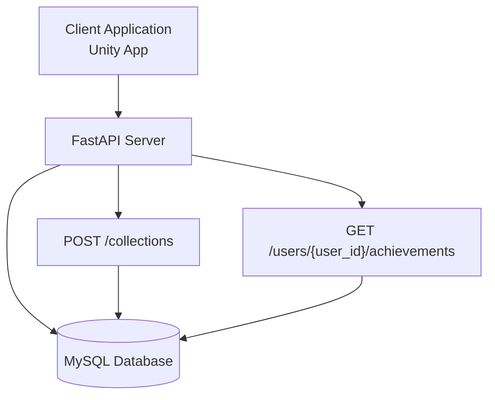
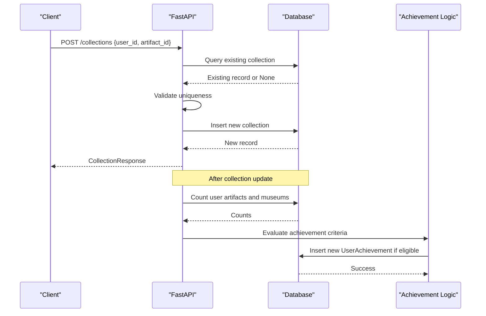
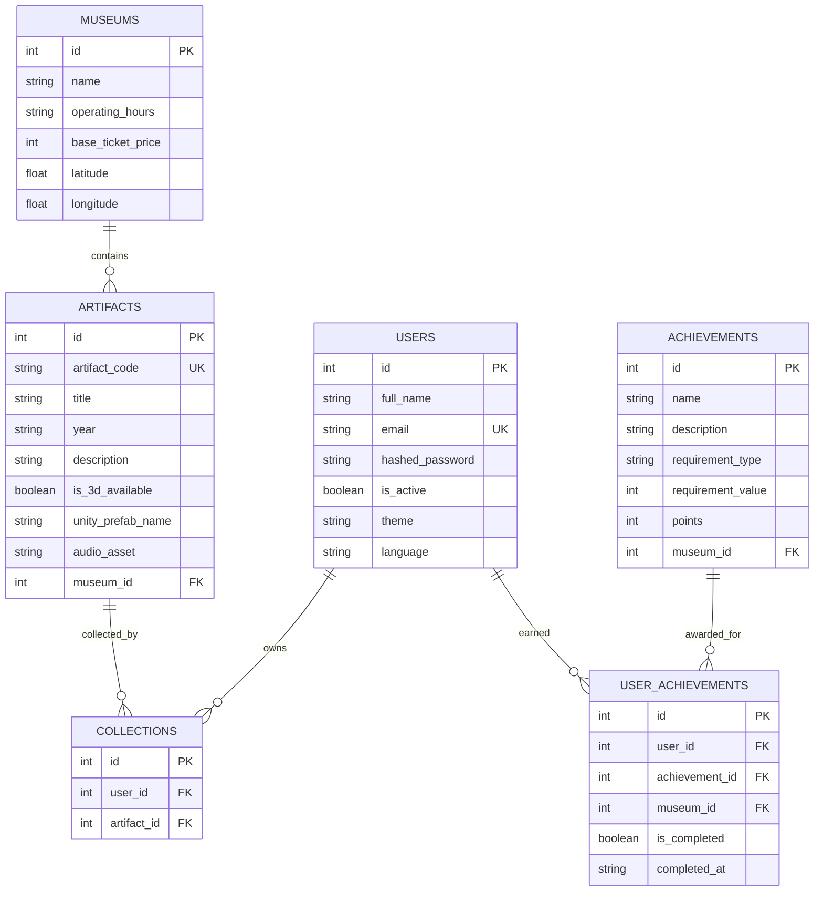
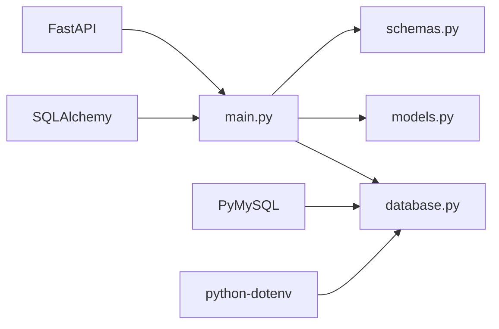

# Collection Management Endpoints

<cite>
**Referenced Files in This Document**
- [main.py](file://main.py)
- [schemas.py](file://schemas.py)
- [models.py](file://models.py)
- [database.py](file://database.py)
- [requirements.txt](file://requirements.txt)
</cite>

## Table of Contents
1. [Introduction](#introduction)
2. [Project Structure](#project-structure)
3. [Core Components](#core-components)
4. [Architecture Overview](#architecture-overview)
5. [Detailed Component Analysis](#detailed-component-analysis)
6. [Dependency Analysis](#dependency-analysis)
7. [Performance Considerations](#performance-considerations)
8. [Troubleshooting Guide](#troubleshooting-guide)
9. [Conclusion](#conclusion)

## Introduction
This document provides comprehensive API documentation for collection management endpoints, focusing on the POST /collections endpoint used to add artifacts to user collections. It explains the request and response schemas, validation logic, duplicate prevention mechanisms, and the integration with the achievement system. Practical examples illustrate the collection addition workflow, user artifact tracking, and automatic achievement triggering.

## Project Structure
The project is a FastAPI application backed by SQLAlchemy ORM with a MySQL database. The collection management functionality resides in the main application module alongside other endpoints for authentication, artifacts, tickets, routes, and achievements. Data models define the database schema, while Pydantic schemas define request/response contracts.

**Diagram sources**
- [main.py:634-661](file://main.py#L634-L661)
- [main.py:738-844](file://main.py#L738-L844)
- [database.py:18-38](file://database.py#L18-L38)

**Section sources**
- [main.py:1-10](file://main.py#L1-L10)
- [database.py:1-38](file://database.py#L1-L38)

## Core Components
- POST /collections endpoint: Adds an artifact to a user's collection with validation and duplicate prevention.
- Schemas:
  - CollectionCreate: Request payload containing user_id and artifact_id.
  - CollectionResponse: Response payload confirming the created collection record.
- Models:
  - Collection: Database table linking users to artifacts in their collections.
  - Achievement and UserAchievement: Achievement tracking and completion records.
- Database: SQLAlchemy engine and session management.

**Section sources**
- [main.py:634-661](file://main.py#L634-L661)
- [schemas.py:51-62](file://schemas.py#L51-L62)
- [models.py:43-51](file://models.py#L43-L51)
- [models.py:86-105](file://models.py#L86-L105)
- [database.py:18-38](file://database.py#L18-L38)

## Architecture Overview
The collection management flow integrates with the achievement system. When a user adds an artifact to their collection, the system updates user progress and may unlock achievements automatically.

**Diagram sources**
- [main.py:634-661](file://main.py#L634-L661)
- [main.py:754-825](file://main.py#L754-L825)
- [models.py:43-51](file://models.py#L43-L51)
- [models.py:97-105](file://models.py#L97-L105)

## Detailed Component Analysis

### POST /collections Endpoint
Purpose: Add an artifact to a user's collection.

- Request Schema: CollectionCreate
  - user_id: integer identifier of the user
  - artifact_id: integer identifier of the artifact
- Response Schema: CollectionResponse
  - id: auto-generated collection record identifier
  - user_id: user identifier
  - artifact_id: artifact identifier

Processing Logic:
1. Duplicate Prevention:
   - Query existing collection entries for the given user_id and artifact_id.
   - If a record exists, return HTTP 400 with a duplicate error message.
2. Creation:
   - Create a new Collection record with the provided identifiers.
   - Persist to the database and refresh to obtain the generated id.
3. Response:
   - Return the created Collection record as CollectionResponse.

Validation and Error Handling:
- Duplicate detection prevents multiple entries for the same user-artifact pair.
- On duplicate, the endpoint raises HTTP 400 with a descriptive message.
- Database errors are handled by the underlying SQLAlchemy session lifecycle.

Integration with Achievement System:
- After a successful collection insertion, the achievement calculation endpoint recomputes progress and may unlock new achievements based on updated scan counts and museum visits.

Practical Example: Adding an Artifact to a User's Collection
- Request: POST /collections with body { "user_id": 1, "artifact_id": 5 }
- Response: { "id": 42, "user_id": 1, "artifact_id": 5 }
- Subsequent GET /users/{user_id}/achievements will reflect the updated progress.

**Section sources**
- [main.py:634-661](file://main.py#L634-L661)
- [schemas.py:51-62](file://schemas.py#L51-L62)
- [models.py:43-51](file://models.py#L43-L51)

### Achievement System Integration
Automatic Achievement Triggering:
- The achievement calculation endpoint aggregates user collection data to compute progress toward various achievement criteria.
- Eligible achievements are inserted into the user_achievements table with completion status and timestamps.
- Points are summed from completed achievements.

Key Behaviors:
- Global achievements based on total scan counts.
- Museum-specific achievements based on scan counts per museum.
- Completion of all artifacts in a museum triggers area-complete achievements.
- Visit-based achievements are unlocked when a user has scanned at least one artifact in a museum.

Progress Tracking:
- Total scan count and unique museums visited are computed from the user's collection.
- Achievement progress is capped at the requirement value and marked complete when thresholds are met.

**Section sources**
- [main.py:738-844](file://main.py#L738-L844)
- [models.py:86-105](file://models.py#L86-L105)

### Data Models and Relationships
The collection management relies on several related models:

**Diagram sources**
- [models.py:4-15](file://models.py#L4-L15)
- [models.py:27-43](file://models.py#L27-L43)
- [models.py:43-51](file://models.py#L43-L51)
- [models.py:16-26](file://models.py#L16-L26)
- [models.py:86-95](file://models.py#L86-L95)
- [models.py:97-105](file://models.py#L97-L105)

## Dependency Analysis
External Dependencies:
- FastAPI: Web framework for building the API.
- SQLAlchemy: ORM for database operations.
- PyMySQL: MySQL driver for Python.
- python-dotenv: Environment variable loading for database configuration.

Internal Dependencies:
- main.py depends on schemas.py for request/response models and models.py for database entities.
- database.py provides the engine and session factory used by all endpoints.

**Diagram sources**
- [requirements.txt:12-59](file://requirements.txt#L12-L59)
- [main.py:1-10](file://main.py#L1-L10)
- [database.py:1-38](file://database.py#L1-L38)

**Section sources**
- [requirements.txt:1-59](file://requirements.txt#L1-L59)
- [main.py:1-10](file://main.py#L1-L10)
- [database.py:1-38](file://database.py#L1-L38)

## Performance Considerations
- Connection Pooling: The database engine uses connection pooling to improve throughput under concurrent load.
- Pre-ping and Recycle: Connections are validated before use and recycled periodically to maintain stability.
- Indexes: Unique constraints on artifact_code and email reduce duplicate insertions and speed lookups.
- Achievement Calculation: The achievement endpoint performs aggregations over collections and artifacts; caching or materialized views could optimize repeated calculations.

## Troubleshooting Guide
Common Issues and Resolutions:
- Duplicate Collection Entry:
  - Symptom: HTTP 400 error indicating the artifact is already in the user's collection.
  - Cause: Attempting to add an artifact that already exists in the collection.
  - Resolution: Verify the artifact is not already collected before attempting to add it.
- Database Integrity Errors:
  - Symptom: HTTP 500 errors during persistence operations.
  - Causes: Foreign key violations, constraint conflicts, or transient database issues.
  - Resolution: Ensure user_id and artifact_id correspond to existing records; retry after verifying referential integrity.
- Achievement Not Unlocked:
  - Symptom: Expected achievement does not appear as completed.
  - Causes: Insufficient scan counts, incorrect museum association, or calculation timing.
  - Resolution: Confirm the user has scanned the required number of artifacts and that the achievement criteria match the current state.

**Section sources**
- [main.py:634-661](file://main.py#L634-L661)
- [main.py:738-844](file://main.py#L738-L844)

## Conclusion
The collection management endpoint provides a robust mechanism for adding artifacts to user collections with built-in duplicate prevention and seamless integration with the achievement system. By leveraging the provided schemas and models, clients can reliably track user progress and unlock achievements as users explore museums and artifacts.