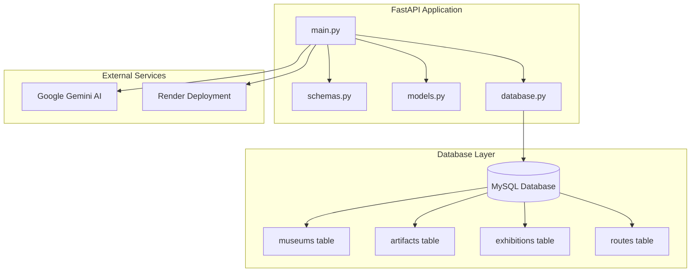
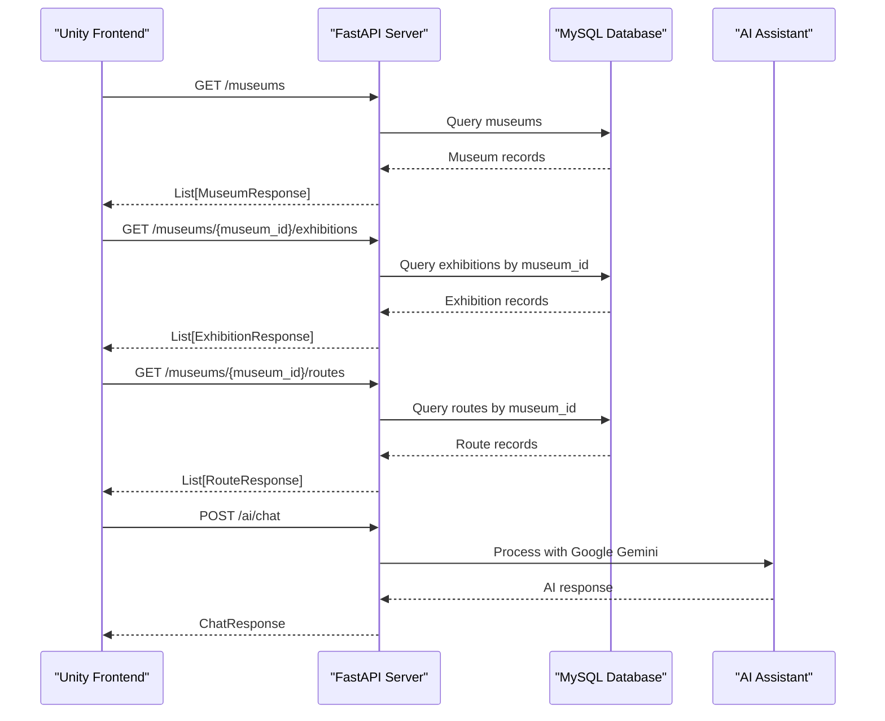
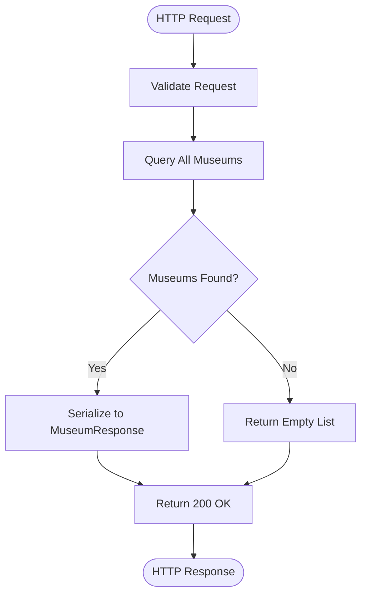
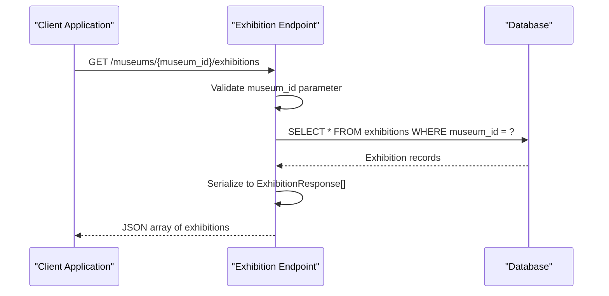
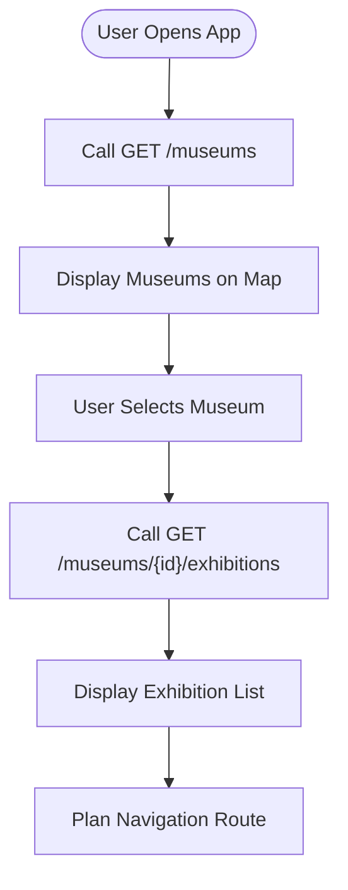

# Museum Management Endpoints

<cite>
**Referenced Files in This Document**
- [main.py](file://main.py)
- [schemas.py](file://schemas.py)
- [models.py](file://models.py)
- [database.py](file://database.py)
- [README.md](file://README.md)
</cite>

## Table of Contents
1. [Introduction](#introduction)
2. [Project Structure](#project-structure)
3. [Core Components](#core-components)
4. [Architecture Overview](#architecture-overview)
5. [Detailed Component Analysis](#detailed-component-analysis)
6. [API Reference](#api-reference)
7. [Integration Guide](#integration-guide)
8. [Performance Considerations](#performance-considerations)
9. [Troubleshooting Guide](#troubleshooting-guide)
10. [Conclusion](#conclusion)

## Introduction

MuseAmigo is a comprehensive museum management system built with FastAPI that enables interactive museum experiences through QR code scanning, guided tours, and AI-powered assistance. This documentation focuses on the museum management endpoints that power the frontend navigation system and provide essential museum information to the Unity-based mobile application.

The system manages four major museums in Ho Chi Minh City, Vietnam, offering visitors an immersive cultural experience through technology integration. The backend provides RESTful APIs for museum discovery, exhibition browsing, and navigation route planning.

## Project Structure

The MuseAmigo backend follows a modular FastAPI architecture with clear separation of concerns:



**Diagram sources**
- [main.py:15-23](file://main.py#L15-L23)
- [database.py:18-38](file://database.py#L18-L38)

**Section sources**
- [main.py:15-23](file://main.py#L15-L23)
- [database.py:18-38](file://database.py#L18-L38)

## Core Components

The museum management system consists of several interconnected components that work together to provide seamless museum experiences:

### Data Models
The system uses SQLAlchemy ORM models to define the database structure for museums, artifacts, exhibitions, and related entities. Each model represents a table in the MySQL database with appropriate field types and relationships.

### Pydantic Schemas
Pydantic models serve as response schemas that define the exact structure of API responses. These schemas ensure type safety and provide automatic serialization/deserialization between Python objects and JSON.

### Database Configuration
The application uses SQLAlchemy with connection pooling for optimal performance. The database connection is configured through environment variables for secure deployment.

**Section sources**
- [models.py:16-61](file://models.py#L16-L61)
- [schemas.py:24-73](file://schemas.py#L24-L73)
- [database.py:18-38](file://database.py#L18-L38)

## Architecture Overview

The museum management architecture follows a layered approach with clear separation between presentation, business logic, and data access layers:



**Diagram sources**
- [main.py:604-700](file://main.py#L604-L700)
- [main.py:870-897](file://main.py#L870-L897)

## Detailed Component Analysis

### Museum Management Endpoints

The museum management system provides two primary endpoints for retrieving museum information and exhibitions:

#### GET /museums - Retrieve All Museums

This endpoint returns a comprehensive list of all museums in the system, including their geographical coordinates and operational information.



**Diagram sources**
- [main.py:604-607](file://main.py#L604-L607)

#### GET /museums/{museum_id}/exhibitions - Retrieve Museum-Specific Exhibitions

This endpoint fetches all exhibitions associated with a specific museum, enabling the frontend to display curated exhibition lists.



**Diagram sources**
- [main.py:664-667](file://main.py#L664-L667)

**Section sources**
- [main.py:604-607](file://main.py#L604-L607)
- [main.py:664-667](file://main.py#L664-L667)

### Data Models and Response Schemas

The system defines comprehensive schemas for data interchange between the backend and frontend applications:

#### MuseumResponse Schema
The MuseumResponse schema defines the structure of museum data returned to clients:

| Field | Type | Description | Example |
|-------|------|-------------|---------|
| id | integer | Unique museum identifier | 1 |
| name | string | Museum name | "Independence Palace" |
| operating_hours | string | Daily operating schedule | "8:00 AM - 5:00 PM" |
| base_ticket_price | integer | Base admission price in VND | 30000 |
| latitude | float | Geographic latitude coordinate | 10.7769 |
| longitude | float | Geographic longitude coordinate | 106.6953 |

#### ExhibitionResponse Schema
The ExhibitionResponse schema structures exhibition data for client consumption:

| Field | Type | Description | Example |
|-------|------|-------------|---------|
| id | integer | Unique exhibition identifier | 1 |
| name | string | Exhibition title | "Presidential Office Tour" |
| location | string | Physical location within museum | "2nd Floor - Presidential Office" |
| museum_id | integer | Parent museum identifier | 1 |

**Section sources**
- [schemas.py:24-35](file://schemas.py#L24-L35)
- [schemas.py:65-73](file://schemas.py#L65-L73)

## API Reference

### GET /museums

Retrieves a list of all museums in the system with their basic information and geographical coordinates.

**Endpoint**: `GET /museums`

**Response Schema**: `List[MuseumResponse]`

**Success Response**: `200 OK`
- Body: Array of MuseumResponse objects
- Content-Type: `application/json`

**Example Response**:
```json
[
  {
    "id": 1,
    "name": "Independence Palace",
    "operating_hours": "8:00 AM - 5:00 PM",
    "base_ticket_price": 30000,
    "latitude": 10.7769,
    "longitude": 106.6953
  },
  {
    "id": 2,
    "name": "War Remnants Museum",
    "operating_hours": "7:30 AM - 6:00 PM",
    "base_ticket_price": 30000,
    "latitude": 10.7794,
    "longitude": 106.6920
  }
]
```

**Error Responses**:
- `500 Internal Server Error`: Database connection failure or query execution error

### GET /museums/{museum_id}/exhibitions

Retrieves all exhibitions for a specific museum identified by museum_id.

**Endpoint**: `GET /museums/{museum_id}/exhibitions`

**Path Parameters**:
- `museum_id` (integer): Unique identifier of the target museum

**Response Schema**: `List[ExhibitionResponse]`

**Success Response**: `200 OK`
- Body: Array of ExhibitionResponse objects
- Content-Type: `application/json`

**Example Response**:
```json
[
  {
    "id": 1,
    "name": "Presidential Office Tour",
    "location": "2nd Floor - Presidential Office",
    "museum_id": 1
  },
  {
    "id": 2,
    "name": "War History Gallery",
    "location": "Ground Floor - East Wing",
    "museum_id": 1
  }
]
```

**Error Responses**:
- `404 Not Found`: Museum with specified ID does not exist
- `500 Internal Server Error`: Database query failure

### Query Parameters and Response Formatting

Both endpoints support standard HTTP response formatting:

- **Content-Type**: `application/json`
- **Character Encoding**: UTF-8
- **Response Compression**: Automatic gzip compression enabled
- **CORS Support**: Enabled for all origins during development

**Section sources**
- [main.py:604-607](file://main.py#L604-L607)
- [main.py:664-667](file://main.py#L664-L667)

## Integration Guide

### Frontend Navigation System Integration

The museum management endpoints integrate seamlessly with the Unity-based frontend navigation system:

#### Museum Discovery Flow


**Diagram sources**
- [main.py:604-607](file://main.py#L604-L607)
- [main.py:664-667](file://main.py#L664-L667)

#### Unity C# Integration Example

To integrate with the Unity frontend, use the following C# pattern:

```csharp
// Base URL configuration
private string baseUrl = "https://museamigo-backend.onrender.com";

// Method to fetch all museums
public async Task<List<MuseumResponse>> GetAllMuseums()
{
    using (UnityWebRequest request = UnityWebRequest.Get(baseUrl + "/museums"))
    {
        await request.SendWebRequest();
        
        if (request.result == UnityWebRequest.Result.Success)
        {
            var jsonResponse = JsonUtility.FromJson<List<MuseumResponse>>(request.downloadHandler.text);
            return jsonResponse;
        }
        
        throw new Exception($"HTTP Error: {request.responseCode}");
    }
}

// Method to fetch museum-specific exhibitions
public async Task<List<ExhibitionResponse>> GetMuseumExhibitions(int museumId)
{
    using (UnityWebRequest request = UnityWebRequest.Get($"{baseUrl}/museums/{museumId}/exhibitions"))
    {
        await request.SendWebRequest();
        
        if (request.result == UnityWebRequest.Result.Success)
        {
            var jsonResponse = JsonUtility.FromJson<List<ExhibitionResponse>>(request.downloadHandler.text);
            return jsonResponse;
        }
        
        throw new Exception($"HTTP Error: {request.responseCode}");
    }
}
```

### Practical Implementation Patterns

#### Error Handling Pattern
Implement robust error handling for network failures and invalid responses:

```csharp
public async Task<T> SafeApiCall<T>(Func<Task<T>> apiCall, string operationName)
{
    try
    {
        return await apiCall();
    }
    catch (HttpRequestException ex)
    {
        Debug.LogError($"Network error during {operationName}: {ex.Message}");
        throw new InvalidOperationException("Unable to connect to museum service");
    }
    catch (JsonException ex)
    {
        Debug.LogError($"JSON parsing error during {operationName}: {ex.Message}");
        throw new InvalidOperationException("Invalid data received from museum service");
    }
}
```

#### Caching Strategy
Implement local caching to reduce API calls and improve user experience:

```csharp
private Dictionary<string, (DateTime timestamp, object data)> cache = new();

public async Task<T> GetCachedData<T>(string cacheKey, Func<Task<T>> refreshFunction, TimeSpan expiryTime)
{
    if (cache.ContainsKey(cacheKey) && DateTime.Now.Subtract(cache[cacheKey].timestamp) < expiryTime)
    {
        return (T)cache[cacheKey].data;
    }
    
    var data = await refreshFunction();
    cache[cacheKey] = (DateTime.Now, data);
    return data;
}
```

**Section sources**
- [README.md:50-89](file://README.md#L50-L89)

## Performance Considerations

### Database Optimization

The system employs several optimization strategies for efficient museum data retrieval:

- **Connection Pooling**: SQLAlchemy connection pool with 10-20 concurrent connections
- **Query Optimization**: Direct table queries without joins for better performance
- **Indexing**: Database indexes on frequently queried fields (name, artifact_code, museum_id)
- **Caching**: Local memory caching for frequently accessed museum data

### Response Time Expectations

- **GET /museums**: ~50-100ms for response time
- **GET /museums/{museum_id}/exhibitions**: ~30-80ms for response time
- **Cold Start**: Initial request may take 30-50 seconds due to Render free tier limitations

### Scalability Considerations

- **Horizontal Scaling**: FastAPI application can be scaled across multiple instances
- **Database Scaling**: MySQL can be migrated to managed cloud database services
- **CDN Integration**: Static assets and media files can be served via CDN
- **Load Balancing**: Reverse proxy configuration for distributing traffic

## Troubleshooting Guide

### Common Issues and Solutions

#### Network Connectivity Problems
**Symptoms**: HTTP 502/503 errors, timeout exceptions
**Causes**: 
- Render free tier server sleeping
- Network connectivity issues
- Database connection failures

**Solutions**:
- Implement retry logic with exponential backoff
- Add connection health checks
- Configure proper timeout values

#### Invalid Museum ID Errors
**Symptoms**: HTTP 404 Not Found responses
**Causes**:
- Non-existent museum_id parameter
- Incorrect URL construction
- Database synchronization issues

**Solutions**:
- Validate museum_id before making API calls
- Implement fallback mechanisms for invalid IDs
- Add proper error handling in frontend

#### Data Serialization Issues
**Symptoms**: JSON parsing errors, type conversion failures
**Causes**:
- Schema mismatches between backend and frontend
- Missing or extra fields in response data
- Type coercion errors

**Solutions**:
- Use strict schema validation
- Implement comprehensive error logging
- Add data sanitization layers

### Monitoring and Logging

Implement comprehensive monitoring for production environments:

```python
import logging
from fastapi import HTTPException

# Configure logging
logging.basicConfig(level=logging.INFO)
logger = logging.getLogger(__name__)

@app.exception_handler(Exception)
async def global_exception_handler(request, exc):
    logger.error(f"Global exception: {exc}")
    return JSONResponse(
        status_code=500,
        content={"detail": "Internal server error"}
    )
```

**Section sources**
- [main.py:512-526](file://main.py#L512-L526)
- [database.py:18-38](file://database.py#L18-L38)

## Conclusion

The MuseAmigo museum management system provides a robust foundation for interactive cultural experiences through its well-designed API endpoints. The GET /museums and GET /museums/{museum_id}/exhibitions endpoints enable seamless integration with Unity-based frontend applications, delivering accurate museum information and exhibition data to enhance visitor experiences.

Key strengths of the system include:
- Clean separation of concerns with FastAPI architecture
- Comprehensive data validation through Pydantic schemas
- Efficient database design with proper indexing
- Scalable deployment architecture
- Extensive error handling and logging capabilities

Future enhancements could include:
- Enhanced museum search and filtering capabilities
- Real-time exhibition availability updates
- Advanced user preference integration
- Multi-language support expansion
- Enhanced AI-powered recommendation systems

The system's modular design ensures maintainability and extensibility, making it well-suited for continued development and enhancement of the museum experience platform.