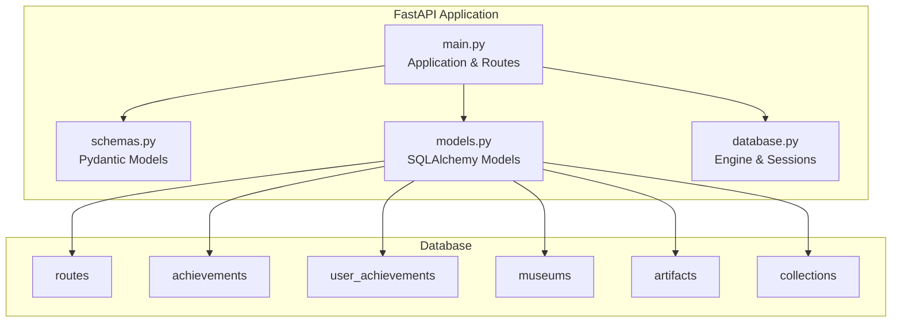
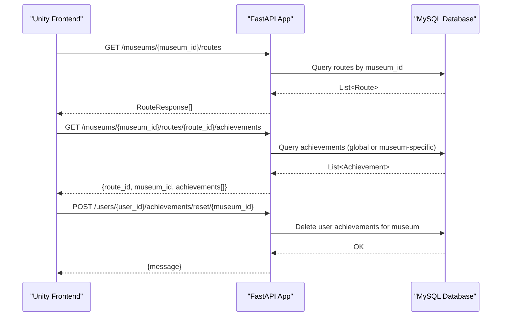
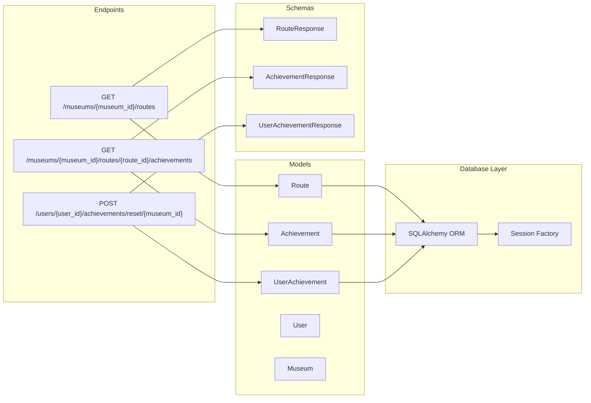

# Navigation System Endpoints

<cite>
**Referenced Files in This Document**
- [main.py](file://main.py)
- [models.py](file://models.py)
- [schemas.py](file://schemas.py)
- [database.py](file://database.py)
- [README.md](file://README.md)
</cite>

## Table of Contents
1. [Introduction](#introduction)
2. [Project Structure](#project-structure)
3. [Core Components](#core-components)
4. [Architecture Overview](#architecture-overview)
5. [Detailed Component Analysis](#detailed-component-analysis)
6. [Dependency Analysis](#dependency-analysis)
7. [Performance Considerations](#performance-considerations)
8. [Troubleshooting Guide](#troubleshooting-guide)
9. [Conclusion](#conclusion)
10. [Appendices](#appendices)

## Introduction
This document provides comprehensive API documentation for the navigation system endpoints that power route discovery, achievement-based navigation, and user progress tracking. It focuses on three key endpoints:
- GET /museums/{museum_id}/routes: retrieves navigation routes for a specific museum with response schema including route name, estimated_time, and stops_count.
- GET /museums/{museum_id}/routes/{route_id}/achievements: fetches achievements associated with a specific route, including filtering by museum scope (global vs museum-specific).
- POST /users/{user_id}/achievements/reset/{museum_id}: resets user achievements scoped to a specific museum.

The documentation includes endpoint definitions, request/response schemas, practical examples, and integration guidance for Unity frontend navigation systems.

## Project Structure
The backend is built with FastAPI and SQLAlchemy ORM. The navigation system endpoints are implemented alongside other museum, artifact, and user management endpoints. The database layer abstracts MySQL connectivity and session management.

**Diagram sources**
- [main.py:696-735](file://main.py#L696-L735)
- [models.py:75-105](file://models.py#L75-L105)
- [database.py:18-38](file://database.py#L18-L38)

**Section sources**
- [main.py:15-23](file://main.py#L15-L23)
- [database.py:12-38](file://database.py#L12-L38)

## Core Components
- Route model and response schema define the navigation route structure with name, estimated_time, stops_count, and museum_id.
- Achievement model supports both global and museum-scoped achievements with requirement types and point values.
- UserAchievement tracks individual user progress and completion status for achievements.
- Database session management ensures thread-safe access to the MySQL database.

Key implementation references:
- RouteResponse schema definition: [schemas.py:94-102](file://schemas.py#L94-L102)
- Achievement model definition: [models.py:86-95](file://models.py#L86-L95)
- UserAchievement model definition: [models.py:97-105](file://models.py#L97-L105)
- Database engine and session factory: [database.py:18-38](file://database.py#L18-L38)

**Section sources**
- [schemas.py:94-102](file://schemas.py#L94-L102)
- [models.py:75-105](file://models.py#L75-L105)
- [database.py:18-38](file://database.py#L18-L38)

## Architecture Overview
The navigation system endpoints integrate with the broader museum and user management ecosystem. The routes endpoint provides curated itineraries, while the achievements endpoint enables gamification and guided exploration. The reset endpoint allows users to restart progress within a museum.

**Diagram sources**
- [main.py:696-735](file://main.py#L696-L735)
- [models.py:75-105](file://models.py#L75-L105)

## Detailed Component Analysis

### GET /museums/{museum_id}/routes
Purpose: Retrieve navigation routes for a specific museum.

Endpoint Definition
- Method: GET
- Path: /museums/{museum_id}/routes
- Path Parameters:
  - museum_id (integer): Unique identifier of the target museum
- Response: Array of RouteResponse objects

RouteResponse Schema
- id (integer): Unique route identifier
- name (string): Human-readable route name
- estimated_time (string): Duration estimate (e.g., "45 min")
- stops_count (integer): Number of stops along the route
- museum_id (integer): Associated museum identifier

Implementation Details
- Filters routes by museum_id using SQLAlchemy ORM
- Returns all matching routes as a list
- Uses RouteResponse schema for serialization

Example Request
- GET /museums/1/routes

Example Response
- Status: 200 OK
- Body: [
  {
    "id": 1,
    "name": "Presidential Tour",
    "estimated_time": "45 min",
    "stops_count": 6,
    "museum_id": 1
  },
  {
    "id": 2,
    "name": "Historical Highlights",
    "estimated_time": "30 min",
    "stops_count": 4,
    "museum_id": 1
  }
]

Practical Workflow Example
- Unity loads museum selection screen
- On selecting a museum, calls GET /museums/{museum_id}/routes
- Displays available routes with estimated duration and stop count
- User selects a route to begin navigation

**Section sources**
- [main.py:696-700](file://main.py#L696-L700)
- [schemas.py:94-102](file://schemas.py#L94-L102)
- [models.py:75-84](file://models.py#L75-L84)

### GET /museums/{museum_id}/routes/{route_id}/achievements
Purpose: Fetch achievements associated with a specific route, including both global and museum-specific achievements.

Endpoint Definition
- Method: GET
- Path: /museums/{museum_id}/routes/{route_id}/achievements
- Path Parameters:
  - museum_id (integer): Target museum identifier
  - route_id (integer): Route identifier
- Response: JSON object containing route metadata and achievement list

Achievement Filtering Logic
- Returns achievements where museum_id equals the specified museum OR museum_id is null (global achievements)
- Enables route-specific gamification while maintaining global progression milestones

Response Structure
- route_id (integer): The requested route identifier
- museum_id (integer): The associated museum identifier
- achievements (array): Achievement objects with id, name, description, and points

Achievement Object Schema
- id (integer): Achievement identifier
- name (string): Achievement title
- description (string): Achievement description
- points (integer): Points awarded upon completion

Integration with Unity Navigation
- Unity can present achievements as part of route guidance
- Achievement points contribute to user progression
- Global achievements appear across all routes; museum-specific achievements align with route themes

**Section sources**
- [main.py:702-722](file://main.py#L702-L722)
- [models.py:86-95](file://models.py#L86-L95)

### POST /users/{user_id}/achievements/reset/{museum_id}
Purpose: Reset user achievements scoped to a specific museum, allowing users to restart progress.

Endpoint Definition
- Method: POST
- Path: /users/{user_id}/achievements/reset/{museum_id}
- Path Parameters:
  - user_id (integer): Target user identifier
  - museum_id (integer): Museum identifier for reset scope
- Response: JSON object with reset confirmation message

Reset Behavior
- Deletes all UserAchievement records where user_id and museum_id match the parameters
- Commits transaction to persist changes
- Returns success message indicating reset completion

Use Cases
- User wants to restart a museum-specific challenge
- Admin needs to reset user progress for maintenance
- User completes a museum tour and wants to reattempt challenges

**Section sources**
- [main.py:724-735](file://main.py#L724-L735)
- [models.py:97-105](file://models.py#L97-L105)

### Related Achievement Calculation Endpoint
While not part of the navigation system, the GET /users/{user_id}/achievements endpoint demonstrates how achievements are calculated and tracked, providing context for the navigation system's gamification features.

Key Features
- Calculates total scan counts per museum and overall
- Determines unique museums visited
- Computes achievement progress based on requirement types
- Automatically completes eligible achievements and updates user progress

**Section sources**
- [main.py:738-844](file://main.py#L738-L844)

## Dependency Analysis
The navigation system endpoints depend on the following components:

**Diagram sources**
- [main.py:696-735](file://main.py#L696-L735)
- [models.py:75-105](file://models.py#L75-L105)
- [schemas.py:94-125](file://schemas.py#L94-L125)
- [database.py:33-38](file://database.py#L33-L38)

**Section sources**
- [main.py:696-735](file://main.py#L696-L735)
- [models.py:75-105](file://models.py#L75-L105)
- [schemas.py:94-125](file://schemas.py#L94-L125)
- [database.py:33-38](file://database.py#L33-L38)

## Performance Considerations
- Database Queries: Each endpoint performs straightforward SELECT operations filtered by foreign keys. The achievement filtering uses OR conditions but targets small reference tables.
- Connection Pooling: The database engine uses connection pooling to handle concurrent requests efficiently.
- Response Serialization: Pydantic models provide fast serialization for route and achievement lists.
- Caching Opportunities: Consider caching route lists and achievement metadata for frequently accessed museums.

## Troubleshooting Guide
Common Issues and Resolutions
- Route Not Found: Verify museum_id exists and has associated routes. Check database seeding for route entries.
- Achievement Scope Issues: Ensure achievement museum_id matches the requested museum or is null for global achievements.
- Reset Operation Fails: Confirm user_id and museum_id combination exists in user_achievements table before reset.
- CORS Errors: The application allows all origins for development; adjust CORS middleware for production deployments.

**Section sources**
- [main.py:696-735](file://main.py#L696-L735)
- [database.py:17-24](file://database.py#L17-L24)

## Conclusion
The navigation system endpoints provide a robust foundation for museum route discovery and achievement-based navigation. The endpoints are designed for seamless integration with Unity frontends, enabling guided tours with gamification elements. The modular architecture supports both global and museum-specific achievements, allowing flexible navigation experiences tailored to user preferences and learning objectives.

## Appendices

### Endpoint Reference Summary
- GET /museums/{museum_id}/routes: Returns RouteResponse[]
- GET /museums/{museum_id}/routes/{route_id}/achievements: Returns {route_id, museum_id, achievements[]}
- POST /users/{user_id}/achievements/reset/{museum_id}: Returns {message}

### Integration Guidelines for Unity
- Use HTTPS endpoints for production deployments
- Implement retry logic for cold start delays on free hosting tiers
- Cache route lists locally to reduce network requests
- Present achievements alongside route descriptions for enhanced engagement

**Section sources**
- [README.md:50-95](file://README.md#L50-L95)