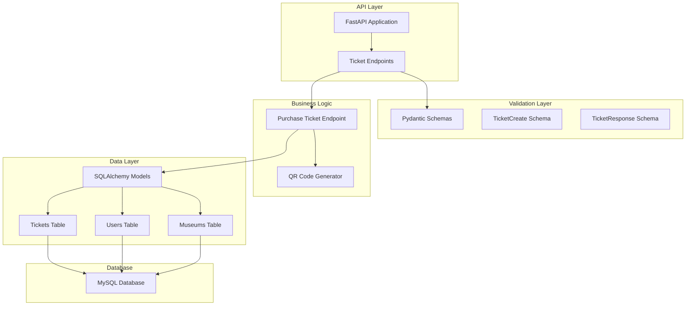
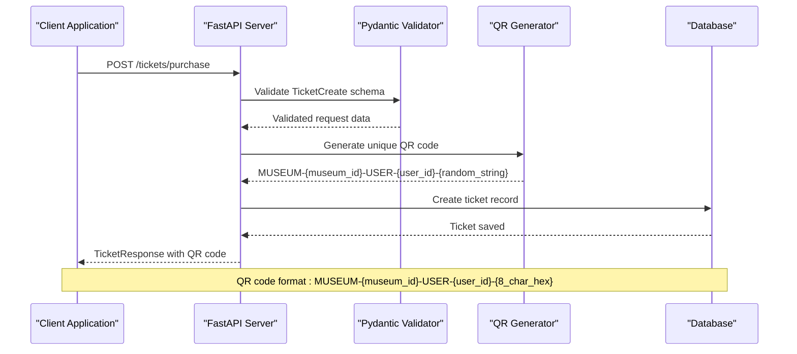
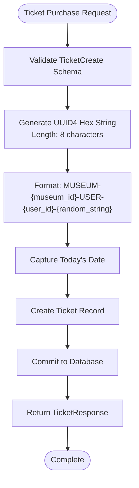
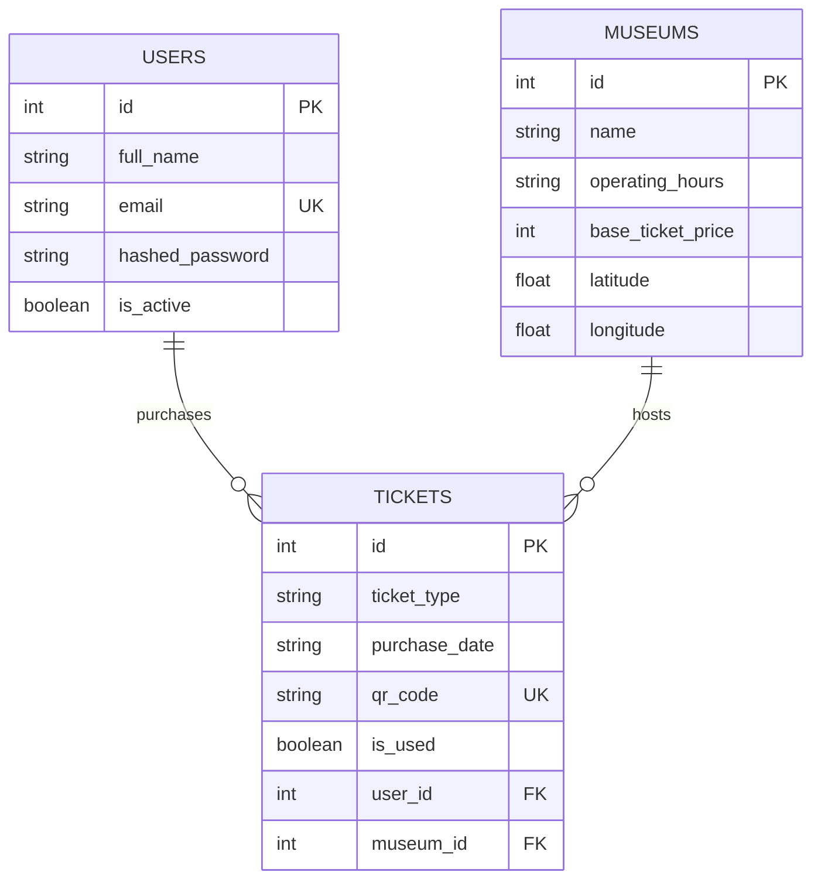
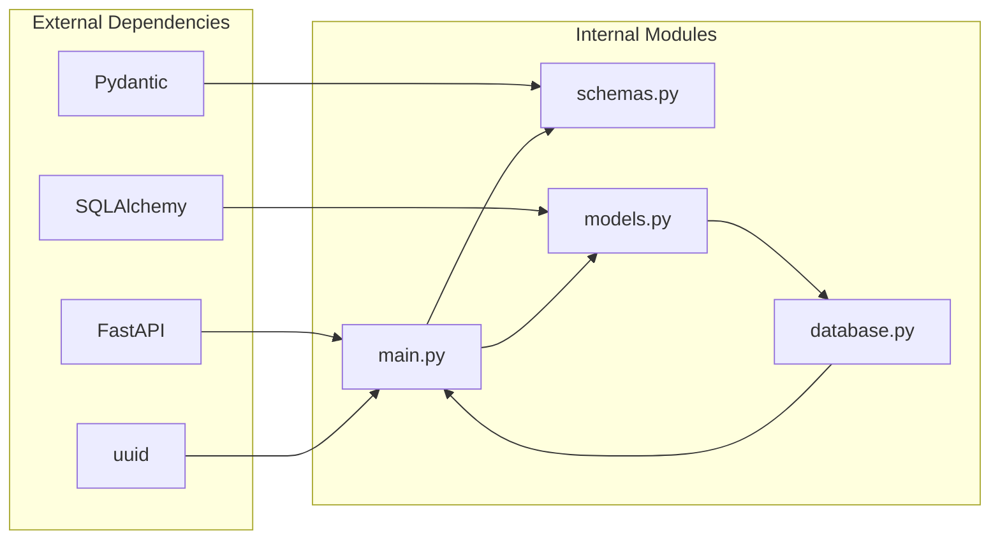

# Ticket Management Endpoints

<cite>
**Referenced Files in This Document**
- [main.py](file://main.py)
- [schemas.py](file://schemas.py)
- [models.py](file://models.py)
- [database.py](file://database.py)
- [README.md](file://README.md)
</cite>

## Table of Contents
1. [Introduction](#introduction)
2. [Project Structure](#project-structure)
3. [Core Components](#core-components)
4. [Architecture Overview](#architecture-overview)
5. [Detailed Component Analysis](#detailed-component-analysis)
6. [Dependency Analysis](#dependency-analysis)
7. [Performance Considerations](#performance-considerations)
8. [Troubleshooting Guide](#troubleshooting-guide)
9. [Conclusion](#conclusion)

## Introduction
This document provides comprehensive API documentation for the ticket management system, focusing on the POST `/tickets/purchase` endpoint that generates virtual tickets with unique QR codes for museum entry. The system creates tickets with structured QR codes in the format `MUSEUM-{museum_id}-USER-{user_id}-{random_string}`, validates ticket types, handles purchase dates, and integrates with museum entry systems through QR code scanning.

## Project Structure
The ticket management system is built using FastAPI with SQLAlchemy ORM for database operations. The key components include:
- API endpoints for ticket purchase and management
- Pydantic models for request/response validation
- SQLAlchemy models for database schema
- Database connection management
- QR code generation using UUID

**Diagram sources**
- [main.py:669-694](file://main.py#L669-L694)
- [schemas.py:75-92](file://schemas.py#L75-L92)
- [models.py:62-73](file://models.py#L62-L73)

**Section sources**
- [main.py:15-23](file://main.py#L15-L23)
- [database.py:12-38](file://database.py#L12-L38)

## Core Components
The ticket management system consists of several core components that work together to handle ticket purchases and QR code generation:

### Request Schema: TicketCreate
The TicketCreate schema defines the structure for ticket purchase requests:
- `user_id`: Integer identifier for the purchasing user
- `museum_id`: Integer identifier for the target museum
- `ticket_type`: String representing the ticket category (e.g., "Adult", "Student")

### Response Schema: TicketResponse
The TicketResponse schema defines the structure for ticket purchase responses:
- `id`: Generated ticket identifier
- `ticket_type`: Ticket category string
- `purchase_date`: Date string in YYYY-MM-DD format
- `qr_code`: Unique QR code string in MUSEUM-{museum_id}-USER-{user_id}-{random_string} format
- `is_used`: Boolean flag indicating ticket usage status
- `user_id`: Associated user identifier
- `museum_id`: Associated museum identifier

### Database Model: Ticket
The Ticket model represents the database structure:
- Primary key `id`
- `ticket_type` with string length limit of 50 characters
- `purchase_date` stored as string
- `qr_code` with unique constraint and index
- Foreign keys linking to `users` and `museums` tables

**Section sources**
- [schemas.py:75-92](file://schemas.py#L75-L92)
- [models.py:62-73](file://models.py#L62-L73)

## Architecture Overview
The ticket purchase process follows a clear architectural flow from API request to database persistence:

**Diagram sources**
- [main.py:669-694](file://main.py#L669-L694)
- [schemas.py:75-92](file://schemas.py#L75-L92)

## Detailed Component Analysis

### POST /tickets/purchase Endpoint
The primary endpoint for ticket generation implements the complete purchase workflow:

#### Request Processing
1. **Schema Validation**: Incoming requests are validated against the TicketCreate schema
2. **QR Code Generation**: Unique QR codes are generated using UUID4 with specific formatting
3. **Date Handling**: Current date is captured for purchase_timestamp
4. **Database Persistence**: New ticket record is created and committed

#### QR Code Generation Algorithm
The QR code follows a strict format: `MUSEUM-{museum_id}-USER-{user_id}-{random_string}`

**Diagram sources**
- [main.py:670-694](file://main.py#L670-L694)

#### Ticket Type Validation
The system accepts arbitrary string values for `ticket_type`. While the schema allows any string, practical validation should ensure:
- Common categories: "Adult", "Student", "Child", "Senior"
- Proper case handling for consistency
- Business rule enforcement at the application level

#### Purchase Date Handling
Purchase dates are automatically captured as the current system date in ISO format (YYYY-MM-DD). This ensures:
- Consistent date formatting across the system
- Easy date comparisons and filtering
- Audit trail capabilities

#### Database Integration
The endpoint creates a new ticket record with foreign key relationships to:
- User table via `user_id`
- Museum table via `museum_id`
- Unique QR code constraint prevents duplicates

**Section sources**
- [main.py:669-694](file://main.py#L669-L694)
- [models.py:62-73](file://models.py#L62-L73)

### Data Model Relationships
The ticket system maintains referential integrity through foreign key relationships:

**Diagram sources**
- [models.py:4-14](file://models.py#L4-L14)
- [models.py:16-25](file://models.py#L16-L25)
- [models.py:62-73](file://models.py#L62-L73)

**Section sources**
- [models.py:4-14](file://models.py#L4-L14)
- [models.py:16-25](file://models.py#L16-L25)
- [models.py:62-73](file://models.py#L62-L73)

## Dependency Analysis
The ticket management system has clear dependency relationships:

**Diagram sources**
- [main.py:1-10](file://main.py#L1-L10)
- [schemas.py:1](file://schemas.py#L1)
- [models.py:1](file://models.py#L1)
- [database.py:1](file://database.py#L1)

### External Dependencies
- **FastAPI**: Web framework for API endpoints
- **SQLAlchemy**: ORM for database operations
- **uuid**: Python library for unique identifier generation
- **Pydantic**: Data validation and serialization

### Internal Dependencies
- `main.py` depends on `schemas.py` for request/response models
- `main.py` depends on `models.py` for database schema
- `models.py` depends on `database.py` for database connection
- All components depend on `uuid` and `date` for QR code generation and date handling

**Section sources**
- [main.py:1-10](file://main.py#L1-L10)
- [schemas.py:1](file://schemas.py#L1)
- [models.py:1](file://models.py#L1)
- [database.py:1](file://database.py#L1)

## Performance Considerations
The ticket management system incorporates several performance optimizations:

### Database Connection Pooling
The database configuration uses connection pooling to improve performance:
- Pool size: 10 concurrent connections
- Overflow: 20 additional connections when pool is exhausted
- Pre-ping: Validates connections before use
- Recycle: 1-hour connection lifetime

### Indexing Strategy
- QR codes have unique constraints and indexes for fast lookup
- Foreign keys on user_id and museum_id enable efficient joins
- Purchase dates indexed for filtering and reporting

### Memory Management
- UUID generation uses minimal memory overhead
- Pydantic validation occurs at request boundary
- Database transactions are properly managed with commit/rollback

## Troubleshooting Guide

### Common Issues and Solutions

#### QR Code Generation Failures
**Symptoms**: Tickets created without proper QR codes
**Causes**: 
- UUID generation errors
- String formatting failures
**Solutions**:
- Verify UUID library availability
- Check string formatting logic
- Validate input parameters

#### Database Connection Issues
**Symptoms**: 500 errors during ticket creation
**Causes**:
- Database connectivity problems
- Connection pool exhaustion
**Solutions**:
- Check DATABASE_URL environment variable
- Monitor connection pool metrics
- Verify database server status

#### Duplicate QR Code Errors
**Symptoms**: Integrity errors when creating tickets
**Causes**:
- Random string collision (extremely rare)
**Solutions**:
- UUID4 provides sufficient entropy
- Database unique constraint prevents duplicates

#### Validation Errors
**Symptoms**: 422 errors for invalid requests
**Causes**:
- Missing required fields
- Invalid data types
**Solutions**:
- Ensure all required fields are present
- Validate data types match schema expectations

**Section sources**
- [main.py:669-694](file://main.py#L669-L694)
- [database.py:12-24](file://database.py#L12-L24)

## Conclusion
The ticket management system provides a robust foundation for virtual ticket generation with unique QR codes. The POST `/tickets/purchase` endpoint successfully implements the complete workflow from request validation to QR code generation and database persistence. The system's architecture supports scalability through connection pooling, maintains data integrity through foreign key relationships, and provides extensibility for future enhancements such as ticket validation endpoints and advanced access control mechanisms.

Key strengths of the implementation include:
- Clear separation of concerns between validation, business logic, and data persistence
- Robust QR code generation using UUID4
- Comprehensive database schema with proper indexing
- Extensible architecture supporting future ticket validation and access control features

The system is production-ready with appropriate error handling, validation, and performance optimizations while maintaining simplicity for integration with museum entry systems through QR code scanning.