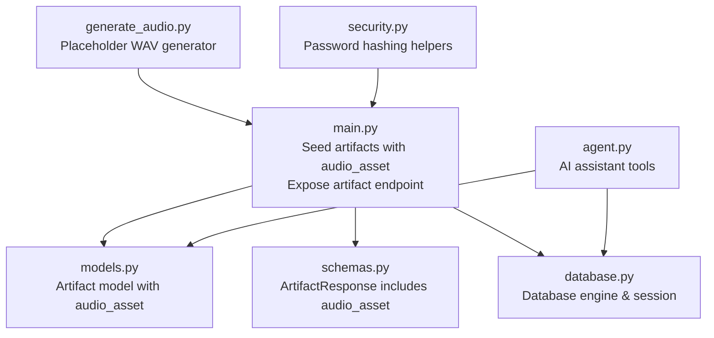
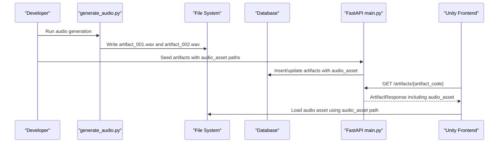
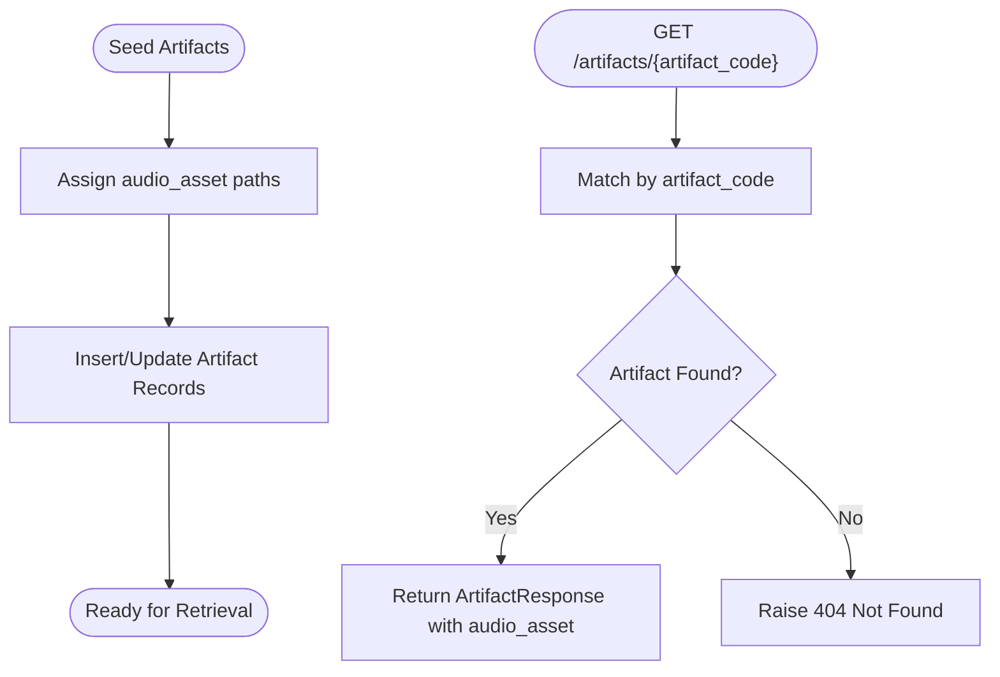
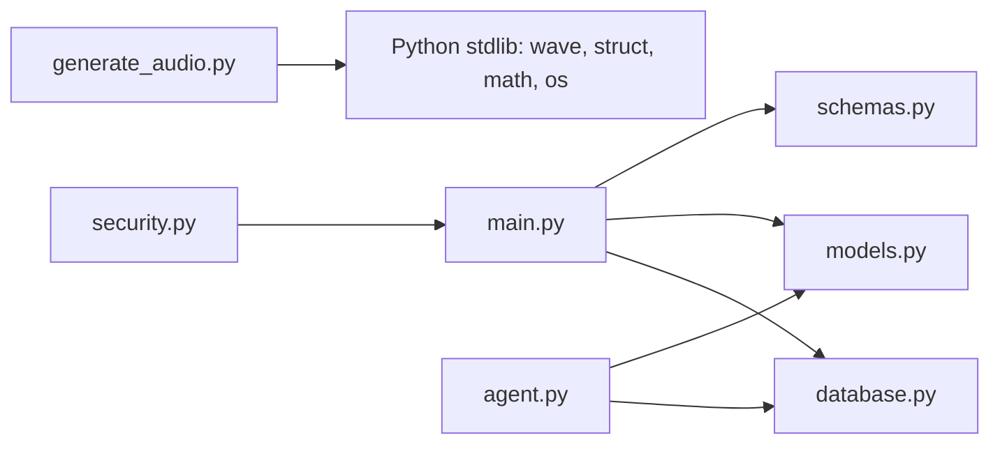

# Audio Asset Management

<cite>
**Referenced Files in This Document**
- [generate_audio.py](file://generate_audio.py)
- [main.py](file://main.py)
- [models.py](file://models.py)
- [schemas.py](file://schemas.py)
- [database.py](file://database.py)
- [agent.py](file://agent.py)
- [security.py](file://security.py)
- [README.md](file://README.md)
- [requirements.txt](file://requirements.txt)
</cite>

## Table of Contents
1. [Introduction](#introduction)
2. [Project Structure](#project-structure)
3. [Core Components](#core-components)
4. [Architecture Overview](#architecture-overview)
5. [Detailed Component Analysis](#detailed-component-analysis)
6. [Dependency Analysis](#dependency-analysis)
7. [Performance Considerations](#performance-considerations)
8. [Troubleshooting Guide](#troubleshooting-guide)
9. [Conclusion](#conclusion)
10. [Appendices](#appendices)

## Introduction
This document explains the audio asset generation and management system used for artifact descriptions in the MuseAmigo backend. It covers how WAV audio files are created, naming conventions, placeholder audio generation strategies, and how artifact metadata integrates with generated audio assets. It also documents the workflow for generating audio assets, quality and file-size considerations, and how audio assets enhance the museum experience through guided tours and artifact storytelling. Guidance is included for integrating audio assets with the artifact discovery system and for mobile/Unity frontend consumption.

## Project Structure
The audio asset system spans several modules:
- Audio generation script creates placeholder WAV files for demonstration.
- Database models define the artifact table with an audio_asset field.
- Schemas define the API response shape for artifacts, including audio_asset.
- Main application seeds artifacts with audio_asset paths and exposes endpoints to retrieve artifacts.
- Supporting modules handle database connectivity, AI assistant integration, and security helpers.

**Diagram sources**
- [generate_audio.py:1-78](file://generate_audio.py#L1-L78)
- [database.py:1-38](file://database.py#L1-L38)
- [models.py:1-105](file://models.py#L1-L105)
- [schemas.py:1-137](file://schemas.py#L1-L137)
- [main.py:1-897](file://main.py#L1-L897)
- [agent.py:1-122](file://agent.py#L1-L122)
- [security.py:1-12](file://security.py#L1-L12)

**Section sources**
- [generate_audio.py:1-78](file://generate_audio.py#L1-L78)
- [models.py:1-105](file://models.py#L1-L105)
- [schemas.py:1-137](file://schemas.py#L1-L137)
- [main.py:1-897](file://main.py#L1-L897)
- [database.py:1-38](file://database.py#L1-L38)
- [agent.py:1-122](file://agent.py#L1-L122)
- [security.py:1-12](file://security.py#L1-L12)

## Core Components
- Audio generation script: Generates two short placeholder WAV files with distinct frequencies to simulate artifact narration and guide audio.
- Artifact model: Stores the audio_asset path as a string, enabling Unity to locate and play the correct audio asset.
- Artifact response schema: Exposes audio_asset to the frontend in API responses.
- Seed data: Pre-populates artifacts with audio_asset paths pointing to the generated WAV files.
- Artifact endpoint: Retrieves artifact details by code, including the audio_asset path for Unity playback.

Key responsibilities:
- Audio generation: Create deterministic, low-complexity WAV files for testing and demonstration.
- Metadata integration: Link artifact records to audio assets via a standardized path.
- API exposure: Return artifact metadata with audio_asset to the frontend.

**Section sources**
- [generate_audio.py:12-78](file://generate_audio.py#L12-L78)
- [models.py:27-42](file://models.py#L27-L42)
- [schemas.py:36-48](file://schemas.py#L36-L48)
- [main.py:75-187](file://main.py#L75-L187)
- [main.py:609-632](file://main.py#L609-L632)

## Architecture Overview
The audio asset pipeline connects the backend to the Unity frontend:
- Audio generation script produces WAV files and places them under a known assets path.
- Artifact seeding assigns audio_asset paths to artifacts.
- The artifact endpoint returns artifact metadata, including audio_asset, to Unity.
- Unity loads the audio asset using the provided path.

**Diagram sources**
- [generate_audio.py:41-78](file://generate_audio.py#L41-L78)
- [main.py:75-187](file://main.py#L75-L187)
- [main.py:609-632](file://main.py#L609-L632)

## Detailed Component Analysis

### Audio Generation Script
Purpose:
- Generate placeholder WAV files for artifact descriptions.
- Demonstrate audio asset creation and naming conventions.

Implementation highlights:
- Generates two sine-wave WAV files with different frequencies to simulate distinct audio styles.
- Writes files to a predefined assets/audio directory relative to the script’s location.
- Prints informational messages about created files and placeholders.

Naming conventions:
- artifact_001.wav and artifact_002.wav align with seeded artifact audio_asset values.

Quality and file size:
- Uses 16-bit mono WAV at 44.1 kHz sample rate.
- Duration is short (3 seconds), minimizing file size while keeping audio meaningful for demos.

Integration:
- Output directory mirrors the audio_asset paths stored in the artifact records.

**Section sources**
- [generate_audio.py:12-78](file://generate_audio.py#L12-L78)

### Artifact Model and Schema
Purpose:
- Store and expose the audio_asset path associated with each artifact.

Model definition:
- Artifact includes an audio_asset column storing a string path.
- The column defaults to empty, allowing flexibility for artifacts without audio.

Schema definition:
- ArtifactResponse includes audio_asset with a default empty string, ensuring consistent API responses.

Impact on frontend:
- Unity receives audio_asset alongside other artifact metadata, enabling seamless playback.

**Section sources**
- [models.py:27-42](file://models.py#L27-L42)
- [schemas.py:36-48](file://schemas.py#L36-L48)

### Artifact Seeding and Endpoint
Purpose:
- Populate artifacts with audio_asset paths and expose them via the artifact endpoint.

Seeding:
- Seeds artifacts with specific audio_asset paths aligned with generated WAV filenames.
- Updates existing artifacts if schema changes occur.

Endpoint:
- Retrieves artifacts by artifact_code, performing case-insensitive matching and trimming.
- Returns ArtifactResponse including audio_asset for Unity consumption.

**Diagram sources**
- [main.py:75-187](file://main.py#L75-L187)
- [main.py:609-632](file://main.py#L609-L632)

**Section sources**
- [main.py:75-187](file://main.py#L75-L187)
- [main.py:609-632](file://main.py#L609-L632)

### Database Connectivity and Migration
Purpose:
- Provide database engine/session and ensure schema compatibility.

Highlights:
- Loads DATABASE_URL from environment variables with a fallback to local MySQL.
- Creates a session factory and defines a dependency to supply sessions to endpoints.
- Includes a migration step to add the audio_asset column if missing.

**Section sources**
- [database.py:1-38](file://database.py#L1-L38)
- [main.py:491-510](file://main.py#L491-L510)

### AI Assistant Integration (Contextual)
Purpose:
- While not directly related to audio assets, the AI assistant can reference artifact metadata, including audio_asset, when responding to user queries.

Highlights:
- Tools query the database for artifact details, museum info, exhibitions, and routes.
- Ensures robustness by closing database sessions after use.

**Section sources**
- [agent.py:17-91](file://agent.py#L17-L91)

### Security Helpers (Contextual)
Purpose:
- Provide password hashing utilities used elsewhere in the system.

Not directly related to audio assets, but part of the backend ecosystem.

**Section sources**
- [security.py:1-12](file://security.py#L1-L12)

## Dependency Analysis
Audio asset dependencies and relationships:
- generate_audio.py depends on Python’s wave, struct, math, and os modules to create WAV files.
- main.py depends on database.py for sessions and models.py for schema definitions.
- schemas.py depends on pydantic BaseModel to define API shapes.
- agent.py depends on database.py and models.py for tool implementations.
- security.py provides password hashing utilities.

**Diagram sources**
- [generate_audio.py:7-10](file://generate_audio.py#L7-L10)
- [main.py:1-10](file://main.py#L1-L10)
- [agent.py:1-8](file://agent.py#L1-L8)
- [security.py:1-4](file://security.py#L1-L4)

**Section sources**
- [generate_audio.py:7-10](file://generate_audio.py#L7-L10)
- [main.py:1-10](file://main.py#L1-L10)
- [agent.py:1-8](file://agent.py#L1-L8)
- [security.py:1-4](file://security.py#L1-L4)

## Performance Considerations
Audio file formats and compression:
- Current implementation generates 16-bit mono WAV files at 44.1 kHz sample rate.
- WAV is uncompressed and offers high fidelity but larger file sizes.
- For production, consider converting to MP3 or AAC for smaller file sizes while maintaining acceptable quality.

Mobile and Unity integration:
- Unity typically supports WAV, MP3, and OGG formats.
- MP3 is widely compatible and reduces bandwidth usage.
- OGG Vorbis offers good compression with quality suitable for narration.

Optimization strategies:
- Short durations (e.g., 3 seconds) reduce file size and latency.
- Mono channels halve bandwidth compared to stereo.
- Normalize volume and trim silence to minimize file size.
- Cache audio assets locally on device to reduce repeated downloads.

[No sources needed since this section provides general guidance]

## Troubleshooting Guide
Common issues and resolutions:
- Audio file not found:
  - Ensure generate_audio.py ran and placed WAV files in the expected assets/audio directory.
  - Verify artifact seeding assigned correct audio_asset paths.
- Incorrect audio playback:
  - Confirm Unity uses the audio_asset path returned by the artifact endpoint.
  - Validate file format compatibility (WAV/MP3/OGG) with Unity.
- Endpoint returns 404:
  - Check artifact_code spelling and case; the endpoint performs case-insensitive matching and trims whitespace.
  - Confirm artifact exists in the database with a populated audio_asset field.

**Section sources**
- [generate_audio.py:41-78](file://generate_audio.py#L41-L78)
- [main.py:609-632](file://main.py#L609-L632)

## Conclusion
The audio asset management system provides a clear pathway for associating artifact metadata with playable audio assets. Placeholder WAV files demonstrate the workflow, while seeded artifact records embed audio_asset paths for Unity consumption. By adopting compressed formats and optimizing file sizes, the system can scale efficiently for mobile and Unity frontends, enhancing the museum experience through guided tours and artifact storytelling.

[No sources needed since this section summarizes without analyzing specific files]

## Appendices

### Audio Asset Creation Workflow
- Generate placeholder WAV files using the audio generation script.
- Place generated files under the assets/audio directory.
- Seed artifacts with audio_asset paths matching the generated filenames.
- Expose artifacts via the artifact endpoint for Unity retrieval.

**Section sources**
- [generate_audio.py:41-78](file://generate_audio.py#L41-L78)
- [main.py:75-187](file://main.py#L75-L187)
- [main.py:609-632](file://main.py#L609-L632)

### Naming Conventions and Storage Patterns
- File naming: artifact_001.wav, artifact_002.wav.
- Storage pattern: assets/audio/<filename>.
- Database storage: audio_asset column stores the relative path string.

**Section sources**
- [generate_audio.py:55-71](file://generate_audio.py#L55-L71)
- [models.py:39-40](file://models.py#L39-L40)

### Integration with Artifact Discovery System
- Unity calls GET /artifacts/{artifact_code}.
- Backend returns ArtifactResponse including audio_asset.
- Unity loads the audio asset using the provided path.

**Section sources**
- [main.py:609-632](file://main.py#L609-L632)
- [schemas.py:36-48](file://schemas.py#L36-L48)

### Frontend Consumption Notes
- Unity supports multiple audio formats; WAV is used for simplicity in this prototype.
- For production, convert to MP3 or OGG to reduce bandwidth and improve loading performance.

[No sources needed since this section provides general guidance]