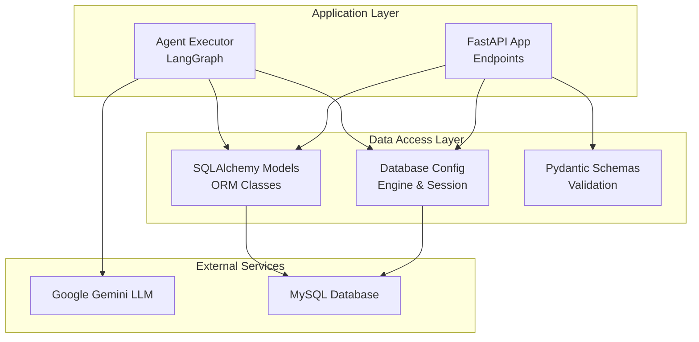
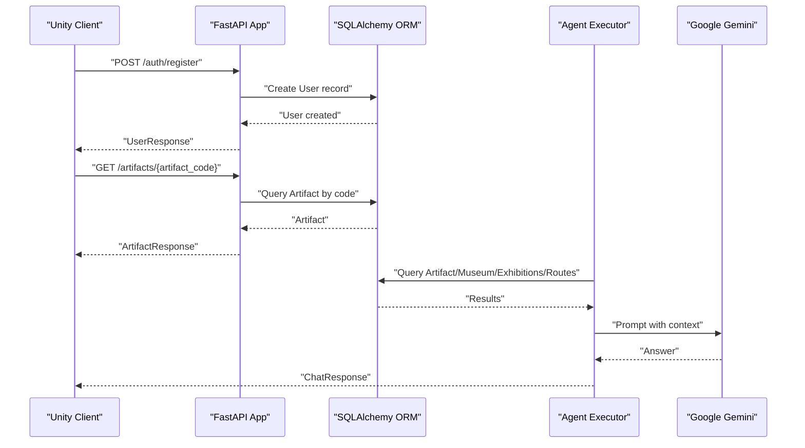
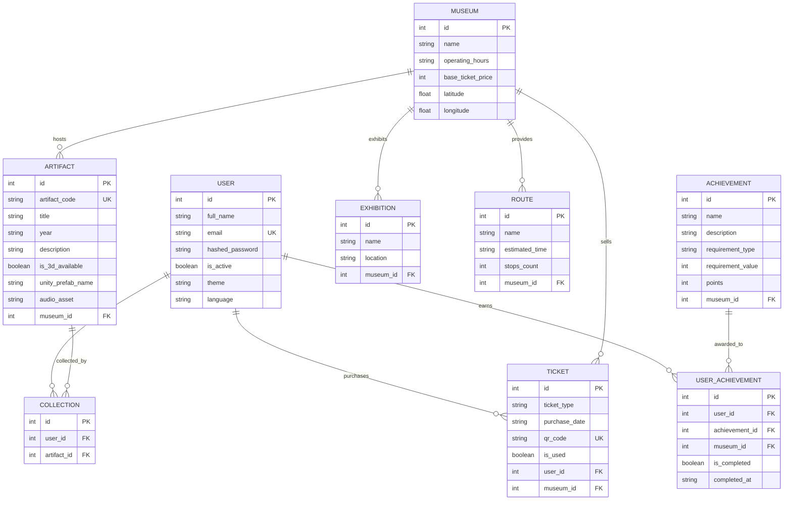
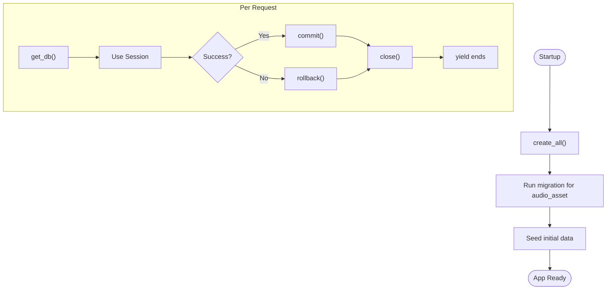
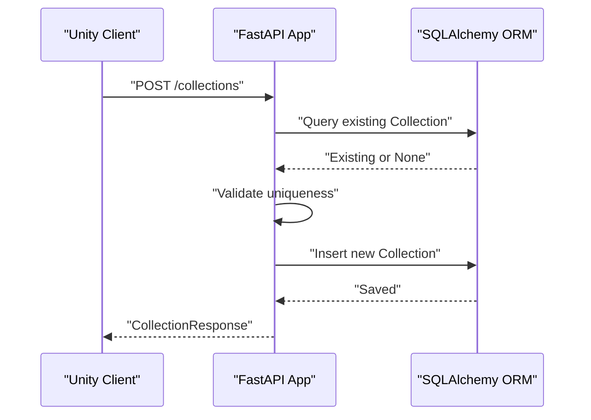
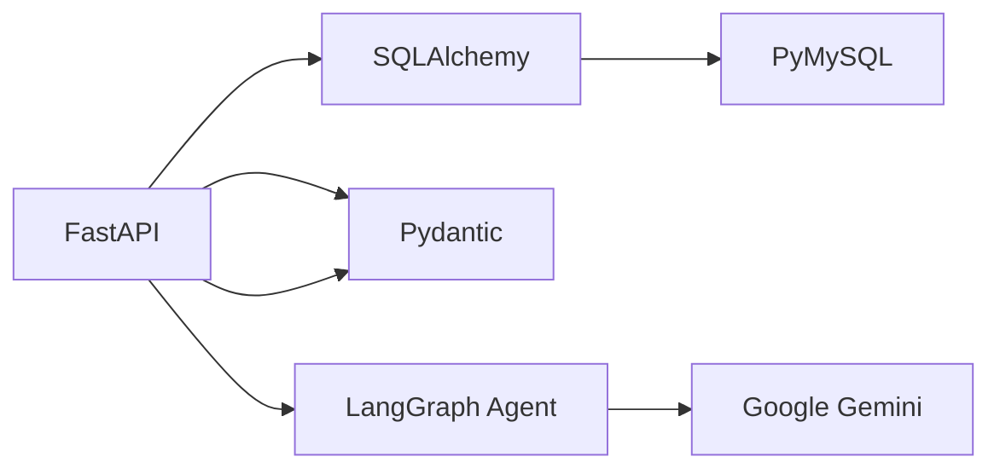

# Data Models & Database Design

<cite>
**Referenced Files in This Document**
- [models.py](file://models.py)
- [schemas.py](file://schemas.py)
- [database.py](file://database.py)
- [main.py](file://main.py)
- [agent.py](file://agent.py)
- [security.py](file://security.py)
- [README.md](file://README.md)
- [requirements.txt](file://requirements.txt)
</cite>

## Table of Contents
1. [Introduction](#introduction)
2. [Project Structure](#project-structure)
3. [Core Components](#core-components)
4. [Architecture Overview](#architecture-overview)
5. [Detailed Component Analysis](#detailed-component-analysis)
6. [Dependency Analysis](#dependency-analysis)
7. [Performance Considerations](#performance-considerations)
8. [Troubleshooting Guide](#troubleshooting-guide)
9. [Conclusion](#conclusion)
10. [Appendices](#appendices)

## Introduction
This document provides comprehensive data model documentation for the MuseAmigo Backend database schema. It covers all entities (User, Museum, Artifact, Collection, Achievement, UserAchievement, Ticket, Route, and Exhibition), their fields, data types, primary and foreign keys, indexes, and constraints. It also explains SQLAlchemy ORM relationships, model inheritance patterns, database indexing strategies, and how Pydantic schemas define validation rules. Additionally, it documents database connection management, session handling, transaction patterns, data lifecycle, cascading operations, referential integrity, migration guidance, and performance optimization techniques.

## Project Structure
The backend is organized around a FastAPI application with SQLAlchemy ORM models, Pydantic schemas, and database configuration. The main application initializes tables, seeds initial data, exposes API endpoints, and integrates an AI agent that queries the database.

**Diagram sources**
- [main.py:12-13](file://main.py#L12-L13)
- [database.py:18-38](file://database.py#L18-L38)
- [models.py:1-105](file://models.py#L1-L105)
- [schemas.py:1-137](file://schemas.py#L1-L137)
- [agent.py:94-105](file://agent.py#L94-L105)

**Section sources**
- [main.py:12-13](file://main.py#L12-L13)
- [database.py:18-38](file://database.py#L18-L38)
- [models.py:1-105](file://models.py#L1-L105)
- [schemas.py:1-137](file://schemas.py#L1-L137)
- [agent.py:94-105](file://agent.py#L94-L105)

## Core Components
This section outlines the core database entities and their roles in the system.

- User: Represents app users with profile settings and authentication fields.
- Museum: Stores museum metadata including location and pricing.
- Artifact: Holds artifact details linked to a museum, including 3D and audio assets.
- Collection: Tracks which artifacts belong to which users.
- Achievement: Defines unlockable goals with requirements and points.
- UserAchievement: Tracks user progress toward achievements.
- Ticket: Manages purchased tickets with QR codes and usage status.
- Route: Provides curated visit routes within a museum.
- Exhibition: Lists temporary or permanent exhibitions in a museum.

**Section sources**
- [models.py:4-105](file://models.py#L4-L105)

## Architecture Overview
The system uses FastAPI with SQLAlchemy ORM and Pydantic for validation. Sessions are managed via a dependency function, and the agent uses a separate session to query the database for AI-driven assistance.

**Diagram sources**
- [main.py:538-568](file://main.py#L538-L568)
- [main.py:610-632](file://main.py#L610-L632)
- [agent.py:17-35](file://agent.py#L17-L35)
- [agent.py:94-105](file://agent.py#L94-L105)

## Detailed Component Analysis

### Entity Relationship Diagram (ERD)
This diagram shows the relationships among all entities, highlighting primary and foreign keys.

**Diagram sources**
- [models.py:4-105](file://models.py#L4-L105)

### Field Definitions, Data Types, Primary/Foreign Keys, Indexes, and Constraints
Below are the field-level definitions derived from the SQLAlchemy models and Pydantic schemas.

- User
  - id: Integer, primary key, indexed
  - full_name: String(100)
  - email: String(100), unique, indexed
  - hashed_password: String(255)
  - is_active: Boolean, default True
  - theme: String(20), default "light"
  - language: String(20), default "en"

- Museum
  - id: Integer, primary key, indexed
  - name: String(100), indexed
  - operating_hours: String(50)
  - base_ticket_price: Integer
  - latitude: Float
  - longitude: Float

- Artifact
  - id: Integer, primary key, indexed
  - artifact_code: String(50), unique, indexed
  - title: String(100)
  - year: String(50)
  - description: String(2000)
  - is_3d_available: Boolean, default False
  - unity_prefab_name: String(100)
  - audio_asset: String(200), default ""
  - museum_id: Integer, foreign key to Museum.id

- Collection
  - id: Integer, primary key, indexed
  - user_id: Integer, foreign key to User.id
  - artifact_id: Integer, foreign key to Artifact.id

- Exhibition
  - id: Integer, primary key, indexed
  - name: String(100)
  - location: String(100)
  - museum_id: Integer, foreign key to Museum.id

- Ticket
  - id: Integer, primary key, indexed
  - ticket_type: String(50)
  - purchase_date: String(50)
  - qr_code: String(255), unique, indexed
  - is_used: Boolean, default False
  - user_id: Integer, foreign key to User.id
  - museum_id: Integer, foreign key to Museum.id

- Route
  - id: Integer, primary key, indexed
  - name: String(100)
  - estimated_time: String(50)
  - stops_count: Integer
  - museum_id: Integer, foreign key to Museum.id

- Achievement
  - id: Integer, primary key, indexed
  - name: String(100)
  - description: String(500)
  - requirement_type: String(50)
  - requirement_value: Integer
  - points: Integer, default 50
  - museum_id: Integer, nullable, foreign key to Museum.id

- UserAchievement
  - id: Integer, primary key, indexed
  - user_id: Integer, foreign key to User.id
  - achievement_id: Integer, foreign key to Achievement.id
  - museum_id: Integer, nullable, foreign key to Museum.id
  - is_completed: Boolean, default False
  - completed_at: String(50), nullable

Notes:
- Unique constraints are enforced at the database level for email, artifact_code, and qr_code.
- Indexes are defined on frequently queried columns (id, email, artifact_code, qr_code, name, museum_id).
- Some fields are nullable by design (e.g., museum_id in Achievement and UserAchievement), enabling global achievements.

**Section sources**
- [models.py:4-105](file://models.py#L4-L105)

### SQLAlchemy ORM Relationships and Inheritance Patterns
- Inheritance: All models inherit from a shared declarative base class, enabling unified table creation and session management.
- Relationships:
  - One-to-many: Museum hosts multiple Artifacts, Exhibitions, Routes, and Tickets.
  - Many-to-one: Artifact belongs to one Museum; Collection links Users and Artifacts; Tickets link Users and Museums; Routes belong to Museums; Achievements belong to Museums (nullable).
  - Many-to-many via join tables: User and Artifact are connected through Collection; User and Achievement are connected through UserAchievement.
- No explicit relationship declarations are present in the models; foreign keys are used to enforce referential integrity. Application logic handles joins and validations.

**Section sources**
- [models.py:4-105](file://models.py#L4-L105)

### Database Indexing Strategies
- Primary keys are indexed by default.
- Additional indexes:
  - email (User)
  - artifact_code (Artifact)
  - qr_code (Ticket)
  - name (Museum)
  - museum_id (Artifact, Exhibition, Route, Ticket)
These indexes optimize frequent lookups and joins.

**Section sources**
- [models.py:7-25](file://models.py#L7-L25)
- [models.py:30-42](file://models.py#L30-L42)
- [models.py:65-73](file://models.py#L65-L73)
- [models.py:18-25](file://models.py#L18-L25)
- [models.py:48-50](file://models.py#L48-L50)
- [models.py:55-60](file://models.py#L55-L60)
- [models.py:83-84](file://models.py#L83-L84)
- [models.py:72-73](file://models.py#L72-L73)

### Data Validation Rules (Pydantic Schemas)
Pydantic schemas define request/response shapes and validation rules for API interactions.

- UserCreate: full_name, email, password (validated in endpoint).
- UserResponse: id, full_name, email, theme, language (from_attributes enabled).
- UserLogin: email, password.
- MuseumResponse: id, name, operating_hours, base_ticket_price, latitude, longitude.
- ArtifactResponse: id, artifact_code, title, year, description, is_3d_available, museum_id, unity_prefab_name, audio_asset.
- CollectionCreate: user_id, artifact_id.
- CollectionResponse: id, user_id, artifact_id.
- ExhibitionResponse: id, name, location, museum_id.
- TicketCreate: user_id, museum_id, ticket_type.
- TicketResponse: id, ticket_type, purchase_date, qr_code, is_used, user_id, museum_id.
- RouteResponse: id, name, estimated_time, stops_count, museum_id.
- AchievementResponse: id, name, description, requirement_type, requirement_value, points, museum_id (nullable).
- UserAchievementResponse: id, user_id, achievement_id, museum_id (nullable), is_completed, completed_at (nullable).
- UserSettingsUpdate: theme, language.
- ChatRequest: message.
- ChatResponse: reply.

Validation highlights:
- Password length validation in registration endpoint.
- Case-insensitive artifact code lookup with normalization.
- Integrity errors handled for duplicate email and unique constraints.

**Section sources**
- [schemas.py:4-137](file://schemas.py#L4-L137)
- [main.py:538-568](file://main.py#L538-L568)
- [main.py:610-632](file://main.py#L610-L632)

### Database Connection Management, Session Handling, and Transactions
- Engine and Session:
  - Engine configured with connection pooling (pool_size, max_overflow, pool_pre_ping, pool_recycle).
  - SessionLocal bound to the engine for request-scoped sessions.
  - get_db dependency yields a session and ensures closure in finally block.
- Transaction patterns:
  - Commit after inserts/updates; refresh to populate auto-generated IDs.
  - Rollback on IntegrityError and other exceptions to maintain consistency.
- Seed and migration:
  - create_all on startup to initialize tables.
  - Startup migration adds audio_asset column if missing.
  - Seed functions populate initial data for museums, artifacts, exhibitions, routes, and achievements.

**Diagram sources**
- [main.py:12-13](file://main.py#L12-L13)
- [main.py:512-526](file://main.py#L512-L526)
- [main.py:491-510](file://main.py#L491-L510)
- [database.py:18-38](file://database.py#L18-L38)

**Section sources**
- [database.py:18-38](file://database.py#L18-L38)
- [main.py:12-13](file://main.py#L12-L13)
- [main.py:512-526](file://main.py#L512-L526)
- [main.py:491-510](file://main.py#L491-L510)

### Data Lifecycle, Cascading Operations, and Referential Integrity
- Referential integrity:
  - Foreign keys enforce parent-child relationships; deletion attempts on parents without cascade will fail.
  - Unique constraints prevent duplicates for email, artifact_code, and qr_code.
- Data lifecycle:
  - Creation: Registration, artifact lookup, collection addition, ticket purchase, route and exhibition retrieval.
  - Updates: User settings update, achievement completion tracking.
  - Deletion: Reset user achievements for a museum via delete operation.
- Cascading:
  - No explicit cascade options are defined in the models; referential integrity is maintained via foreign keys and application-level checks.

**Section sources**
- [models.py:4-105](file://models.py#L4-L105)
- [main.py:634-661](file://main.py#L634-L661)
- [main.py:669-694](file://main.py#L669-L694)
- [main.py:724-735](file://main.py#L724-L735)

### Sample Data Structures
Representative samples for seeding and API responses:

- Museum
  - name: "Independence Palace"
  - operating_hours: "8:00 AM - 5:00 PM"
  - base_ticket_price: 30000
  - latitude: 10.7769
  - longitude: 106.6953

- Artifact
  - artifact_code: "IP-001"
  - title: "Presidential Desk"
  - year: "1960s"
  - description: "Historical artifact..."
  - is_3d_available: true
  - unity_prefab_name: "Model_Presidential_Desk"
  - audio_asset: "assets/audio/artifact_001.wav"
  - museum_id: 1

- Ticket
  - ticket_type: "Adult"
  - purchase_date: "YYYY-MM-DD"
  - qr_code: "MUSEUM-1-USER-1-A8F3B92C"
  - is_used: false
  - user_id: 1
  - museum_id: 1

- Achievement
  - name: "First Steps"
  - description: "Scan your first artifact"
  - requirement_type: "scan_count"
  - requirement_value: 1
  - points: 50
  - museum_id: null

- UserAchievement
  - user_id: 1
  - achievement_id: 1
  - museum_id: null
  - is_completed: true
  - completed_at: "YYYY-MM-DD"

**Section sources**
- [main.py:26-72](file://main.py#L26-L72)
- [main.py:75-187](file://main.py#L75-L187)
- [main.py:190-268](file://main.py#L190-L268)
- [main.py:271-350](file://main.py#L271-L350)
- [main.py:352-488](file://main.py#L352-L488)
- [main.py:669-694](file://main.py#L669-L694)
- [main.py:738-844](file://main.py#L738-L844)

### API Workflows and Data Validation
- Registration:
  - Validates presence and length of password; prevents duplicate emails via IntegrityError handling.
- Artifact Lookup:
  - Case-insensitive search with normalization; supports exact and partial matches.
- Collection Addition:
  - Prevents duplicate entries for the same user-artifact pair.
- Ticket Purchase:
  - Generates unique QR code and persists ticket record.
- Achievement Calculation:
  - Computes progress based on scan counts, museum visits, and global requirements; auto-completes eligible achievements.

**Diagram sources**
- [main.py:634-661](file://main.py#L634-L661)

**Section sources**
- [main.py:538-568](file://main.py#L538-L568)
- [main.py:610-632](file://main.py#L610-L632)
- [main.py:634-661](file://main.py#L634-L661)
- [main.py:669-694](file://main.py#L669-L694)
- [main.py:738-844](file://main.py#L738-L844)

## Dependency Analysis
External libraries and their roles:
- FastAPI: Web framework for building APIs.
- SQLAlchemy: ORM for database modeling and queries.
- Pydantic: Data validation and serialization.
- PyMySQL: MySQL driver.
- python-dotenv: Environment variable loading.
- LangChain + Google Gemini: AI agent for contextual assistance.

**Diagram sources**
- [requirements.txt:12-47](file://requirements.txt#L12-L47)
- [agent.py:94-105](file://agent.py#L94-L105)

**Section sources**
- [requirements.txt:12-47](file://requirements.txt#L12-L47)
- [agent.py:94-105](file://agent.py#L94-L105)

## Performance Considerations
- Connection pooling: Engine configured with pool_size and max_overflow to handle concurrent requests efficiently.
- Pre-ping and recycle: pool_pre_ping and pool_recycle reduce stale connections and improve reliability.
- Indexes: Strategic indexes on frequently filtered columns (email, artifact_code, qr_code, museum_id) enhance query performance.
- Query patterns: Use filters on indexed columns; avoid SELECT *; leverage joins and filters in endpoints.
- AI queries: Agent opens and closes sessions per tool invocation to minimize long-lived connections.

[No sources needed since this section provides general guidance]

## Troubleshooting Guide
Common issues and resolutions:
- IntegrityError on registration:
  - Cause: Duplicate email.
  - Resolution: Catch IntegrityError, rollback, and return user-friendly error.
- Artifact not found:
  - Cause: Incorrect or mismatched artifact code.
  - Resolution: Normalize input (strip and uppercase); support partial matches; return clear error messages.
- Achievement calculation anomalies:
  - Cause: Missing or inconsistent collection data.
  - Resolution: Verify collection records and artifact-museum linkage; re-run achievement computation.
- Database connectivity:
  - Cause: Pool exhaustion or stale connections.
  - Resolution: Adjust pool settings; ensure sessions are closed in finally blocks.

**Section sources**
- [main.py:554-568](file://main.py#L554-L568)
- [main.py:610-632](file://main.py#L610-L632)
- [main.py:738-844](file://main.py#L738-L844)
- [database.py:18-38](file://database.py#L18-L38)

## Conclusion
The MuseAmigo Backend employs a clean, relational schema with clear entity boundaries and robust indexing. SQLAlchemy ORM and Pydantic schemas provide strong typing and validation. Session management and transaction patterns ensure data consistency. The AI agent integrates seamlessly with the database to deliver contextual assistance. With proper migration practices and performance tuning, the system scales effectively for museum experiences.

[No sources needed since this section summarizes without analyzing specific files]

## Appendices

### Database Migration Guidance
- Add new column safely:
  - Use a migration function that attempts to add the column and gracefully handles “already exists” errors.
  - Commit on success; rollback otherwise.
- Schema updates:
  - Prefer explicit ALTER TABLE statements for backward-compatible changes.
  - Validate constraints and indexes post-migration.

**Section sources**
- [main.py:491-510](file://main.py#L491-L510)

### Security Notes
- Authentication:
  - Password hashing and verification utilities are available; current login endpoint compares plaintext for demonstration.
  - Recommendation: Hash passwords before storage and verify hashed values during login.
- Environment variables:
  - DATABASE_URL and GOOGLE_API_KEY are loaded from .env; keep secrets out of version control.

**Section sources**
- [security.py:1-12](file://security.py#L1-L12)
- [database.py:12-15](file://database.py#L12-L15)
- [agent.py:10-15](file://agent.py#L10-L15)

### External References
- Cloud database connection parameters and deployment details are documented in the project README.

**Section sources**
- [README.md:7-21](file://README.md#L7-L21)
- [README.md:24-33](file://README.md#L24-L33)
- [README.md:36-49](file://README.md#L36-L49)