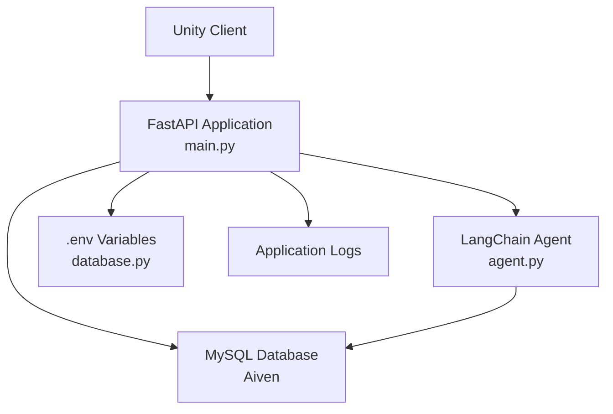
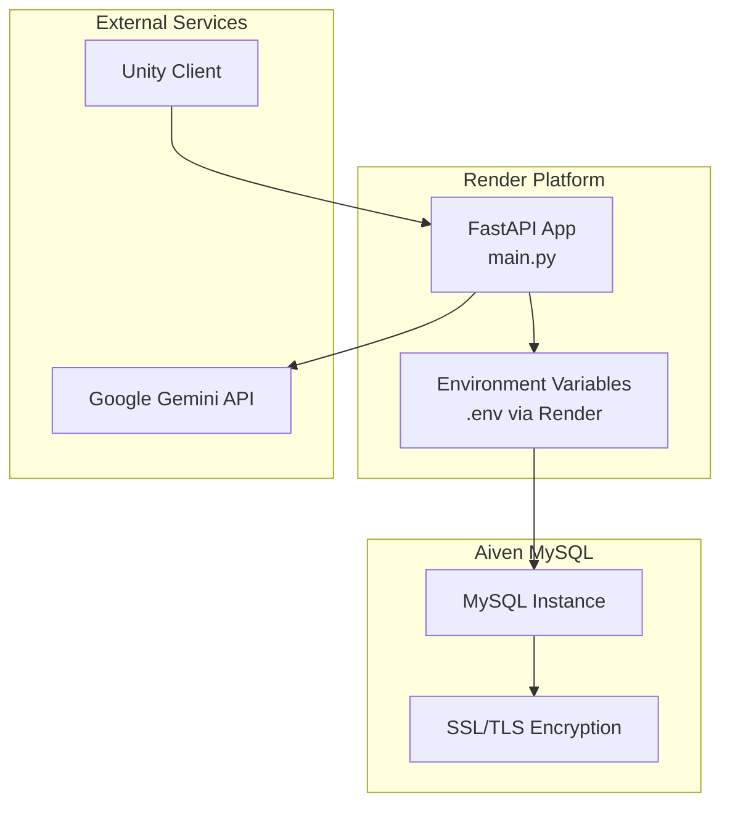
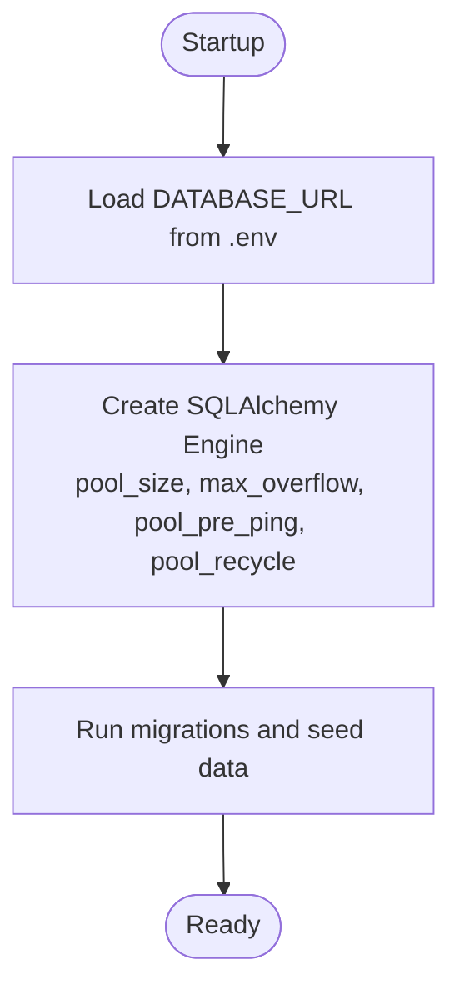
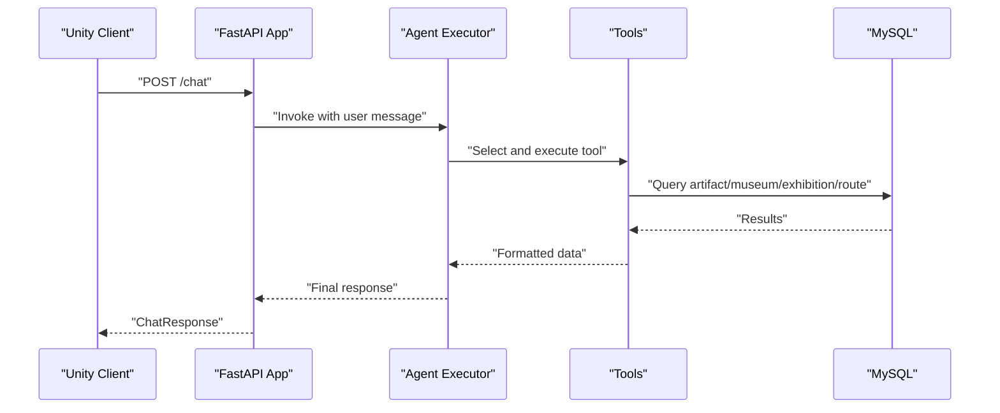
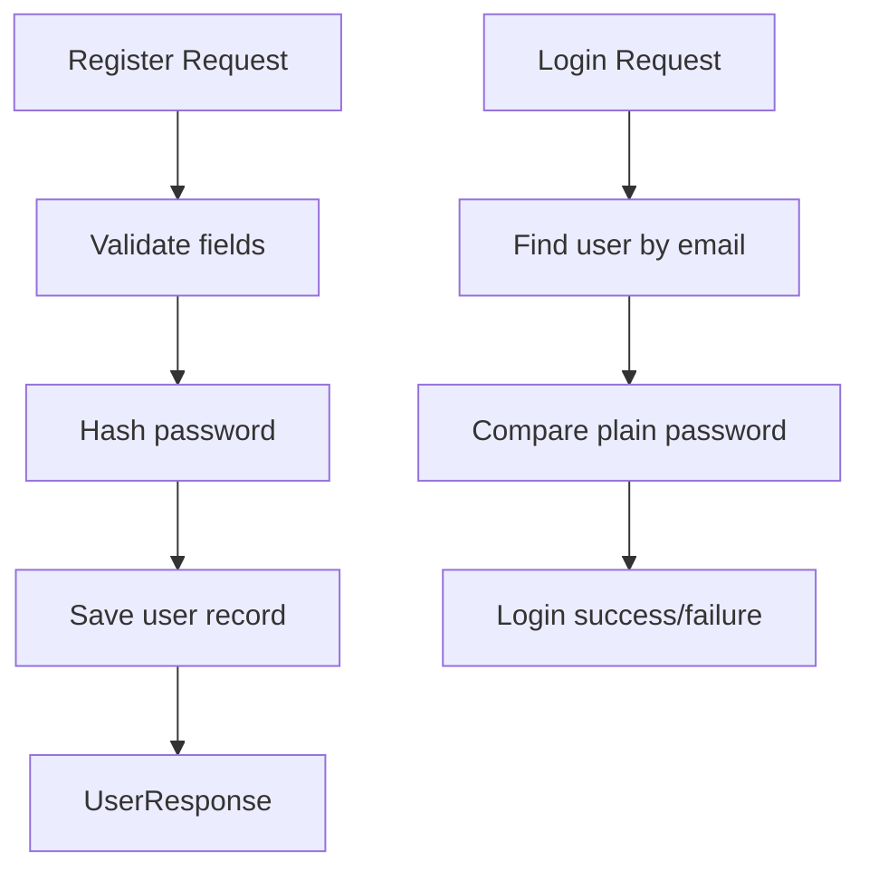
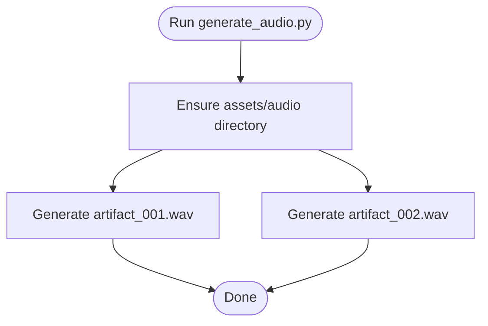
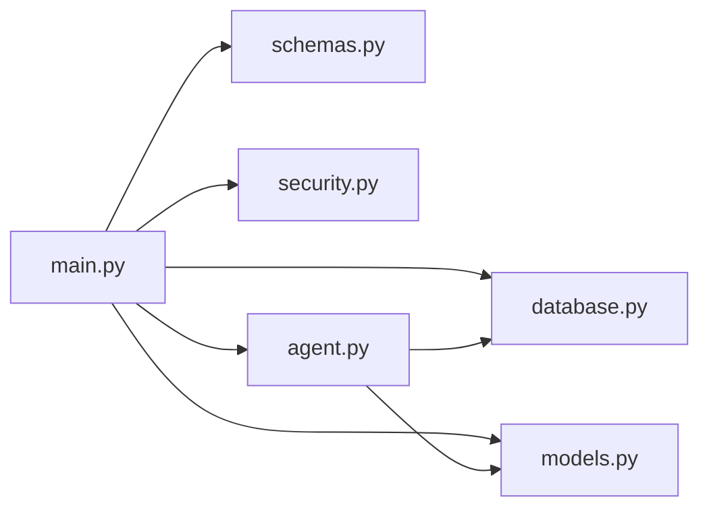

# Deployment & Production

<cite>
**Referenced Files in This Document**
- [README.md](file://README.md)
- [requirements.txt](file://requirements.txt)
- [main.py](file://main.py)
- [database.py](file://database.py)
- [models.py](file://models.py)
- [schemas.py](file://schemas.py)
- [security.py](file://security.py)
- [agent.py](file://agent.py)
- [generate_audio.py](file://generate_audio.py)
</cite>

## Table of Contents
1. [Introduction](#introduction)
2. [Project Structure](#project-structure)
3. [Core Components](#core-components)
4. [Architecture Overview](#architecture-overview)
5. [Detailed Component Analysis](#detailed-component-analysis)
6. [Dependency Analysis](#dependency-analysis)
7. [Performance Considerations](#performance-considerations)
8. [Troubleshooting Guide](#troubleshooting-guide)
9. [Conclusion](#conclusion)
10. [Appendices](#appendices)

## Introduction
This document provides comprehensive deployment and production guidance for the MuseAmigo Backend. It covers:
- Render cloud deployment and environment configuration
- Database deployment on Aiven MySQL, connection string management, and SSL/TLS configuration
- CI/CD workflow via GitHub integration and automated deployment
- Monitoring, logging, and performance optimization strategies
- Scaling, load balancing, and high availability patterns
- Security hardening, backup procedures, and disaster recovery planning
- Troubleshooting guides for common deployment issues, cold start optimization, and production maintenance

## Project Structure
The backend is a FastAPI application with integrated AI agent capabilities powered by Google Gemini. It connects to a MySQL database hosted on Aiven and exposes REST endpoints consumed by a Unity client. The repository includes:
- Application entry and routing logic
- Database abstraction and connection pooling
- Data models and Pydantic schemas
- Authentication helpers and security utilities
- AI agent integration and tooling
- Audio generation utilities for artifact narration
- Dependencies and deployment metadata

**Diagram sources**
- [main.py:15-23](file://main.py#L15-L23)
- [database.py:12-24](file://database.py#L12-L24)
- [agent.py:104-105](file://agent.py#L104-L105)

**Section sources**
- [README.md:1-95](file://README.md#L1-L95)
- [requirements.txt:1-59](file://requirements.txt#L1-L59)

## Core Components
- FastAPI application with CORS middleware and startup seeding
- SQLAlchemy ORM for database modeling and session management
- Pydantic models for request/response validation
- Security utilities for password hashing and verification
- LangChain agent with tools for artifact, museum, exhibition, and route queries
- Audio generation utilities for artifact narration

Key runtime characteristics:
- Environment-driven database URL with fallback to local MySQL
- Connection pooling and pre-ping enabled for reliability
- Startup data seeding and schema migrations
- AI agent requires a valid Google API key

**Section sources**
- [main.py:12-23](file://main.py#L12-L23)
- [database.py:12-24](file://database.py#L12-L24)
- [models.py:1-105](file://models.py#L1-L105)
- [schemas.py:1-137](file://schemas.py#L1-L137)
- [security.py:1-12](file://security.py#L1-L12)
- [agent.py:104-105](file://agent.py#L104-L105)

## Architecture Overview
The production architecture centers on Render hosting the FastAPI application, connecting to Aiven MySQL for persistence, and integrating with Google Gemini for conversational AI. The Unity client consumes the exposed REST endpoints.

**Diagram sources**
- [README.md:24-26](file://README.md#L24-L26)
- [database.py:12-24](file://database.py#L12-L24)
- [agent.py:14](file://agent.py#L14)

## Detailed Component Analysis

### Database Layer
- Connection string management via environment variable with local fallback
- Connection pooling configured for throughput and resilience
- Pre-ping and recycle settings to maintain healthy connections
- Startup migration to add optional audio asset column

**Diagram sources**
- [database.py:12-24](file://database.py#L12-L24)
- [main.py:512-525](file://main.py#L512-L525)

**Section sources**
- [database.py:12-24](file://database.py#L12-L24)
- [main.py:491-510](file://main.py#L491-L510)

### AI Agent Integration
- Tools for artifact details, museum info, exhibitions, and routes
- Gemini LLM configured with a specific model and temperature
- Tool execution within a React agent executor

**Diagram sources**
- [agent.py:17-91](file://agent.py#L17-L91)
- [agent.py:104-105](file://agent.py#L104-L105)

**Section sources**
- [agent.py:104-105](file://agent.py#L104-L105)

### Authentication and Security
- Password hashing and verification using bcrypt
- Basic validation in registration and login endpoints
- Environment-driven secrets for database and AI

**Diagram sources**
- [main.py:538-568](file://main.py#L538-L568)
- [main.py:569-601](file://main.py#L569-L601)
- [security.py:7-12](file://security.py#L7-L12)

**Section sources**
- [security.py:1-12](file://security.py#L1-L12)
- [main.py:538-601](file://main.py#L538-L601)

### Audio Asset Generation
- Utility to generate placeholder WAV files for artifact narration
- Outputs to a path intended for the Unity assets folder

**Diagram sources**
- [generate_audio.py:41-77](file://generate_audio.py#L41-L77)

**Section sources**
- [generate_audio.py:1-78](file://generate_audio.py#L1-L78)

## Dependency Analysis
Runtime dependencies include FastAPI, SQLAlchemy, PyMySQL, uvicorn, and Google Gemini integration libraries. The application relies on environment variables for database and AI configuration.

**Diagram sources**
- [main.py:1-10](file://main.py#L1-L10)
- [database.py:1-5](file://database.py#L1-L5)
- [models.py:1-2](file://models.py#L1-L2)
- [schemas.py:1-1](file://schemas.py#L1-L1)
- [security.py:1-1](file://security.py#L1-L1)
- [agent.py:1-8](file://agent.py#L1-L8)

**Section sources**
- [requirements.txt:1-59](file://requirements.txt#L1-L59)

## Performance Considerations
- Connection pooling: Tune pool_size and max_overflow based on expected concurrency and Render plan limits
- Pre-ping and recycle: Ensures stale connections are refreshed
- Startup seeding: Minimizes first-request latency by initializing data at startup
- AI agent: Consider caching frequent queries and limiting tool execution frequency
- Static assets: Serve audio assets efficiently via CDN or Render static assets if applicable

[No sources needed since this section provides general guidance]

## Troubleshooting Guide
Common deployment issues and resolutions:
- Missing environment variables
  - Ensure DATABASE_URL and GOOGLE_API_KEY are set in Render
  - Verify .env is not committed to the repository
- Cold start delays
  - Expect slower first request on free Render plans; inform users accordingly
- Database connectivity
  - Confirm Aiven MySQL SSL/TLS settings and network access
  - Validate connection string format and credentials
- AI agent failures
  - Verify GOOGLE_API_KEY presence and quota limits
- CORS errors
  - Adjust allow_origins for production domains if needed

**Section sources**
- [README.md:19-20](file://README.md#L19-L20)
- [README.md:92-94](file://README.md#L92-L94)
- [agent.py:14](file://agent.py#L14)
- [database.py:12-15](file://database.py#L12-L15)

## Conclusion
This guide outlines a production-ready deployment strategy for MuseAmigo Backend on Render, backed by Aiven MySQL and integrated with Google Gemini. By following the outlined procedures for environment configuration, CI/CD automation, monitoring, security hardening, and operational maintenance, teams can achieve reliable, scalable, and secure delivery of the backend service.

[No sources needed since this section summarizes without analyzing specific files]

## Appendices

### A. Render Deployment Checklist
- Create a new Web Service on Render pointing to the repository
- Configure environment variables:
  - DATABASE_URL: Aiven MySQL connection string with SSL/TLS
  - GOOGLE_API_KEY: Gemini API key
- Set build and run commands appropriate for Python and uvicorn
- Enable automatic deploys on branch push
- Configure domain and SSL certificate for HTTPS

**Section sources**
- [README.md:24-26](file://README.md#L24-L26)
- [README.md:36-48](file://README.md#L36-L48)

### B. Aiven MySQL Setup and SSL/TLS
- Provision a MySQL service on Aiven
- Use the provided host, port, username, password, and database
- Ensure SSL/TLS is enabled and enforced by the connection string
- Whitelist Render outbound IPs if private access is required

**Section sources**
- [README.md:7-18](file://README.md#L7-L18)

### C. CI/CD Workflow
- Commit and push changes to the main branch
- Render automatically builds and deploys the latest commit
- Monitor build logs for dependency installation and startup errors

**Section sources**
- [README.md:36-48](file://README.md#L36-L48)

### D. Monitoring and Logging
- Enable Render logs and export to external log aggregation if needed
- Add structured logging around database operations and agent tool execution
- Monitor response times and error rates for key endpoints

[No sources needed since this section provides general guidance]

### E. Security Hardening
- Store secrets in Render environment variables, never in code or .env
- Enforce HTTPS and restrict CORS origins in production
- Rotate API keys and database credentials regularly
- Audit access logs and monitor for anomalies

**Section sources**
- [README.md:19-20](file://README.md#L19-L20)

### F. Backup and Disaster Recovery
- Back up Aiven MySQL snapshots regularly
- Maintain offsite backups of application configuration and secrets
- Document restore procedures and conduct periodic drills

[No sources needed since this section provides general guidance]

### G. Scaling and High Availability
- Scale Render instances horizontally if traffic increases
- Use Aiven MySQL cluster for high availability and read replicas
- Implement circuit breakers and retries for AI agent calls

[No sources needed since this section provides general guidance]

### H. Cold Start Optimization
- Keep application warm by pinging endpoints periodically
- Reduce startup work where possible while maintaining functionality
- Consider Render’s paid plan for reduced cold starts if budget allows

**Section sources**
- [README.md:92-94](file://README.md#L92-L94)