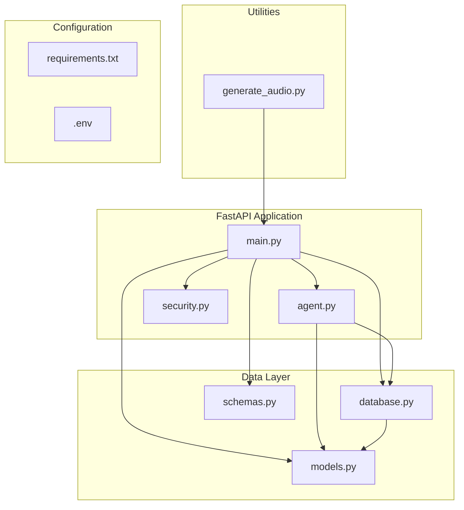
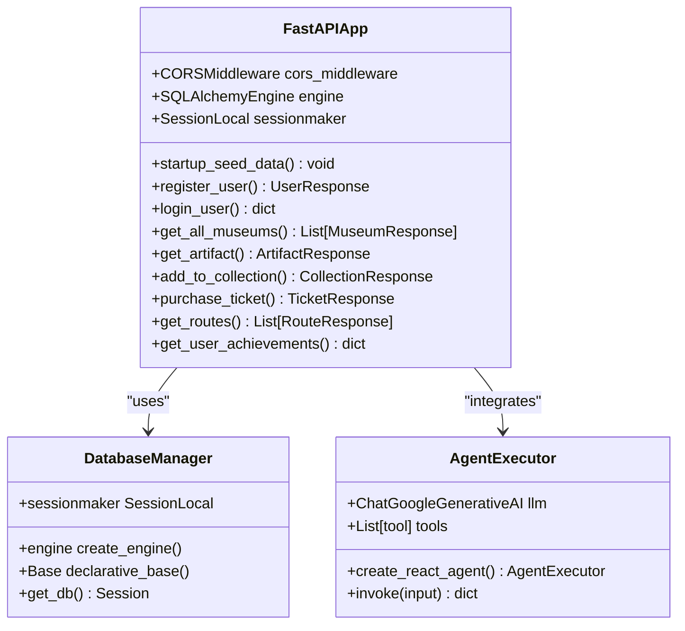
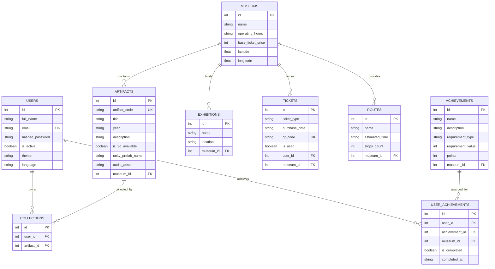
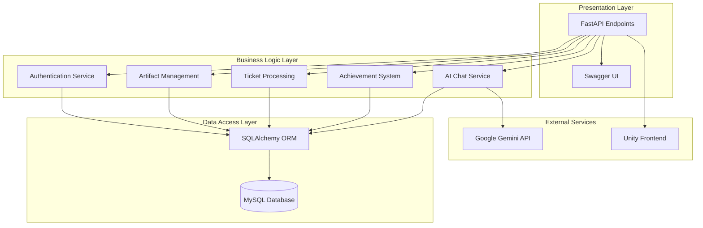
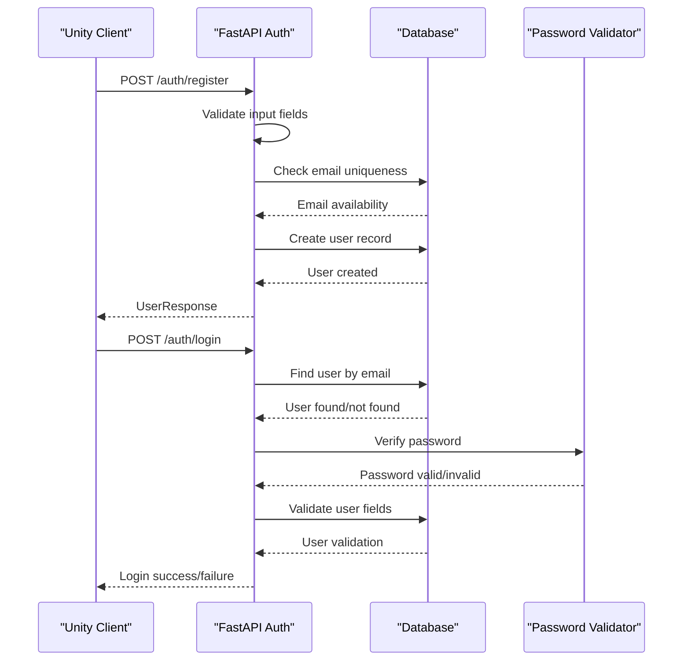
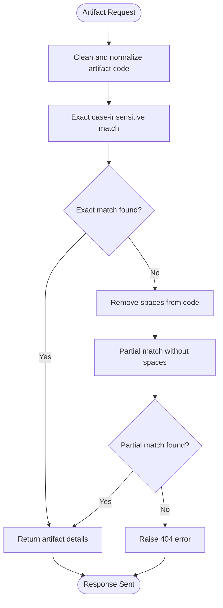
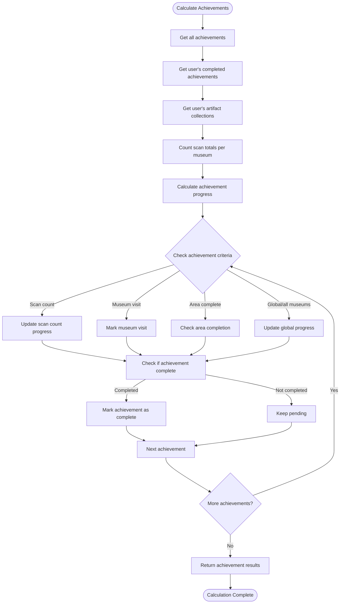
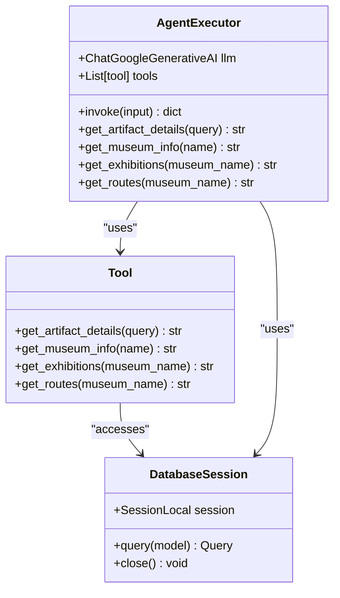
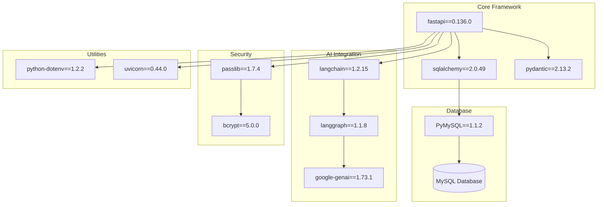
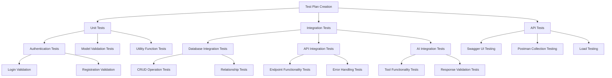

# Development Guidelines

<cite>
**Referenced Files in This Document**
- [main.py](file://main.py)
- [agent.py](file://agent.py)
- [database.py](file://database.py)
- [models.py](file://models.py)
- [schemas.py](file://schemas.py)
- [security.py](file://security.py)
- [generate_audio.py](file://generate_audio.py)
- [README.md](file://README.md)
- [requirements.txt](file://requirements.txt)
- [test_output.txt](file://test_output.txt)
</cite>

## Table of Contents
1. [Introduction](#introduction)
2. [Project Structure](#project-structure)
3. [Core Components](#core-components)
4. [Architecture Overview](#architecture-overview)
5. [Detailed Component Analysis](#detailed-component-analysis)
6. [Dependency Analysis](#dependency-analysis)
7. [Development Workflow](#development-workflow)
8. [Testing Strategies](#testing-strategies)
9. [Code Review Guidelines](#code-review-guidelines)
10. [Debugging and Logging](#debugging-and-logging)
11. [Performance Considerations](#performance-considerations)
12. [Security Best Practices](#security-best-practices)
13. [Deployment Process](#deployment-process)
14. [Troubleshooting Guide](#troubleshooting-guide)
15. [Conclusion](#conclusion)

## Introduction

MuseAmigo is a FastAPI-based backend system designed to manage and enhance visitor experiences at Vietnamese museums through AI-powered interactions and interactive artifact discovery. The system integrates with Unity frontend applications to provide immersive museum navigation, artifact exploration, and gamified learning experiences.

The backend handles core functionalities including user authentication, artifact management, museum information, ticket purchasing, route navigation, achievement systems, and AI-powered chat assistance through Google Gemini integration.

## Project Structure

The MuseAmigo backend follows a modular FastAPI architecture with clear separation of concerns:

**Diagram sources**
- [main.py:1-15](file://main.py#L1-L15)
- [database.py:1-38](file://database.py#L1-L38)
- [models.py:1-105](file://models.py#L1-L105)

**Section sources**
- [main.py:1-15](file://main.py#L1-L15)
- [database.py:1-38](file://database.py#L1-L38)
- [models.py:1-105](file://models.py#L1-L105)

## Core Components

### FastAPI Application Structure

The main application initializes the FastAPI instance with CORS middleware and database schema creation:

**Diagram sources**
- [main.py:15-23](file://main.py#L15-L23)
- [database.py:18-38](file://database.py#L18-L38)
- [agent.py:94-105](file://agent.py#L94-L105)

### Database Models

The system implements a comprehensive relational model with clear relationships:

**Diagram sources**
- [models.py:4-105](file://models.py#L4-L105)

**Section sources**
- [main.py:15-23](file://main.py#L15-L23)
- [models.py:4-105](file://models.py#L4-L105)

## Architecture Overview

The MuseAmigo backend implements a layered architecture with clear separation between presentation, business logic, and data access layers:

**Diagram sources**
- [main.py:538-800](file://main.py#L538-L800)
- [agent.py:17-105](file://agent.py#L17-L105)

## Detailed Component Analysis

### Authentication System

The authentication system implements a straightforward user registration and login mechanism:

**Diagram sources**
- [main.py:538-601](file://main.py#L538-L601)
- [security.py:6-12](file://security.py#L6-L12)

### Artifact Discovery System

The artifact discovery system provides QR code-based artifact retrieval with intelligent matching:

**Diagram sources**
- [main.py:609-632](file://main.py#L609-L632)

### Achievement System

The achievement system tracks user progress across multiple criteria:

**Diagram sources**
- [main.py:738-800](file://main.py#L738-L800)

**Section sources**
- [main.py:538-601](file://main.py#L538-L601)
- [main.py:609-632](file://main.py#L609-L632)
- [main.py:738-800](file://main.py#L738-L800)

### AI Chat Integration

The AI chat system integrates Google Gemini for contextual museum assistance:

**Diagram sources**
- [agent.py:17-105](file://agent.py#L17-L105)
- [agent.py:108-122](file://agent.py#L108-L122)

**Section sources**
- [agent.py:17-105](file://agent.py#L17-L105)
- [agent.py:108-122](file://agent.py#L108-L122)

## Dependency Analysis

The project relies on several key dependencies for its functionality:

**Diagram sources**
- [requirements.txt:12-59](file://requirements.txt#L12-L59)

**Section sources**
- [requirements.txt:12-59](file://requirements.txt#L12-L59)

## Development Workflow

### Local Development Setup

1. **Environment Configuration**
   - Install Python 3.8+
   - Create virtual environment: `python -m venv venv`
   - Activate environment: `venv\Scripts\activate`
   - Install dependencies: `pip install -r requirements.txt`

2. **Database Configuration**
   - Configure `.env` file with database credentials
   - Set `DATABASE_URL` environment variable
   - Ensure MySQL server is running

3. **Application Startup**
   - Run development server: `uvicorn main:app --reload`
   - Access Swagger UI at `http://localhost:8000/docs`

### Testing Procedures

1. **Unit Testing**
   - Test individual functions and utilities
   - Mock database sessions for isolation
   - Validate data validation logic

2. **Integration Testing**
   - Test complete request-response cycles
   - Validate database interactions
   - Test AI integration endpoints

3. **API Testing**
   - Use Swagger UI for manual testing
   - Test all CRUD operations
   - Validate error handling scenarios

### Deployment Process

1. **Code Changes**
   - Update requirements: `pip freeze > requirements.txt`
   - Commit changes with descriptive messages
   - Push to main branch

2. **Automated Deployment**
   - Render platform automatically builds on push
   - Wait for deployment completion (2-3 minutes)
   - Test deployed API endpoints

**Section sources**
- [README.md:24-48](file://README.md#L24-L48)

## Testing Strategies

### Unit Testing Approach

### API Testing with Swagger UI

The Swagger UI provides comprehensive API documentation and testing capabilities:

1. **Access Swagger UI**: Navigate to `/docs` endpoint
2. **Test Endpoints**: Select endpoint and click "Try it out"
3. **Execute Requests**: Click "Execute" to test functionality
4. **Validate Responses**: Check status codes and response data
5. **Test Error Cases**: Validate error handling scenarios

**Section sources**
- [README.md:24-33](file://README.md#L24-L33)

## Code Review Guidelines

### Code Organization Principles

1. **Module Structure**
   - Keep related functionality in separate modules
   - Use clear, descriptive module names
   - Group related imports together

2. **Function Design**
   - Keep functions focused and single-purpose
   - Use meaningful parameter names
   - Return clear, well-documented responses

3. **Error Handling**
   - Use specific HTTP exceptions with appropriate status codes
   - Provide clear error messages
   - Log errors appropriately

### Import Patterns

1. **Standard Library Imports**
   - Place at top of file
   - Group alphabetically

2. **Third-party Imports**
   - Group separately from standard library
   - Import modules, not individual functions when possible

3. **Local Imports**
   - Place after third-party imports
   - Use relative imports for sibling modules

### Coding Standards

1. **Naming Conventions**
   - Use snake_case for variables and functions
   - Use PascalCase for classes
   - Use UPPER_CASE for constants

2. **Documentation**
   - Add docstrings for all functions
   - Document complex logic
   - Include parameter descriptions

3. **Type Hints**
   - Use type hints consistently
   - Document return types
   - Specify optional parameters

**Section sources**
- [main.py:1-15](file://main.py#L1-L15)
- [schemas.py:1-137](file://schemas.py#L1-L137)

## Debugging and Logging

### Debugging Techniques

1. **Development Server**
   - Use `--reload` flag for automatic restarts
   - Leverage IDE debugging capabilities
   - Use print statements for quick debugging

2. **Database Debugging**
   - Enable SQLAlchemy logging
   - Use database client tools
   - Monitor query performance

3. **AI Integration Debugging**
   - Test tools individually
   - Validate API key configuration
   - Monitor external service responses

### Logging Strategies

1. **Application Logging**
   - Use Python logging module
   - Log important events and errors
   - Include context information

2. **Database Logging**
   - Log SQL queries for debugging
   - Monitor connection pooling
   - Track performance metrics

3. **AI Integration Logging**
   - Log tool invocations
   - Track API responses
   - Monitor rate limits

**Section sources**
- [test_output.txt:1-13](file://test_output.txt#L1-L13)

## Performance Considerations

### Database Optimization

1. **Connection Pooling**
   - Configure appropriate pool sizes
   - Use connection pre-ping
   - Implement connection recycling

2. **Query Optimization**
   - Use appropriate indexes
   - Minimize N+1 query problems
   - Optimize complex joins

3. **Caching Strategy**
   - Implement appropriate caching
   - Cache frequently accessed data
   - Use cache invalidation strategies

### API Performance

1. **Response Optimization**
   - Use appropriate response models
   - Minimize data transfer
   - Implement pagination for large datasets

2. **Concurrency Handling**
   - Use async patterns where appropriate
   - Implement proper locking mechanisms
   - Handle concurrent access safely

### AI Integration Performance

1. **Tool Optimization**
   - Cache tool results when safe
   - Batch database queries
   - Implement tool result caching

2. **External Service Management**
   - Handle timeouts gracefully
   - Implement retry logic
   - Monitor service health

## Security Best Practices

### Authentication Security

1. **Password Handling**
   - Use bcrypt hashing
   - Never store plain text passwords
   - Implement password policies

2. **Session Management**
   - Use secure session cookies
   - Implement proper expiration
   - Handle session invalidation

### Data Protection

1. **Input Validation**
   - Validate all user inputs
   - Sanitize data before storage
   - Implement proper escaping

2. **API Security**
   - Use HTTPS in production
   - Implement rate limiting
   - Add input sanitization

### Environment Security

1. **Secret Management**
   - Store secrets in environment variables
   - Never commit secrets to version control
   - Use different secrets for different environments

2. **Database Security**
   - Use connection encryption
   - Implement proper access controls
   - Regular security audits

**Section sources**
- [security.py:6-12](file://security.py#L6-L12)
- [database.py:12-15](file://database.py#L12-L15)

## Deployment Process

### Production Deployment

1. **Environment Configuration**
   - Set production database URL
   - Configure environment-specific settings
   - Set up monitoring and logging

2. **Build Process**
   - Freeze requirements for reproducibility
   - Build static assets if applicable
   - Validate deployment configuration

3. **Deployment Pipeline**
   - Automated deployment on code push
   - Health checks after deployment
   - Rollback procedures

### Monitoring and Maintenance

1. **Application Monitoring**
   - Monitor API response times
   - Track error rates
   - Monitor resource usage

2. **Database Monitoring**
   - Monitor query performance
   - Track connection usage
   - Monitor disk space

3. **AI Service Monitoring**
   - Monitor API usage limits
   - Track response times
   - Monitor error rates

**Section sources**
- [README.md:36-48](file://README.md#L36-L48)

## Troubleshooting Guide

### Common Issues and Solutions

1. **Database Connection Issues**
   - Verify DATABASE_URL environment variable
   - Check database server connectivity
   - Validate connection pool configuration

2. **AI Integration Problems**
   - Verify GOOGLE_API_KEY is set
   - Check API quota limits
   - Validate tool configurations

3. **Authentication Failures**
   - Check password hashing implementation
   - Verify user data integrity
   - Validate session management

4. **Performance Issues**
   - Analyze slow queries
   - Check connection pooling
   - Monitor resource usage

### Error Handling Patterns

1. **HTTP Exceptions**
   - Use appropriate status codes
   - Provide clear error messages
   - Log error details for debugging

2. **Database Errors**
   - Handle integrity constraint violations
   - Implement proper rollback logic
   - Provide user-friendly error messages

3. **AI Integration Errors**
   - Handle external service failures
   - Implement fallback mechanisms
   - Log API errors for monitoring

**Section sources**
- [main.py:560-567](file://main.py#L560-L567)
- [test_output.txt:1-13](file://test_output.txt#L1-L13)

## Conclusion

The MuseAmigo backend provides a robust foundation for museum interaction applications, combining modern FastAPI architecture with AI-powered assistance. The system demonstrates clear architectural principles, comprehensive data modeling, and practical integration patterns.

Key strengths include:
- Well-organized modular structure
- Comprehensive database modeling
- Practical AI integration
- Clear API design
- Solid security practices

Areas for improvement include:
- Enhanced error handling patterns
- Expanded testing coverage
- Performance optimization
- Documentation improvements
- Security hardening

The development guidelines provided here should enable contributors to effectively extend and maintain the MuseAmigo backend while preserving its architectural integrity and performance characteristics.