# Getting Started

<cite>
**Referenced Files in This Document**
- [README.md](file://README.md)
- [requirements.txt](file://requirements.txt)
- [main.py](file://main.py)
- [database.py](file://database.py)
- [models.py](file://models.py)
- [schemas.py](file://schemas.py)
- [agent.py](file://agent.py)
- [security.py](file://security.py)
- [generate_audio.py](file://generate_audio.py)
</cite>

## Table of Contents
1. [Introduction](#introduction)
2. [Prerequisites](#prerequisites)
3. [Environment Setup](#environment-setup)
4. [Database Configuration](#database-configuration)
5. [Local Development Server](#local-development-server)
6. [API Testing with Swagger UI](#api-testing-with-swagger-ui)
7. [Unity Frontend Integration](#unity-frontend-integration)
8. [Core Components](#core-components)
9. [Architecture Overview](#architecture-overview)
10. [Detailed Component Analysis](#detailed-component-analysis)
11. [Dependency Analysis](#dependency-analysis)
12. [Performance Considerations](#performance-considerations)
13. [Troubleshooting Guide](#troubleshooting-guide)
14. [Conclusion](#conclusion)

## Introduction
This guide helps you set up and run the MuseAmigo Backend locally, connect to a MySQL database (via Aiven), explore the API with Swagger UI, and integrate with a Unity frontend. The backend is built with FastAPI, uses SQLAlchemy for ORM, and integrates Google Gemini for conversational capabilities.

## Prerequisites
- Python 3.x installed on your machine
- Basic understanding of FastAPI and REST APIs
- Familiarity with relational databases (tables, relations, migrations)
- Access to a MySQL-compatible database (Aiven recommended)
- Optional: Unity editor for frontend integration

**Section sources**
- [README.md:1-4](file://README.md#L1-L4)

## Environment Setup
Follow these steps to prepare your local environment:

1. **Clone or download the repository** to your local machine.
2. **Create a virtual environment**:
   - On Windows: `python -m venv venv`
   - Activate it: `venv\Scripts\activate`
3. **Install dependencies**:
   - `pip install -r requirements.txt`
4. **Set up environment variables**:
   - Create a `.env` file at the project root with the following keys:
     - `DATABASE_URL`: your MySQL connection string (see Database Configuration)
     - `GOOGLE_API_KEY`: your Google AI API key for conversational features
5. **Verify installation**:
   - Confirm all packages from requirements.txt are installed.

**Section sources**
- [requirements.txt:1-59](file://requirements.txt#L1-L59)
- [database.py:8-15](file://database.py#L8-L15)
- [agent.py:10-15](file://agent.py#L10-L15)

## Database Configuration
The backend supports both local MySQL and Aiven MySQL. Configure your database as follows:

- **Local MySQL fallback**:
  - The application defaults to a local MySQL connection string if `DATABASE_URL` is not set in `.env`.
- **Aiven MySQL setup**:
  - Use the connection parameters provided in the project documentation for DBeaver to configure your Aiven instance.
  - Set `DATABASE_URL` in `.env` to your Aiven MySQL connection string.
- **Connection string format**:
  - Use the `mysql+pymysql` dialect as shown in the database module.
- **Initial migration and seeding**:
  - The application creates tables on startup and seeds initial data (museums, artifacts, exhibitions, routes, achievements).
  - A migration script adds the `audio_asset` column to the artifacts table if missing.

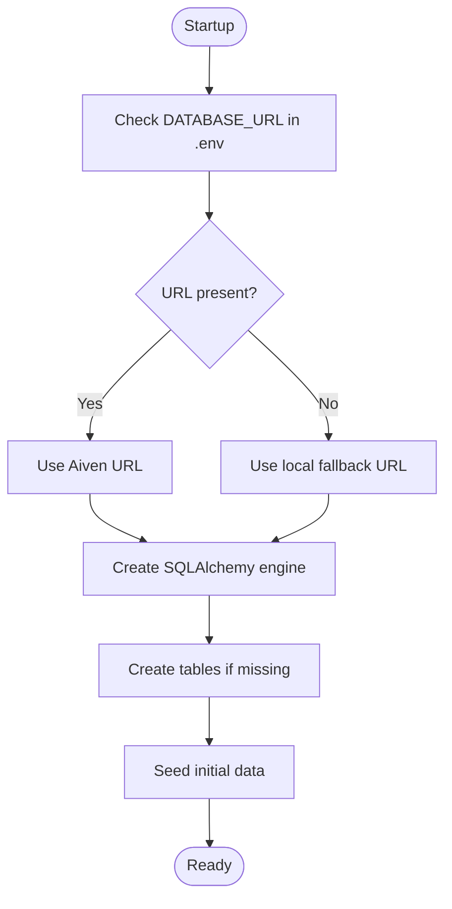

**Diagram sources**
- [database.py:18-38](file://database.py#L18-L38)
- [main.py:12-13](file://main.py#L12-L13)
- [main.py:512-525](file://main.py#L512-L525)
- [main.py:491-510](file://main.py#L491-L510)

**Section sources**
- [database.py:11-24](file://database.py#L11-L24)
- [main.py:12-13](file://main.py#L12-L13)
- [main.py:512-525](file://main.py#L512-L525)
- [main.py:491-510](file://main.py#L491-L510)
- [README.md:7-21](file://README.md#L7-L21)

## Local Development Server
Start the local development server using Uvicorn:

- Command: `uvicorn main:app --reload`
- The server will run on the default port configured by Uvicorn.
- CORS is enabled for all origins during development.

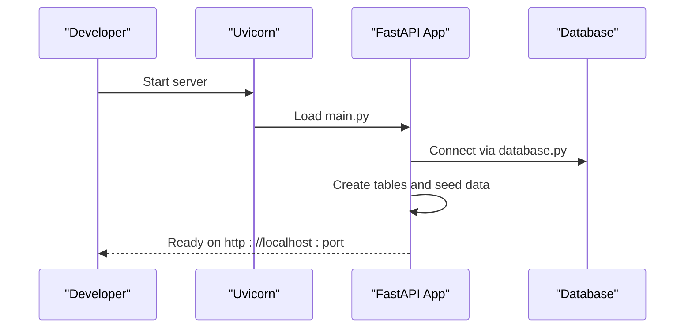

**Diagram sources**
- [main.py:15-23](file://main.py#L15-L23)
- [database.py:18-38](file://database.py#L18-L38)

**Section sources**
- [main.py:15-23](file://main.py#L15-L23)
- [database.py:18-38](file://database.py#L18-L38)

## API Testing with Swagger UI
Explore and test the API using Swagger UI:

- Access the interactive docs at `/docs` (e.g., http://localhost:8000/docs).
- Try endpoints such as:
  - GET `/museums`
  - GET `/artifacts/{artifact_code}`
  - POST `/auth/register`
  - POST `/auth/login`
  - POST `/collections`
  - POST `/tickets/purchase`
  - GET `/museums/{museum_id}/exhibitions`
  - GET `/museums/{museum_id}/routes`
  - GET `/museums/{museum_id}/routes/{route_id}/achievements`
  - POST `/users/{user_id}/achievements/reset/{museum_id}`
  - GET `/users/{user_id}/achievements`
- The hosted Swagger UI link is also available in the project documentation.

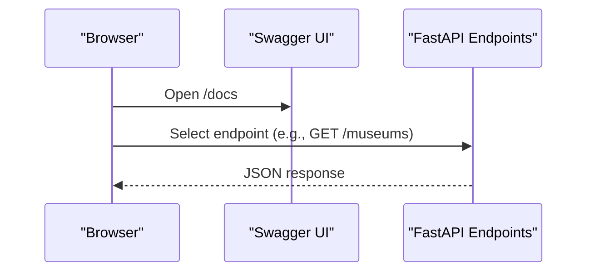

**Diagram sources**
- [README.md:24-33](file://README.md#L24-L33)
- [main.py:604-607](file://main.py#L604-L607)
- [main.py:610-632](file://main.py#L610-L632)

**Section sources**
- [README.md:24-33](file://README.md#L24-L33)
- [main.py:604-607](file://main.py#L604-L607)
- [main.py:610-632](file://main.py#L610-L632)

## Unity Frontend Integration
Connect your Unity frontend to the backend using HTTP requests:

- Base URL:
  - Use the production URL provided in the documentation for cloud deployment.
- Example C# script pattern:
  - Use UnityWebRequest to call endpoints like `/artifacts` and parse JSON responses.
- Authentication:
  - Register and log in users via `/auth/register` and `/auth/login`.
- Collections and tickets:
  - Add artifacts to collections via `/collections`.
  - Purchase tickets and receive QR codes via `/tickets/purchase`.

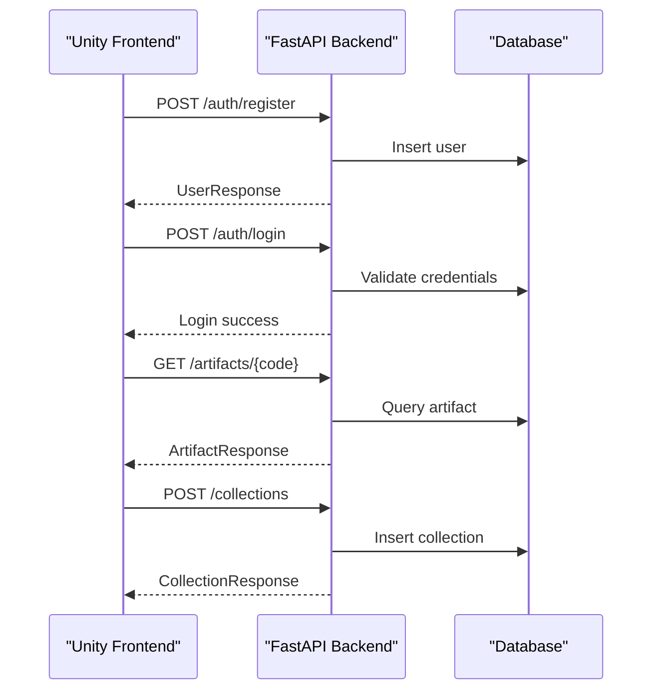

**Diagram sources**
- [README.md:50-89](file://README.md#L50-L89)
- [main.py:538-568](file://main.py#L538-L568)
- [main.py:569-601](file://main.py#L569-L601)
- [main.py:610-632](file://main.py#L610-L632)
- [main.py:634-661](file://main.py#L634-L661)

**Section sources**
- [README.md:50-89](file://README.md#L50-L89)
- [main.py:538-568](file://main.py#L538-L568)
- [main.py:569-601](file://main.py#L569-L601)
- [main.py:610-632](file://main.py#L610-L632)
- [main.py:634-661](file://main.py#L634-L661)

## Core Components
Key components and their responsibilities:

- FastAPI Application (`main.py`)
  - Defines CORS middleware and routes for museums, artifacts, collections, tickets, routes, achievements, and user management.
  - Seeds initial data and runs migrations on startup.
- Database Layer (`database.py`)
  - Loads environment variables, constructs the SQLAlchemy engine, and provides a session factory.
- Data Models (`models.py`)
  - Declares ORM models for users, museums, artifacts, collections, exhibitions, tickets, routes, achievements, and user achievements.
- Request/Response Schemas (`schemas.py`)
  - Defines Pydantic models for request payloads and API responses.
- Conversational Agent (`agent.py`)
  - Integrates Google Gemini to answer queries about artifacts, museums, exhibitions, and routes.
- Security Utilities (`security.py`)
  - Provides hashing and verification helpers for passwords.
- Audio Generation (`generate_audio.py`)
  - Generates placeholder WAV files for artifact audio assets.

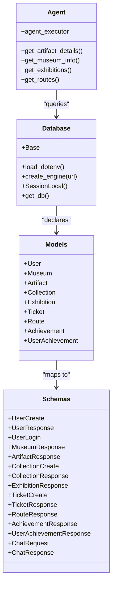

**Diagram sources**
- [database.py:8-38](file://database.py#L8-L38)
- [models.py:4-105](file://models.py#L4-L105)
- [schemas.py:4-137](file://schemas.py#L4-L137)
- [agent.py:17-105](file://agent.py#L17-L105)

**Section sources**
- [main.py:15-23](file://main.py#L15-L23)
- [database.py:8-38](file://database.py#L8-L38)
- [models.py:4-105](file://models.py#L4-L105)
- [schemas.py:4-137](file://schemas.py#L4-L137)
- [agent.py:17-105](file://agent.py#L17-L105)
- [security.py:1-12](file://security.py#L1-L12)
- [generate_audio.py:12-77](file://generate_audio.py#L12-L77)

## Architecture Overview
High-level architecture showing how components interact:

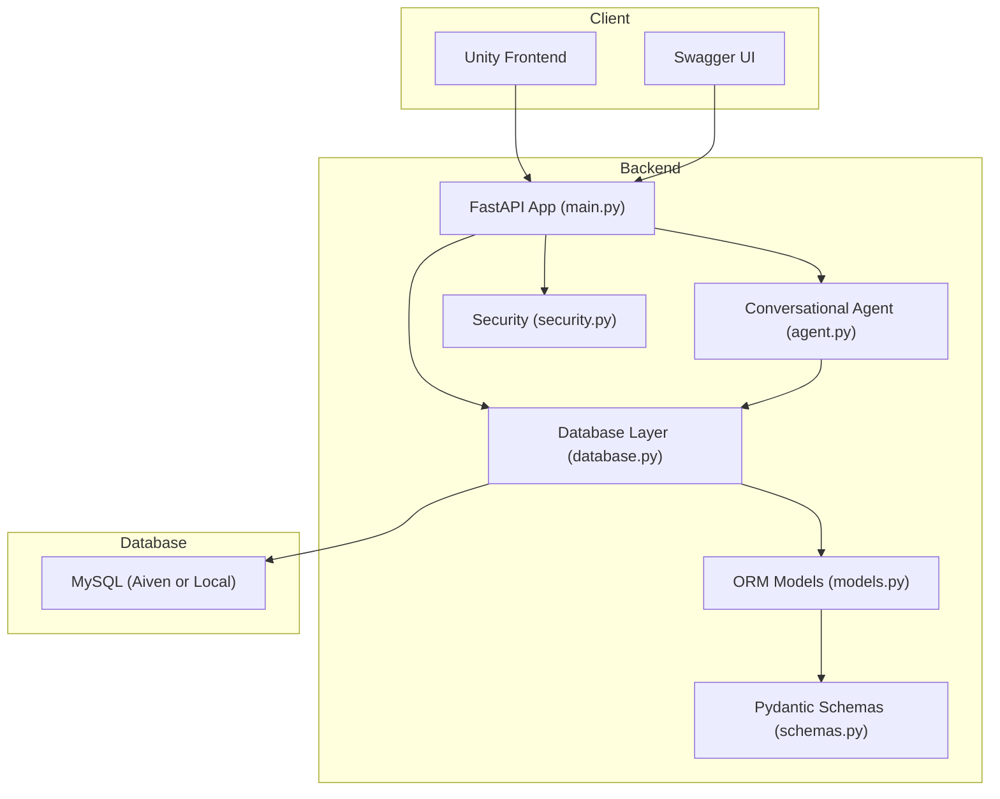

**Diagram sources**
- [main.py:15-23](file://main.py#L15-L23)
- [database.py:18-38](file://database.py#L18-L38)
- [models.py:4-105](file://models.py#L4-L105)
- [schemas.py:4-137](file://schemas.py#L4-L137)
- [agent.py:94-105](file://agent.py#L94-L105)
- [security.py:1-12](file://security.py#L1-L12)

## Detailed Component Analysis

### Authentication Endpoints
- Registration (`POST /auth/register`):
  - Validates full name, email, and password length.
  - Inserts a new user record and returns a sanitized response.
- Login (`POST /auth/login`):
  - Validates credentials and ensures account completeness.
  - Returns a success message with user details.

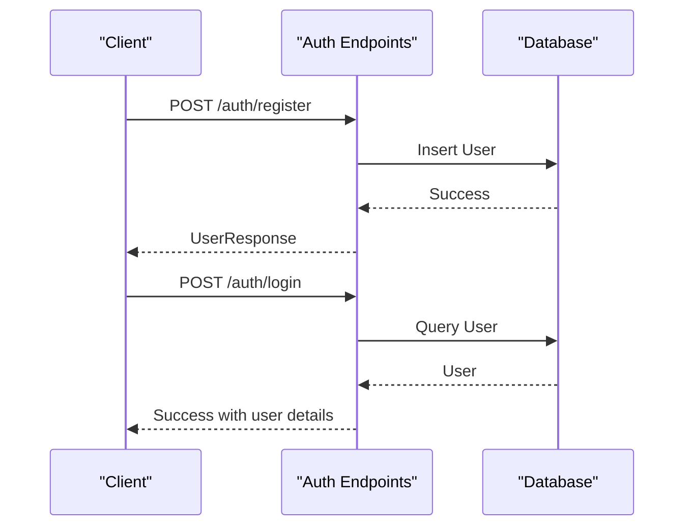

**Diagram sources**
- [main.py:538-568](file://main.py#L538-L568)
- [main.py:569-601](file://main.py#L569-L601)

**Section sources**
- [main.py:538-568](file://main.py#L538-L568)
- [main.py:569-601](file://main.py#L569-L601)

### Artifact Retrieval
- Endpoint: `GET /artifacts/{artifact_code}`
  - Performs case-insensitive matching and handles codes with spaces.
  - Returns artifact details including Unity prefab name and optional audio asset.

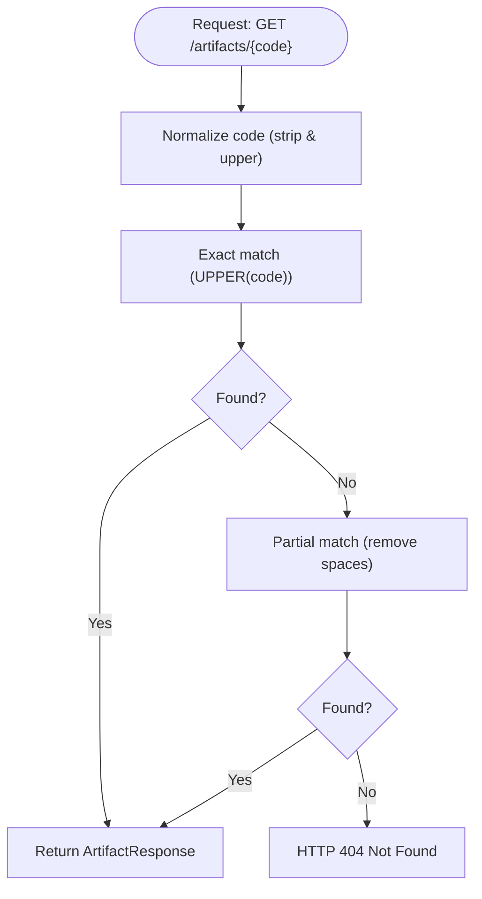

**Diagram sources**
- [main.py:610-632](file://main.py#L610-L632)

**Section sources**
- [main.py:610-632](file://main.py#L610-L632)

### Collections Management
- Endpoint: `POST /collections`
  - Prevents duplicate entries for the same user-artifact pair.
  - Inserts a new collection record and returns confirmation.

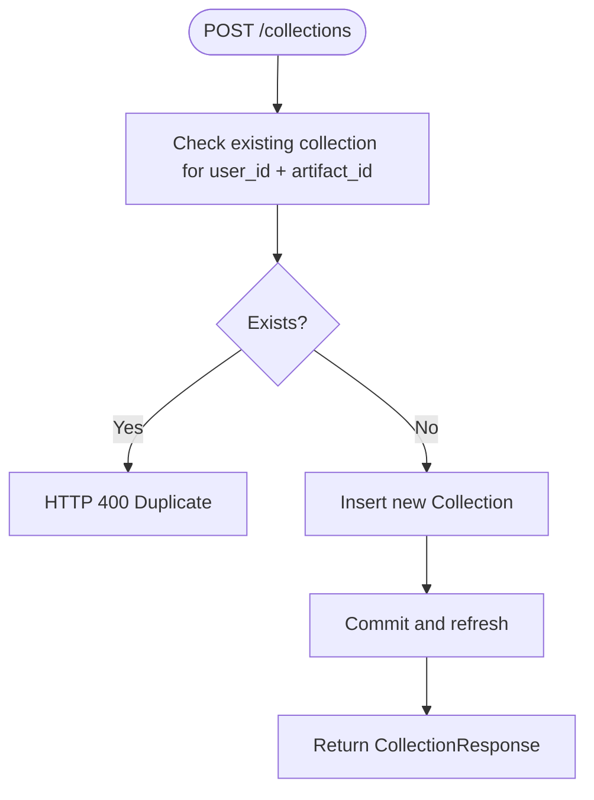

**Diagram sources**
- [main.py:634-661](file://main.py#L634-L661)

**Section sources**
- [main.py:634-661](file://main.py#L634-L661)

### Ticket Purchase and QR Code Generation
- Endpoint: `POST /tickets/purchase`
  - Generates a unique QR code string combining museum and user identifiers.
  - Stores ticket metadata and returns the generated QR code.

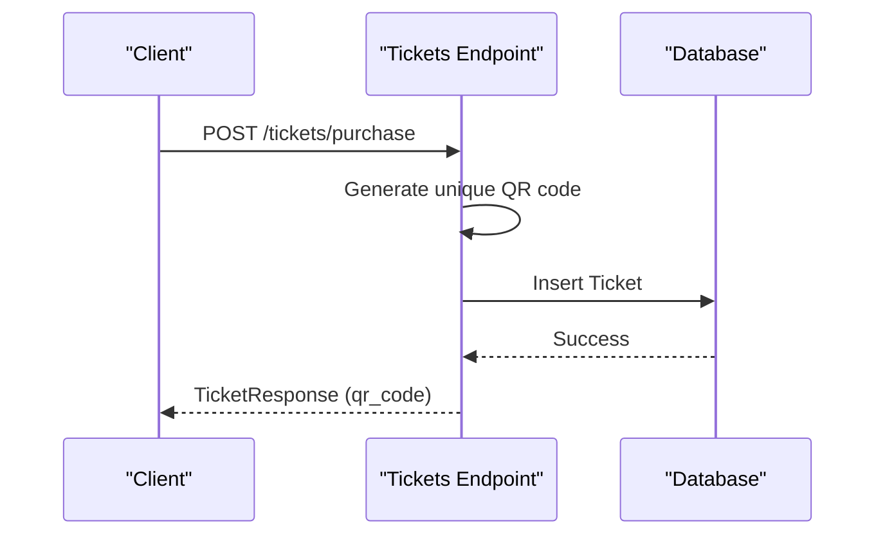

**Diagram sources**
- [main.py:669-694](file://main.py#L669-L694)

**Section sources**
- [main.py:669-694](file://main.py#L669-L694)

### Conversational Agent
- Tools:
  - Retrieve artifact details by name or code.
  - Get museum information (hours, price, location).
  - List exhibitions for a museum.
  - List available routes for a museum.
- Initialization:
  - Requires `GOOGLE_API_KEY` in `.env`.

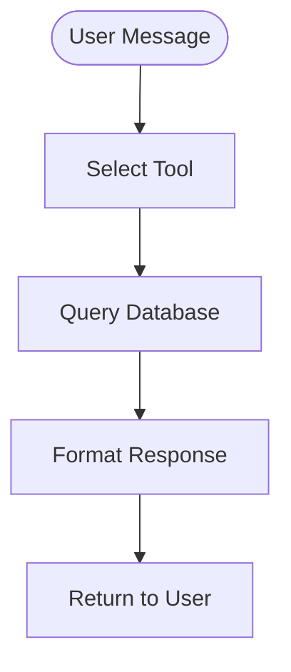

**Diagram sources**
- [agent.py:17-105](file://agent.py#L17-L105)

**Section sources**
- [agent.py:17-105](file://agent.py#L17-L105)

## Dependency Analysis
External libraries and their roles:

- FastAPI and Uvicorn: Web framework and ASGI server
- SQLAlchemy: ORM and database connectivity
- PyMySQL: MySQL driver
- python-dotenv: Environment variable loading
- google-genai and LangChain: Generative AI integration
- passlib: Password hashing
- Pydantic: Data validation and serialization

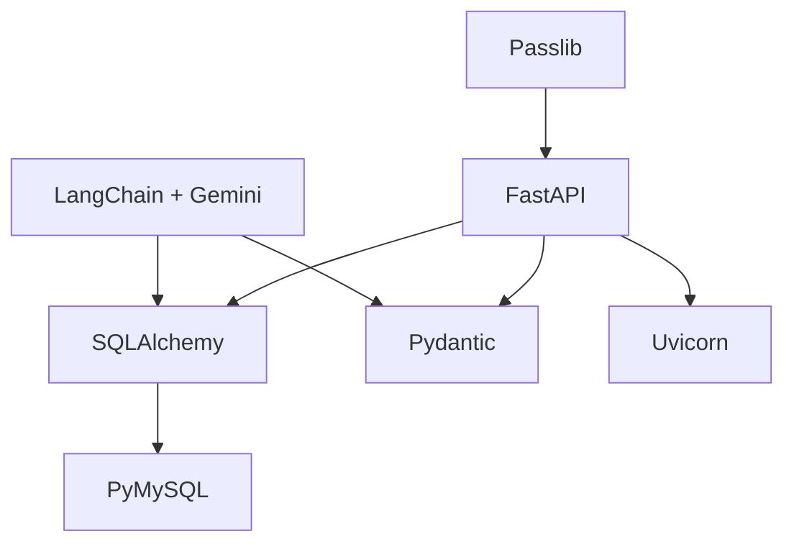

**Diagram sources**
- [requirements.txt:12-59](file://requirements.txt#L12-L59)
- [database.py:18-38](file://database.py#L18-L38)
- [agent.py:94-105](file://agent.py#L94-L105)
- [security.py:1-12](file://security.py#L1-L12)

**Section sources**
- [requirements.txt:12-59](file://requirements.txt#L12-L59)
- [database.py:18-38](file://database.py#L18-L38)
- [agent.py:94-105](file://agent.py#L94-L105)
- [security.py:1-12](file://security.py#L1-L12)

## Performance Considerations
- Connection pooling:
  - The engine uses a configurable pool size and pre-ping to maintain healthy connections.
- Startup seeding:
  - Initial data is seeded on application startup; avoid frequent restarts in production.
- Cold start:
  - Cloud deployments may experience cold start delays; plan accordingly.

**Section sources**
- [database.py:18-24](file://database.py#L18-L24)
- [README.md:90-95](file://README.md#L90-L95)

## Troubleshooting Guide
Common issues and resolutions:

- Missing environment variables:
  - Ensure `.env` contains `DATABASE_URL` and `GOOGLE_API_KEY`.
- Database connection failures:
  - Verify the connection string format and network access to Aiven or local MySQL.
- CORS errors:
  - CORS is enabled for all origins in development; adjust origins as needed for production.
- LangGraph deprecation warning:
  - Update imports to use the newer LangChain agent creation method if encountering warnings.
- Password hashing:
  - Use the provided security utilities for hashing and verifying passwords.
- Audio assets:
  - Use the audio generation script to create placeholder WAV files for artifact descriptions.

**Section sources**
- [database.py:8-15](file://database.py#L8-L15)
- [agent.py:10-15](file://agent.py#L10-L15)
- [README.md:90-95](file://README.md#L90-L95)
- [security.py:1-12](file://security.py#L1-L12)
- [generate_audio.py:12-77](file://generate_audio.py#L12-L77)

## Conclusion
You now have the essentials to run the MuseAmigo Backend locally, connect to a MySQL database, explore the API with Swagger UI, and integrate with a Unity frontend. Use the provided components and endpoints to build out features, and refer to the troubleshooting section for common setup issues.