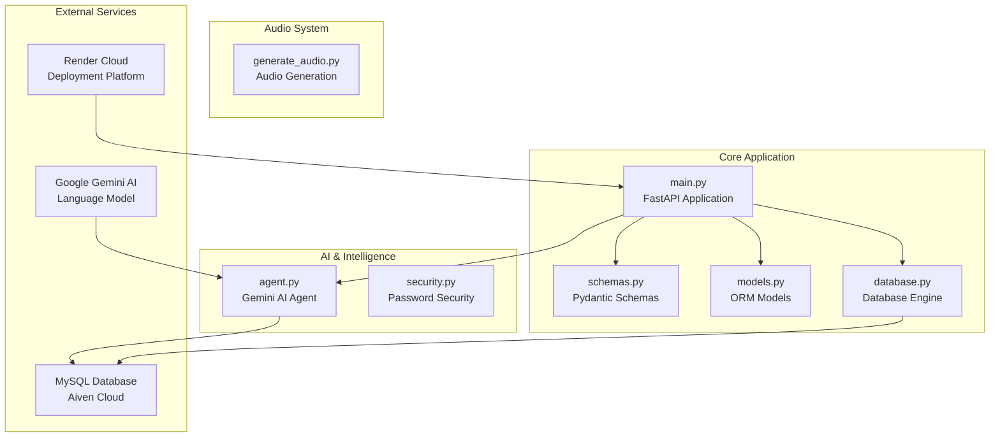
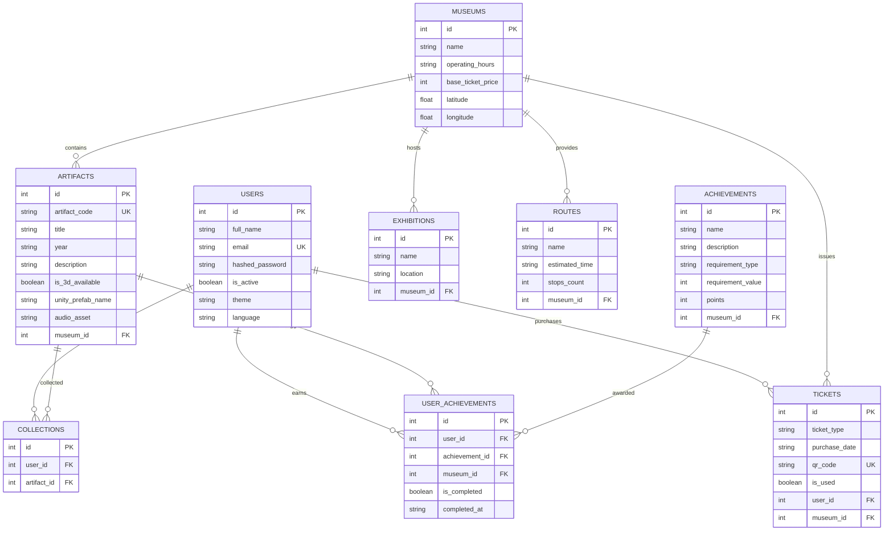
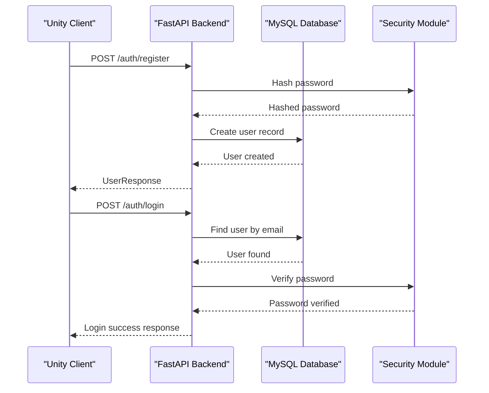
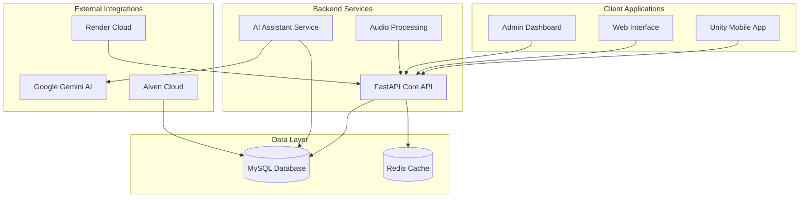
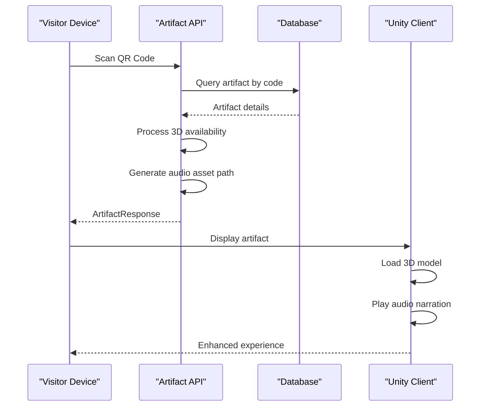
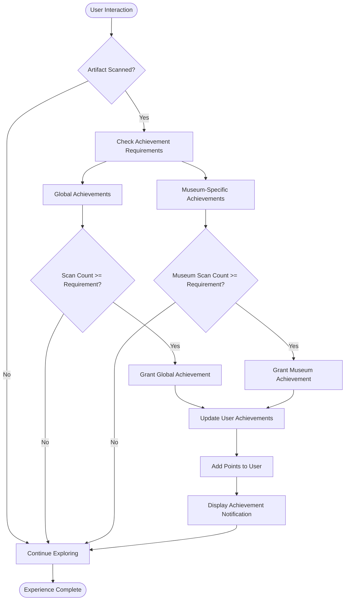
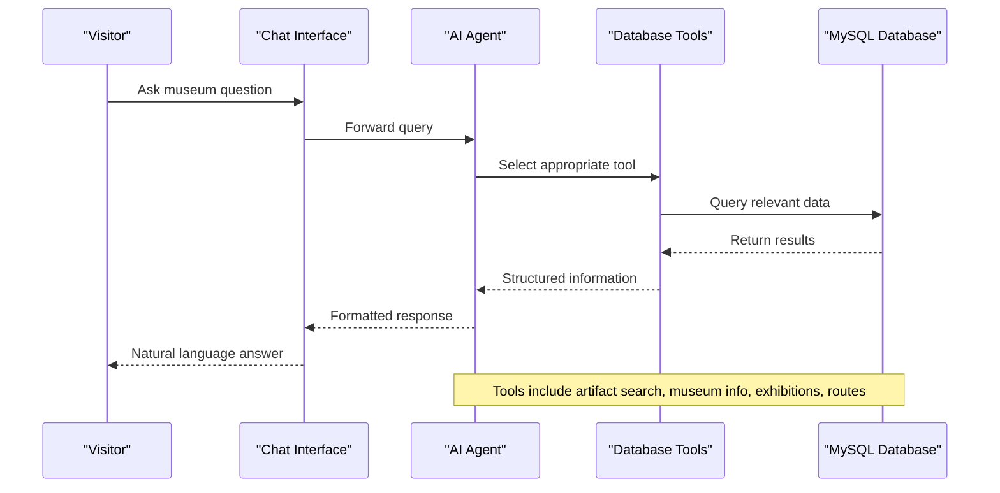
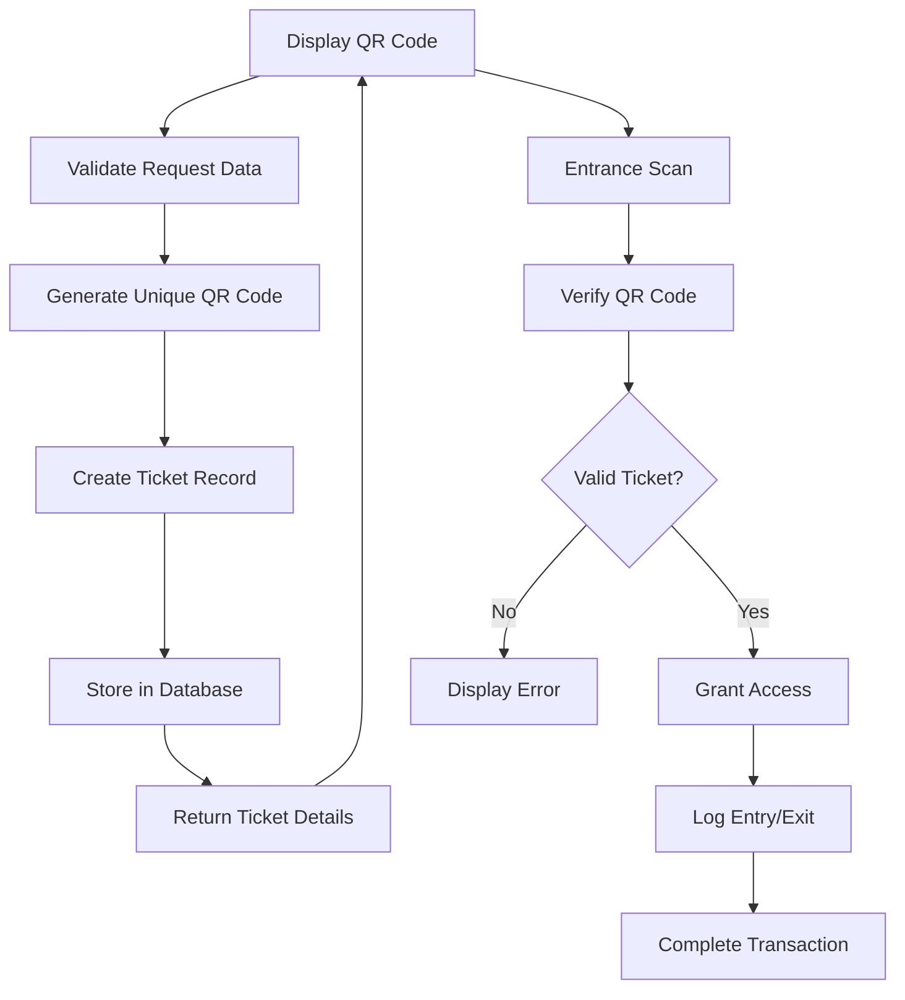
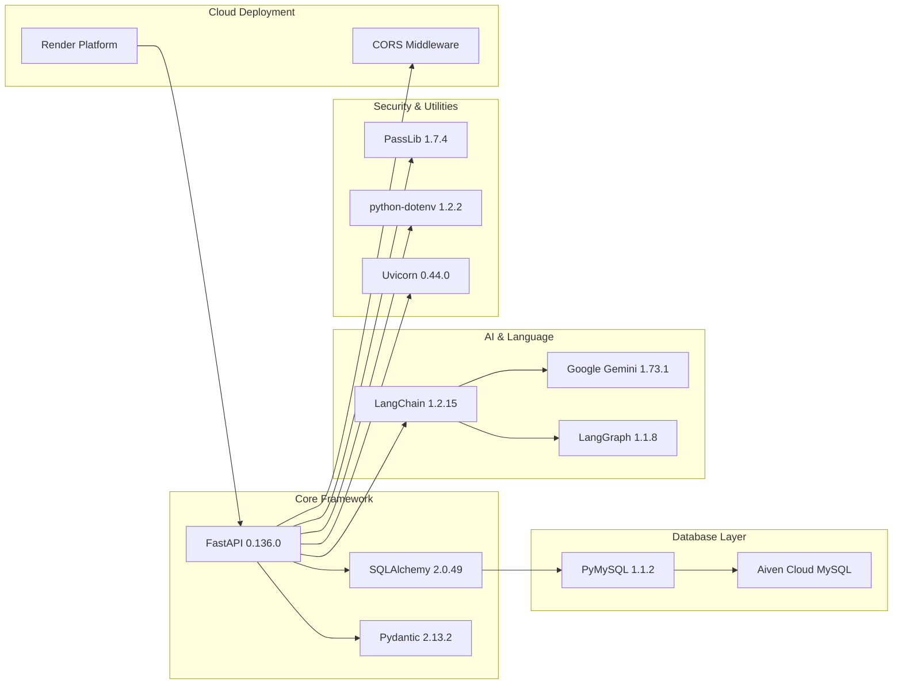

# Project Overview

<cite>
**Referenced Files in This Document**
- [README.md](file://README.md)
- [main.py](file://main.py)
- [models.py](file://models.py)
- [schemas.py](file://schemas.py)
- [database.py](file://database.py)
- [agent.py](file://agent.py)
- [security.py](file://security.py)
- [generate_audio.py](file://generate_audio.py)
- [requirements.txt](file://requirements.txt)
</cite>

## Table of Contents
1. [Introduction](#introduction)
2. [Project Structure](#project-structure)
3. [Core Components](#core-components)
4. [Architecture Overview](#architecture-overview)
5. [Detailed Component Analysis](#detailed-component-analysis)
6. [Dependency Analysis](#dependency-analysis)
7. [Performance Considerations](#performance-considerations)
8. [Troubleshooting Guide](#troubleshooting-guide)
9. [Conclusion](#conclusion)

## Introduction

MuseAmigo is an innovative interactive museum experience platform designed to seamlessly blend physical museum visits with digital storytelling. The system creates an immersive educational journey where visitors can scan QR codes to unlock rich multimedia experiences, engage with AI-powered chat assistance, and participate in gamified exploration activities.

The platform serves as a comprehensive ecosystem that transforms traditional museum visits into dynamic, personalized adventures. Visitors can discover historical artifacts through 3D models, listen to narrated stories, navigate guided tours, collect virtual treasures, and earn achievements while exploring cultural institutions.

At its core, MuseAmigo combines cutting-edge technologies to deliver an engaging experience:
- **QR Code Integration**: Physical artifact identification through scannable codes
- **AI-Powered Assistance**: Intelligent chatbot powered by Google Gemini AI
- **Gamification System**: Achievement tracking and reward mechanisms
- **Real-time Navigation**: Interactive route planning and museum guidance
- **Multi-platform Experience**: Seamless integration between mobile apps and Unity-based applications

## Project Structure

The MuseAmigo Backend follows a modular FastAPI architecture organized around clear functional domains:

**Diagram sources**
- [main.py:1-25](file://main.py#L1-L25)
- [database.py:1-38](file://database.py#L1-L38)
- [agent.py:1-122](file://agent.py#L1-L122)

The backend is structured around several key layers:

- **Application Layer**: FastAPI routes and business logic
- **Data Access Layer**: SQLAlchemy ORM models and database connections
- **Integration Layer**: AI agent and external service integrations
- **Presentation Layer**: Pydantic schemas for request/response validation

**Section sources**
- [main.py:12-25](file://main.py#L12-L25)
- [database.py:1-38](file://database.py#L1-L38)
- [models.py:1-105](file://models.py#L1-L105)

## Core Components

### Database Schema Architecture

The system employs a comprehensive relational database design supporting multiple museum collections and interactive features:

**Diagram sources**
- [models.py:4-105](file://models.py#L4-L105)

### Authentication System

The backend implements a robust user authentication mechanism with password hashing and session management:

**Diagram sources**
- [main.py:538-601](file://main.py#L538-L601)
- [security.py:1-12](file://security.py#L1-L12)

**Section sources**
- [models.py:4-15](file://models.py#L4-L15)
- [schemas.py:4-23](file://schemas.py#L4-L23)
- [security.py:1-12](file://security.py#L1-L12)

## Architecture Overview

MuseAmigo operates as a centralized API platform serving multiple client applications and external services:

**Diagram sources**
- [main.py:1-15](file://main.py#L1-L15)
- [agent.py:94-105](file://agent.py#L94-L105)
- [database.py:12-24](file://database.py#L12-L24)

The architecture emphasizes scalability and modularity:

- **Centralized API**: Single source of truth for all museum data and user interactions
- **Service-Oriented Design**: Clear separation between authentication, content delivery, and AI assistance
- **Cloud-Native Deployment**: Optimized for containerized deployment and auto-scaling
- **AI Integration**: Intelligent assistant service enhances user experience through natural language processing

**Section sources**
- [README.md:3](file://README.md#L3)
- [main.py:15-23](file://main.py#L15-L23)

## Detailed Component Analysis

### Artifact Discovery System

The artifact discovery mechanism enables seamless QR code scanning and content delivery:

**Diagram sources**
- [main.py:609-632](file://main.py#L609-L632)
- [schemas.py:36-48](file://schemas.py#L36-L48)

Key features include:
- **Flexible QR Code Matching**: Supports both exact and formatted artifact codes
- **3D Content Integration**: Automatic loading of Unity-compatible 3D models
- **Audio Narration**: Synchronized audio descriptions for enhanced storytelling
- **Museum Context**: Rich contextual information linking artifacts to their cultural origins

### Achievement Tracking System

The gamification framework provides progressive engagement through achievement milestones:

**Diagram sources**
- [main.py:738-800](file://main.py#L738-L800)
- [models.py:86-105](file://models.py#L86-L105)

Achievement categories include:
- **Progressive Milestones**: Scan counts across all artifacts
- **Museum Exploration**: Site-specific discovery challenges
- **Collection Completion**: Artifact acquisition targets
- **Community Recognition**: Multi-user achievement badges

### AI Assistant Integration

The integrated AI assistant provides intelligent museum guidance and information services:

**Diagram sources**
- [agent.py:17-105](file://agent.py#L17-L105)

The AI system utilizes specialized tools for different information domains:
- **Artifact Information Retrieval**: Detailed artifact descriptions and historical context
- **Museum Operations**: Opening hours, pricing, and location details
- **Exhibition Catalog**: Current and upcoming exhibition information
- **Navigation Guidance**: Recommended routes and museum layouts

**Section sources**
- [agent.py:1-122](file://agent.py#L1-L122)
- [main.py:8-9](file://main.py#L8-L9)

### Ticket Management System

The ticketing system handles visitor admission and QR code generation:

**Diagram sources**
- [main.py:669-694](file://main.py#L669-L694)

Key ticket features include:
- **Unique QR Code Generation**: Prevents duplication and ensures security
- **Real-time Validation**: Instant verification at museum entrances
- **User Tracking**: Comprehensive visitor analytics and access logs
- **Flexible Pricing**: Support for various ticket types and pricing structures

**Section sources**
- [main.py:669-694](file://main.py#L669-L694)
- [models.py:62-73](file://models.py#L62-L73)

## Dependency Analysis

The backend relies on a carefully selected set of dependencies optimized for performance and functionality:

**Diagram sources**
- [requirements.txt:12-59](file://requirements.txt#L12-L59)

**Section sources**
- [requirements.txt:1-59](file://requirements.txt#L1-L59)

## Performance Considerations

The MuseAmigo backend is designed with several performance optimization strategies:

### Database Optimization
- **Connection Pooling**: Configured with 10 base connections and 20 overflow capacity
- **Pre-ping Validation**: Ensures connection health before use
- **Automatic Recycling**: Connections refreshed hourly to prevent stale connections
- **Foreign Key Indexing**: Strategic indexing on frequently queried foreign keys

### API Response Optimization
- **Selective Field Loading**: Pydantic schemas limit response payload size
- **Lazy Loading**: Non-critical data loaded only when requested
- **Caching Strategy**: Redis integration planned for frequently accessed data
- **Batch Operations**: Bulk data operations for seeding and maintenance tasks

### AI Service Efficiency
- **Tool-Based Architecture**: Specialized tools reduce unnecessary database queries
- **Query Optimization**: Efficient filtering and search algorithms
- **Response Formatting**: Structured data minimizes parsing overhead

## Troubleshooting Guide

### Common Issues and Solutions

**Database Connection Problems**
- Verify DATABASE_URL environment variable is properly configured
- Check Aiven cloud connectivity and firewall settings
- Monitor connection pool exhaustion during peak usage

**AI Service Failures**
- Confirm GOOGLE_API_KEY is present in environment variables
- Validate Gemini API quota limits and billing status
- Check network connectivity to Google services

**Authentication Issues**
- Verify password hashing implementation is functioning correctly
- Check email uniqueness constraints in user registration
- Review CORS configuration for cross-origin requests

**Performance Degradation**
- Monitor database query execution times
- Check connection pool utilization metrics
- Review AI tool execution latency

**Section sources**
- [database.py:12-24](file://database.py#L12-L24)
- [agent.py:14](file://agent.py#L14)
- [main.py:538-601](file://main.py#L538-L601)

## Conclusion

MuseAmigo represents a comprehensive solution for modern museum experiences, combining traditional cultural preservation with cutting-edge digital innovation. The backend architecture demonstrates strong technical foundations with clear separation of concerns, robust data modeling, and intelligent AI integration.

The platform's strength lies in its holistic approach to museum engagement, where technology serves the enhancement of human cultural experiences rather than overshadowing them. The modular design ensures maintainability and extensibility, while the cloud-native deployment strategy provides scalability and reliability.

Future enhancements could include advanced analytics capabilities, expanded AI functionality, enhanced multimedia content delivery, and integration with augmented reality technologies. The current architecture provides an excellent foundation for these evolutionary improvements while maintaining the core mission of making cultural heritage accessible and engaging for all visitors.