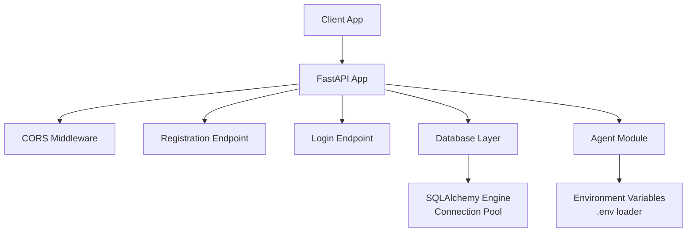
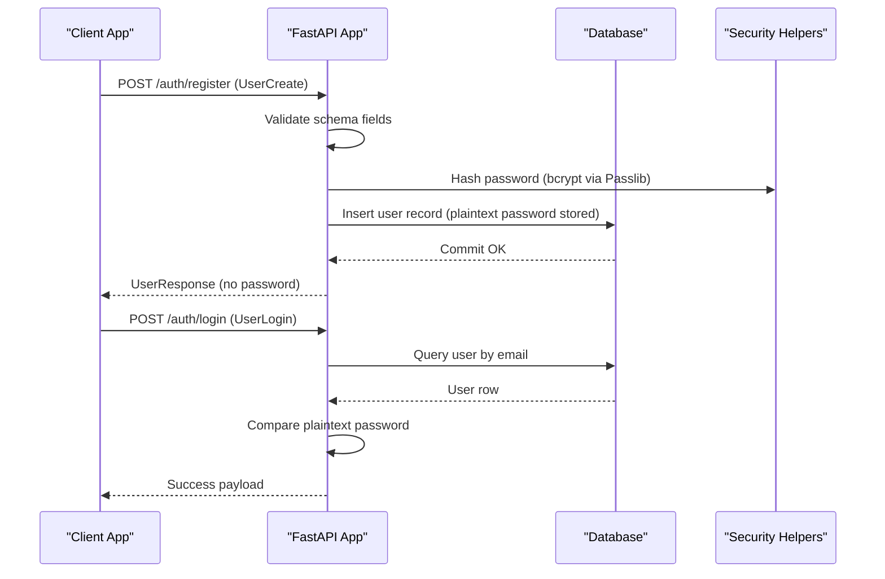
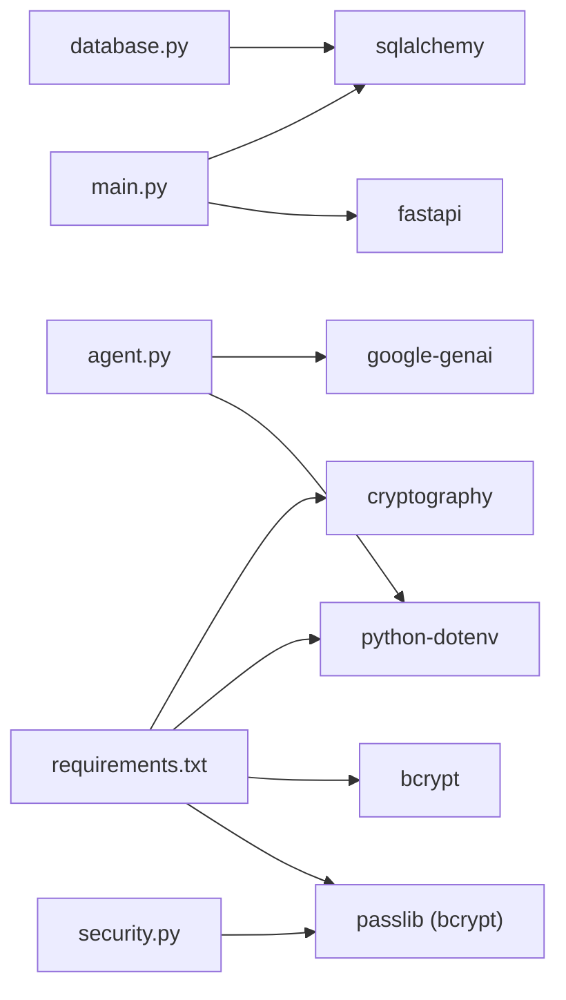
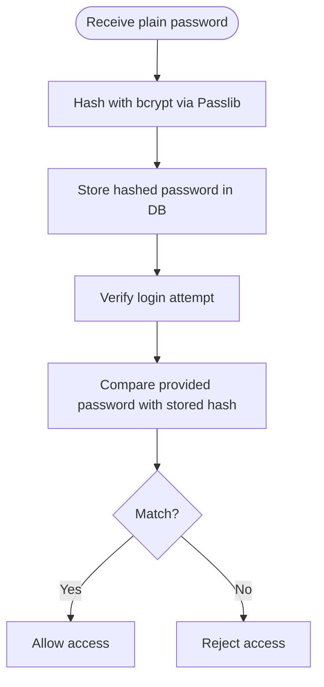

# Security & Authentication

<cite>
**Referenced Files in This Document**
- [security.py](file://security.py)
- [main.py](file://main.py)
- [database.py](file://database.py)
- [schemas.py](file://schemas.py)
- [models.py](file://models.py)
- [agent.py](file://agent.py)
- [requirements.txt](file://requirements.txt)
</cite>

## Table of Contents
1. [Introduction](#introduction)
2. [Project Structure](#project-structure)
3. [Core Components](#core-components)
4. [Architecture Overview](#architecture-overview)
5. [Detailed Component Analysis](#detailed-component-analysis)
6. [Dependency Analysis](#dependency-analysis)
7. [Performance Considerations](#performance-considerations)
8. [Troubleshooting Guide](#troubleshooting-guide)
9. [Conclusion](#conclusion)
10. [Appendices](#appendices)

## Introduction
This document provides comprehensive security documentation for the MuseAmigo Backend authentication and authorization systems. It explains how passwords are handled, outlines the current authentication flows, highlights gaps in secure credential handling, and proposes mitigations for production readiness. It also covers database security practices, CORS configuration, environment variable usage, and recommended improvements for session management, JWT, and authorization controls.

## Project Structure
The backend is a FastAPI application with modular components:
- Security helpers for password hashing
- Database configuration with connection pooling and environment-driven URLs
- Data models and Pydantic schemas for request/response validation
- Application routes implementing registration and login
- An AI assistant module that loads secrets from environment variables

**Diagram sources**
- [main.py:15-23](file://main.py#L15-L23)
- [main.py:537-601](file://main.py#L537-L601)
- [database.py:18-24](file://database.py#L18-L24)
- [agent.py:10-15](file://agent.py#L10-L15)

**Section sources**
- [main.py:15-23](file://main.py#L15-L23)
- [database.py:18-24](file://database.py#L18-L24)
- [agent.py:10-15](file://agent.py#L10-L15)

## Core Components
- Password hashing: Implemented with Passlib using bcrypt for secure hashing and verification.
- Authentication endpoints: Registration and login routes that currently handle plaintext passwords.
- Database configuration: Environment-driven URL, connection pooling, pre-ping, and recycling.
- Schemas and models: Pydantic models define request/response shapes; SQLAlchemy models define tables and relationships.
- AI assistant: Loads a secret API key from environment variables.

Key implementation references:
- Password hashing and verification: [security.py:1-12](file://security.py#L1-L12)
- Registration endpoint: [main.py:537-568](file://main.py#L537-L568)
- Login endpoint: [main.py:569-601](file://main.py#L569-L601)
- Database engine and pool settings: [database.py:18-24](file://database.py#L18-L24)
- User model and hashed password field: [models.py:4-15](file://models.py#L4-L15)
- User creation schema: [schemas.py:4-17](file://schemas.py#L4-L17)
- AI secret loading: [agent.py:10-15](file://agent.py#L10-L15)

**Section sources**
- [security.py:1-12](file://security.py#L1-L12)
- [main.py:537-601](file://main.py#L537-L601)
- [database.py:18-24](file://database.py#L18-L24)
- [models.py:4-15](file://models.py#L4-L15)
- [schemas.py:4-17](file://schemas.py#L4-L17)
- [agent.py:10-15](file://agent.py#L10-L15)

## Architecture Overview
The authentication architecture centers around:
- Client requests to registration and login endpoints
- Validation via Pydantic schemas
- Database persistence via SQLAlchemy ORM
- Password hashing utilities from Passlib
- CORS middleware configured at the FastAPI level

**Diagram sources**
- [main.py:537-601](file://main.py#L537-L601)
- [security.py:1-12](file://security.py#L1-L12)
- [models.py:4-15](file://models.py#L4-L15)
- [schemas.py:4-17](file://schemas.py#L4-L17)

## Detailed Component Analysis

### Password Hashing Implementation (Passlib + bcrypt)
- The security module configures Passlib to use bcrypt and exposes two functions:
  - Hash a plain password
  - Verify a plain password against a stored hash
- Current implementation stores plaintext passwords in the database, bypassing hashing.

Recommended remediation:
- Replace plaintext storage with hashed passwords using the provided helpers before persisting user records.

References:
- [security.py:1-12](file://security.py#L1-L12)
- [main.py:550-552](file://main.py#L550-L552)

**Section sources**
- [security.py:1-12](file://security.py#L1-L12)
- [main.py:550-552](file://main.py#L550-L552)

### JWT Token Generation and Validation
- Not implemented in the current codebase.
- Recommended approach for production:
  - Use a library such as python-jose to generate and verify signed JWTs.
  - Store minimal claims in tokens (e.g., user_id).
  - Enforce token expiration and refresh strategies.

[No sources needed since this section provides general guidance]

### Session Management
- No explicit session management is present in the codebase.
- For cookie-based sessions in production:
  - Set HttpOnly, Secure, SameSite flags on session cookies.
  - Implement strict CSRF protections.
  - Rotate session identifiers after privilege changes.

[No sources needed since this section provides general guidance]

### Secure Credential Handling
- Environment variables:
  - Database URL loaded from DATABASE_URL with fallback to local MySQL.
  - AI secret loaded from GOOGLE_API_KEY.
- Recommendations:
  - Restrict CORS origins to trusted domains.
  - Avoid logging secrets.
  - Use OS-level permissions to protect .env files.

References:
- [database.py:12-15](file://database.py#L12-L15)
- [agent.py:10-15](file://agent.py#L10-L15)

**Section sources**
- [database.py:12-15](file://database.py#L12-L15)
- [agent.py:10-15](file://agent.py#L10-L15)

### User Registration Workflow
Current behavior:
- Validates presence and length of password.
- Stores plaintext password in the database.
- Returns a response excluding the password.

Remediations:
- Hash the password before insertion.
- Add rate limiting and CAPTCHA to prevent abuse.
- Normalize and sanitize input fields.

References:
- [main.py:537-568](file://main.py#L537-L568)
- [schemas.py:4-17](file://schemas.py#L4-L17)
- [models.py:4-15](file://models.py#L4-L15)

**Section sources**
- [main.py:537-568](file://main.py#L537-L568)
- [schemas.py:4-17](file://schemas.py#L4-L17)
- [models.py:4-15](file://models.py#L4-L15)

### User Login Workflow
Current behavior:
- Validates presence of email and password.
- Queries user by email and compares plaintext password.
- Returns success payload with user identity.

Remediations:
- Switch to hashed password verification.
- Implement failed-login throttling and account lockout policies.
- Add optional MFA for privileged actions.

References:
- [main.py:569-601](file://main.py#L569-L601)
- [schemas.py:20-22](file://schemas.py#L20-L22)
- [models.py:4-15](file://models.py#L4-L15)

**Section sources**
- [main.py:569-601](file://main.py#L569-L601)
- [schemas.py:20-22](file://schemas.py#L20-L22)
- [models.py:4-15](file://models.py#L4-L15)

### Password Reset Procedures
- Not implemented in the current codebase.
- Recommended approach:
  - Generate time-limited, single-use tokens.
  - Send tokens via secure channels (email with DKIM/DMARC).
  - Invalidate tokens after use or expiry.

[No sources needed since this section provides general guidance]

### Account Security Measures
- Current gaps:
  - Plaintext password storage.
  - No rate limiting or account lockout.
  - No audit logs for authentication events.
- Mitigations:
  - Enforce strong password policies.
  - Implement adaptive authentication (risk scoring).
  - Log and alert on suspicious activity.

[No sources needed since this section provides general guidance]

### Database Security Practices
- Connection pooling:
  - Pool size, overflow, pre_ping, and recycle configured for resilience.
- Environment variable configuration:
  - DATABASE_URL loaded from .env with a sensible fallback.
- Sensitive data protection:
  - Avoid storing secrets in code or logs.
  - Use encrypted connections and least-privileged database accounts.

References:
- [database.py:18-24](file://database.py#L18-L24)
- [database.py:12-15](file://database.py#L12-L15)

**Section sources**
- [database.py:18-24](file://database.py#L18-L24)
- [database.py:12-15](file://database.py#L12-L15)

### CORS Middleware Configuration
- Configured to allow all origins, methods, and headers.
- Recommendations:
  - Lock down allow_origins to specific domains.
  - Disable allow_credentials for wildcard origins.
  - Align allow_headers with actual request headers.

References:
- [main.py:17-23](file://main.py#L17-L23)

**Section sources**
- [main.py:17-23](file://main.py#L17-L23)

### API Key Management
- AI assistant requires GOOGLE_API_KEY in .env.
- Recommendations:
  - Store keys in a secrets manager.
  - Rotate keys regularly and revoke compromised ones.
  - Limit scopes and enable audit logging.

References:
- [agent.py:10-15](file://agent.py#L10-L15)

**Section sources**
- [agent.py:10-15](file://agent.py#L10-L15)

### Security Headers Implementation
- Not explicitly implemented in the current codebase.
- Recommendations:
  - Add HSTS, CSP, X-Content-Type-Options, X-Frame-Options, Referrer-Policy.
  - Configure via middleware or ASGI proxy.

[No sources needed since this section provides general guidance]

### Authentication Middleware Patterns
- No custom middleware for authentication/authorization is present.
- Recommended pattern:
  - Create a dependency that extracts and validates tokens or session identifiers.
  - Enforce RBAC via roles stored in the user model and validated in route dependencies.

[No sources needed since this section provides general guidance]

### Role-Based Access Control (RBAC)
- No roles or permissions are modeled in the current codebase.
- Recommended modeling:
  - Add role enumeration to the User model.
  - Define route-level dependencies to enforce access policies.

[No sources needed since this section provides general guidance]

### Authorization Strategies
- Not implemented in the current codebase.
- Recommended strategies:
  - Attribute-based access control (ABAC) for resource-level permissions.
  - OAuth2/OpenID Connect for third-party integrations.
  - JWT scopes for delegated permissions.

[No sources needed since this section provides general guidance]

## Dependency Analysis
External dependencies relevant to security:
- Passlib for password hashing
- bcrypt for cryptographic strength
- python-dotenv for environment variable loading
- cryptography for TLS and related primitives

**Diagram sources**
- [security.py:1-12](file://security.py#L1-L12)
- [main.py:1-10](file://main.py#L1-L10)
- [database.py:1-6](file://database.py#L1-L6)
- [agent.py:1-8](file://agent.py#L1-L8)
- [requirements.txt:1-59](file://requirements.txt#L1-L59)

**Section sources**
- [requirements.txt:1-59](file://requirements.txt#L1-L59)

## Performance Considerations
- Connection pooling reduces overhead and improves throughput.
- Pre-ping and recycle keep connections healthy under load.
- Consider adding read replicas for read-heavy endpoints.

[No sources needed since this section provides general guidance]

## Troubleshooting Guide
Common issues and mitigations:
- Registration fails due to duplicate email:
  - IntegrityError is caught and surfaced to the client.
  - Improve UX by distinguishing duplicate vs. other constraint violations.
- Login fails with invalid credentials:
  - Current comparison uses plaintext; switch to hashed verification.
- CORS errors in production:
  - Tighten allow_origins and disable allow_credentials for wildcards.
- Missing secrets:
  - GOOGLE_API_KEY must be present; otherwise initialization fails fast.

References:
- [main.py:560-566](file://main.py#L560-L566)
- [main.py:583-587](file://main.py#L583-L587)
- [agent.py:14-15](file://agent.py#L14-L15)

**Section sources**
- [main.py:560-566](file://main.py#L560-L566)
- [main.py:583-587](file://main.py#L583-L587)
- [agent.py:14-15](file://agent.py#L14-L15)

## Conclusion
The MuseAmigo Backend currently lacks secure credential handling and authorization controls. Immediate priorities include:
- Hashing passwords with bcrypt before storage
- Implementing JWT-based authentication and authorization
- Hardening CORS and adding security headers
- Introducing rate limiting, audit logging, and RBAC
- Securing environment variables and secrets management

These changes will establish a robust foundation for production-grade security.

## Appendices

### Password Hashing Flow

**Diagram sources**
- [security.py:1-12](file://security.py#L1-L12)
- [main.py:550-552](file://main.py#L550-L552)

### CORS Configuration Reference
- Origins: Allow only trusted domains in production.
- Credentials: Disable when allow_origins is wildcard.
- Methods and headers: Align with actual client needs.

**Section sources**
- [main.py:17-23](file://main.py#L17-L23)