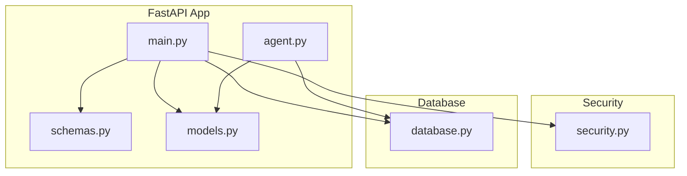
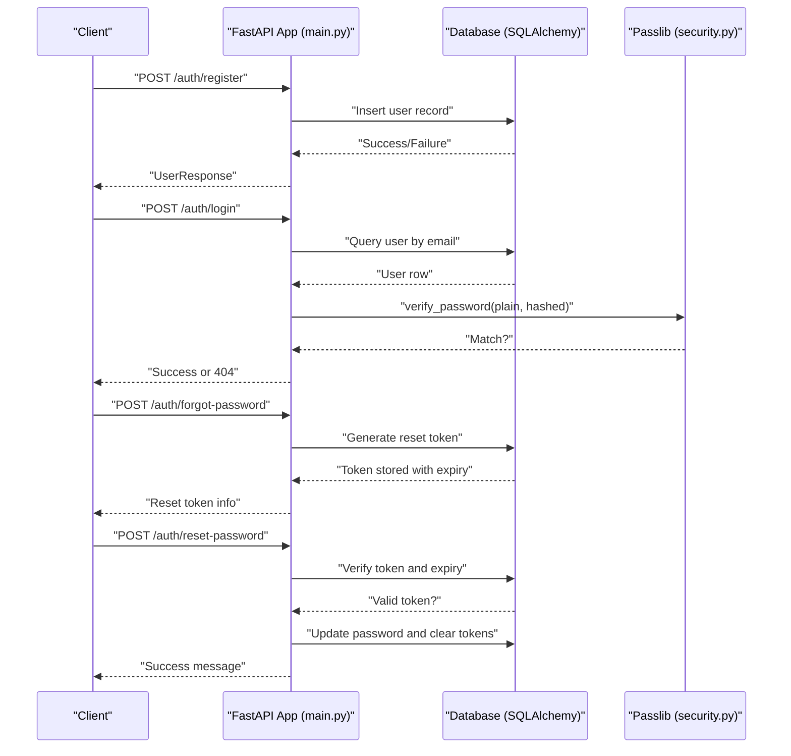
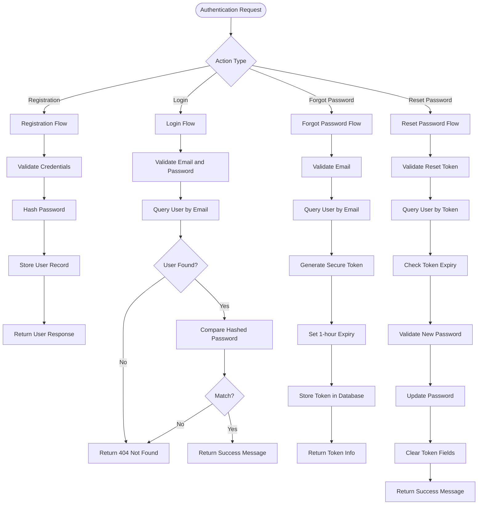
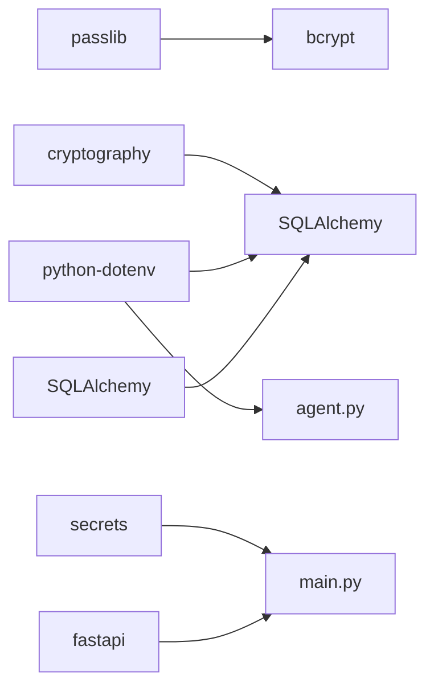

# Security & Authentication

<cite>
**Referenced Files in This Document**
- [security.py](file://security.py)
- [database.py](file://database.py)
- [main.py](file://main.py)
- [models.py](file://models.py)
- [schemas.py](file://schemas.py)
- [agent.py](file://agent.py)
- [requirements.txt](file://requirements.txt)
- [README.md](file://README.md)
</cite>

## Update Summary
**Changes Made**
- Enhanced password reset workflow documentation covering new forgot-password and reset-password endpoints
- Added secure token generation and database migration integration details
- Updated authentication flow diagrams to include password reset process
- Expanded security considerations for token-based authentication
- Added database schema modifications for reset functionality

## Table of Contents
1. [Introduction](#introduction)
2. [Project Structure](#project-structure)
3. [Core Components](#core-components)
4. [Architecture Overview](#architecture-overview)
5. [Detailed Component Analysis](#detailed-component-analysis)
6. [Dependency Analysis](#dependency-analysis)
7. [Performance Considerations](#performance-considerations)
8. [Troubleshooting Guide](#troubleshooting-guide)
9. [Conclusion](#conclusion)
10. [Appendices](#appendices)

## Introduction
This document provides comprehensive security and authentication documentation for the MuseAmigo Backend. It focuses on password hashing with Passlib, authentication flow, database security, CORS configuration, API key management, and secure deployment practices. It also covers cloud database connectivity, environment variable protection, production hardening, and mitigation strategies for common vulnerabilities.

**Updated** Enhanced with comprehensive password reset workflow documentation covering secure token generation, database migration integration, and token-based authentication mechanisms.

## Project Structure
The backend is a FastAPI application with modular components:
- Security utilities for password hashing and verification
- Database configuration with SQLAlchemy and connection pooling
- Application endpoints for registration, login, and password reset workflows
- Data models and Pydantic schemas for request/response validation
- Agent module integrating Google AI with database tools

**Diagram sources**
- [main.py](file://main.py)
- [security.py](file://security.py)
- [database.py](file://database.py)
- [models.py](file://models.py)
- [schemas.py](file://schemas.py)
- [agent.py](file://agent.py)

**Section sources**
- [main.py](file://main.py)
- [database.py](file://database.py)
- [security.py](file://security.py)
- [models.py](file://models.py)
- [schemas.py](file://schemas.py)
- [agent.py](file://agent.py)

## Core Components
- Password hashing and verification using Passlib with bcrypt
- Database connection configuration with environment-driven URLs, connection pooling, and lifecycle management
- Authentication endpoints for registration, login, and password reset workflows
- CORS middleware configuration for cross-origin requests
- Environment variable loading for secrets and database configuration
- Agent module for AI chat with database tooling and API key management
- Database migration system for schema updates including password reset functionality

**Updated** Enhanced with password reset workflow endpoints and database migration capabilities for secure token management.

**Section sources**
- [security.py](file://security.py)
- [database.py](file://database.py)
- [main.py](file://main.py)
- [schemas.py](file://schemas.py)
- [agent.py](file://agent.py)
- [models.py](file://models.py)

## Architecture Overview
The authentication and security architecture centers around:
- Password hashing with Passlib/bcrypt
- Database-backed user storage with SQLAlchemy ORM
- FastAPI endpoints validating credentials and returning minimal user data
- CORS configuration allowing broad origins for development
- Environment-driven configuration for database and AI keys
- Password reset workflow with secure token generation and expiration handling

**Updated** Enhanced with password reset workflow architecture including token-based authentication and database migration integration.

**Diagram sources**
- [main.py](file://main.py)
- [security.py](file://security.py)
- [database.py](file://database.py)
- [models.py](file://models.py)
- [schemas.py](file://schemas.py)

## Detailed Component Analysis

### Password Hashing with Passlib (bcrypt)
- Algorithm selection: bcrypt is configured via Passlib CryptContext
- Hash generation: A function produces a bcrypt hash from plaintext
- Verification: A function verifies plaintext against stored hash
- Salt handling: bcrypt manages salt internally; no manual salt handling is required

Security best practices implemented:
- Strong, adaptive hashing with bcrypt
- No plaintext password storage in the current implementation (note: see "Current Implementation Notes" below)

Current implementation notes:
- The registration endpoint stores the password in the hashed_password field without hashing it first. This is a critical vulnerability and must be addressed by hashing passwords before persistence.

Recommended remediation:
- Replace plaintext assignment with hashed password prior to insertion
- Ensure password hashing occurs before committing to the database

**Section sources**
- [security.py](file://security.py)
- [main.py](file://main.py)

### Authentication Flow: Registration, Login, and Password Reset
- Registration endpoint validates presence and length of credentials, creates a user record, and returns a sanitized response
- Login endpoint validates credentials, queries the user by email, compares the plaintext password against the stored value, and returns a success message with user identifiers
- Password reset workflow includes forgot-password endpoint for token generation and reset-password endpoint for secure password updates

Security considerations:
- Current login compares plaintext with stored plaintext, which is insecure
- Registration stores plaintext passwords, which is insecure
- Add password hashing to both endpoints
- Implement rate limiting and input sanitization
- Consider adding CSRF protection and secure cookies for session management if adopting cookie-based sessions
- Password reset tokens are URL-safe and expire after 1 hour
- Token validation includes expiry checking and database verification

**Updated** Enhanced with comprehensive password reset workflow including secure token generation, validation, and cleanup procedures.

**Diagram sources**
- [main.py](file://main.py)
- [models.py](file://models.py)
- [schemas.py](file://schemas.py)

**Section sources**
- [main.py](file://main.py)
- [models.py](file://models.py)
- [schemas.py](file://schemas.py)

### Password Reset Workflow Implementation
The password reset system provides secure account recovery through token-based authentication:

**Token Generation Process:**
- Uses `secrets.token_urlsafe(32)` for cryptographically secure random tokens
- Tokens expire after 1 hour using ISO format timestamps
- Stored in `reset_token` and `reset_token_expires` database columns
- Email enumeration protection: returns success even for non-existent emails

**Token Validation Process:**
- Validates token existence in database
- Checks ISO format timestamp parsing
- Verifies expiration against current UTC time
- Rejects expired or invalid tokens with appropriate HTTP errors

**Security Features:**
- URL-safe tokens prevent encoding issues
- 1-hour expiry window limits attack window
- Token cleanup after successful password reset
- Input validation for new password strength (minimum 6 characters)

**Section sources**
- [main.py:558-603](file://main.py#L558-L603)
- [models.py:13-16](file://models.py#L13-L16)

### Database Security: Connection Pooling and Environment Variables
- Environment-driven database URL with fallback for local development
- Connection pooling configured with pool size, overflow, pre-ping, and recycle
- Dependency function yields a scoped session per request and closes it afterward
- Agent module loads environment variables and enforces presence of the Google API key
- Database migration system for schema updates including password reset columns

**Updated** Enhanced with database migration capabilities for password reset functionality including automatic column addition.

Security measures:
- Sensitive configuration loaded from environment variables
- Connection lifecycle managed to prevent leaks
- Pre-ping ensures healthy connections; recycle mitigates stale connections
- Automatic database schema migrations for new features

Production hardening recommendations:
- Use encrypted connections (SSL/TLS) for cloud database
- Restrict DATABASE_URL to a dedicated environment variable and avoid embedding secrets in code
- Monitor pool usage and tune pool size based on workload
- Rotate secrets regularly and restrict access to environment files
- Implement database backup and recovery procedures for migration safety

**Section sources**
- [database.py](file://database.py)
- [agent.py](file://agent.py)
- [main.py:423-452](file://main.py#L423-L452)

### CORS Middleware Configuration
- CORS allows all origins, methods, and headers for development
- Credentials flag is disabled

Security considerations:
- Broad origin allowance is acceptable for development but must be restricted in production
- Disable credentials unless strictly necessary
- Configure allowed origins to match frontend domains

**Section sources**
- [main.py](file://main.py)

### API Key Management
- Google API key is loaded from environment variables and validated at startup
- The agent module raises an error if the key is missing

Security recommendations:
- Store API keys in environment variables only
- Limit key scope and permissions
- Rotate keys periodically and monitor usage
- Avoid logging or exposing keys in client-side code

**Section sources**
- [agent.py](file://agent.py)

### Secure Deployment Practices
- Cloud database connection parameters are documented in the repository's README
- Production-grade deployment requires HTTPS and restricted CORS
- Environment variable protection is essential; never commit secrets to version control
- Database migration system ensures schema consistency across deployments

**Updated** Enhanced with database migration system for secure deployment of new features.

Deployment checklist:
- Use HTTPS endpoints in production
- Restrict CORS origins to trusted domains
- Protect environment files and secrets
- Enable database SSL/TLS
- Use secrets management systems for API keys and database credentials
- Implement database backup and migration procedures
- Monitor token-based authentication usage and cleanup expired tokens

**Section sources**
- [README.md](file://README.md)

## Dependency Analysis
External libraries relevant to security and authentication:
- Passlib: cryptographic password hashing (bcrypt)
- bcrypt: underlying hashing implementation
- cryptography: general-purpose cryptographic primitives
- python-dotenv: environment variable loading
- SQLAlchemy: ORM and connection pooling
- FastAPI: web framework with built-in validation and security features
- secrets: cryptographically secure random token generation

**Updated** Enhanced with secrets library for secure token generation.

**Diagram sources**
- [requirements.txt](file://requirements.txt)
- [security.py](file://security.py)
- [database.py](file://database.py)
- [agent.py](file://agent.py)
- [main.py](file://main.py)

**Section sources**
- [requirements.txt](file://requirements.txt)

## Performance Considerations
- Connection pooling reduces overhead and improves throughput under load
- Pre-ping and recycle keep connections healthy and reduce failures
- Consider tuning pool size and overflow based on observed traffic patterns
- Password reset token cleanup prevents database bloat
- Database migrations are performed during startup to minimize downtime

**Updated** Enhanced with performance considerations for password reset workflow and database migrations.

## Troubleshooting Guide
Common issues and mitigations:
- Missing GOOGLE_API_KEY leads to runtime errors in the agent module
  - Ensure the .env file contains the key and is loaded at startup
- Database connectivity failures
  - Verify DATABASE_URL environment variable and network access to the cloud database
  - Confirm SSL/TLS settings and firewall rules
- Authentication failures
  - Confirm password hashing is applied before storing credentials
  - Ensure login compares hashed passwords, not plaintext
- Password reset token issues
  - Verify token generation and storage in database
  - Check token expiry calculations and timezone handling
  - Ensure database migration has been applied for reset columns
- CORS errors
  - Align allowed origins with the frontend domain; avoid wildcard in production

**Updated** Enhanced with troubleshooting guidance for password reset workflow and database migration issues.

**Section sources**
- [agent.py](file://agent.py)
- [database.py](file://database.py)
- [main.py](file://main.py)

## Conclusion
The MuseAmigo Backend implements a solid foundation for security and authentication with Passlib/bcrypt, environment-driven configuration, and connection pooling. However, critical vulnerabilities exist in the current implementation where plaintext passwords are stored and compared. Immediate remediation is required to hash passwords at registration and enforce hashed comparison at login. Additionally, production deployments must tighten CORS, enforce HTTPS, protect environment variables, and enable database encryption.

**Updated** Enhanced conclusion reflecting the comprehensive password reset workflow implementation and database migration capabilities.

The newly implemented password reset workflow provides secure account recovery through token-based authentication with proper expiration handling and database integration. The database migration system ensures schema consistency across deployments. Addressing these gaps will significantly improve the system's resilience against common attacks and align with industry best practices.

## Appendices

### Security Vulnerabilities and Mitigations
- Plaintext password storage and comparison
  - Mitigation: Hash passwords with bcrypt before persisting; compare hashed values during login
- Excessive CORS allowances
  - Mitigation: Restrict allowed origins to known frontend domains
- Hardcoded or exposed secrets
  - Mitigation: Use environment variables and secrets managers; never commit secrets
- Insecure transport
  - Mitigation: Enforce HTTPS and TLS for all communications
- Missing input validation and sanitization
  - Mitigation: Leverage FastAPI/pydantic validation; apply rate limiting and sanitization
- Password reset token vulnerabilities
  - Mitigation: Use cryptographically secure tokens; implement proper expiry handling; validate token format
- Database schema inconsistency
  - Mitigation: Implement automated migration system; validate schema before startup

**Updated** Enhanced with password reset workflow and database migration security considerations.

### Password Reset Workflow Security Controls
- Token Generation: URL-safe cryptographically secure random tokens
- Expiration Handling: 1-hour expiry with ISO format timestamp storage
- Database Storage: Separate columns for token and expiry with proper indexing
- Validation: Comprehensive token validation including format, expiry, and existence checks
- Cleanup: Automatic token clearing after successful password reset
- Enumeration Protection: Success responses for non-existent emails to prevent user enumeration

**Section sources**
- [main.py:558-603](file://main.py#L558-L603)
- [models.py:13-16](file://models.py#L13-L16)